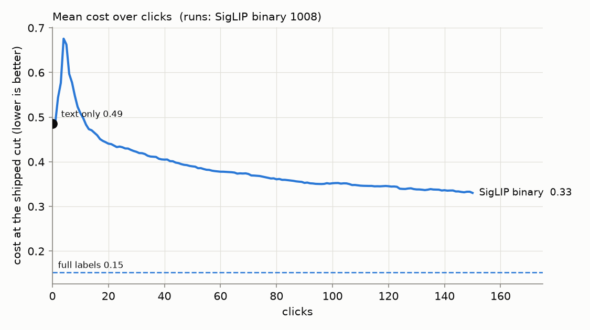
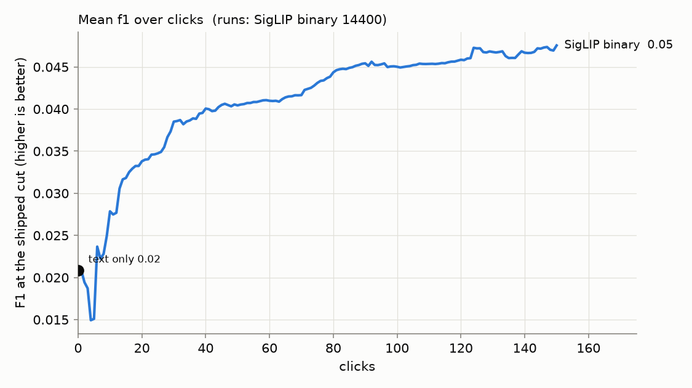
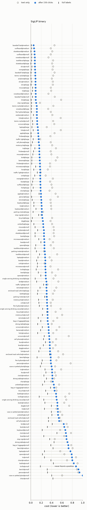

# State of the App: Binary Photo — 2026-09-24

**Issue:** #4159. **Recipe:** `.claude/skills/state-of-the-app/SKILL.md`.
**Path:** SigLIP whole-image embedding, binary (Good/Bad) votes.
**Bench:** `coco_better`, all 49 classes at every size, which is 144 cells.
**Seeds:** 100 (14,400 runs). The companion report is *State of the App:
Region Photo*.

A **review**, not an experiment: the app as it ships, the way a user meets it.
The user types a query, sees the text sort, then votes for up to 150 clicks
while Autopilot picks what to show. Every curve runs from the **text-only score
at click 0**, through the clicks, to the **full-label ceiling**: the same head
trained on every label in the training half. *Cost* is the harness's weighted
FNR/FPR at the shipped threshold, where lower is better. *F1* is at the same
threshold.

## Headline

| mean over 14,400 runs | text only | after 150 clicks | full labels |
|---|---:|---:|---:|
| **cost** | 0.49 | **0.33** | 0.15 |
| **F1** | 0.02 | **0.05** | — |



1. **Clicking roughly halves the distance to the ceiling, and no more.** Cost
   falls from 0.49 to 0.33, against a ceiling of 0.15: 150 clicks close 47% of
   the gap between typing the query and having every label. At 100 seeds this
   is precise: the per-seed mean of the final cost has a standard deviation of
   0.007 (0.31 to 0.35 across seeds).
2. **The first detector is worse than the text sort.** Mean cost jumps from 0.49
   to **0.67 at click 4**, when the first Good and Bad train a head, and does not
   beat the text sort again until **click 13**. A user who stops after a few
   clicks has a worse result than if they had not clicked at all.
3. **The clicks find few positives.** The median run finds **4** positives in
   150 clicks, of about 50 in its training half. **392 runs (2.7%) never find
   one**, so no detector is ever trained, all of them in 16 small-band cells:
   `chair@small` in all 100 seeds, `knife@small` in 86, `bowl@small` 40,
   `laptop@small` 36, `bench@small` 27, `person@small` 25 and `tv@small` 23. The
   easy classes find far more: `tennis racket` 32, `skis` 26, `baseball bat` 25.
4. **The shipped threshold buys recall with precision.** Median recall at 150
   clicks is **0.96**; median precision is **0.02**. At about 1% prevalence, a
   user sees roughly 50 false positives for every true one. Cost rewards that
   trade and F1 does not, which is why cost looks moderate while F1 is 0.05.



## Where it does well and where it does poorly

| band (mean) | text only | after 150 clicks | full labels | F1 | positives found |
|---|---:|---:|---:|---:|---:|
| large | 0.41 | **0.19** | 0.056 | 0.062 | 8.0 |
| medium | 0.47 | **0.31** | 0.16 | 0.045 | 6.3 |
| small | 0.58 | **0.50** | 0.24 | 0.034 | 5.5 |

**Well:** sports equipment and other objects with a distinctive shape.

| class | text only | after 150 | full labels | positives found |
|---|---:|---:|---:|---:|
| skis | 0.43 | **0.091** | 0.016 | 26 |
| tennis racket | 0.44 | **0.092** | 0.012 | 32 |
| snowboard | 0.34 | **0.093** | 0.015 | 14 |
| baseball bat | 0.46 | **0.097** | 0.017 | 25 |
| surfboard | 0.39 | **0.11** | 0.018 | 6.6 |

**Poorly:** furniture, tableware and people, all of them things that fill
scenes rather than stand out in them.

| class | text only | after 150 | full labels | positives found |
|---|---:|---:|---:|---:|
| chair | 0.74 | **0.77** | 0.36 | 2.7 |
| bench | 0.75 | **0.65** | 0.30 | 3.1 |
| vase or potted plant | 0.55 | **0.58** | 0.31 | 3.3 |
| person | 0.74 | **0.54** | 0.17 | 3.6 |
| knife | 0.70 | **0.54** | 0.13 | 2.9 |
| bowl | 0.52 | **0.53** | 0.23 | 3.1 |

- **Clicking made things worse than typing** in 1,762 of 14,400 runs (12%).
  Averaged over seeds, four classes end above their text score: `stop sign`
  (+0.047), `vase or potted plant` (+0.029), `parking meter` (+0.025) and
  `chair` (+0.024).
- **Headroom** (final − ceiling) is largest where positives are hardest to find:
  `chair` 0.41, `knife` 0.40, `person` 0.37, `bench` 0.35. The head could learn
  these classes with the labels; the loop never collects them. That makes the
  loop, not the class, the limit.

Every cell, text only → final → full labels:



## Images: what a click does, and when

Each scored step's change in the held-out test cost is split equally among the
clicks since the previous scored step. The first step is measured from the
text-only score and split among the opening clicks. The credits sum exactly to
each run's net change.

**When a positive is clicked matters more than which one it is.**

| mean cost removed per click | clicks 1–30 | clicks 31–90 | clicks 91–150 |
|---|---:|---:|---:|
| a **positive** (Good) | **−0.028** (hurts) | **+0.016** (helps) | +0.001 |
| a negative (Bad) | +0.005 | +0.001 | +0.0005 |

An early positive hurts on average because it trains the first detector, and
that detector is worse than the text sort (finding 2). The same positive helps
once there are enough labels to fit a reasonable head.

**Individual images matter, in both directions, and most of it is harm.** An
image's raw mean credit mostly records *when* and *where* it was clicked, since
early positives hurt and some classes are harder than others. So each click's
credit is netted of the mean of every click with the same cell, label and
phase. At 100 seeds, 22,388 of 23,472 clicked images were clicked 10 or more
times (median 83):

| images past \|z\| > 3 | observed | shuffled images (5 draws) |
|---|---:|---:|
| **harmful** | **592** | 34–39 |
| **helpful** | **330** | 4–8 |

The effect belongs to the image: an image's net effect in the even seeds
predicts it in the odd seeds (r = 0.62 over 20,801 images).

- **Harm is specific to a class.** Taken per image and class, 1,672 pairs hurt
  past z < −3, against 97 in a shuffle; past z < −5 it is 650 against 1. **83%
  are the image clicked as a negative.** Most often the class is `snowboard`
  (186 pairs), `skis` (115), `keyboard` (78), `microwave` (73) or `stop sign`
  (61).
- **Many are correct negatives from a related scene**: at 7 seeds, a bear for
  `kite`, cows for `airplane`, an elephant for `stop sign`. A Bad vote on a
  scene that shares the class's context teaches the head the wrong contrast.
- **Some are label errors.** 490264, a negative for `fork`, shows a fork. The
  280 harmful pairs clicked as *positives* are candidates too: a positive that
  reliably hurts may not be one.
- **Caveat on the z-scores:** the same image often turns up at the same point
  in a class's runs across seeds, so its repeats are not fully independent and
  a single z overstates certainty. The shuffled null and the split-half
  correlation are the evidence to lean on.

The pair list is `analysis-binary/harmful_pairs.csv`. #4179 reviews it by hand,
strongest first. See [images.md](images.md) for the 12 strongest images in each
direction, with thumbnails.

## Flagged regimes

- **Never found a positive:** the 392 runs above, all small-band cells.
- **Positive exhaustion (#4121)** did not arise. Runs find too few positives to
  run out.

## What to A/B next (proposed)

1. **Don't let the first detector replace a better text sort.** Blend the text
   score with the early detector until the detector beats it (#3944). This
   targets finding 2 and the "early positives hurt" row.
2. **Find positives faster:** the acquisition offset and the text-seed dwell
   (#3261, #2910). Starvation is the first-order problem on small-band cells.
3. **The operating point:** a cut that trades some recall for precision, judged
   on F1 as well as cost (#4118).

## Provenance

- **Run directory:** `/expscratch/sgreenberg/state-of-the-app/2026-09-23/`.
  Analysis is in `analysis-binary/`, including `viewer.html`, the interactive
  curves for every cell.
- **Shipped defaults** throughout: text opening, fused threshold, linear SVM
  head, 150 clicks.
- **CPU count:** every run had a 2-CPU allocation (the partition allocates
  whole cores). Seeds 23–99 ran two cells side by side in each allocation,
  so those runs had about one core each. Thread count changes low-order
  floating-point digits and so can change individual picks, but a check on one
  cell gave identical costs at clicks 25, 50 and 150.

```bash
cd scripts/experiments/state_of_app
SOTA_PATH=binary srun -p cpu --mem=48G -c 4 bash analyze.sh <run dir>
```
