Images tested (clicked 10+ times): 22388 of 23472; 922 past |z| > 3. *Net* is the mean cost removed per click beyond what an average click with the same cell, label and phase removed; *z* is that in standard errors.

### Most helpful

| image | id | clicks | detectors | as positive | net / click | z | raw / click | early | late |
|---|---|---:|---:|---:|---:|---:|---:|---:|---:|
| 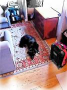 | 272745 | 211 | 29 | 3 | +0.095 | +9.1 | +0.101 | +0.192 | +0.003 |
| 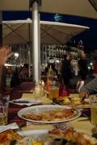 | 111933 | 183 | 35 | 0 | +0.123 | +9.1 | +0.136 | +0.181 | -0.002 |
| 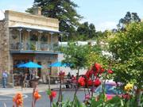 | 170700 | 148 | 31 | 2 | +0.081 | +9.0 | +0.090 | +0.143 | +0.007 |
| 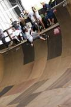 | 59202 | 227 | 27 | 5 | +0.086 | +8.9 | +0.093 | +0.179 | -0.001 |
|  | 296176 | 208 | 30 | 52 | +0.074 | +8.6 | +0.098 | +0.131 | -0.000 |
| 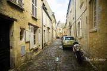 | 134113 | 283 | 59 | 0 | +0.035 | +8.1 | +0.043 | +0.077 | +0.002 |
|  | 220182 | 141 | 37 | 53 | +0.022 | +8.1 | -0.000 | +0.011 | -0.002 |
| 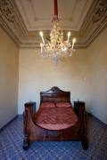 | 152265 | 231 | 45 | 0 | +0.060 | +7.6 | +0.073 | +0.115 | +0.001 |
| 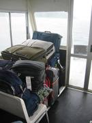 | 425522 | 169 | 41 | 1 | +0.070 | +7.6 | +0.074 | +0.149 | +0.000 |
|  | 461458 | 268 | 47 | 0 | +0.078 | +7.3 | +0.085 | +0.127 | +0.001 |
| 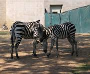 | 133115 | 68 | 8 | 0 | +0.103 | +7.0 | +0.109 | +0.116 | -0.036 |
| 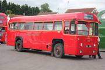 | 557843 | 110 | 28 | 0 | +0.100 | +6.9 | +0.110 | +0.180 | -0.004 |

### Most harmful

| image | id | clicks | detectors | as positive | net / click | z | raw / click | early | late |
|---|---|---:|---:|---:|---:|---:|---:|---:|---:|
| 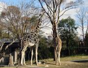 | 168879 | 157 | 10 | 0 | -0.098 | -39.0 | -0.077 | -0.080 | +0.002 |
|  | 268603 | 187 | 27 | 0 | -0.067 | -23.4 | -0.051 | -0.061 | -0.004 |
|  | 26578 | 119 | 16 | 0 | -0.134 | -22.4 | -0.122 | -0.144 | +0.003 |
| 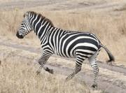 | 528011 | 116 | 15 | 0 | -0.067 | -20.4 | -0.056 | -0.065 | +0.013 |
|  | 497444 | 259 | 38 | 0 | -0.055 | -15.4 | -0.051 | -0.064 | +0.002 |
|  | 127110 | 171 | 15 | 0 | -0.036 | -15.2 | -0.020 | -0.021 | -0.010 |
| 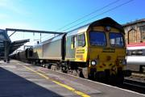 | 94162 | 134 | 21 | 0 | -0.055 | -14.8 | -0.042 | -0.052 | +0.006 |
| 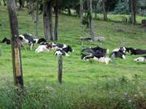 | 121461 | 160 | 15 | 0 | -0.069 | -14.7 | -0.057 | -0.064 | +0.006 |
|  | 472841 | 160 | 23 | 0 | -0.055 | -14.7 | -0.046 | -0.069 | +0.001 |
| 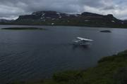 | 466347 | 261 | 52 | 6 | -0.108 | -14.3 | -0.100 | -0.172 | +0.001 |
|  | 490264 | 238 | 28 | 1 | -0.138 | -13.8 | -0.135 | -0.194 | +0.001 |
| 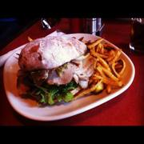 | 504810 | 126 | 18 | 3 | -0.050 | -13.2 | -0.035 | -0.044 | -0.002 |
