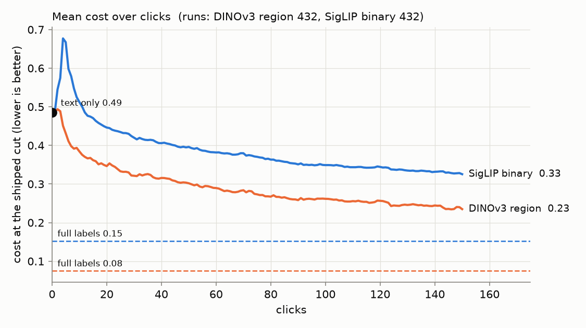
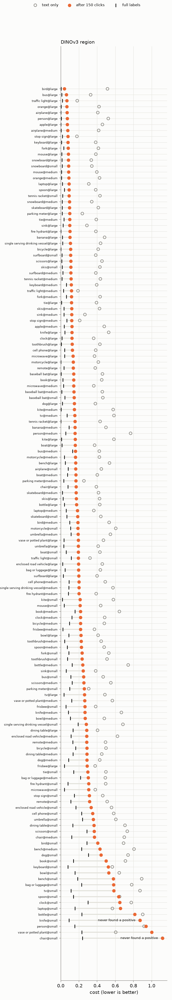

# State of the App: Region Photo — 2026-09-24

**Issue:** #4159. **Recipe:** `.claude/skills/state-of-the-app/SKILL.md`.
**Path:** SigLIP text opening, then DINOv3 patch embeddings with max-patch
scoring and region voting (the user votes on a box, not the whole image).
**Bench:** `coco_better`, all 49 classes at every size (144 cells).
**Seeds:** 3 (432 runs). The companion report is *State of the App: Binary
Photo*; its comparisons here use the same 3 seeds.

A **review**, not an experiment: the app as it ships, the way a user meets it.
The user types a query, sees the text sort, then votes for up to 150 clicks
while Autopilot picks what to show. Every curve runs from the **text-only score
at click 0**, through the clicks, to the **full-label ceiling**. For region this
is the same head trained on every oracle box in the training half. *Cost* is
the harness's weighted FNR/FPR at the shipped threshold, where lower is better.
*F1* is at the same threshold.

## Headline

| mean over 432 runs | text only | 25 clicks | 50 clicks | 150 clicks | full labels |
|---|---:|---:|---:|---:|---:|
| **Region** cost | 0.49 | 0.33 | 0.30 | **0.24** | 0.075 |
| Binary cost (same seeds) | 0.49 | 0.44 | 0.40 | 0.33 | 0.15 |
| **Region** F1 | 0.021 | | | **0.065** | — |



1. **Region voting is better than binary at every click count.** At 150 clicks
   region ends at 0.24 against binary's 0.33, and it is lower in **328 of 432**
   paired runs (same class, band and seed; Wilcoxon p < 10⁻³⁸). It closes
   **61%** of the gap between the text sort and full labels, where binary closes
   48%. Its ceiling is also lower: 0.075 against 0.15, lower in 368 of 432
   pairs.
2. **No early dip.** Binary's first detector is much worse than the text sort
   (0.68 at click 4). Region's barely moves: **0.49 at click 2**, and below the
   text sort again from **click 4**. By click 10 region is at 0.38 and binary at
   0.51.
3. **It still finds few positives on hard cells.** The median run finds 4
   positives, the same as binary. **12 runs never find one**, the same count as
   binary on these seeds, and all small-band cells: `chair@small` and
   `knife@small` in all 3 seeds, `bowl@small` and `person@small` in 2, and
   `laptop@small` and `spoon@small` in 1. On large-band cells it finds twice as
   many as binary: 16 against 8.
4. **The shipped threshold still buys recall with precision.** Median recall at
   150 clicks is **0.98** and median precision **0.028**. That is better than
   binary's 0.96 / 0.020, but still roughly 35 false positives for every true
   one.

## Where it does well and where it does poorly

| band (mean) | text only | after 150 clicks | full labels | F1 | positives found |
|---|---:|---:|---:|---:|---:|
| large | 0.41 | **0.13** | 0.025 | 0.089 | 16 |
| medium | 0.47 | **0.19** | 0.074 | 0.066 | 7.9 |
| small | 0.59 | **0.39** | 0.13 | 0.038 | 3.8 |

**Well:** objects with a distinctive shape or colour, including fruit.

| class | text only | after 150 | full labels | positives found |
|---|---:|---:|---:|---:|
| orange | 0.42 | **0.078** | 0.005 | 35 |
| snowboard | 0.34 | **0.088** | 0.015 | 7.3 |
| apple | 0.47 | **0.097** | 0.019 | 26 |
| airplane | 0.42 | **0.10** | 0.028 | 37 |
| tennis racket | 0.43 | **0.12** | 0.011 | 25 |

**Poorly:** the same scene-filling classes as binary, though every one of them
ends better than binary does.

| class | text only | after 150 | full labels | positives found | binary after 150 |
|---|---:|---:|---:|---:|---:|
| chair | 0.74 | **0.55** | 0.15 | 2.6 | 0.78 |
| vase or potted plant | 0.55 | **0.49** | 0.13 | 3.1 | 0.64 |
| knife | 0.69 | **0.42** | 0.073 | 2.9 | 0.55 |
| bottle | 0.69 | **0.41** | 0.13 | 4.2 | 0.54 |
| bench | 0.74 | **0.39** | 0.16 | 4.6 | 0.68 |
| person | 0.74 | **0.39** | 0.071 | 9.0 | 0.51 |

- **Where region gains most over binary:** `bench` (0.29 lower), `chair`
  (0.23), `book` (0.19), `single serving drinking vessel` (0.18),
  `dining table` (0.17) and `stop sign` (0.17). These are small objects in
  cluttered scenes, where a box isolates what one whole-image vector cannot.
- **Where binary is better:** `frisbee` (binary 0.095 lower), `baseball bat`
  (0.065), `kite` (0.056), `skis` (0.045) and `surfboard` (0.031). These are
  thin or airborne sports objects whose whole scene (a field, the sky, snow)
  is itself the evidence.
- **Clicking made things worse than typing** in only 15 of 432 runs, against
  46 for binary. No class ends above its text score on average.
- **Headroom** (final − ceiling) is largest on `chair` 0.41, `vase or potted
  plant` 0.36, `knife` 0.35 and `person` 0.32. As with binary, the head could
  learn these; the loop does not collect enough positives.

Every cell, text only → final → full labels:



## Images: what a click does, and when

Credit per click is computed as in the Binary Photo report: each scored step's
change in held-out cost is split equally among the clicks since the previous
scored step.

**Every positive helps, including the first ones.** This is the per-click face
of finding 2.

| mean cost removed per click | clicks 1–30 | clicks 31–90 | clicks 91–150 |
|---|---:|---:|---:|
| a **positive** (Good), region | **+0.023** | +0.013 | +0.002 |
| a positive, binary (7 seeds) | −0.027 | +0.015 | +0.001 |
| a negative (Bad), region | +0.002 | +0.001 | +0.000 |

**Per image, 3 seeds are too few.** Only 363 images were clicked 10 or more
times, and after netting out cell, label and phase, 3 are helpful past |z| > 3
against 0–1 with images shuffled. None are harmful. That is too little to name
images; see [images.md](images.md) for the format. Binary needed 7 seeds to see
harmful images (#4179).

## Flagged regimes

- **Never found a positive:** the 12 runs above, all small-band cells.
- **Positive exhaustion (#4121)** did not arise.

## What to A/B next (proposed)

1. **Find positives on small cells.** Starvation is the same 12 runs on both
   paths, so it lies before the head: the acquisition offset and the text-seed
   dwell (#3261, #2910).
2. **Region for scene classes, whole image for sport classes.** Region loses by
   up to 0.095 on `frisbee`, `baseball bat`, `kite` and `skis`. A candidate is
   a head that also sees the whole-image vector.
3. **The operating point:** a cut that trades some recall for precision, judged
   on F1 as well as cost (#4118).

## Cost of the path

Region is expensive to evaluate: about 40 minutes a run at 8 CPUs for the
clicks (17 GB) plus about 10–17 minutes for the ceiling (70 GB), against about
10 minutes and 2 GB for a binary run. One region seed takes about 5 hours of
the per-user limit; that is why this report has 3 seeds and Binary Photo has
more.

## Provenance

- **Run directory:** `/expscratch/sgreenberg/state-of-the-app/2026-09-23/`.
  Analysis is in `analysis-region/`; clicks are in `results/`, and the
  full-label ceiling is in `ceiling/results/` (launched as two passes,
  `SOTA_PASS=trajectory` and `SOTA_PASS=ceiling`).
- **Shipped defaults** throughout: text opening, fused threshold, linear SVM
  head, max-patch scoring with region voting, 150 clicks.
- **CPU count:** click runs used 8 or 4 CPUs. Thread count changes low-order
  floating-point digits and can change individual picks; a check on one cell
  gave identical costs at clicks 25, 50 and 150.
- **Never-trained runs:** in a two-pass run, a click run that never finds a
  positive writes a header-only file. `analyze.py` now recovers such runs from
  their ceiling row. Before that fix, the 10 hardest runs were silently dropped.

```bash
cd scripts/experiments/state_of_app
SOTA_PATH=region bash analyze.sh <run dir>
python figures.py --analysis <run dir>/analysis-region --out <run dir>/analysis-region/figures \
  --compare <run dir>/analysis-binary
```
