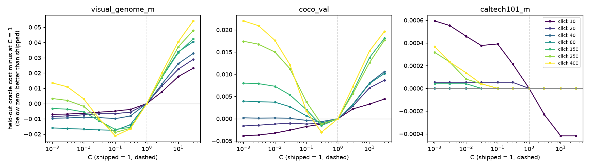
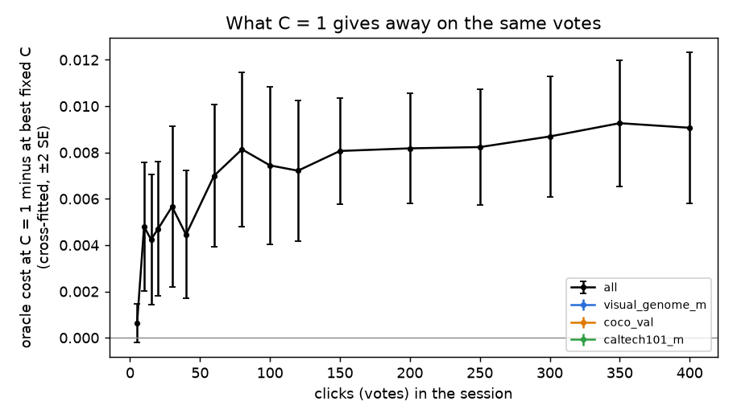
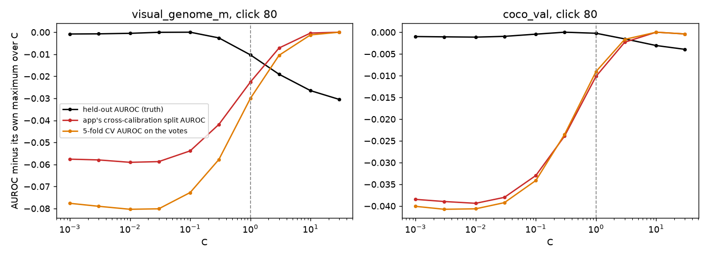
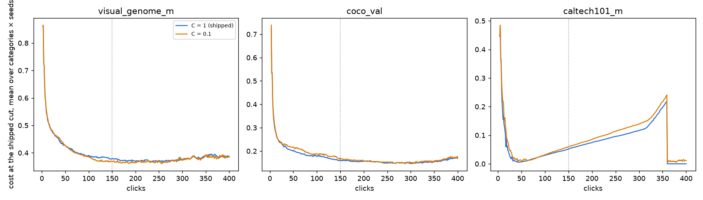
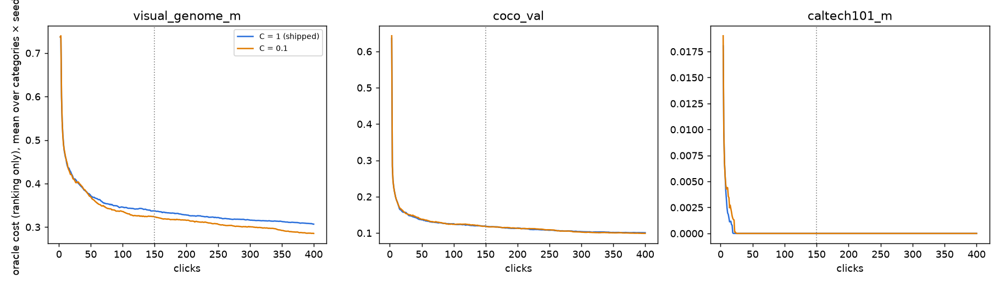
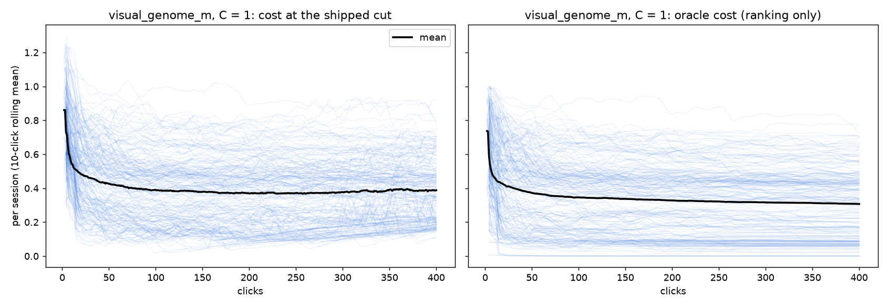

# How many votes does it take to over-train the head? (issue #3945)

**Question.** Does the detector over-train as the user votes, and after how many votes? Should training account for it, or should the app detect it and tell the user? Pre-registered design and decision rules: [`PLAN.md`](PLAN.md).

**Verdict.**

- **It memorises from the first vote, and it over-trains mildly.** The shipped head (linear SVM, C = 1) separates its own votes perfectly at every depth: training AUROC is 1.00 at 20 votes and 0.999 at 150. On the same votes, a more regularised C ranks the held-out images better from about 10 votes on. The gap is 0.004–0.008 oracle cost pooled, and it grows to 0.017 on Visual Genome by 150 votes. Inside the Autopilot loop at 400 clicks, C = 0.1 ranks better by 0.008 ± 0.002 over clicks 151–400.
- **The fix is a smaller constant C, not a schedule.** The best C does *not* fall as votes accumulate. It sits at the centroid-like end (C ≈ 0.001) for tiny vote sets, rises to about 0.1 by 60 votes, and stays there. One fixed C ≈ 0.06 captures all of the available gain, and every vote-count schedule does as well or worse. But the shipped cut hands the ranking gain back (regret +0.008), so the cost the user sees does not move. C therefore has to change together with the cut. That is #4115, and nothing ships from here.
- **The app cannot detect it from the votes.** Every vote-only gauge points the wrong way: the app's own cross-calibration AUROC, 5-fold CV on the votes, and training AUROC all prefer *less* regularisation. Picking C by any of them does worse than leaving C at 1. Autopilot's votes are the hard boundary cases, so a score measured on them does not measure the haystack. A "you are over-training, try a new dataset" message cannot be driven by anything the app computes today.
- **The late-session degradation a user would actually see is the cut, not the head.** Along 400-click sessions, the *ranking* ends ≥ 0.02 worse than its best stretch in 13% of sessions. The *cost at the shipped cut* does so in 55%, and in 75% of sessions that have found ≥ 80% of the positives. The rise is false positives (FPR +0.067) from the fused cut drifting after exhaustion, which is #4121. The rows contain a natural experiment for it: on Caltech the cut recovers in one click, in every session, at the step where vote exclusion switches off.

## What was already known

- **The shuffled-label control** was run by #3197 (its `A_control.csv`, credited there to this issue). Every head separates coin-flip labels perfectly on its own votes and scores chance held out (AUROC 0.50). Memorisation is invisible from the votes.
- **In-loop C at 150 clicks** (#3197): C = 0.1 ranks better than C = 1 and the cut gives it back. That result is filed as #4115.
- **Late spikes in deep sessions are positive exhaustion** (#3547).

What was missing is the shape in the vote count, whether a schedule helps, whether anything the app can see detects it, and how deep sessions behave.

## Design

- **Stage R, replay (CPU, no loop).** Take real Autopilot vote sets, cut each session at t ∈ {5 … 400} clicks, and refit the shipped head at ten values of C from 0.001 to 30. Each fit is scored three ways: on the harness's held-out half (the truth), on its own votes, and on two vote-only gauges. The gauges are the app's cross-calibration splits (2 × 30% held out, as shipped) and 5-fold CV. Script: [`c_path.py`](../../../scripts/experiments/overtrain_3945/c_path.py). There are two sources of sessions. **R150** uses #3197's 480 shipped-arm sessions (150 clicks). **R400** uses this study's own 480 sessions at 400 clicks.
- **Stage D, in the loop (CPU).** #3197's harness unchanged ([`launch_svmlog_3197.sh`](../../../scripts/experiments/calibration/launch_svmlog_3197.sh)) at `CALIB_MAX_STEPS=400`, arms `svm` (shipped) and `svmc01` (C = 0.1). The environments are three pile datasets × `siglip`/`siglip2_l`, 48 categories each, 5 seeds: **480 sessions per arm, 0 failures**. The environment table is in #3197's report.

Every contrast is paired within the session (and the cut), with SE clustered on (environment, category). A contrast is **not resolvable** when |mean| < 2 SE. The "best C" is always cross-fitted: chosen on seeds {0,1,2} and scored on {3,4}, and vice versa.

## 1. How many votes? The C path on the same votes



*Held-out oracle cost against C, relative to C = 1, one line per click count. Below zero is better than the shipped head. R150.*

Held-out oracle cost, mean over sessions (R150):

| C | VG @20 | VG @80 | VG @150 | COCO @20 | COCO @80 | COCO @150 |
|---|---|---|---|---|---|---|
| 0.01 | 0.42 | 0.340 | 0.329 | 0.160 | 0.130 | 0.126 |
| 0.1 | 0.42 | **0.338** | **0.320** | 0.161 | 0.128 | 0.120 |
| 0.3 | 0.42 | 0.342 | 0.323 | 0.161 | **0.127** | **0.117** |
| **1 (shipped)** | 0.43 | 0.354 | 0.337 | 0.163 | 0.128 | 0.119 |
| 10 | 0.45 | 0.384 | 0.369 | 0.172 | 0.136 | 0.133 |

What memorisation looks like from inside (pooled, R150):

| C | training AUROC @20 / @80 / @150 | votes inside the margin @150 |
|---|---|---|
| 0.1 | 1.00 / 0.99 / 0.98 | 100% |
| 1 (shipped) | 1.00 / 1.00 / **1.00** | 88% |
| 10 | 1.00 / 1.00 / 1.00 | 59% |

**The penalty: C = 1 against the cross-fitted best fixed C, per click count.**



| click | 10 | 20 | 40 | 80 | 150 |
|---|---|---|---|---|---|
| Goods in the vote set (mean) | 3.6 | 5.3 | 8.5 | 14 | 26 |
| pooled | +0.0045 ± 0.0012 | +0.0042 ± 0.0018 | +0.0044 ± 0.0015 | +0.0075 ± 0.0016 | +0.0077 ± 0.0017 |
| VG | +0.006 ± 0.002 | not resolvable | +0.009 ± 0.003 | +0.016 ± 0.003 | +0.017 ± 0.003 |
| COCO | +0.0045 ± 0.0018 | not resolvable | not resolvable | not resolvable | not resolvable |
| Caltech | 0 | 0 | 0 | 0 | 0 |

(Oracle cost; positive means C = 1 is worse. From [`R150_penalty.csv`](R150_penalty.csv).)

So the answer to **"how many votes"** is **about 10**: that is where C = 1 first ranks resolvably worse than a smaller C. Pooled, it passes the pre-registered 0.005 bar from **60 votes**. Whether it *grows* is environment-dependent. Paired within the session, penalty(150) − penalty(20) is **+0.011 ± 0.003 on VG**, −0.0045 ± 0.0024 on COCO (not resolvable), and +0.0035 ± 0.0020 pooled (not resolvable). By PLAN's rule, "C = 1 over-trains" **holds on VG and not in the pool**.

<!-- R400 -->

## 2. Should training account for it? A constant, not a schedule

The cross-fitted best C per click count (R150, both seed halves):

| click | 5 | 10–30 | 40 | 60–150 |
|---|---|---|---|---|
| C* | 0.3 (flat, nothing to choose) | 0.001 | 0.001 / 0.1 | **0.1** (0.3 once) |

The best C **rises** with votes. It does not fall. With a handful of votes the best fit is nearly the class-mean difference (C → 0 is the centroid limit, #3197). As votes accumulate the head can afford to fit more, but never as loosely as C = 1. That refutes the premise of a C ∝ 1/n schedule ("the model gets less regularised the more you click, so shrink C with n"). Per dataset, COCO's best C settles at 0.3 and VG's at 0.1.

Schedules, each fitted on one seed half and scored on the other, averaged over every cut ([`R150_schedule.csv`](R150_schedule.csv)):

| schedule | minus C = 1 | minus the best fixed C |
|---|---|---|
| fixed C ≈ 0.06 | **−0.0048 ± 0.0010** | — |
| C ∝ votes^−½ | −0.0048 ± 0.0009 | not resolvable |
| C ∝ votes^−1 | −0.0041 ± 0.0008 | +0.0007 ± 0.0003 (worse) |
| C ∝ Goods^−½ | −0.0043 ± 0.0009 | +0.0005 ± 0.0002 (worse) |
| C ∝ Goods^−1 | −0.0033 ± 0.0010 | +0.0015 ± 0.0003 (worse) |

A per-click oracle C*(t) beats the fixed one by only 0.0003 ± 0.0002. **No schedule clears the pre-registered bar** (beat fixed C* by ≥ 0.005), so the question folds into #4115 as a single constant.

## 3. Can the app detect it? Not from the votes



*At click 80: held-out AUROC (the truth) peaks at C ≈ 0.1 and falls towards C = 30. The app's cross-calibration split AUROC and 5-fold CV on the votes do the opposite, rising steeply towards large C.*

| gauge | within-session rank correlation with held-out AUROC (median) | held-out oracle cost of the C it picks, minus C* | … minus C = 1 | picks C ≥ 1 |
|---|---|---|---|---|
| app's cross-calibration splits | **−0.21** | +0.011 ± 0.001 | +0.0055 ± 0.0007 | 90% |
| 5-fold CV on the votes | −0.11 | +0.011 ± 0.002 | +0.0063 ± 0.0007 | 91% |
| training AUROC | −0.47 | +0.007 ± 0.001 | +0.0016 ± 0.0003 | 100% |

([`R150_detect.csv`](R150_detect.csv).) PLAN's bar was a median correlation > 0.5 **and** a picked C within 0.005 of C*. Every gauge fails both, in the **wrong direction**. The mechanism: Autopilot votes the items nearest the boundary (`hard` phase), so the vote set is a sample of the hardest cases, not of the haystack. A looser fit separates those hard cases better, and the haystack is ranked worse for it. As a session deepens its votes get harder, so a vote-set score *falls* while held-out quality *rises*, which is where the negative correlation comes from. The detector the issue asks for would need scores on items the user did **not** choose. The atlas typicality detector was the natural home, but #3329 measured it as near-constant.

## 4. In the loop at 400 clicks: C = 0.1 ranks better, the cut gives it back

C = 0.1 minus shipped C = 1, 480 paired sessions ([`D_paired.csv`](D_paired.csv)):

| window | oracle cost (ranking) | regret (the cut) | cost (both) |
|---|---|---|---|
| clicks 1–150 | **−0.0036 ± 0.0016** | +0.0068 ± 0.0013 | not resolvable |
| clicks 151–400 | **−0.0080 ± 0.0015** | +0.0094 ± 0.0031 | not resolvable |
| at click 400 | **−0.011 ± 0.002** | +0.013 ± 0.005 | not resolvable |

AUROC agrees (+0.0038 ± 0.0007 over clicks 1–400; +0.0064 ± 0.0013 at click 400). AP is not resolvable in any window.

On VG alone, oracle cost over clicks 151–400 is **−0.016 ± 0.002**. The ranking gain grows with depth on-policy, as the replay predicted, and it is on-policy here: C = 0.1 chose its own votes. The cost the user sees does not move, because the shipped cut gives it all back. That is #4115's finding again at 2.7× the depth. It also finds 1.4 ± 0.6 fewer Goods over the session (on COCO, 3.8 ± 1.2 fewer), which is worth carrying into #4115's arm.





*Mean over categories and seeds, one panel per dataset. The dotted line is click 150, where every previous study stopped.*

## 5. What does get worse with more votes: the cut (#4121)

Per session, the last 50 clicks against the session's best 50-click stretch (smoothed, so one noisy click cannot fake it), shipped arm ([`D_degrade.csv`](D_degrade.csv)):

| sessions | n | **cost** ≥ 0.02 worse at the end | **oracle cost** ≥ 0.02 worse | FPR change | FNR change |
|---|---|---|---|---|---|
| all | 480 | 55% | 13% | +0.044 | +0.002 |
| found ≥ 80% of the positives | 218 | **75%** | 9% | **+0.067** | −0.005 |
| found < 80% | 262 | 39% | 16% | +0.024 | +0.007 |
| C = 0.1 arm, found ≥ 80% | 209 | 75% | 9% | +0.082 | −0.007 |



*Every shipped-arm VG session as its own line (10-click rolling mean). Left: cost at the shipped cut, whose mean turns up after about 250 clicks. Right: oracle cost, which keeps falling. [COCO](figures/stageD_runs_coco_val.png) shows the same.*

**The natural experiment.** Caltech's sim half holds 419 images, so the unvoted remainder crosses `EXCLUSION_MIN_REMAINDER = 60` at click 360 in every session, and vote exclusion switches off there ([`D_exclusion.csv`](D_exclusion.csv), all 60 sessions):

| remainder | exclusion | fused cut | FPR | cost | oracle cost |
|---|---|---|---|---|---|
| 64 | on | 0.44 | 0.14 | 0.21 | 0.00 |
| 60 | on | 0.44 | 0.14 | 0.22 | 0.00 |
| **59** | **off** | **0.49** | **0.00** | **0.00** | 0.00 |
| 55 | off | 0.49 | 0.00 | 0.00 | 0.00 |

The ranking is perfect throughout. The whole 0.22 is the cut, and it disappears in one click when exclusion stops. This settles #4121's first design note ("confirm it is the exclusion") without a re-run. The evidence is posted on #4121.

**Literal rows** (click at the session's best stretch → click 400, shipped arm, [`D_examples.csv`](D_examples.csv)):

| session | Goods / test positives | cut | FPR | cost | oracle cost |
|---|---|---|---|---|---|
| `visual_genome_m × siglip2_l`, `ball`, seed 2 | 14 → 26 / 19 | 0.31 → 0.20 | 0.15 → 0.54 | 0.31 → 0.70 | 0.30 → 0.28 |
| `visual_genome_m × siglip`, `neck`, seed 0 | 20 → 24 / 20 | 0.28 → 0.20 | 0.19 → 0.56 | 0.39 → 0.71 | 0.36 → 0.44 |
| `coco_val × siglip2_l`, `microwave`, seed 1 | 25 → 25 / 28 | 0.26 → 0.20 | 0.12 → 0.34 | 0.12 → 0.34 | 0.045 → 0.045 |
| `coco_val × siglip2_l`, `microwave`, seed 3 | 26 → 26 / 28 | 0.26 → 0.20 | 0.11 → 0.34 | 0.11 → 0.34 | 0.092 → 0.092 |

The COCO rows are the purest case: no new Goods, the ranking identical to three decimals, and the cut falling from 0.26 to 0.20 as Bad votes accumulate. The VG `neck` row is the one #3197 found carries unlabelled necks (people and animals). Its oracle cost is high for that reason, not because of the cut.

## 6. Do clicks past the app's own stop signal hurt?

The app's rules (Smart, Stable and Span all green) fired in 464 of 480 shipped sessions, at median click **64** ([`D_stop.csv`](D_stop.csv), via `stopping.stopping_points`). Click 400 minus the stopping point:

| | cost | oracle cost | sessions ≥ 0.02 worse in cost |
|---|---|---|---|
| all | −0.020 ± 0.007 | −0.036 ± 0.004 | 29% |
| VG | not resolvable | −0.049 ± 0.005 | 35% |
| COCO | −0.023 ± 0.010 | −0.027 ± 0.005 | 29% |

On average, clicking past the stop still helps: the ranking keeps improving (the first half of #3560's question on these cells). But 29% of sessions end ≥ 0.02 worse in cost than where the app said they could stop. That is the §5 drift, and the stop signal does not warn about it.

## Decision rules (PLAN), as read

| rule | result |
|---|---|
| "C = 1 over-trains": penalty > 0.005 and resolvable at ≥ 2 adjacent cuts, **and** growing by 2 SE | **Holds on VG** (+0.011 ± 0.003 growth). **Pooled: first half yes (60–150), growth no** (+0.0035 ± 0.0020). |
| A vote-count schedule worth an in-loop test (beats fixed C* by ≥ 0.005) | **No.** Best schedule: not resolvable against fixed C*. |
| A gauge detects over-training (median ρ > 0.5 and picked C within 0.005 of C*) | **No, for every gauge.** All three point the wrong way. |
| Nothing ships | Held. Recommendations go to #4115 and #4121. |

## What this changes

- **#4115** (C with a re-tuned cut) gets the grid this study measured. Candidate C ∈ {0.03, 0.1, 0.3}, not a schedule. The gain is ranking-only until the cut is re-tuned, and it grows with depth (−0.011 oracle cost at click 400), so #4115 should read at 400 clicks, not 150.
- **#4121** (fused cut drifts after exhaustion) is confirmed as the exclusion, and shown on COCO and VG as well as Caltech. It is the late-session "the more I click, the worse it gets" failure the issue describes, and it is not over-training.
- **No detector for "you are over-training"** should be built on vote-set scores. A future attempt needs unvoted items; see §3.
- The issue's own suggestions (dropout, hidden width, PCA) do not apply to a linear head. The equivalent knob is C, measured here.

## Scope, validity and limits

- **The replay is off-policy.** It refits other C values on votes the C = 1 head chose. Stage D's `svmc01` arm is the on-policy check, and it agrees in sign and grows with depth as the replay does.
- **Oracle cost is ranking-only.** No claim here is about cost at a re-tuned cut.
- **Prefix check** (PLAN): only 88 of 480 of this study's 400-click sessions reproduce #3197's first 150 picks. Median first divergence is click 8 ([`D_prefix.csv`](D_prefix.csv)). Dev changed the cut between the two runs (#3551 shipped the corridor20 fold-fallback schedule; #3839 raised the anchored refit budget), and Autopilot's pick depends on the cut. Every contrast in this report is within one run, so none is affected. R150 and R400 are two independent session sets, not one set read twice. <!-- determinism -->
- Whole-image voting and two SigLIP embedders, as in #3197. Caltech is saturated (oracle cost 0) and contributes zeros to every ranking contrast.

## Reproduce

```bash
# Stage D (400 clicks, two arms), then harvest the vote sets
export VTS_REPO=<worktree> SVMLOG_BASE=/expscratch/$USER/overtrain-3945/stageD CALIB_MAX_STEPS=400 CALIB_TIME=8:00:00 CALIB_MEM=8G
ln -s /expscratch/$USER/svmlog-3197/stageB/prepare $SVMLOG_BASE/prepare
bash scripts/experiments/calibration/launch_svmlog_3197.sh svm
bash scripts/experiments/calibration/launch_svmlog_3197.sh svmc01
python scripts/experiments/svm_vs_logistic/harvest_picks.py $SVMLOG_BASE/svm     # and svmc01
# Stage R: the C path on #3197's sessions and on Stage D's
bash scripts/experiments/overtrain_3945/launch_c_path.sh /expscratch/$USER/svmlog-3197/stageB svm /expscratch/$USER/overtrain-3945/R150
bash scripts/experiments/overtrain_3945/launch_c_path.sh $SVMLOG_BASE svm /expscratch/$USER/overtrain-3945/R400
# analysis, figures, examples
python scripts/experiments/overtrain_3945/analyze_c_path.py --results …/R150 --out …/analysis150      # and R400
python scripts/experiments/overtrain_3945/analyze_stage_d.py --root $SVMLOG_BASE --prefix-root /expscratch/$USER/svmlog-3197/stageB --out …/analysisD
python scripts/experiments/overtrain_3945/figures.py --rpath …/analysis150 --stageD …/analysisD --out docs/experiments/2026-09-25-overtrain-3945/figures
python scripts/experiments/overtrain_3945/examples.py --replay-root $SVMLOG_BASE --rpath …/R400 --t 300 --out docs/experiments/2026-09-25-overtrain-3945/EXAMPLES.md
```

Run root on the GRID: `/expscratch/sgreenberg/overtrain-3945/`.
