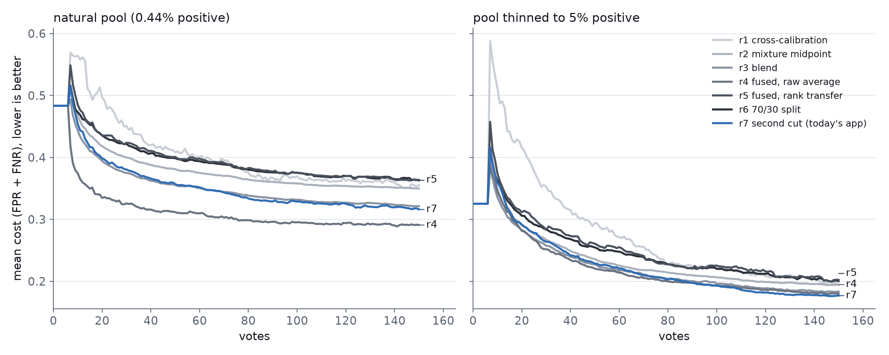
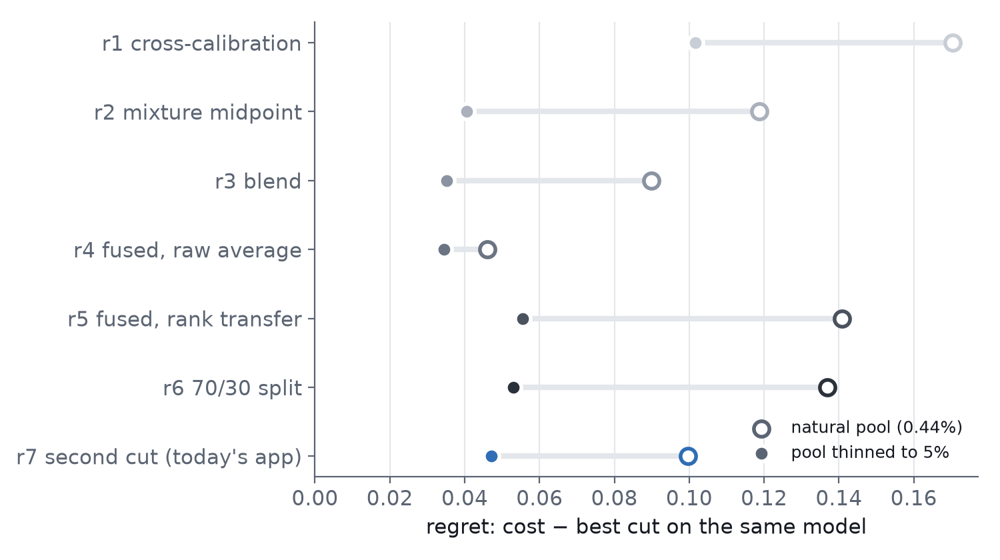

# Does the deck's calibration ladder descend on COCO Better?

**No, not at COCO Better's natural prevalence, and it only partly recovers at 5%.**
The seven rungs of *Hold The Line*, each the app as the deck draws it, ran
closed-loop on every COCO Better cell (144 class@band cells × 5 seeds, SigLIP,
binary voting, 150 votes). At the natural pool, where 0.44% of images are
positive, the deck's **strawman wins**. `anchored_rawmean` (r4, "three models,
three scales") is the best rung at every checkpoint. The shipped fused cut (r5)
is **+0.083 ± 0.0031** worse than it in mean cost over clicks 1–150, and worse
in all 49 classes. The underlying models are equally good in every rung; the
whole gap is **where the cut lands**. At that prevalence the haystack mixture's
"high" component holds ~25% of the pool, so every midpoint rule cuts near the
72nd–79th percentile and flags ~50–60 images per real positive. Rerunning the
same grid on a pool thinned to 5% positives (#4201) cuts every rung's cost by
0.065–0.13 and shrinks the r5 − r4 gap to +0.030 ± 0.0017. The ordering does
not flip: r4 still beats r5 in 47 of 49 classes. Today's app (r7) overtakes r4
at vote 89 on the thinned pool and ends lowest, but never catches it on the
natural one.

Plan and rung table: [PLAN.md](PLAN.md). Follow-up issue: #4201.

## The ladder at two prevalences

Mean cost is FPR + FNR, filled: a cell with no app-visible detector yet is still
showing the typed query's ranking and counts at its text-sort cost. Every curve
therefore leaves the same click-0 notch (0.48 natural, 0.33 at 5%).

| rung | slide | natural t=10 | t=50 | t=150 | 5% t=10 | t=50 | t=150 |
|---|---|---|---|---|---|---|---|
| r1 cross-calibration | *Grading Your Own Homework* | 0.56 | 0.41 | 0.36 | 0.51 | 0.29 | 0.20 |
| r2 mixture midpoint | *Oops! All Haystack* | 0.47 | 0.38 | 0.35 | 0.35 | 0.24 | 0.19 |
| r3 blend | *Cross Examination* | 0.44 | 0.36 | 0.32 | 0.34 | 0.23 | 0.18 |
| r4 fused, raw average | *The Rank & File* b | **0.37** | **0.31** | **0.29** | 0.34 | **0.22** | 0.18 |
| r5 fused, rank transfer | *The Rank & File* d | 0.49 | 0.40 | 0.36 | 0.37 | 0.26 | 0.20 |
| r6 70/30 split | *Train More, Check Less* | 0.47 | 0.40 | 0.36 | 0.36 | 0.25 | 0.20 |
| r7 second cut (today's app) | *Second Cut* | 0.45 | 0.36 | 0.32 | 0.36 | 0.23 | **0.18** |

Each rung against the one before, mean over clicks 1–150, paired on 720 cells
(bold = more than 2 SE from zero):

| step | natural Δcost | 5% Δcost |
|---|---|---|
| r1 → r2 | **−0.025** ± 0.0053 | **−0.042** ± 0.0027 |
| r2 → r3 | **−0.025** ± 0.0013 | **−0.0092** ± 0.0014 |
| r3 → r4 | **−0.041** ± 0.0026 | −0.0028 ± 0.0014 |
| r4 → r5 | **+0.083** ± 0.0031 | **+0.030** ± 0.0017 |
| r5 → r6 | −0.0022 ± 0.0015 | **−0.0040** ± 0.0014 |
| r6 → r7 | **−0.041** ± 0.0023 | **−0.023** ± 0.0018 |

The deck's argument predicts two of these features, and both show. r1 starves
early: it rises *above* the notch at vote 10 at both prevalences, reading
nothing but labels. And each of r2, r3 and r7 helps. One step goes the wrong
way at both prevalences: r4 → r5, the step *The Rank & File* argues for.

## Why: the cut, not the model

Over the clicks where a detector is on screen:

| rung | pool | cost | best cut on same model | regret | cut percentile (median) | FPR | FNR | mixture high weight (median) |
|---|---|---|---|---|---|---|---|---|
| r1 | natural | 0.35 | 0.18 | 0.17 | 99% | 0.027 | 0.32 | 0.27 |
| r1 | 5% | 0.26 | 0.16 | 0.10 | 98% | 0.044 | 0.22 | 0.068 |
| r2 | natural | 0.32 | 0.20 | 0.12 | 74% | 0.25 | 0.065 | 0.26 |
| r2 | 5% | 0.22 | 0.18 | 0.041 | 87% | 0.13 | 0.085 | 0.17 |
| r4 | natural | 0.23 | 0.19 | **0.046** | 89% | 0.12 | 0.11 | 0.22 |
| r4 | 5% | 0.21 | 0.17 | **0.034** | 91% | 0.10 | 0.10 | 0.13 |
| r5 | natural | 0.34 | 0.20 | 0.14 | 72% | 0.28 | 0.061 | 0.26 |
| r5 | 5% | 0.24 | 0.18 | 0.055 | 83% | 0.16 | 0.074 | 0.18 |
| r7 | natural | 0.28 | 0.18 | 0.10 | 79% | 0.21 | 0.071 | 0.21 |
| r7 | 5% | 0.21 | 0.16 | 0.047 | 88% | 0.13 | 0.078 | 0.084 |

- **The models are the same.** The best-cut cost is 0.16–0.20 and AUROC 0.94 in
  every rung, so what differs is the rule's cut.
- **At 0.44% the mixture splits the haystack.** A two-component fit to a pool of
  ~50 positives in ~11,000 images does not find the positives. Its high
  component is the top quarter of the negatives (weight ~0.25). The votes then
  identify that component as Good, and every midpoint rule cuts at its edge.
- **Thinning to 5% halves the problem, not all of it.** The high component falls
  to 0.13–0.18 on the midpoint rungs, still 3× the true 0.05, and regret falls
  by 53–66%. Only r1, which reads no mixture, and r7 get near 0.05.
- **r4's win is its scale mismatch.** It takes the same too-low mixture
  midpoints but averages them as raw scores and applies them on the final
  model's scale, which lands the cut higher (~90%). That is the right direction
  whenever the mixture over-weights the high component. The 5% run tested
  whether the ordering flips once positives form a component. **It did not**,
  because at 5% the component is still ~3× too heavy.

### Where it happens: every class

r5 − r4 mean cost per class (49 classes, over bands and seeds):

| pool | min | 10th pct | median | 90th pct | max | classes where r5 wins |
|---|---|---|---|---|---|---|
| natural | +0.001 | +0.035 | +0.096 | +0.16 | +0.18 | 0 of 49 |
| 5% | −0.009 | +0.009 | +0.033 | +0.050 | +0.073 | 2 of 49 |

The largest natural gaps are kite (+0.18), banana (+0.18), skateboard (+0.17),
keyboard (+0.17) and tennis racket (+0.16). The smallest are knife (+0.001),
bowl (+0.007), dining table (+0.021), chair (+0.022) and book (+0.024): the
classes where r4 also over-flags. Full table: `r5_minus_r4_by_class.csv`.

### Literal examples (natural pool, seed 0, mean over shown clicks)

| cell | r4 cost | r5 cost | r4 cut pct | r5 cut pct | r4 flagged | r5 flagged | test positives |
|---|---|---|---|---|---|---|---|
| keyboard@large | 0.10 | 0.41 | 92% | 59% | 970 | 4,680 | 55 |
| motorcycle@large | 0.07 | 0.38 | 94% | 62% | 690 | 4,373 | 52 |
| bicycle@large | 0.10 | 0.45 | 92% | 55% | 956 | 5,132 | 47 |
| knife@medium | 0.44 | 0.75 | 63% | 62% | 4,164 | 4,325 | 47 |
| book@medium | 0.62 | 0.54 | 70% | 67% | 3,412 | 3,714 | 48 |
| toothbrush@small | 0.57 | 0.46 | 85% | 75% | 1,761 | 2,956 | 49 |
| bench@medium | 0.82 | 0.69 | 70% | 68% | 3,447 | 3,691 | 51 |

On `keyboard@large` the shipped cut flags 4,680 of ~11,600 test images to catch
55 keyboards. That is a cut in the wrong place, not an annotation problem:
the raw-average cut on the same models flags 970. The last three rows are cells
where r5 does beat r4, and in each both cuts sit deep in the haystack. File:
`examples_natural_seed0.csv`.

## Caveats

- **Few positives are ever voted.** After 150 votes the midpoint rungs have cast
  about 3 Good votes on the natural pool (r7, 6.7; r1, 13), so every detector
  here trains on a handful of positives. On the thinned pool r7 harvests 32 of
  ~50 positives, and 38% of its cells reach 40. That is the exhaustion hazard
  preflight named. It compresses r7's measured advantage at 5%, so r7's win
  there survives it.
- **The 5% arm changes only what the rules see.** `thin_haystack` drops
  simulation-half negatives after the split. Test sets are identical to the
  natural run's cell for cell (checked on `n_test_pos` / `n_test_neg`), and
  cost is FPR + FNR, which does not move with prevalence. The paired arm
  deltas (5% − natural) are −0.065 (r4) to −0.13 (r2, r5, r6), with the thinned
  pool better in 87–99% of cells (`prevalence_paired.csv`). Those deltas
  include the model effect of an easier pool, not only the cut.
- **The first analysis read a stale baseline.** The natural click-0 notch was
  first taken from a `text_baseline.csv` built on 09-25. The pool changed
  before the rungs ran, and that file's test sets matched 30 of 702 cells.
  Rebuilt and re-analysed: curve levels moved by at most 0.01, and every paired
  step is unchanged. The analyzer now refuses a mismatched baseline.
- **Everything no slide discusses is held at today's production** (linear SVM
  head, today's text opening and autopilot), per PLAN.md. None of these rungs is
  historical.
- The interactive viewers (4.2 MB and 5.3 MB) exceed the repo's 4 MB file cap and
  stay on the GRID: `/expscratch/sgreenberg/progression-4184/analysis-v/viewer.html`
  and `/expscratch/sgreenberg/progression-4184-h0.05/analysis-v/viewer.html`.

## What this means

- **For the app:** at low prevalence the shipped cut over-flags by ~60×, and a
  rule that is wrong in principle does better by accident. The lever is the
  mixture's high-component weight, which the votes contradict (they say ~1–5%
  Good). #4201 carries the options: a vote-rate prior on that weight, a
  three-component fit, a tail rule, and a prevalence sweep.
- **For the slide:** the ladder as drawn does not descend at either prevalence.
  How to tell it is the owner's call and is not settled here.

## Files

| file | what |
|---|---|
| `natural/`, `h0.05/` | per-arm analyzer output: `progression_curve.csv`, `paired.csv`, `provenance.json`, `SUMMARY.md`, and `figures/` (cost over clicks, averaged and per seed) |
| `prevalence_summary.csv` | per rung and arm: cost, oracle cost, regret, FPR, FNR, cut percentile, mixture high weight |
| `prevalence_paired.csv` | per rung: 5% − natural, paired per cell |
| `r5_minus_r4_by_class.csv` | the per-class spread |
| `examples_natural_seed0.csv` | the literal examples above |
| `figures/` | `ladder_by_prevalence.png`, `regret_by_prevalence.png` |

Reproduce: `launch_progression_4184.sh {rungs,baseline,analyze}` with and without
`CALIB_HAYSTACK_PREVALENCE=0.05`, then `compare_prevalence_4201.py` and
`figure_prevalence_4201.py`. Raw cells:
`/expscratch/sgreenberg/progression-4184{,-h0.05}/`.
