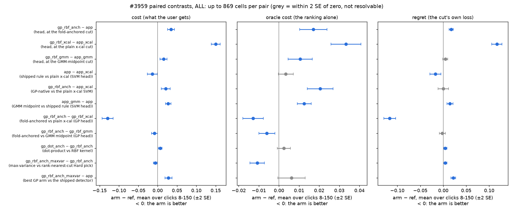
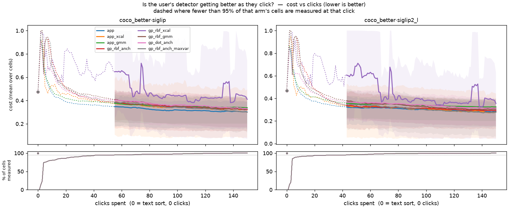

# A Gaussian-process head does not beat the shipped linear SVM, even with a cut built for it (issue #3959)

**Verdict.** On 869 paired cells (`coco_better` at ~1% prevalence, 565 cells; `coco_val` at
natural prevalence, 304; SigLIP and SigLIP2-L each), the RBF Gaussian-process head loses to
the shipped linear-SVM head under **every** threshold rule, the GP-native one included. Under
the fold-anchored cut (the shipped rule, now run on the GP's own calibration folds) the GP
costs **+0.034 ± 0.004** more over clicks 8–150: +0.046 ± 0.005 on `coco_better`, +0.013 ± 0.004
on `coco_val`. Half of that is **ranking** (oracle cost +0.017 ± 0.003) and half is the **cut**
(regret +0.017 ± 0.002). The GP-native cut does fix what broke the #3954 pilot: on the GP head it
is **−0.13 ± 0.01** cheaper than the raw cross-calibration cut, which still flags the whole test
haystack on 11% of `coco_better` steps. But a working cut on the GP only brings it close to the
shipped detector, not past it. **Nothing ships.** The GP, its fold-anchored cut and the knobs stay
in the harness as measured arms.

Interactive pages, with every arm, category, seed and metric: `coco_better`
[SigLIP](coco_better/siglip/viewer.html) and [SigLIP2-L](coco_better/siglip2_l/viewer.html) (each class
pools its three size bands; one run = one band × one seed), and [`coco_val`](coco_val/viewer.html).
Built by [`viewer_3959.py`](../../../scripts/experiments/gp_head/viewer_3959.py).

## The question

The #3954 pilot (`docs/experiments/2026-09-17-gp-head-3954/REPORT.md`) built GP arms into the
harness and found two things it could not settle on `caltech101_m`, where every head ranks
perfectly (AUROC 1.00):

1. Does the GP **rank** better than the shipped head where ranking has room to move?
2. Is the GP's in-loop loss a property of the **head**, or of the threshold rule? Every rule the
   pilot could give the GP moved a cut *between* models, and the GP's probability scale moves
   with every refit.

#3959 asked for harder, rarer environments, and for a threshold rule native to the GP, so that
the comparison measures the head and not the rule.

## What was built

- **The GP-native cut** (`simulate_voting_iterations(standalone_cut="anchored")`,
  `CALIB_STANDALONE_CUT=anchored`). The GP fits its own calibration folds on **the app's exact
  splits**: `compute_fold_orderings(fold_fit=...)` draws the same dithered, stratified folds from
  the same `RandomState`, with a GP in place of the torch head. The **shipped** fold-anchored
  estimator then runs unchanged. Each fold's mixture is fitted on that fold GP's own haystack
  scores, anchored by its held-out votes, and the cut reaches the final GP by quantile. No raw
  score crosses between models. `_safe_threshold_for_step` now scores callable fold models.
- **The ranking-vs-cut split for standalone trainers.** A `gp_*` row now carries the calibration
  study's base columns (`oracle_cost`, `regret`, `threshold_provenance`, …) from the same test
  pass. The pilot could not report these, which is why it could not say whether the GP lost on
  its ranking or on its cut.
- **Harness knobs** `CALIB_TRAINER`, `CALIB_STRATEGY` and `CALIB_STANDALONE_CUT`, declared to
  preflight as divergences from production. The GP arms now run on the pile through
  `run_cells.py` beside the app's own arms.
- **Runner**: [`scripts/experiments/gp_head/launch_grid_3959.sh`](../../../scripts/experiments/gp_head/launch_grid_3959.sh).
  **Analysis**: [`analyze_grid_3959.py`](../../../scripts/experiments/gp_head/analyze_grid_3959.py),
  [`figures_3959.py`](../../../scripts/experiments/gp_head/figures_3959.py).

## Design

**Environments.** The issue named `vg_scale_*`, which was retired in #4038. Its replacement is used:

| env | dataset | cells | prevalence | categories |
|---|---|---|---|---|
| `better` | `coco_better` | 144 class@band × 2 embedders × 2 seeds = 576 | ~1% by design (100 positives, 9,900 shared negatives) | every class × size band |
| `natural` | `coco_val` | 19 × 2 embedders × 8 seeds = 304 | natural (per category) | every category with a typed query and ≥ 20 positives |

Both embedders are `siglip` (shipped) and `siglip2_l` (premium), each opening on its own text sort.
Autopilot runs 150 clicks at inclusion 0, `calibrate_count=2`, the app's calibration fraction,
and seed-major cell order. Eleven `coco_better` cells, all `@small` bands (`chair`, `knife`,
`person`, `spoon`, `keyboard`, `bowl`), produce no trainable step **under any arm**. They drop out
of every pair identically, so the pairing is 565 + 304 = **869 cells per arm**.

**Arms.** Each arm is its own trajectory: the head and the cut drive the Hard pick, so arms pair
on the cell, never on the step. The design runs three threshold rules under each head:

| arm | head | cut | Hard pick |
|---|---|---|---|
| `app` | linear SVM (shipped) | fold-anchored fusion (**shipped**) | rank-nearest-cut |
| `app_xcal` | linear SVM | plain cross-calibration, raw | rank-nearest-cut |
| `app_gmm` | linear SVM | GMM midpoint on its own haystack (`gmm_mid`) | rank-nearest-cut |
| `gp_rbf_anch` | RBF GP, ML-II | fold-anchored on the GP's own folds (**GP-native**) | rank-nearest-cut |
| `gp_rbf_xcal` | RBF GP | plain cross-calibration, raw (the pilot's `gp_rbf`) | rank-nearest-cut |
| `gp_rbf_gmm` | RBF GP | `gmm_mid` | rank-nearest-cut |
| `gp_dot_anch` | dot-product GP (Bayesian linear) | GP-native | rank-nearest-cut |
| `gp_rbf_anch_maxvar` | RBF GP | GP-native | `autopilot_maxvar` (largest posterior spread) |

The `app` / `app_*` rows are what `gp_*` rows are read against at the same rule. The pilot's
straddle pick is dropped because it never beat the rank-nearest-cut pick there.

**Metrics.** `cost` = FPR + FNR on the held-out half, at the arm's own cut. It splits exactly into
`oracle_cost` (the best cut the test labels allow, i.e. the ranking) plus `regret` (what the arm's
cut loses against that). Every difference is `arm − ref`, paired on the cell, with an SE clustered
on (dataset, embedder, category). "Not resolvable" means |mean| < 2 SE. **AULC** is the mean over
clicks 8–150, forward-filled.

## Results

### The head, with the rule held fixed



**Figure 1.** Every contrast, area under clicks 8–150, 869 cells (±2 SE; grey = not resolvable).
Left: the cost a user gets. Middle and right: its exact split into ranking and cut. Per dataset:
[`paired_aulc__coco_better.png`](figures/paired_aulc__coco_better.png),
[`paired_aulc__coco_val.png`](figures/paired_aulc__coco_val.png).

| GP − SVM, same rule (AULC) | `coco_better` cost | `coco_val` cost | oracle cost (both) | regret (both) |
|---|---|---|---|---|
| fold-anchored (`gp_rbf_anch − app`) | **+0.046 ± 0.005** | **+0.013 ± 0.004** | +0.017 ± 0.003 | +0.017 ± 0.002 |
| plain x-cal (`gp_rbf_xcal − app_xcal`) | +0.16 ± 0.01 | +0.13 ± 0.01 | +0.033 ± 0.004 | +0.12 ± 0.01 |
| GMM midpoint (`gp_rbf_gmm − app_gmm`) | +0.023 ± 0.005 | 0.000 ± 0.008, not resolvable | +0.011 ± 0.003 | +0.005 ± 0.003, not resolvable |

- **The GP ranks worse by the measure the app cuts on.** On `coco_better` its oracle cost is
  higher under every rule and under both embedders (fold-anchored: siglip +0.032 ± 0.005,
  siglip2_l +0.016 ± 0.006). On `coco_val` the ranking gap is small (+0.004 ± 0.002 fold-anchored)
  and, at the GMM rule, not resolvable (−0.003 ± 0.002).
- **Its cut is also a little worse, even on its own rule.** At the fold-anchored rule the regret
  is +0.022 ± 0.002 on `coco_better` and +0.009 ± 0.003 on `coco_val`. The GP's cut sits lower (mean
  threshold 0.18 vs 0.31 on `coco_better`) and admits more of the haystack: FPR 0.27 vs 0.23 over
  the run, with the same FNR.
- **The one tie is the GMM rule on `coco_val`**, which is also the SVM's worst rule there
  (`app_gmm − app` +0.016 ± 0.005).

### AP says the opposite, and why

The GP's **average precision** is *higher* than the SVM's at the same rule: +0.008 ± 0.003
fold-anchored, +0.014 ± 0.002 GMM. Its oracle cost is worse. The two measures weight the ranking
differently. AP is dominated by the top of the list; oracle cost is balanced FPR + FNR at one cut,
so it is decided around the point where positives run out, deep in a 1%-prevalence haystack. The GP
orders the confident head of the list a little better and the ambiguous middle worse, and a
detector is judged on the middle. The same split is sharper with the max-variance pick (next
section).

### The GP-native cut repairs the collapse

| on the GP head (AULC, 869 cells) | cost | regret | oracle cost |
|---|---|---|---|
| fold-anchored − plain x-cal (`gp_rbf_anch − gp_rbf_xcal`) | **−0.13 ± 0.01** | −0.12 ± 0.01 | −0.013 ± 0.003 |
| fold-anchored − GMM midpoint (`gp_rbf_anch − gp_rbf_gmm`) | −0.008 ± 0.004 | −0.002 ± 0.003, not resolvable | −0.006 ± 0.002 |

The pilot's collapse reproduces at scale. The raw x-cal cut on the GP flags the **entire** test
haystack on 11% of `coco_better` steps (5.4% on `coco_val`); the SVM does so on 0%. At click 50
that is FPR 0.58 against 0.25 for the fold-anchored GP. The GP-native cut brings the flag-everything
rate to 0.6%.



**Figure 2.** Cost over clicks on `coco_better`, one panel per embedder, mean over cells with an
inter-quartile band. Click 0 is the free text sort. `gp_rbf_xcal` (purple) is the collapse; every
other arm sits in one band, and `app` (blue) is at its bottom. The lower strip is the share of
cells measured; the curves are dashed where it is under 95%. Per-seed panels:
[`siglip`](figures/coco_better/cost_vs_clicks_runs__coco_better·siglip.png),
[`siglip2_l`](figures/coco_better/cost_vs_clicks_runs__coco_better·siglip2_l.png);
`coco_val`: [`cost_vs_clicks.png`](figures/coco_val/cost_vs_clicks.png).

### Kernel and acquisition

| contrast (AULC, 869 cells) | cost | oracle cost | regret | AP |
|---|---|---|---|---|
| dot-product − RBF kernel (`gp_dot_anch − gp_rbf_anch`) | +0.007 ± 0.002 | +0.002 ± 0.002, not resolvable | +0.004 ± 0.002 | −0.016 ± 0.002 |
| max-variance − rank-nearest-cut pick (`gp_rbf_anch_maxvar − gp_rbf_anch`) | −0.006 ± 0.002 | −0.011 ± 0.002 | +0.004 ± 0.002 | **+0.038 ± 0.004** |
| best GP arm − shipped (`gp_rbf_anch_maxvar − app`) | **+0.028 ± 0.005** | +0.006 ± 0.003, not resolvable | +0.022 ± 0.003 | **+0.047 ± 0.004** |

- The Bayesian-linear GP is slightly worse than the RBF one. It is not a cheaper route to the same head.
- **Max-variance is the best GP arm, and it is still worse than the shipped detector** on cost
  (+0.028 ± 0.005). It buys the largest AP gain in the study, +0.060 ± 0.005 over `app` on
  `coco_better` (at click 150: AP 0.57 vs 0.46). But the gain stays at the top of the ranking, and
  its own cut gives back more than its ranking earns. The widest-posterior items are the ones far
  from every vote, which at 1% prevalence are mostly negatives; that teaches the top of the list and
  not the middle. **If AP ever becomes the product metric** (a ranked browse with no threshold),
  this arm is the one to revisit.

### The issue's framing: everything against the plain x-cal SVM

| arm − `app_xcal` (AULC) | `coco_better` | `coco_val` |
|---|---|---|
| `app` (what the shipped rule is worth on the shipped head) | **−0.025 ± 0.007** | +0.007 ± 0.007, not resolvable |
| `gp_rbf_anch` | +0.021 ± 0.007 | +0.020 ± 0.006 |

The pilot found `app − app_xcal` *positive* on `caltech101_m`, the binary-voting fusion regression
recorded in `docs/ML.md`. It does **not** reproduce here. The shipped rule is worth −0.025 ± 0.007
on `coco_better`, almost all of it FNR (−0.19 ± 0.01: plain x-cal misses 30% of the positives
at 1% prevalence, the shipped rule 12%), and is a tie on `coco_val`.

### Where the GP loses: per category

The fold-anchored GP is worse than `app` in **82% of `coco_better` classes** and **74% of
`coco_val` categories** (AULC cost, averaged over seeds, embedders and bands). The extremes, from
`per_class_gp_vs_app.csv` (Δ = GP − SVM; negative = GP better):

| dataset | GP loses most (Δcost / Δoracle) | GP wins most (Δcost / Δoracle) |
|---|---|---|
| `coco_better` | keyboard +0.17 / +0.13, microwave +0.15 / +0.10, spoon +0.12 / +0.067, bowl +0.11 / +0.043, tv +0.10 / +0.079 | chair −0.030 / −0.039, frisbee −0.019 / +0.002, skateboard −0.018 / −0.005, surfboard −0.014 / −0.008 |
| `coco_val` | scissors +0.053 / +0.008, sports ball +0.045 / +0.017, toothbrush +0.032 / 0.000, sink +0.030 / +0.020 | bear −0.033 / −0.001, refrigerator −0.020 / −0.008, zebra −0.019 / +0.001, elephant −0.018 / −0.001 |

The pattern **reads as clutter, not size** (a reading, not a measured mechanism). The GP's worst
classes are indoor objects that share kitchen and desk scenes with each other (keyboard, tv,
microwave, spoon, bowl), and the loss is mostly ranking (large Δoracle). One plausible cause: an
RBF kernel on `2 − 2·cos` scores by nearness to the Good votes, and in a cluttered scene the nearest
neighbours of a keyboard image are other desk images, where a linear head can learn the direction
that separates them. Its best classes are distinctive single objects in open scenes (animals, board
sports), where neighbourhood and class coincide. These are class-level averages, not a
characterised error mode, so the report makes no claim about individual images. Per-seed curves
for any class are in the viewers.

### Cut health and fit health

| (share of steps) | `app` | `gp_rbf_anch` | `gp_rbf_xcal` | `gp_rbf_gmm` |
|---|---|---|---|---|
| flags the whole test half, `coco_better` | 0.000 | 0.006 | **0.11** | 0.006 |
| flags nothing, `coco_better` | 0.006 | 0.007 | 0.086 | 0.025 |
| fold-anchored cut used (rest: blend fallback), `coco_better` | 0.94 | 0.94 | – | – |

- The GP folds reach the anchored estimator exactly as often as the SVM's (94% of steps on
  `coco_better`, 99% on `coco_val`). The fallback is the same cold-start blend.
- The anchored EM refit hits its iteration cap on **2.6%** of GP steps on `coco_better` and **3.5%**
  on `coco_val`, against 0.4% and 0.2% for the SVM. GP fold posteriors are smoother and less
  bimodal, so the mixture converges more slowly. That is too rare to explain a +0.017 regret gap,
  but it is recorded (`fold_anchored_maxiter` in `threshold_provenance`).

## What this licenses, and what it does not

- **Licensed:** replacing the shipped head with a GP (RBF or dot-product, ML-II, Laplace), under
  any of the three cuts, makes the binary-voting detector worse on both COCO benches and both
  embedders. The fold-anchored cut is the right cut for a GP head; the raw x-cal cut is not usable
  on one.
- **Not licensed:** that a GP could not win elsewhere. There is no region voting (the GP scores
  whole images only), n ≤ 150 votes, inclusion 0 only, and two seeds per `coco_better` cell. The
  GP's calibration advantage from the pilot (Brier/ECE) is not re-measured here, because the app
  never shows a probability; it shows a cut, and the cut is where that advantage would have to pay.
- The pilot's `caltech101_m` fusion regression (`app` worse than `app_xcal`) does not generalise:
  on `coco_better` the shipped rule is better, on `coco_val` it is a tie.

## Reproduce

```bash
cd scripts/experiments/gp_head
bash launch_grid_3959.sh prepare better && bash launch_grid_3959.sh prepare natural
bash launch_grid_3959.sh baseline better && bash launch_grid_3959.sh baseline natural
CALIB_MEM=3G bash launch_grid_3959.sh better all && CALIB_MEM=3G bash launch_grid_3959.sh natural all
python analyze_grid_3959.py --root /expscratch/$USER/gp-grid-3959 --out <analysis>
python figures_3959.py --root /expscratch/$USER/gp-grid-3959 --analysis <analysis> --out docs/experiments/2026-09-26-gp-head-grid-3959/figures
python viewer_3959.py --root /expscratch/$USER/gp-grid-3959 --out docs/experiments/2026-09-26-gp-head-grid-3959
```

Measured cost per cell (one CPU): `coco_better` 4 min (`app`) to 9–11 min (GP arms), `coco_val`
1–3 min, peak memory 1.2 GB. The whole grid was ~640 CPU-hours. Results root:
`/expscratch/sgreenberg/gp-grid-3959`. The analysis CSVs this report reads are committed beside it:
[`paired.csv`](paired.csv), [`levels.csv`](levels.csv), [`cut_health.csv`](cut_health.csv),
[`per_class_gp_vs_app.csv`](per_class_gp_vs_app.csv), [`coverage.csv`](coverage.csv). The whole grid ran
at `74efbdc1a` except `better/gp_dot_anch` and `better/gp_rbf_anch_maxvar`, which ran at `1396c1224`
(a launcher `status` fix only; no harness change).
