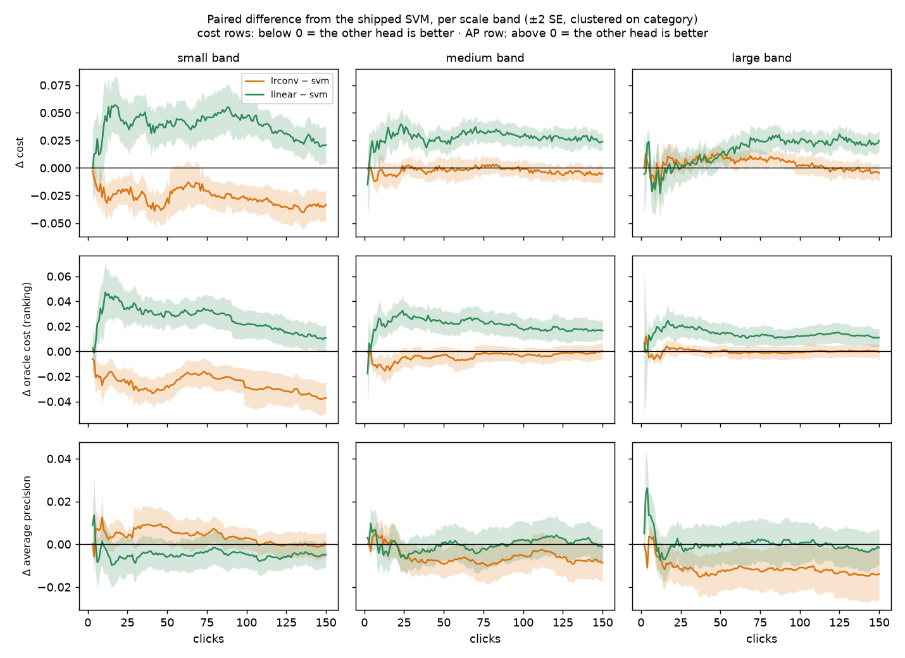
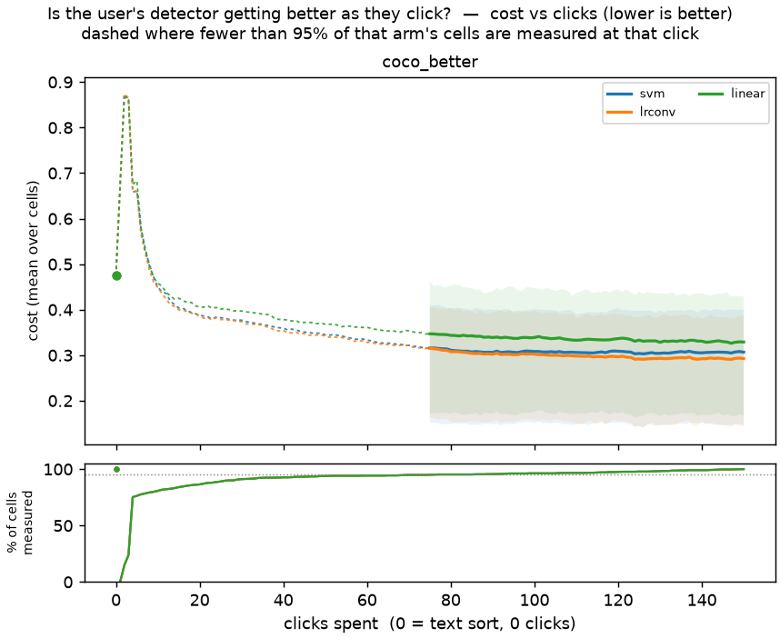

# A converged logistic head beats the shipped SVM in the loop, on small objects only (issue #4114)

**Verdict.** Inside the Autopilot loop on COCO Better, balanced L2 logistic regression fitted to convergence at C = 1 (`head="linear_logreg"`) beats the shipped linear SVM by **0.0098 ± 0.0027** cost (mean over clicks 1–150, 702 paired cells). The gain is **ranking**: oracle cost −0.012 ± 0.0024, while regret against the shipped cut is +0.0021 ± 0.0016, not resolvable. So the cut tuned on other heads neither costs nor helps it. **All of it comes from the small band**: −0.034 ± 0.0065 cost there, with medium −0.0024 ± 0.0027 and large +0.0037 ± 0.0026, neither resolvable. The two ranking metrics disagree at the top of the list. The logistic head wins AUROC (+0.0080 ± 0.0015) but loses average precision (−0.0048 ± 0.0020), and on large objects that AP loss is −0.012 ± 0.0043. #3197's replay finding carries into the loop, but it is a band-dependent trade, not a uniform improvement. Nothing ships from this run: region voting has not been measured (the issue requires it before a ship decision).

Interactive viewer: [`viewer.html`](viewer.html). Literal examples: [`EXAMPLES.md`](EXAMPLES.md).

## Question

#3197 found that the old logistic head (`LINEAR_HEAD`) loses to the SVM because of how it was **fitted** (Adam, lr 1e-3, early-stopped at ≤ 200 epochs), not because of its loss. Refitted to convergence on the SVM's own Autopilot vote sets, logistic regression ranked as well as the SVM or slightly better. That was a replay on fixed votes. In the loop the head also picks the next vote, and the shipped cut (fold-anchored fusion) was tuned on other heads' score distributions. This study measures the converged head as its own trajectory.

## Setup

- **Bench: COCO Better** (owner, 2026-09-27: current data rather than the #3197 pile or `vg_scale`). All 144 class@band cells of `coco_better`, SigLIP, binary voting, text-sort opening, 5 seeds, 150 clicks: 720 cells per arm. It is the same bench as #4184's calibration ladder.
- **Arms**, each its own trajectory and paired on the cell (category, seed):

  | arm | head | what it is |
  |---|---|---|
  | `svm` | `linear_svm` (production) | `LinearSVC`, squared hinge, balanced, C = 1 |
  | `lrconv` | `linear_logreg` (new) | `LogisticRegression(C=1, class_weight="balanced")`, lbfgs to tol 1e-6, lifted into `Linear(D,1)` |
  | `linear` | `linear` | the early-stopped logistic head the SVM replaced (fidelity arm) |

  The new head is `LINEAR_LOGREG_HEAD` in `vtscore/training/mlp.py`, fitted by `vtscore/training/logreg.py`. It threads through the calibration folds by the same `hidden_dim` sentinel as production, so fold models share the final model's fit. `tests_lib/detectors/test_linear_head_fidelity.py` pins it to a tightly converged scikit-learn fit to 1e-4 in score.
- Everything except the head is production: `CALIB_SAFE_THRESHOLDS=1`, shipped blend schedule, split and acquisition offset. Preflight declared `head` as the only divergence.
- **Coverage.** Every arm wrote all 720 cells: 0 unreadable, 0 zero-byte. 18 cells per arm never found a positive in 150 clicks, the same 18 in every arm, so every paired number below is over **702 cells** ([`stageB_provenance.json`](stageB_provenance.json)).
- Cost: ~5.7 min and 1.7 GB per cell for both heads. The converged fit adds nothing measurable.

Every difference is `other − svm`, paired on the cell, with a standard error clustered on category (5 seeds of one category are not 5 independent cells). For cost, oracle cost and regret, **negative favours the other arm**. For AP and AUROC, positive does. A difference smaller than 2 SE is called not resolvable.

## Result: the head in the loop

Mean over clicks 1–150 (area under the curve):

| lrconv − svm | cost | oracle cost | regret | AP | AUROC |
|---|---|---|---|---|---|
| **all** | **−0.0098 ± 0.0027** | **−0.012 ± 0.0024** | +0.0021 ± 0.0016 | **−0.0048 ± 0.0020** | **+0.0080 ± 0.0015** |
| small | **−0.034 ± 0.0065** | **−0.035 ± 0.0058** | +0.0007 ± 0.0041 | +0.0046 ± 0.0021 | **+0.023 ± 0.0036** |
| medium | −0.0024 ± 0.0027 | −0.0040 ± 0.0024 | +0.0016 ± 0.0018 | −0.0059 ± 0.0029 | +0.0033 ± 0.0012 |
| large | +0.0037 ± 0.0026 | −0.0001 ± 0.0019 | +0.0039 ± 0.0025 | **−0.012 ± 0.0043** | +0.0000 ± 0.0006 |

At fixed clicks (all bands):

| lrconv − svm | cost | oracle cost | regret | AP | Goods found |
|---|---|---|---|---|---|
| click 20 | −0.0020 ± 0.0035 | −0.0063 ± 0.0024 | +0.0043 ± 0.0028 | −0.0031 ± 0.0022 | +0.10 ± 0.044 |
| click 40 | −0.0052 ± 0.0034 | −0.010 ± 0.0023 | +0.0049 ± 0.0026 | −0.0061 ± 0.0025 | +0.11 ± 0.071 |
| click 80 | −0.0033 ± 0.0028 | −0.0067 ± 0.0022 | +0.0034 ± 0.0020 | −0.0056 ± 0.0025 | +0.043 ± 0.15 |
| click 150 | **−0.014 ± 0.0032** | **−0.011 ± 0.0029** | −0.0032 ± 0.0023 | **−0.0079 ± 0.0027** | −0.49 ± 0.27 |

Read this way:

- **The ranking gain is real and the cut is neutral.** Oracle cost is resolvable from click 20 on. Regret is never resolvable at 2 SE, so the shipped cut transfers to the logistic head's score distribution. #3197's `svmc01` arm showed a head that ranks better can lose on the cut; this one does not.
- **It is a small-object effect.** On small objects the converged logistic head ranks much better by every measure, AP included (+0.0046 ± 0.0021). On large objects it ranks the same by oracle cost and AUROC but loses AP, so its top of the list is worse there. Averaged over the bench, cost comes out ahead because the small-band gain is large, but the bands point different ways.
- **AUROC and AP split.** Over all bands the logistic head orders the whole haystack better (AUROC, oracle cost) and the SVM orders the top better (AP). A margin fit that weights the examples nearest the boundary is the textbook reason an SVM would lead at the top. This study measures the split; it does not test that mechanism.
- **Acquisition barely moves.** Goods found by click 150 differ by −0.49 ± 0.27, not resolvable, so the gain is not coming from a different harvest.

## Fidelity: #3197's gap on this bench

The `linear` arm (old early-stopped logistic head) against the SVM, mean over clicks 1–150: cost **+0.026 ± 0.0032**, oracle cost +0.020 ± 0.0023, regret +0.0065 ± 0.0023, AUROC −0.012 ± 0.0016. The SVM beats the old head here as it did on #3197's pile, where the gap was 0.013 ± 0.003. It is twice as large on this bench and again mostly ranking. So the old head's fit, not its loss, is what lost: fitted to convergence, the same loss moves from 0.026 behind the SVM to 0.0098 ahead of it.

## Figures

**The band split** ([`figures_4114.py`](../../../scripts/experiments/svm_vs_logistic/figures_4114.py)): the paired difference from the SVM at every click, one column per band, ±2 SE clustered on category.



*Orange is the converged logistic head, green the old early-stopped one; both are measured against the SVM, so 0 is the shipped head. Small band: the converged head is ahead on cost and oracle cost from the first few clicks to 150, and slightly ahead on AP until click ~100, level after. Large band: level on oracle cost, a little behind on cost between clicks ~25 and ~100, and behind on AP throughout. The green line is above zero in every band on cost: the old head's loss to the SVM is not a band effect. The x-axis starts where at least 10 categories are measured; the first clicks are thin.*

**The quality-over-clicks pair** (`curves.py`), averaged over the whole bench. The left end is the zero-click text sort.



*Mean cost per click, one line per arm, inter-quartile band shaded, dashed while fewer than 95% of cells are measured. The paired gap between svm and lrconv (0.01) is much smaller than the spread between cells, so the lines are close and the shaded bands overlap; the tables above, which pair on the cell, are what resolve it. Every run's own curve: [`figures/cost_vs_clicks_runs__coco_better.png`](figures/cost_vs_clicks_runs__coco_better.png). The same pair for oracle cost and AP is in `figures/`.*

**When clicking beats typing.** All three arms beat the text sort on cost by click 9–10, and on AP by click 9–10. On **oracle cost** (the ranking alone) they separate: the converged logistic head passes the text sort at click **40**, the SVM at **56**, the old head at **85** (`curves.py` crossover, same-cell means).

## Literal examples

[`EXAMPLES.md`](EXAMPLES.md) refits both heads on the **same** 40 Autopilot votes (the SVM arm's) for the three cells per band where the in-loop gap was largest in each direction. It lists, among images in the top 500 of either head, the positives and negatives each head ranks higher, with filenames.

**On the same votes the two heads barely differ.** In all six cells, cells where the in-loop gap at click 40 was as large as ±0.25 oracle cost, the refitted heads' AP agrees within 0.02 (e.g. `knife@large` 0.16 vs 0.16, `toothbrush@small` 0.08 vs 0.08). So a large gap in a single cell comes from the two heads **collecting different votes**, not from ranking the same votes differently. The 702-cell mean is what measures the head, and the single cells are noisy draws of it. The confusions each head makes are the expected ones, for example scissors and spoons in a `knife@large` cell, and dining tables and ties in a `cell phone@medium` cell.

## Scope and limits

- **Binary voting, SigLIP only.** Region voting (max-pooling, per-bag sample weights) uses the same `Linear(D,1)` but was not run. The issue requires it before a ship decision; it is the follow-up.
- **One C.** C = 1 for both heads, as shipped. #4115 finds C = 0.1 ranks better for the SVM; the logistic head's best C was not swept in the loop.
- **Mis-votes.** The issue's tie-breaker (#3197's Stage A mis-vote conditions) was not run, because the loop result is not a tie. #3197's replay found the converged logistic head more robust to flipped votes, which would count in its favour.
- The per-band result is a report across strata of the bench, not a claim about object size in general (see the coco-better plan's method-bench ruling).

## Reproduce

```bash
bash scripts/experiments/calibration/launch_logreg_4114.sh prepare
bash scripts/experiments/calibration/launch_logreg_4114.sh baseline
bash scripts/experiments/calibration/launch_logreg_4114.sh arms            # svm lrconv linear, cpu, ~6 min/cell
python scripts/experiments/svm_vs_logistic/analyze_stage_b.py --root /expscratch/$USER/logreg-4114 --out <analysis>
# figures and viewer: curves.py / viewer.py over a root holding svm, lrconv, linear -> <arm>/results
python scripts/experiments/svm_vs_logistic/figures_4114.py --root /expscratch/$USER/logreg-4114 --out <figures>
python scripts/experiments/svm_vs_logistic/harvest_picks.py /expscratch/$USER/logreg-4114/svm
SVMLOG_EMBEDDINGS=$VTS_PILE/datadir/embeddings python scripts/experiments/svm_vs_logistic/examples.py \
    --stageB /expscratch/$USER/logreg-4114 --other lrconv --both-ways --four-ways --top-k 500 --top 3 --t 40 --n-cells 3 --out EXAMPLES.md
```

Run root on the GRID: `/expscratch/sgreenberg/logreg-4114/`.
