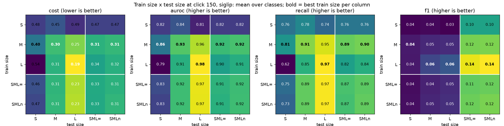
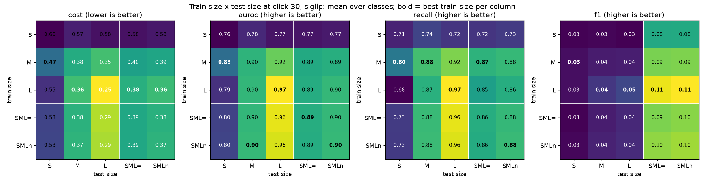
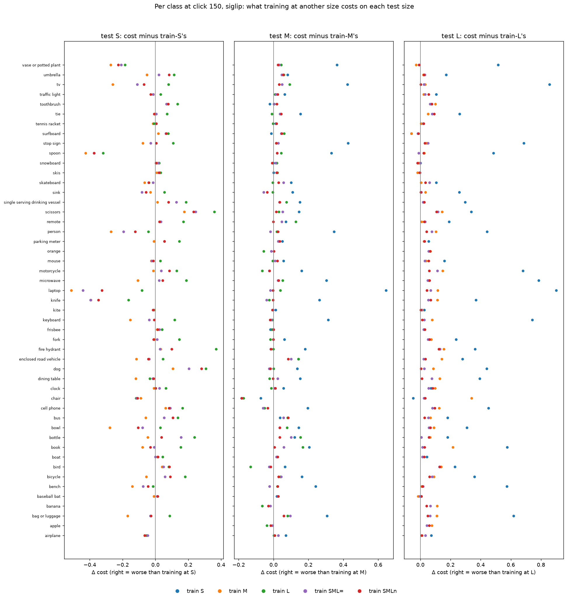
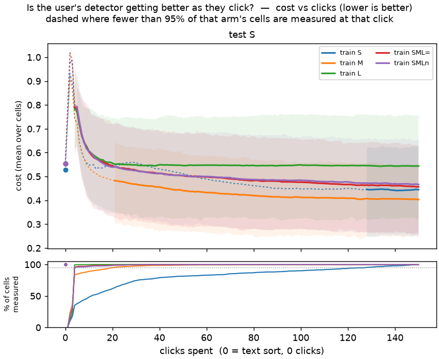
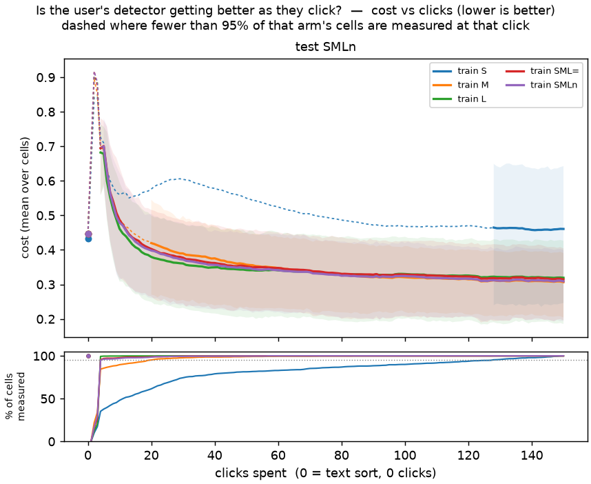
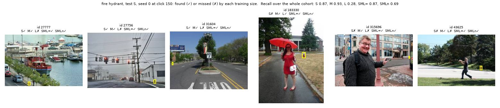
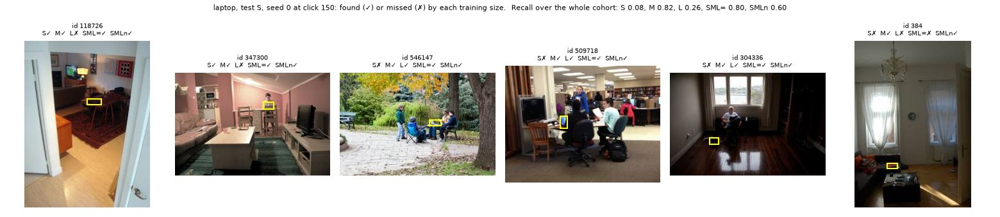
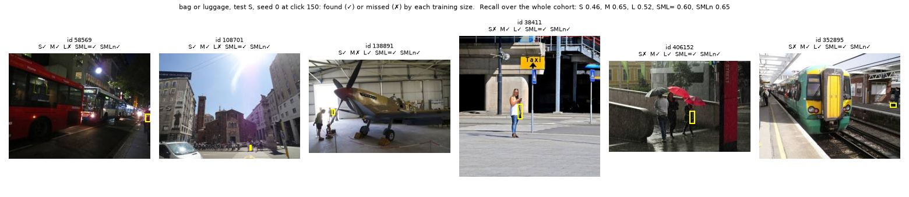

# Train at one size, test at another: medium or mixed examples travel, small and large do not (issue #4160)

**Verdict.** On `coco_better` with SigLIP binary voting (49 classes, 20 seeds, 150 clicks, shipped
defaults), the best examples to train on are **not** always the size you will test on. At click
150, averaged over classes (cost = FPR + FNR, lower is better; text sort alone in the last row):

| train \ test | S | M | L | SML (natural mix) |
|---|---|---|---|---|
| **S** | **0.48** | 0.45 | 0.49 | 0.47 |
| **M** | 0.40 | **0.30** | 0.25 | 0.31 |
| **L** | 0.54 | 0.31 | **0.19** | 0.32 |
| **SML (equal)** | 0.46 | 0.31 | 0.23 | 0.31 |
| **SML (natural)** | 0.47 | 0.31 | 0.23 | **0.31** |
| *text sort, 0 clicks* | *0.55* | *0.44* | *0.38* | *0.45* |

- **Medium examples are the best training on small objects** (0.40 against 0.48 for small
  examples, paired **−0.073 ± 0.020**, 33 of 46 classes). That is not because small examples teach
  less. **28% of small-object hunts find fewer than 3 positives in 150 clicks** (under 1% for every
  other size). Given a small hunt that found at least 3, small and medium training tie on small
  objects (**+0.009 ± 0.013**, not resolvable). The small-object problem is *finding* them.
- **Large examples do not travel down.** A large-trained detector is the best on large objects
  (0.19) and, after 150 clicks, **no better than the text sort on small ones** (0.54 against 0.55;
  recall 0.62). Small examples travel up even worse (0.49 on large against 0.19, **+0.30 ±
  0.04**), and that one survives the harvest restriction (+0.19 ± 0.03 against medium).
- **Mixed-size training is a safe default and costs little.** On the natural-mix test (what a
  user who has not picked a size meets) both mixes tie medium and large training (SMLn −0.002 ±
  0.006 against M, +0.010 ± 0.006 against L, neither resolvable). Their price is **+0.04 ±
  0.005** on large objects against large-only training. **Equal and natural mixes are
  indistinguishable**: no paired difference is resolvable on any test size (largest −0.010 ±
  0.006, on small objects).

Interactive page, every class, seed, test size and metric: [viewer.html](viewer.html). *Dataset*
in its menus is the **test** size, *arm* is the **training** size.

## The question

#4160: *"If class C were size [S, M, L or SML] in training and size [S, M, L or SML] in
testing, we do [this] well."* #4051 asked for the pure-band 3×3 and was closed out of scope;
this issue asks again with the mixes on both sides. The study reads it as the app is used: a
simulated user types the class, then clicks Good/Bad through 150 images of the **training** size,
and the detector they end up with is scored on held-out images of each **test** size.

## What was built

- **The mixed training arm** (`vtscore/eval/scale_bands.paired_mix`,
  `simulate_voting_iterations(train_mix=...)`, `CALIB_TRAIN_MIXES=equal,natural`). A mixed arm
  cannot simply pool the three bands and let the harness split the pool: it would then train on
  images a pure arm tests on. So the mix draws its training positives **only from the pure arms'
  own training halves** at the seed, at the requested shares, and is tested on **exactly the pure
  arms' held-out images**. It votes over as many positives (the pure arms' mean, ~50) at the same
  prevalence, so a row differs from another only in the sizes of its examples. The negatives are
  the class's one shared pool, checked shared on every class before launch.
- **SML (equal)** gives each band a third. **SML (natural)** uses the shares the whole COCO corpus
  holds ([mix_shares.json](mix_shares.json), from `coco_better_export.py --mix-census-json`): bus is
  5% small, 27% medium, 68% large; traffic light 59/36/5. Apple, banana and orange have no small
  band and mix over two.
- **Test SML is computed, not run.** Every arm has one threshold and one negative pool, so its miss
  rate and its AUROC on any mix of the three test cohorts are that mix's weighted average of the
  three.
- **Per-band AUROC** (`auroc_<band>`, opt-in `CALIB_TEST_BAND_AUROC=1`): each test cohort ranked
  against the held-out negatives, so a size can be lost on the ranking or on the cut and the two
  can be told apart.
- **Runs with no detector yet are scored at the text sort**, not dropped. Until a run has a Good
  and a Bad vote the app shows the text sort, and dropping those runs would score the small row
  only on the hunts that went well.

Scripts: [`launch.sh`](../../../scripts/experiments/size_vs_size/launch.sh),
[`analyze.py`](../../../scripts/experiments/size_vs_size/analyze.py),
[`baseline.py`](../../../scripts/experiments/size_vs_size/baseline.py),
[`harvest.py`](../../../scripts/experiments/size_vs_size/harvest.py),
[`examples.py`](../../../scripts/experiments/size_vs_size/examples.py) with
[`run_examples.sh`](../../../scripts/experiments/size_vs_size/run_examples.sh).

## The design

| | |
|---|---|
| dataset | `coco_better`, C = 49, 144 pure cells (`apple`/`banana`/`orange` have no small band) + 98 mixed |
| path | SigLIP binary voting (`siglip`, whole image); Region Photo not run (owner rule: only on request) |
| seeds | 20, all complete: 4,840 runs |
| horizon | 150 clicks, read at 30 and 150 |
| everything else | shipped defaults: text opening, fused threshold, no variant arms |
| pairing | every contrast on the same (class, seed) and the same test images; SE over classes |

The prepare step was reused from the 2026-09-26 State of the App run (same pickle, same category
settings). Rerunning pure cells of that run's seeds reproduced 45 of 88 cells bit for bit. The
others share their votes and drift after about click 17 (bird@medium seed 0: final cost 0.34
here against 0.31 there): float nondeterminism between runs, not the new code, which only adds
columns (pinned by `test_band_auroc_moves_no_other_column`). Every comparison here is within this
run.

## Results

### The table, at click 30 and click 150

*Mean over classes. Bold marks the best training size in each test column. The white lines split
pure sizes from mixes. F1 is shown but is **not comparable across columns**: each test size has its
own positive count, and the SML columns pool all three.*

*The same at click 30. The shape is already set. 31% of small-trained runs still have no detector
at click 30 and sit at the text sort.*

### Paired contrasts, click 150, cost

Each training size against the one matching the test size. Negative = cheaper than the matched size.

| test | train | vs | Δ cost | SE | classes where cheaper |
|---|---|---|---|---|---|
| S | M | S | **−0.073** | 0.020 | 33/46 |
| S | L | S | **+0.067** | 0.019 | 12/46 |
| S | SML equal | S | −0.020 (not resolvable) | 0.019 | 22/46 |
| S | SML natural | S | −0.010 (not resolvable) | 0.018 | 22/46 |
| M | S | M | **+0.15** | 0.021 | 6/46 |
| M | L | M | +0.017 (not resolvable) | 0.009 | 20/49 |
| M | SML natural | M | +0.011 (not resolvable) | 0.006 | 18/49 |
| L | S | L | **+0.30** | 0.038 | 3/46 |
| L | M | L | **+0.067** | 0.010 | 5/49 |
| L | SML equal | L | **+0.042** | 0.005 | 6/49 |
| L | SML natural | L | **+0.040** | 0.005 | 4/49 |
| SML natural | S | SML natural | **+0.16** | 0.026 | 7/46 |
| SML natural | M | SML natural | −0.002 (not resolvable) | 0.006 | 31/49 |
| SML natural | L | SML natural | +0.010 (not resolvable) | 0.006 | 19/49 |
| SML natural | SML equal | SML natural | +0.005 (not resolvable) | 0.003 | 20/49 |

AUROC tells the same story, which says these are **ranking** differences and not just cut
placement: on small objects, medium training ranks better than small (+0.040 ± 0.013) and large
worse (−0.034 ± 0.012). On large objects, small training loses 0.17 ± 0.024 of AUROC. Every row,
at both clicks and on all four metrics: [contrasts.csv](contrasts.csv); pooled cells with SEs:
[matrix.csv](matrix.csv); per class: [per_class.csv](per_class.csv).

### Why small examples lose on small objects: the hunt, not the lesson

A simulated user hunting small objects clicks down a text sort that ranks small instances low.
Every arm finds few positives in 150 clicks (median 3 to 4 of ~50 available), but the small hunt
most often finds almost none ([harvest_share.csv](harvest_share.csv)):

| training size | runs | share finding < 3 positives | median found |
|---|---|---|---|
| S | 920 | **28%** | 3 |
| M | 980 | 0.7% | 4 |
| L | 980 | 0% | 4 |
| SML equal / natural | 980 each | 0.1% / 0.2% | 4 |

Restrict to the (class, seed) pairs whose small hunt found at least 3, keeping the medium run of
the same pair ([harvest_contrasts.csv](harvest_contrasts.csv)):

| test | S minus M, all runs | S minus M, S found ≥ 3 (39 classes, 662 pairs) |
|---|---|---|
| S | +0.073 ± 0.020 | **+0.009 ± 0.013** (not resolvable) |
| M | +0.15 ± 0.021 | +0.11 ± 0.019 |
| L | +0.23 ± 0.037 | +0.19 ± 0.033 |

So on **small** objects the deficit is the harvest. The classes where small training loses most
on small objects are exactly those whose small hunts find a median of **one** positive: laptop
(cost on small 0.87 trained small, 0.36 trained medium), spoon (0.80 / 0.37), knife (0.85 /
0.45), person (0.77 / 0.50). Where the small hunt does find positives, small training wins on
small objects: fire hydrant (0.38 small, 0.41 medium, 0.75 large), scissors (0.38 / 0.55 /
0.73), dog (0.61 / 0.72 / 0.92). On **other** sizes the small-trained detector is worse even when
the hunt went well: that part is transfer. The restriction selects pairs whose small hunt went
well, so read the right column as "given a user who found a few", not as a rate.

`chair@small` never found a positive in any of its 20 seeds, and every arm scores near 1.0 on
small chairs: the text sort and every detector miss them.

### Per class

*Each dot is one training size's cost on a test size minus the matched size's, one row per
class. Right of zero is worse than training at the test size. Large training (green) on small
objects runs from −0.32 (spoon) to +0.37 (fire hydrant). The pooled +0.067 is an average over
classes that disagree, not a uniform penalty.*

### Quality over clicks

*Test size S, one line per training size, click 0 = the text sort alone. The small-trained line is
dashed until ~120 clicks because its runs have no detector until they find a positive (coverage
strip). The large-trained line falls to the text sort's level by about click 20 and stays there.*

*Test size SML (natural). Medium, large and both mixes overlap from about click 20. Small training
sits apart.*

Medium and large test sizes, and every run as its own line:
[test M](figures/test_M__cost_vs_clicks.png), [test L](figures/test_L__cost_vs_clicks.png),
[runs, S](figures/test_S__cost_vs_clicks_runs__test_S.png),
[runs, M](figures/test_M__cost_vs_clicks_runs__test_M.png),
[runs, L](figures/test_L__cost_vs_clicks_runs__test_L.png),
[runs, SMLn](figures/test_SMLn__cost_vs_clicks_runs__test_SMLn.png).

## Literal examples

Seed 0 of all five training sizes, for three classes, rerun with per-image dumps
([`run_examples.sh`](../../../scripts/experiments/size_vs_size/run_examples.sh)). They are reruns,
so their rates differ a little from the grid's seed 0. Each sheet shows the test images the training
sizes disagree on most, the object's box in yellow, and ✓/✗ for whether each training size's final
detector put the image over its own cut. Every scored image with every arm's score and cut:
[examples.csv](examples.csv).

**Fire hydrant, small test images.** Large training finds 28% (small 87%, medium 93%). The ones it
misses are hydrants a few pixels tall at the edge of street scenes.

**Laptop, small test images.** Small training finds 8%: its hunt found one positive in 150 clicks
(a 1-vs-149 detector with a strict cut). Medium finds 82%, large 26%.

**Bag or luggage, small test images.** Every size struggles (small 46%, medium 65%). The boxes are
small bags carried in crowded scenes.

The medium and large sheets for all three classes: [examples.md](examples.md). Worth a look for
label errors before anyone builds on a single class's number.

## What this means for the app

The dataset is the bench here, so the finding that matters is about method:

1. **Small objects are an acquisition problem first.** The text-sort opening buries them. A
   quarter of small hunts end with almost no positives, and once positives are found the small
   detector is as good as any. The lever is how the loop *finds* small positives (the opening,
   region voting, the acquisition rule), not how it trains on them. Region Photo, which votes on
   boxes, is the obvious arm to measure against this.
2. **When a user's object size is unknown, mixed or medium examples are the safe choice.** They
   are within noise of the best on everything except large objects (+0.04). Training only on large
   instances leaves small ones at text-sort quality.
3. **Equal vs natural mixing does not matter** at this scale. Nothing here needs a size-aware
   sampler.

## Follow-ups

- **Region Photo on the same table.** Not run (owner rule). If region voting fixes the small hunt's
  harvest, the S row should close most of its gap.
- **The small-object opening.** A method study on how the loop finds small positives (seed
  ordering, acquisition), with the 28% under-3 share as the number to move.
