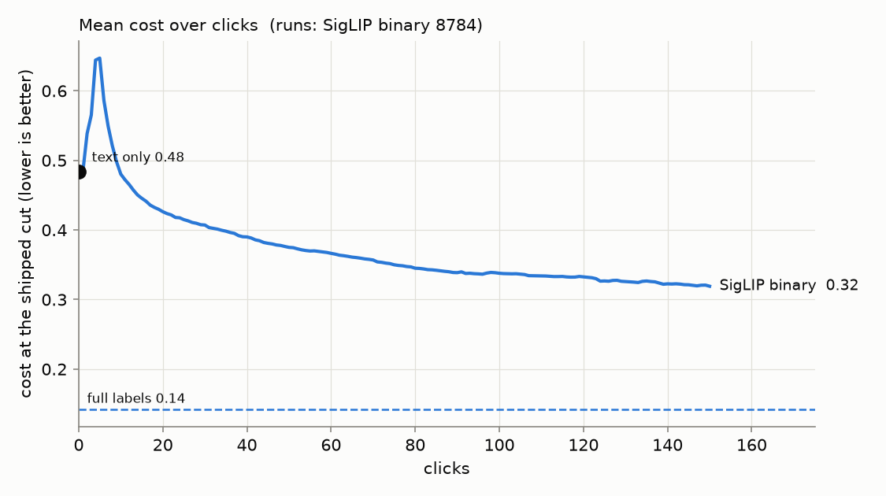
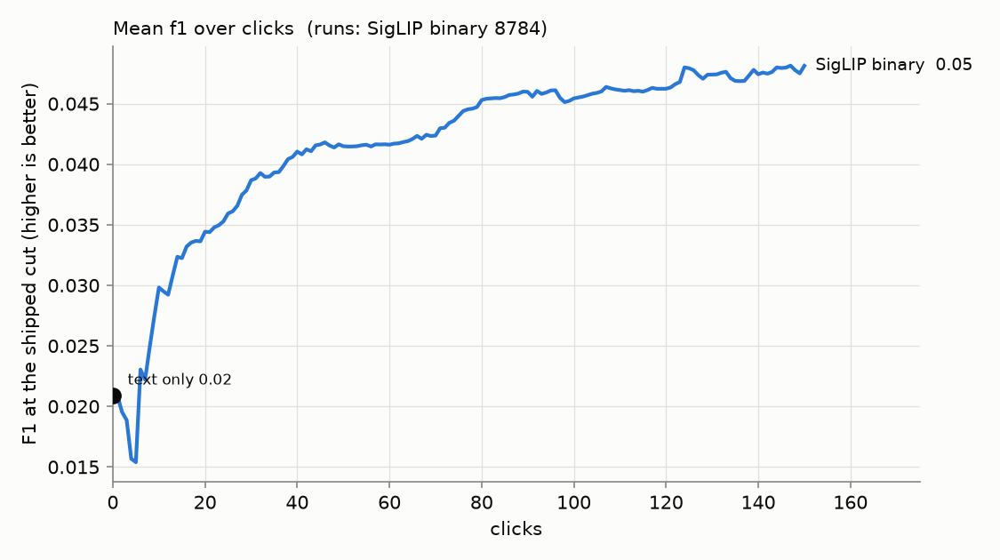
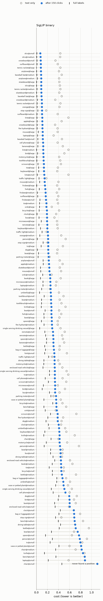
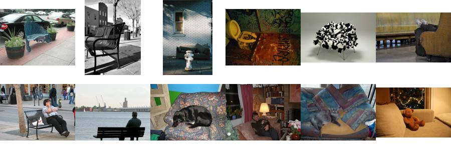
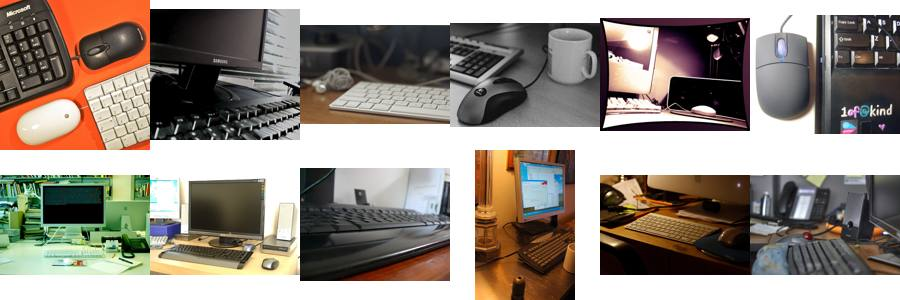
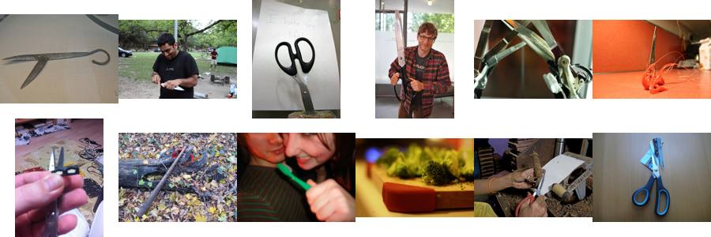
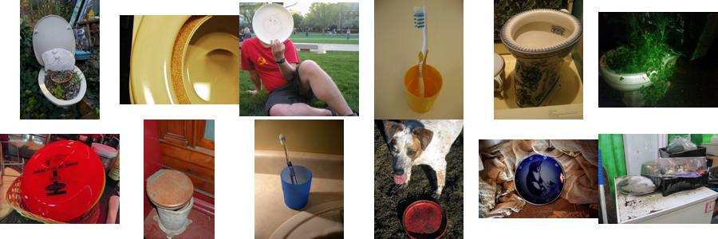

# State of the App: Binary Photo — 2026-09-27

**Issue:** #4179 (its last box). **Recipe:** `.claude/skills/state-of-the-app/SKILL.md`.
**Path:** SigLIP whole-image embedding, binary (Good/Bad) votes.
**Bench:** `coco_better` after #4179's hand corrections and #4175's ≤100% `large`
band: all 49 classes at every size, which is 144 cells.
**Seeds:** 61 (8,784 runs), which is what one night bought.

A **review**, not an experiment: this is the app as it ships, the way a user
meets it. The user types a query and sees the text sort. Then they vote for up
to 150 clicks while Autopilot picks what to show them. Every curve runs from
the **text-only score at click 0**, through the clicks, to the **full-label
ceiling**: the same head trained on every label in the training half.

- *Cost* is the harness's weighted FNR/FPR at the shipped threshold. Lower is
  better.
- *F1* is taken at the same threshold.

## Headline

| mean over 8,784 runs | text only | 25 clicks | 50 clicks | 150 clicks | full labels |
|---|---:|---:|---:|---:|---:|
| **cost** | 0.48 | 0.42 | 0.38 | **0.32** | 0.14 |
| **F1** | 0.021 | 0.036 | 0.041 | **0.048** | — |



1. **150 clicks close about half the distance to having every label.** Cost
   falls from 0.48 to 0.32 against a ceiling of 0.14, which closes 48% of the
   gap. The result is stable: the per-seed mean final cost has a standard
   deviation of 0.0061 (range 0.30 to 0.33).
2. **The first detector is worse than the text sort.** Mean cost rises from
   0.48 to **0.65 at click 5**, once the first Good and Bad train a head. It
   does not drop back below the text sort until **click 10**. A user who stops
   after a handful of clicks has a worse ranking than if they had only typed.
3. **The clicks find few positives.** The median run finds **4** positives in
   150 clicks, out of about 50 in its training half. **235 runs (2.7%) never
   find one**, so no detector is ever trained. All but one of those runs are in
   small-band cells: `chair@small` in all 61 seeds, `knife@small` in 47,
   `bowl@small` in 36.
4. **The shipped threshold buys recall with precision.** Median recall at 150
   clicks is **0.96**, and median precision is **0.020**, so a user sees about
   50 false positives for every true one. Cost rewards that trade and F1 does
   not, which is why cost looks moderate while F1 is 0.048.



## Where it does well and where it does poorly

| band (mean) | text only | 150 clicks | full labels | F1 | positives found |
|---|---:|---:|---:|---:|---:|
| large | 0.41 | **0.19** | 0.052 | 0.063 | 7.8 |
| medium | 0.47 | **0.30** | 0.15 | 0.046 | 6.5 |
| small | 0.58 | **0.48** | 0.23 | 0.035 | 5.7 |

**Well:** sports equipment, fruit and other distinctive objects. These are
things a scene is *about*, and they have a silhouette SigLIP knows.

| class | text only | 150 clicks | full labels | positives found |
|---|---:|---:|---:|---:|
| skis | 0.43 | **0.078** | 0.006 | 27 |
| tennis racket | 0.44 | **0.089** | 0.009 | 33 |
| snowboard | 0.34 | **0.094** | 0.014 | 15 |
| baseball bat | 0.46 | **0.098** | 0.015 | 27 |
| surfboard | 0.39 | **0.12** | 0.015 | 6.6 |
| kite | 0.58 | **0.12** | 0.010 | 5.4 |

**Poorly:** furniture, tableware, containers and people. These are things
that fill a scene rather than define it.

| class | text only | 150 clicks | full labels | headroom | positives found |
|---|---:|---:|---:|---:|---:|
| chair | 0.74 | **0.78** | 0.36 | 0.42 | 2.5 |
| bench | 0.76 | **0.64** | 0.30 | 0.35 | 3.0 |
| vase or potted plant | 0.54 | **0.55** | 0.30 | 0.26 | 3.2 |
| knife | 0.70 | **0.51** | 0.12 | **0.39** | 3.2 |
| bottle | 0.70 | **0.50** | 0.28 | 0.21 | 3.2 |
| bag or luggage | 0.58 | **0.49** | 0.31 | 0.18 | 3.4 |
| dining table | 0.52 | **0.49** | 0.29 | 0.20 | 4.2 |
| bowl | 0.53 | **0.49** | 0.22 | 0.26 | 3.1 |
| person | 0.74 | **0.48** | 0.15 | **0.33** | 3.9 |
| spoon | 0.50 | **0.45** | 0.15 | **0.31** | 3.4 |
| laptop | 0.42 | **0.42** | 0.12 | **0.30** | 3.4 |

Every cell, text only → final → full labels:



## Why the weak classes are weak

Two questions separate the weak classes: **could the head learn the class with
every label**, and **what did the loop show the user instead?** For the
second, every Bad click is an image the detector ranked highly that was not the
class. `why.py` pools those over all 61 seeds and says what COCO's annotators
found in each one: its largest object, over all 80 COCO categories. It ranks
them by **lift**, how many times more often that content turns up among the
Bad clicks than in the corpus as a whole.

### The embedding cannot separate them: chair, bench, vase, bag, dining table, bottle

Their **ceilings are 0.28–0.36**, against 0.006–0.015 for the classes the app
does well on. Even with every label in the training half, a linear head on
SigLIP's *whole-image* vector cannot tell these images apart. That is expected
for objects that are rarely the subject of the photo: a chair is almost always
background furniture, and the whole-image vector describes the room. Clicking
cannot fix this. It is a job for the region path.

What the user gets shown instead are the neighbours in the scene:

| class | its Bad clicks are most often… (share, lift over the corpus) |
|---|---|
| chair | **benches** 13% (×8), **couches** 14% (×7), toilets 9% (×4) |
| bench | parking meters (×10), fire hydrants (×4): other street furniture |
| vase or potted plant | bowls (×6), broccoli (×5): greenery and vessels |
| dining table | chairs (×5), pizza (×4), ovens (×4): the rest of the kitchen |



*Chair's most-shown negatives: park benches, couches and armchairs.* Part of
this is COCO's own boundary. LVIS armchairs are 82% `chair` and 18% `couch` in
COCO (`boundary_contest.py chair couch bench`), so the head is taught both
answers for the same object. That split is smaller than those that justified
past merges (car/truck 9.6%, cup/wine glass 10.7% at the box level), and
`couch` is not one of our 49 classes, so it stays a finding, not a fix.

### The head could learn them, but the loop never collects the labels: knife, person, spoon, laptop

Their **ceilings are low (0.12–0.15)**, so the head can learn them. But their
headroom is the largest in the bench (0.30–0.39), and they find **3–4
positives in 150 clicks**. The loop spends its clicks on a sibling class that
the first detector ranks above the real thing:

| class | its Bad clicks are most often… |
|---|---|
| laptop | **keyboards** 11% (**×49**), **tvs/monitors** 14% (×17) |
| knife | **scissors** 8% (**×34**) |
| spoon | **knives** (×23) |
| tv | **remotes** (×23), **microwaves** (×14), laptops (×7) |
| bottle | toothbrushes (×34), cups (×14) |
| bowl | **toilets** 23% (×11), broccoli (×8) |
| person | teddy bears (×10) |



*Laptop's most-shown negatives are desktop keyboards and monitors: a laptop's
parts sold separately.* The same pattern shows for knife (scissors, shears, a
machete) and bowl (toilet bowls, a cup holding a toothbrush):




Each Bad click on a sibling is a correct label, and it should teach the head
the contrast. But the loop shows the *same few* siblings again and again, so
the clicks go to separating the class from its nearest neighbour while the
positives stay unfound. At thumbnail size two of those images looked like label
errors: a dog's food dish for `bowl` and a person cutting with a knife. At full
size they are a frisbee (77193) and a man putting toothpaste on a toothbrush
(160893): correct negatives, and look-alikes of exactly the kind this section
describes.

### Where clicking loses to typing

In 976 of 8,784 runs (11%), the final cost is worse than the text sort alone.
Averaged over seeds, six classes end at or above their text cost:

| class | text only | 150 clicks | change |
|---|---:|---:|---:|
| stop sign | 0.28 | 0.33 | **+0.056** |
| chair | 0.74 | 0.78 | +0.042 |
| vase or potted plant | 0.54 | 0.55 | +0.015 |
| parking meter | 0.27 | 0.28 | +0.012 |
| traffic light | 0.22 | 0.23 | +0.010 |
| laptop | 0.42 | 0.42 | +0.000 |

Stop sign, parking meter and traffic light have the **best text sorts in the
bench** (0.22–0.28). The query alone already ranks them well, and the head
trained on a handful of clicks replaces that ranking with a worse one. That is
finding 2 lasting for the whole run instead of 10 clicks.

## Images: what a click does

Each scored step's change in the held-out test cost is split equally among the
clicks since the previous scored step, and rolled up per image. Each click's
credit is netted of the mean for the same cell, label and phase, which removes
*when* and *where* an image was clicked from its score. Of the 21,634 images
clicked 10 or more times:

| images past \|z\| > 3 | observed | shuffled images (5 draws) |
|---|---:|---:|
| **harmful** | **461** | 31–35 |
| **helpful** | **238** | 4–10 |

**Harm is specific to a class, and most of it comes from correct negatives.**
Taken per image and class, 1,172 pairs hurt past z < −3, and 968 of them (83%)
are the image clicked as a negative. #4179 checked this list by hand. Of the 1,392
harmful negatives the owner reviewed, **95.6% really do not hold the class**.
So the harm is mostly not bad data. It is the loop spending an early Bad click
on a hard, correct negative.

The standing example is **490264**, a negative for `fork` (z = −11 over 81
clicks). It is a plastic *spoon* lifting macaroni, a correct negative, and it
is still one of the most harmful images in the bench, because it teaches
`fork`'s first head the hardest possible contrast before it has seen enough
forks. See [images.md](images.md) for the 12 strongest images in each
direction, with thumbnails.

## Flagged regimes

- **Never found a positive:** the 235 runs above, in 17 cells, all small-band
  except one `chair@medium` run.
- **Positive exhaustion (#4121)** did not arise. Runs find too few positives to
  run out.

## What to A/B next

1. **Don't let the first detector replace a better text sort** (#3944). This
   targets finding 2 and the stop sign / traffic light / parking meter rows,
   where the text sort is better than any head the clicks can train.
2. **Find positives faster on small and crowded classes:** the acquisition
   offset and the text-seed dwell (#3261, #2910). Starvation is the first-order
   problem for chair, knife and bowl at `small`.
3. **Stop the loop fixating on one sibling class:** #4197 (filed with this
   report). The weakest learnable classes spend their Bad clicks on the same
   few siblings: keyboards for laptop, scissors for knife, toilets for bowl.
4. **The operating point:** a cut that trades some recall for precision,
   judged on F1 as well as cost (#4118).

## Against the previous review

The 2026-09-24 report, on the bench before #4179's corrections and the ≤100%
`large` band, had a final cost of 0.33 and a ceiling of 0.15. It is not a
like-for-like comparison, because both the labels and the band edge changed,
and this report does not try to make it one.

## Provenance

- **Run directory:** `/expscratch/sgreenberg/state-of-the-app/2026-09-26/`. The
  analysis is in `analysis-binary/`, including `viewer.html`, the interactive
  curves for every cell. The confusion analysis is in `why/`.
- **Seeds:** 0–60, the complete ones at the 08:00 cut-off. Seeds 61–69 were
  partly run and are not analysed.
- **Shipped defaults** throughout: text opening, fused threshold, linear SVM
  head, 150 clicks. No Region Photo runs: by the owner's standing decision,
  Region runs only on request.
- **Bench build:** `coco_better` built from `dev` @ 66947deda, which includes
  #4194. `--verify` passes on every cell.

```bash
cd scripts/experiments/state_of_app
SOTA_PATH=binary SOTA_ANALYZE_SEEDS=61 srun -p cpu --mem=96G -c 8 bash analyze.sh <run dir>
python why.py --exp <run dir> --analysis <run dir>/analysis-binary --out <run dir>/why --classes "chair,bench,..."
```
