Images tested (clicked 10+ times): 21634 of 23437; 699 past |z| > 3. *Net* is the mean cost removed per click beyond what an average click with the same cell, label and phase removed; *z* is that in standard errors.

### Most helpful

| image | id | clicks | detectors | as positive | net / click | z | raw / click | early | late |
|---|---|---:|---:|---:|---:|---:|---:|---:|---:|
|  | 520982 | 117 | 17 | 29 | +0.161 | +6.9 | +0.169 | +0.268 | +0.003 |
| 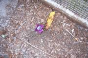 | 19836 | 256 | 48 | 1 | +0.010 | +6.7 | +0.010 | +0.016 | +0.001 |
| 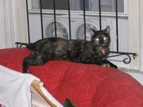 | 212976 | 123 | 20 | 0 | +0.063 | +6.6 | +0.073 | +0.114 | +0.001 |
| 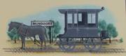 | 478067 | 128 | 23 | 0 | +0.010 | +6.5 | +0.004 | +0.002 | +0.001 |
| 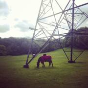 | 534026 | 159 | 35 | 0 | +0.045 | +6.3 | +0.056 | +0.090 | -0.004 |
| 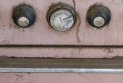 | 505637 | 248 | 46 | 0 | +0.011 | +6.0 | +0.009 | +0.016 | +0.003 |
| 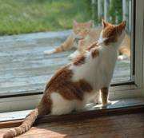 | 470128 | 109 | 20 | 0 | +0.038 | +5.7 | +0.043 | +0.065 | -0.007 |
| 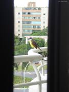 | 574988 | 182 | 37 | 36 | +0.047 | +5.6 | +0.041 | +0.064 | -0.000 |
| 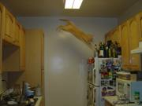 | 352117 | 122 | 37 | 0 | +0.062 | +5.5 | +0.070 | +0.135 | -0.002 |
| 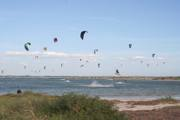 | 95670 | 90 | 20 | 0 | +0.116 | +5.5 | +0.127 | +0.174 | -0.002 |
|  | 220182 | 77 | 27 | 30 | +0.028 | +5.4 | -0.001 | +0.025 | -0.002 |
| 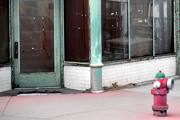 | 111280 | 337 | 44 | 1 | +0.027 | +5.3 | +0.031 | +0.105 | -0.000 |

### Most harmful

| image | id | clicks | detectors | as positive | net / click | z | raw / click | early | late |
|---|---|---:|---:|---:|---:|---:|---:|---:|---:|
| 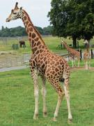 | 213897 | 73 | 6 | 0 | -0.054 | -17.2 | -0.044 | -0.045 | -0.006 |
| 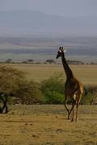 | 503637 | 68 | 9 | 0 | -0.066 | -16.1 | -0.052 | -0.061 | +0.015 |
| 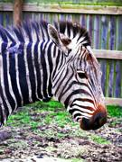 | 454654 | 60 | 5 | 0 | -0.144 | -14.7 | -0.133 | -0.140 |  |
| 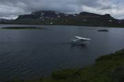 | 466347 | 151 | 41 | 4 | -0.124 | -13.3 | -0.116 | -0.183 | +0.001 |
| 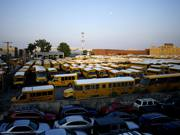 | 435811 | 167 | 42 | 1 | -0.037 | -12.8 | -0.026 | -0.044 | +0.002 |
| 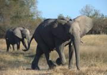 | 137154 | 67 | 5 | 0 | -0.073 | -11.7 | -0.062 | -0.064 | -0.009 |
| 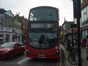 | 426917 | 147 | 33 | 2 | -0.034 | -11.6 | -0.023 | -0.038 | +0.003 |
|  | 277888 | 90 | 14 | 0 | -0.024 | -11.6 | -0.016 | -0.020 | -0.007 |
|  | 544121 | 104 | 22 | 0 | -0.062 | -11.2 | -0.057 | -0.084 | -0.000 |
| 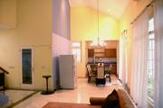 | 455135 | 64 | 21 | 33 | -0.042 | -11.1 | -0.016 | -0.021 | -0.012 |
| 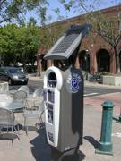 | 196775 | 115 | 24 | 0 | -0.028 | -10.8 | -0.022 | -0.032 | -0.004 |
|  | 186207 | 151 | 33 | 0 | -0.017 | -10.7 | -0.006 | -0.010 | +0.003 |
