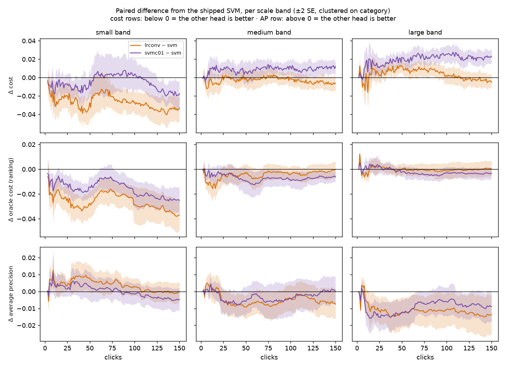
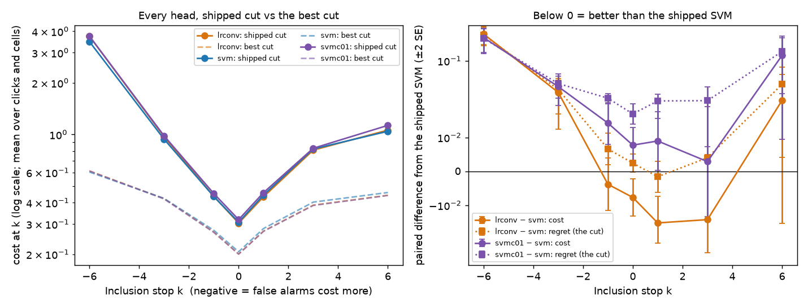
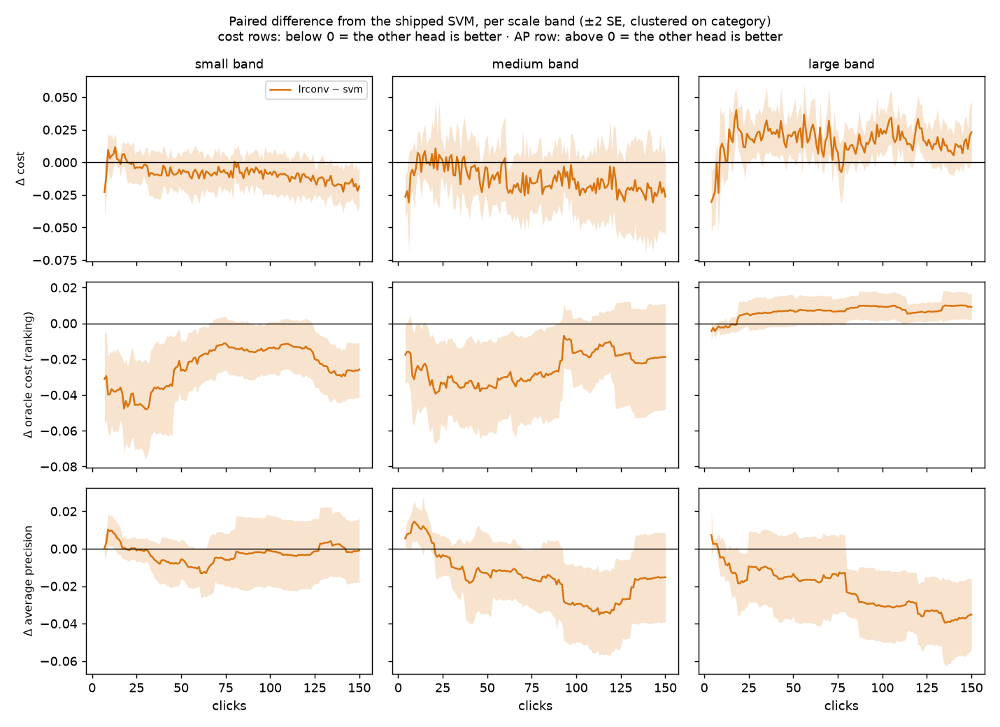

# Should the production head switch to converged logistic regression? Not yet: region voting starves it (issues #4219, #4213)

**Verdict.** No switch. The converged logistic head (`linear_logreg`) ranks better than the shipped SVM in both voting modes. It turns that into lower cost only in binary voting (−0.0099 ± 0.0028). Under **region voting** the shipped cut gives the ranking gain straight back: cost −0.0010 ± 0.0039, not resolvable, with regret +0.014 ± 0.0037. On **easy categories** it is worse outright, at cost **+0.014 ± 0.0038**, because Autopilot's acquisition cut drifts low on logistic scores and the user is shown negatives instead of borderline positives. By click 150 the logistic head has found **11 positives where the SVM found 19**. In binary voting the logistic head is the right way to get the regularisation gain #4115 found: it beats an SVM at C = 0.1 by −0.016 ± 0.0021 cost, because the shipped cut handles its scores. But a head switch covers both voting modes, and region voting is where it fails.

Interactive viewers: [`viewer.html`](viewer.html) (binary, three arms), [`region/viewer.html`](region/viewer.html) (region, two arms).

## The question

#4114 found the converged logistic head beats the SVM in the loop on COCO Better, binary voting (−0.0098 ± 0.0027 cost, all ranking). The owner asked whether to switch the production head, and what its worst case would be. Three stress tests were chosen (owner, 2026-09-28):

1. **A C-matched rival.** At the same nominal C = 1, logistic regression is effectively more heavily regularised than the squared-hinge SVM, and #4115 found an SVM at C = 0.1 also ranks better. Is logistic's win the loss, or just regularisation?
2. **Free reads** on the #4114 cells: the top of the list, by difficulty, and the Inclusion stops the user can move to. The cut was tuned on SVM scores.
3. **Region voting** (#4213), where every Bad image floods ~200 correlated patch rows into the fit. The logistic loss counts every one of them; the hinge ignores those it already classifies well. That made it the predicted worst case.

## Setup

Everything except the head is production: the fold-anchored fused cut, blend schedule, calibration split and acquisition offset. Arms pair on the cell (category, seed). SEs are clustered on category. A difference under 2 SE is called not resolvable. For cost, oracle cost and regret, negative favours the other head; for AP, positive does.

| run | environment | arms | cells |
|---|---|---|---|
| binary | `coco_better` × SigLIP, all 144 class@band cells × 5 seeds, 150 clicks | `svm`, `lrconv`, `svmc01` | 720 per arm, 702 paired (18 never found a positive, the same 18 in every arm) |
| region | `coco_better` × `siglip+dinov3_patch`, `max_patch`, the 36 hardest + 36 easiest cells × 2 seeds, 150 clicks | `svm`, `lrconv` | 144 per arm, 138 paired (6 never found a positive, the same in both) |

**Difficulty** is each category's mean AP over clicks 1–150 on #4114's `linear` arm (the old early-stopped head). That trajectory is independent of every arm compared here, so the easy stratum carries no regression-to-the-mean bias against either head; stratifying on the SVM's own AP would build one in. The region grid is those two quartiles ([`region_categories.txt`](region_categories.txt)), chosen through the new `CALIB_CATEGORY_FILE` knob, because a region cell costs **2 h and 17 GB** (the same for both heads, so the logistic fit adds no time even at patch scale).

The binary run also re-cut every step at Inclusion −6, −3, −1, 0, 1, 3 and 6 with the shipped rule, into the `__cutincl` side frame. The trajectories are unchanged. **Instrument check:** the k = 0 re-cut reproduces the live cost exactly for every arm (max difference 0.0, 90,836 rows each; [`cutincl/cutincl_k0_check.csv`](cutincl/cutincl_k0_check.csv)).

All jobs ran at SLURM nice 1000 so other sessions' work went first (owner's instruction).

## 1. The C-matched rival: logistic is regularisation the cut can use

Mean over clicks 1–150, binary:

| other − svm | cost | oracle cost (ranking) | regret (the cut) | AP |
|---|---|---|---|---|
| `lrconv` | **−0.0099 ± 0.0028** | **−0.012 ± 0.0025** | +0.0022 ± 0.0016 | −0.0044 ± 0.0019 |
| `svmc01` | **+0.0057 ± 0.0026** | **−0.0098 ± 0.0018** | **+0.016 ± 0.0017** | −0.0041 ± 0.0017 |
| `lrconv − svmc01` | **−0.016 ± 0.0021** | −0.0023 ± 0.0015 | **−0.013 ± 0.0019** | −0.0003 ± 0.0016 |

An SVM at C = 0.1 ranks almost exactly as well as the logistic head, but the shipped cut gives back more than all of it, so it ends up worse than the shipped SVM. The logistic head keeps the gain, and it beats the C = 0.1 SVM in every band (small −0.019, medium −0.012, large −0.016). **The ranking gain is regularisation; what the logistic head adds is scores the shipped cut still handles.** This also answers #4115's open question: its gain was lost to the cut, and a loss change keeps it where a C change does not. (`lrconv − svm` reproduces #4114 to the third digit, as it should: the trajectories are deterministic, so this is a check of the code, not new evidence.)

Oracle-cost crossover against the zero-click text sort: `lrconv` click 40, `svmc01` 44, `svm` 56.

## 2. Binary voting: the worst world is easy categories

By difficulty quartile, binary, mean over clicks 1–150 ([`strata/binary_quartiles.csv`](strata/binary_quartiles.csv)):

| lrconv − svm | cost | oracle cost | regret | AP |
|---|---|---|---|---|
| q1 hard | **−0.036 ± 0.0068** | **−0.037 ± 0.0058** | +0.0013 ± 0.0051 | +0.0036 ± 0.0014 |
| q2 | **−0.012 ± 0.0054** | **−0.013 ± 0.0053** | +0.0014 ± 0.0022 | +0.0013 ± 0.0041 |
| q3 | +0.0012 ± 0.0036 | −0.0004 ± 0.0027 | +0.0017 ± 0.0024 | **−0.014 ± 0.0056** |
| q4 easy | +0.0057 ± 0.0028 | +0.0013 ± 0.0007 | +0.0044 ± 0.0026 | **−0.0084 ± 0.0019** |

The #4114 "small band" effect is a difficulty effect: small objects are mostly hard categories. On hard categories the logistic head wins by a lot. On easy ones, which the SVM already ranks well, it gives up about 0.01 AP at the top of the list, and the cost loss is just under 2 SE. In binary voting that trade still comes out well ahead overall.



*Binary. Orange is logistic and purple the C = 0.1 SVM, both minus the shipped SVM, ±2 SE clustered on category. On cost the C = 0.1 SVM is above zero in medium and large, where its cut gives the ranking back. The logistic head is below zero in small and medium, and within about 0.01 of zero in large.*

## 3. Inclusion: the strict end of the slider

lrconv − svm at each Inclusion stop, binary ([`cutincl/cutincl_paired.csv`](cutincl/cutincl_paired.csv)). Negative k means a false alarm costs 2^|k| times a miss.

| k | Δcost | Δregret (cut) | Δoracle (ranking) | svm cost | svm best-cut cost |
|---|---|---|---|---|---|
| −6 | **+0.27 ± 0.044** | **+0.27 ± 0.045** | +0.0081 ± 0.0019 | 3.5 | 0.60 |
| −3 | **+0.030 ± 0.0090** | **+0.034 ± 0.0086** | −0.0037 ± 0.0025 | 0.94 | 0.42 |
| −1 | −0.0038 ± 0.0039 | +0.0066 ± 0.0024 | −0.010 ± 0.0027 | 0.43 | 0.28 |
| 0 | −0.0077 ± 0.0028 | +0.0024 ± 0.0013 | −0.010 ± 0.0025 | 0.31 | 0.21 |
| +1 | **−0.015 ± 0.0039** | −0.0016 ± 0.0023 | −0.014 ± 0.0029 | 0.44 | 0.28 |
| +3 | −0.014 ± 0.0096 | +0.0040 ± 0.0090 | −0.018 ± 0.0036 | 0.82 | 0.40 |
| +6 | +0.023 ± 0.019 | +0.041 ± 0.019 | −0.019 ± 0.0038 | 1.0 | 0.46 |

(The k = 0 row is over the re-cut rows, which cover slightly fewer steps than the base rows, so it reads −0.0077 where §1 reads −0.0099.)



*Left: every head's cost at the shipped cut (solid) and at the best cut the test labels allow (dashed), log scale. Right: paired difference from the shipped SVM, cost (solid) and regret (dotted), ±2 SE, on a symmetric-log axis.*

At the strict end the shipped cut is already far from the best cut for every head (the SVM pays 3.5 where 0.60 was available at k = −6). The logistic head makes that 8% worse at k = −6 and 3% worse at k = −3, all of it the cut; the C = 0.1 SVM does the same. From k = −1 to +3 it is level or better. This is not a reason to hold the switch on its own: the strict-end miss is the existing #3546, and the Inclusion slider is being retired for a precision floor (#4269, #4246).

## 4. Region voting (#4213): the logistic head starves acquisition on easy categories

lrconv − svm, mean over clicks 1–150, and Goods found ([`region/`](region/), [`strata/region_strata.csv`](strata/region_strata.csv)):

| | cost | oracle cost | regret | AP | Goods found by click 150 (svm → lrconv) |
|---|---|---|---|---|---|
| all | −0.0010 ± 0.0039 | **−0.015 ± 0.0042** | **+0.014 ± 0.0037** | **−0.012 ± 0.0041** | **−4.1 ± 0.99** |
| hard | **−0.018 ± 0.0060** | **−0.037 ± 0.0067** | **+0.019 ± 0.0063** | −0.0045 ± 0.0073 | 3.3 → 3.3 (−0.08 ± 0.16) |
| easy | **+0.014 ± 0.0038** | **+0.0043 ± 0.0014** | **+0.010 ± 0.0039** | **−0.019 ± 0.0037** | **18.8 → 11.1 (−7.7 ± 1.7)** |

Under region voting the logistic head still ranks better on hard categories, by as much as in binary (oracle −0.037). But the cut gives half of it back (regret +0.019), where in binary it gave back none. On easy categories it loses on every measure, and it **finds 41% fewer positives**.

**Mechanism, from Autopilot's own picks on the easy stratum** ([`strata/region_acquisition.csv`](strata/region_acquisition.csv)):

| clicks | acquisition cut (score) svm / lrconv | pool admitted svm / lrconv | "hard"-phase picks that are Good, svm / lrconv |
|---|---|---|---|
| 1–20 | 0.50 / 0.47 | 7.7% / 7.7% | 22% / 13% |
| 21–50 | 0.47 / 0.42 | 3.5% / 4.9% | 15% / 8.1% |
| 51–100 | 0.44 / 0.37 | 3.2% / 4.4% | 11% / 3.9% |
| 101–150 | 0.42 / 0.34 | 3.0% / 4.2% | 7.1% / 2.4% |

As Bad votes accumulate, the logistic head's acquisition cut drifts down (0.47 → 0.34, against the SVM's 0.50 → 0.42). It admits more of the pool, so the borderline items Autopilot asks about sit among negatives. By the last 50 clicks the user is shown a Good a third as often (2.4% against 7.1%). That is the region-flooding prediction: each Bad image contributes ~200 correlated region rows, mostly easy negatives, and a loss that counts every row pulls the scores of everything down. The per-bag weights balance the classes' total weight, but not how that weight is spread. The hinge ignores rows it already classifies well, so the SVM's scores do not drift.



*Region voting, lrconv − svm by band (the grid's strata are hard/easy; band is shown because it is the axis `figures_4114.py` draws). Large objects, mostly easy categories, are worse on cost and AP from click ~15 onward, and on ranking too.*

## What this changes

- **Keep the SVM as the production head.** A switch would buy −0.010 cost in binary voting and cost +0.014 on easy categories under region voting, with far fewer positives found. The region loss is the one a user would notice.
- **Do not lower `SVM_HEAD_C` to 0.1 alone (#4115).** It ranks better, but the shipped cut gives back more than the gain (+0.0057 cost here).
- **The logistic head's ranking gain is still on the table.** Two routes, filed as #4278: make the region fit stop dragging scores down (e.g. weight region rows so the easy negatives of one Bad image do not dominate, or cap the rows per bag), or make the acquisition cut robust to the score drift. Either would have to be measured on this same region grid.
- **Tooling that stays:** `CALIB_CATEGORY_FILE` (a designated grid narrowed to named strata, tested), `LOGREG_VOTING` / `LOGREG_ARMS` / `LOGREG_CUT_INCL_KS` / `LOGREG_NICE` on `launch_logreg_4114.sh`, `analyze_cutincl_4219.py` (heads at every Inclusion stop with the k = 0 check), and `strata_4219.py` (difficulty strata on an independent arm, and the acquisition mechanism).

## Scope and limits

- **Region voting ran two strata, not the whole bench.** The average over them is not a bench average; each stratum is read on its own. Hard and easy are the two ends where binary voting showed the gain and the loss.
- **Two seeds under region voting.** The easy-stratum Goods gap (−7.7 ± 1.7) and cost (+0.014 ± 0.0038) are several SE out; the hard-stratum AP is not resolvable.
- **One embedder per mode** (SigLIP; SigLIP + DINOv3 patches), 150 clicks, natural prevalence.
- **Mis-votes were not run.** #3197's replay found the logistic head more robust to them, which is the one test that could favour it further.

## Reproduce

```bash
export VTS_REPO=<worktree>
L=scripts/experiments/calibration/launch_logreg_4114.sh
# binary: three arms, re-cut at seven Inclusion stops
LOGREG_BASE=/expscratch/$USER/logreg-4219 LOGREG_ARMS="svm lrconv svmc01" \
  LOGREG_CUT_INCL_KS=-6,-3,-1,0,1,3,6 LOGREG_NICE=1000 bash $L prepare   # then: baseline, arms
# region: the hard + easy strata, two seeds
LOGREG_VOTING=region LOGREG_ARMS="svm lrconv" LOGREG_NICE=1000 \
  LOGREG_CATEGORY_FILE=docs/experiments/2026-09-28-head-switch-4219/region_categories.txt \
  CALIB_N_SEEDS=2 CALIB_MEM=24G CALIB_TIME=4:00:00 CALIB_CONC=20 bash $L prepare   # then: baseline, arms
python scripts/experiments/svm_vs_logistic/analyze_stage_b.py --root /expscratch/$USER/logreg-4219 --out <a>
python scripts/experiments/svm_vs_logistic/analyze_stage_b.py --root /expscratch/$USER/logreg-4213 --out <b>
python scripts/experiments/svm_vs_logistic/analyze_cutincl_4219.py --root /expscratch/$USER/logreg-4219 --out cutincl
python scripts/experiments/svm_vs_logistic/strata_4219.py --difficulty /expscratch/$USER/logreg-4114/linear/results \
  --binary /expscratch/$USER/logreg-4219 --region /expscratch/$USER/logreg-4213 \
  --categories docs/experiments/2026-09-28-head-switch-4219/region_categories.txt --out strata
python scripts/experiments/svm_vs_logistic/figures_4114.py --root /expscratch/$USER/logreg-4219 --arms lrconv,svmc01 --out figures
python scripts/experiments/svm_vs_logistic/figures_4114.py --root /expscratch/$USER/logreg-4213 --arms lrconv --out figures_region
# curves.py / viewer.py over <root>/{svm,lrconv,svmc01} -> <arm>/results, as for #4114
```

Run roots on the GRID: `/expscratch/sgreenberg/logreg-4219/` (binary) and `/expscratch/sgreenberg/logreg-4213/` (region).
