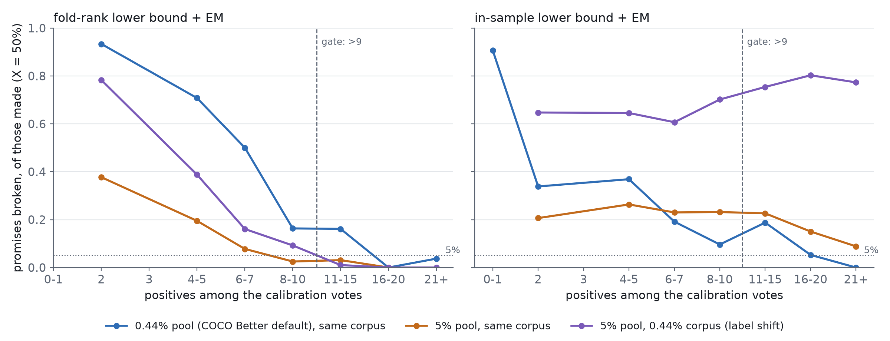
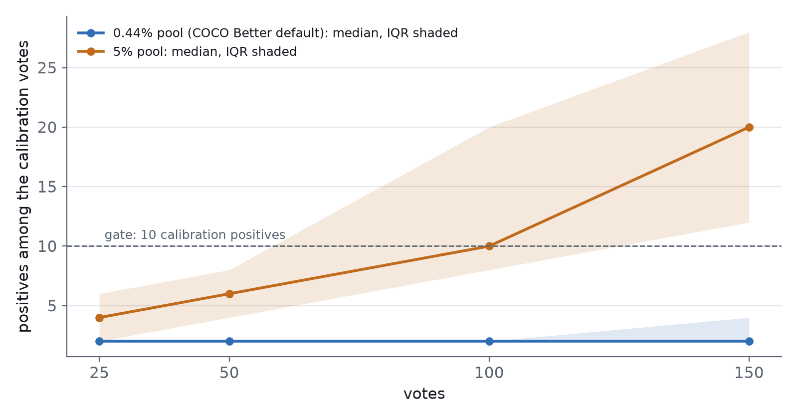

# Can a precision-floor promise be kept from the app's own votes?

**Yes, but only once the calibration folds hold about ten positives, and today's
app gets there in 5% of COCO Better cells.** Under the #4223 ruling, the user
names a precision floor X and the cut returns as much as it can while at least
X of it is right. A live rule has to *estimate* precision above a cut from the
votes it has. The one estimator that keeps its promise in every scenario takes
the calibration folds' held-out votes, transfers them to the final model by
rank, fits a logistic P(positive | score), cuts at a bootstrap lower bound, and
re-estimates the corpus prior by EM. Gated on ≥10 positives among the
calibration votes, it breaks **6%** of its X = 50% promises on the 0.44% pool,
**1%** on a 5% pool, and **3%** when the corpus is poorer than the pool it was
calibrated on. Ungated, it breaks **83%** on the 0.44% pool. The in-sample
estimator is never safe: it breaks 9–16% of its promises when gated, and **77%**
under label shift. Even when it keeps its promise, the safe estimator is
**timid**. Gated at X = 50% it recovers 0.55 recall where the best cut on the
same model reaches 0.95 (0.44% pool), and 0.23 against 0.84 on the 5% pool.

Follows #4223 (the ruling) and #4224 (the feasibility sim). It feeds #4221 (the
rule) and #4222 (the harvest this depends on). Plan fixed before the first
result: #4220, comment of 2026-09-28.

## What was run

- **Today's app (r7), unchanged,** on all 720 COCO Better cells (144 class@band
  cells × 5 seeds, SigLIP, binary voting, 150 votes). It ran at COCO Better's default pool
  (0.44% positive) and at the #4201 5% haystack arm.
- **Precision frames** (`CALIB_PFRAME_STEPS=25,50,100,150`) at each checkpoint.
  - What the app has: its pool's final-model scores, each voted item's
    in-sample score and label, and every calibration fold's held-out vote
    scores with that fold model's own haystack.
  - The truth: the test half's final-model scores and labels.
- **Offline estimators.** Each estimates P(positive | score) for every item of a
  target corpus, estimates the precision of the top k as the running mean, and
  cuts at the largest k whose estimate is ≥ X.
  - *in-sample*: fitted on the votes' own final-model scores.
  - *fold-rank*: fold held-out scores mapped to their percentile in their own
    fold's haystack, then applied through the final model's pool percentiles.
  - *fold-raw*: fold scores applied as they are.
  - Each is fitted as logistic or isotonic, and read as a point estimate or a
    10th-percentile bootstrap lower bound, with or without an EM re-estimate of
    the corpus prior.
- **Scenarios.**
  - *same*: the corpus has the voted pool's prevalence (the 0.44% arm's test
    half, or the 5% arm's test half thinned to 5%).
  - *shifted*: the 5% arm's untouched 0.44% test half, i.e. a detector
    calibrated on a rich session and run over a poor corpus.
- 1,440 cells, 18 of them starved (no detector, skipped), 4 checkpoints each.
  Analysis: `analyze_pframes_4220.py` (planted-answer test:
  `selftest_analyze_pframes_4220.py`).

## Trust follows the positives

X = 50%. Each point is the share of promises broken among the frames that made
one. A frame that promises nothing can't break a promise, so it's left out.

- **Fold-rank (left): the broken share falls steeply with calibration
  positives in every scenario.** With 2 positives it breaks 38–93% of its
  promises. With 16 or more it breaks 0–4%.
- **In-sample (right): it never gets safe.** It uses the model's scores on the
  very items the model trained on, so it is overconfident, and it has no answer
  to label shift. Under shift it breaks *more* as positives grow (61% to 80%),
  because a surer posterior for the wrong prior is surer and still wrong.

### The gate, per scenario (logistic, lower bound + EM)

| scenario | estimator | gate (calibration positives) | frames past the gate | broken, of promises made, X=50% | promises made | recall / oracle at X=50% |
|---|---|---|---|---|---|---|
| 0.44%, same | fold-rank | none | 100% | 83% | 63% | 0.46 / 0.43 |
| 0.44%, same | fold-rank | ≥10 | **5%** | **6%** | 92% | 0.55 / 0.95 |
| 0.44%, same | in-sample | ≥10 | 5% | 9% | 100% | 0.92 / 0.95 |
| 5%, same | fold-rank | ≥10 | 43% | **1%** | 49% | 0.23 / 0.84 |
| 5%, same | in-sample | ≥10 | 43% | 16% | 100% | 0.81 / 0.84 |
| 5%, shifted | fold-rank | ≥10 | 43% | **3%** | 18% | 0.11 / 0.58 |
| 5%, shifted | in-sample | ≥10 | 43% | 77% | 100% | 0.73 / 0.58 |

"Recall / oracle" is the mean recall the cut achieves against the best recall
any cut on the same model could reach at X. A recall above the oracle's means
the cut returned more than the floor allows: a broken promise. X = 25/75/90%
and gates 0/5/10 are in `gate_table.csv`.

A gate of 5 is not enough on the 0.44% pool (18% of promises broken). EM
matters under label shift. Counted over all shifted frames, fold-rank's lower
bound breaks its promise 7–31% of the time without EM and 4–11% with it,
ungated. With EM and the gate, it breaks 3% of the promises it makes
(`estimators_summary.csv`).

## Today's app almost never reaches the gate

| pool | calibration positives at vote 25 / 50 / 100 / 150 (mean) | frames with ≥10 at vote 150 |
|---|---|---|
| 0.44% (COCO Better's default) | 2.0 / 2.4 / 3.1 / 4.1 | 13% large, 8% medium, 9% small |
| 5% | 4.0 / 6.7 / 13 / 20 | 89% large, 89% medium, 86% small |

On the 0.44% pool, today's app spends 150 votes and holds a median of **two**
positives in its calibration folds. The gate is a statement about the harvest,
not about the estimator. **#4222 (asking about likely positives) is what turns
this promise on.**

## Per band (gated fold-rank, lower bound + EM, X = 50%)

| pool | band | frames | broken, of all frames | nothing promised | recall / oracle |
|---|---|---|---|---|---|
| 0.44% | large | 54 | 9% | 2% | 0.63 / 0.97 |
| 0.44% | medium | 37 | 3% | 11% | 0.46 / 0.96 |
| 0.44% | small | 35 | 3% | 14% | 0.51 / 0.91 |
| 5%, same | large | 529 | 1% | 32% | 0.35 / 0.97 |
| 5%, same | medium | 383 | 1% | 60% | 0.16 / 0.82 |
| 5%, same | small | 315 | 1% | 70% | 0.11 / 0.67 |
| 5%, shifted | large | 529 | 0% | 71% | 0.17 / 0.83 |
| 5%, shifted | medium | 383 | 1% | 88% | 0.06 / 0.48 |
| 5%, shifted | small | 315 | 1% | 91% | 0.05 / 0.29 |

Safety holds in every band. The timidity grows as objects shrink: on the 5%
pool the rule promises nothing for 70% of small cells, where the oracle could
still reach 0.67 recall.

## Literal examples (0.44% pool, vote 150, fold-rank lower bound + EM, X = 50%)

**Promises broken below the gate:**

| cell | seed | positives among votes / calibration | returned | precision achieved | recall | oracle recall |
|---|---|---|---|---|---|---|
| tv@small | 3 | 2 / 2 | 909 | 1% | 0.25 | 0.02 |
| dog@small | 0 | 4 / 2 | 435 | 3% | 0.23 | 0.02 |
| clock@small | 0 | 3 / 2 | 606 | 3% | 0.34 | 0.22 |

On `tv@small` the rule saw two positives in its calibration votes, promised
"at least half right", and returned 909 images, of which 1% were televisions.

**Past the gate: kept, and often timid:**

| cell | seed | positives among votes / calibration | returned | precision achieved | recall | oracle recall |
|---|---|---|---|---|---|---|
| bird@large | 0 | 23 / 14 | 42 | 100% | 0.91 | 1.00 |
| fire hydrant@large | 0 | 19 / 12 | 43 | 100% | 0.86 | 0.98 |
| skis@medium | 0 | 36 / 20 | 10 | 100% | 0.18 | 0.98 |
| airplane@large | 0 | 45 / 28 | **0** | – | 0 | 0.98 |
| apple@large | 2 | 23 / 14 | 105 | 42% | 0.88 | 0.86 |

`airplane@large` holds 28 calibration positives and still promises nothing.
Its positives sit above the pool's 99.5th percentile, and a logistic in the
raw percentile coordinate can't resolve that thin tail. `apple@large` is one of
the gated promises that broke: 42% against a promise of 50%.

Which cells pass the gate is itself telling. They are the distinctive classes
where autopilot finds positives: skis, tennis racket, airplane, baseball bat.

## What today's cuts promise

At vote 150, median precision of what each existing cut returns
(`reference_cuts.csv`):

| cut | 0.44% | 5%, same | 5%, shifted |
|---|---|---|---|
| shipped | 2.0% | 34% | 4.2% |
| `tau_gumbel_priorfree` | 1.6% | 85% | 30% |
| `tau_mid` | 1.8% | 67% | 15% |
| `tau_tail_a040` | 5.9% | 57% | 10% |

None of them tracks a precision target. What they deliver depends on the pool
far more than on any setting.

## Caveats

- **Open loop.** Every estimator reads r7's trajectory. A rule that cut
  elsewhere would have asked different questions and harvested different
  positives (#4222).
- **One dataset, one embedder.** COCO Better with SigLIP, binary voting.
- **The shifted scenario is one shift (5% → 0.44%).** A corpus richer than the
  session isn't tested.
- **The lower bound is a fixed 10th percentile of 30 bootstrap refits.** Its
  level is a knob this study didn't sweep; it trades broken promises for
  timidity directly.

## For #4221

1. **Carry fold-rank + logistic + bootstrap lower bound + EM** as the base. It's
   the only candidate that is safe across scenarios. Reject in-sample (never
   safe under shift) and fold-raw (breaks its promise 16–94% of the time; see
   `estimators_summary.csv`).
2. **Gate the promise on ≥10 calibration positives,** and say "not enough
   evidence yet" below it. That is the #4224 behaviour for "no cut can reach X".
3. **Attack the timidity:**
   - a tail coordinate for the rank transfer (−log(1 − percentile)), since
     `airplane@large` shows the raw percentile can't resolve the top 0.5%;
   - pooling the folds' evidence instead of bounding each refit;
   - a swept bound level.
4. **Everything depends on #4222:** at today's harvest the gate opens in 5% of
   cells.

## Files

| file | what |
|---|---|
| `gate_table.csv` | gates 0/5/10 × X × scenario: frames past the gate, promises broken (of all frames, and of promises made), promises made, recall, oracle recall |
| `estimators_summary.csv` | every estimator × fit × reading × X × scenario: violation, empty, empty-though-reachable, recall share of oracle |
| `estimators_by_t.csv` | the lower-bound readings by checkpoint |
| `reference_cuts.csv` | the recorded cutdiag cuts and the shipped one: returned, precision, recall |
| `fig_violation_by_calpos.csv`, `fig_calpos.csv` | the figures' data |
| `SUMMARY.md`, `provenance.json` | the analyzer's machine summary; 1,440 cells, 18 starved |

Per-row outputs (6 MB) and the frames themselves (~0.9 GB) stay on the GRID at
`/expscratch/sgreenberg/pframes-4220/`. Rebuild: `analyze_pframes_4220.py --arm
natural=…/natural/r7_acq4/results --arm h0.05=…/h0.05/r7_acq4/results --out …
--jobs 16`, then `figure_pframes_4220.py`.
