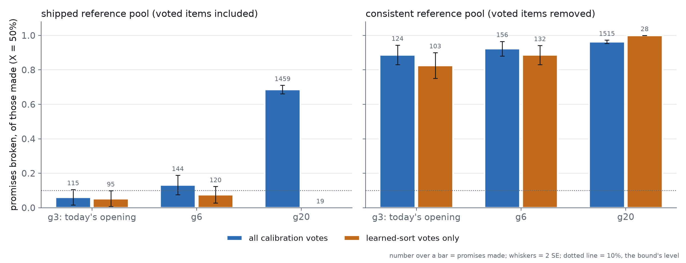
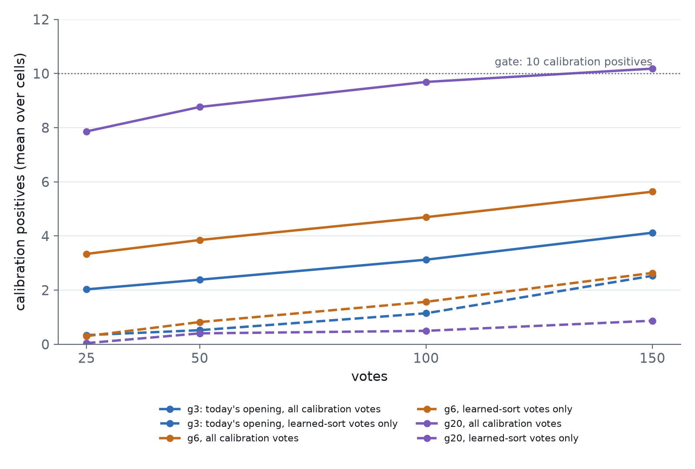

# Does calibrating the precision floor only on learned-sort votes keep its promise?

**No.** Dropping the opening's votes from the calibration evidence does not
repair the #4220 estimator. It stops the long text walk's broken promises only by
leaving the estimator nothing to promise with. In the g20 arm, all votes and the
shipped reference pool break **69%** of X = 50% promises. Learned-sort votes only
break **0 of 19**, but they reach the 10-positive gate in **1.1%** of frames
(was 62%) and recover **0.0068** of the oracle's recall (was 0.97). Built consistently,
the estimator still fails on learned-sort votes alone: it breaks **83%** (g3),
**89%** (g6) and **100%** (g20) of the promises it makes. Some of those frames hold
23–27 learned-sort calibration positives, and the promises still fail. So the bias
is not the opening's. **Every vote a model chose is a biased sample of that
model's scores**: the learned Good picks come from its top, and the Hard picks
from its boundary. The shipped pool's in-sample offset is what hides this, at
6.1% broken with today's g3 opening. Random verification (#4257, PR #4264)
samples uniformly by design, and it is the route that keeps promises: 0.23% broken
at 35 audit votes.

Part of #4224; the provenance test proposed on #4221 and filed as #4256. Pool:
**0.44% (COCO Better's default)**, a scenario, not a claim about users.

## What was run

- **Sessions.** Today's app on COCO Better (SigLIP, binary voting): 144 class@band
  cells × 5 seeds, frames at t = 25, 50, 100 and 150 votes. There are three
  openings, all `gG@top,b4@mid`: **g3** (production), **g6** and **g20** (#4222's
  arms). That is 2,160 sessions and 7,986 frames (2,662 per arm; starved cells
  have no detector). The run used the #4222 launcher, with a harness that records
  which vote each calibration row came from.
- **Provenance.** Each precision frame names its calibration votes
  (`fold_cal_vote`) and the phase that picked them (`fold_cal_phase`). It reads
  them through the held-out rows that `compute_fold_orderings` reports
  (`holdout_sink`, the hook #4245 added). A test checks that the named votes'
  labels equal the calibration labels.
- **Evidence sets.**
  - **all**: every calibration vote, as the app would use them.
  - **learned**: only votes picked at or after the session's first
    hard/new/done pick. The split is by *time*, not phase name: Autopilot's
    Good phase recurs after the opening as a *learned* Good pick under the same
    name.
- **Reference pools.**
  - **shipped**: the pool includes the voted items, scored in-sample, as
    `vtscore/detectors/training.py` builds it on dev.
  - **consistent**: voted items removed, matching the fold haystacks.
- **Estimator.** The library's `precision_floor_cut`, unchanged: fold-rank
  evidence, logistic P(y | percentile), a 10th-percentile bootstrap lower bound
  over 30 refits, Saerens EM, and the 10-positive gate. X = 25%, 50% and 75%.
  Each promise is scored on the frame's unvoted test half.
- **Decision rule (posted on #4256 before the run).** Learned-only evidence
  *repairs the text walk* if g20's shipped-pool broken rate at X = 50% comes
  within 2 SE of g3's all-votes rate. It *repairs the general failure* only if the
  consistent pool drops to ≤ ~5% broken.

## Results



X = 50%, all four checkpoints pooled (2,662 frames per arm):

| opening | evidence | past the gate | promised | broken, shipped pool | broken, consistent pool | recall ÷ oracle, shipped |
|---|---|---|---|---|---|---|
| g3 | all | 4.7% | 4.3% | **6.1%** ± 2.2 (115) | 89% ± 2.8 (124) | 0.060 |
| g3 | learned | 3.9% | 3.6% | 5.3% ± 2.3 (95) | **83%** ± 3.7 (103) | 0.044 |
| g6 | all | 6.0% | 5.4% | 13% ± 2.8 (144) | 92% ± 2.1 (156) | 0.073 |
| g6 | learned | 5.1% | 4.5% | 7.5% ± 2.4 (120) | **89%** ± 2.8 (132) | 0.051 |
| g20 | all | 62% | 55% | **69%** ± 1.2 (1,459) | 96% ± 0.5 (1,515) | 0.97 |
| g20 | learned | 1.1% | 0.71% | **0 of 19** | **100%** (28) | 0.0068 |

± is one SE; the number of promises made is in brackets. "Recall ÷ oracle" is
the mean recall of the promised set divided by the mean oracle recall at X
(0.43–0.46), counting no promise as 0. It is above 1 wherever broken promises
return too much.

**The rule's two tests:**

1. *Does learned-only evidence repair the text walk?* **Only vacuously.** g20
   learned + shipped breaks 0 of its 19 promises, which is under g3's 6.1%. But 19
   promises is 0.71% of frames, and the one-sided Clopper–Pearson 95% upper bound
   on 0/19 is 15%. It avoids broken promises by abstaining. The long walk's evidence
   *is* its opening: 29 of its calibration votes are opening votes on average, and
   they hold 95% of its calibration positives (9.2 all against 0.47 learned).
2. *Does it repair the general failure?* **No.** The consistent pool breaks 83–100%
   of learned-only promises in every arm, against the ≤ ~5% the rule asked for.

**Other floors.** The pattern holds at X = 25% and X = 75%:

| opening | evidence | broken, shipped pool (X = 25% / 75%) | broken, consistent pool (X = 25% / 75%) |
|---|---|---|---|
| g3 | all | 5.9% / 5.1% | 86% / 85% |
| g3 | learned | 4.1% / 6.3% | 82% / 82% |
| g20 | all | 69% / 68% | 96% / 96% |
| g20 | learned | 0 of 23 / 0 of 11 | 100% / 100% |

**By checkpoint.** Learned-sort evidence arrives late. g3's learned
calibration positives average 0.34 at t = 25 and 2.5 at t = 150. The
shipped-pool broken rate for g3 learned falls from 8.8% (34 promises) at
t = 100 to 1.9% (52) at t = 150, which is within noise of all-votes (1.7%). The g20
learned arm passes the gate in 0% of frames at t = 25 and 50, and in 3.3% at
t = 150.



(Means over cells. The gate is per frame: 62% of g20 frames pass it although its
mean sits near 10.)

## Literal examples (t = 150, X = 50%)

- **g20, airplane@large, seed 4.** All 12 calibration positives came from the
  16-vote text-walk opening, and none from learned sorts. With all votes and the
  shipped pool, it **promised 377 items at ≥ 50% and delivered 14%**. With the
  consistent pool it promised 416 at 13%. Learned-only: *insufficient evidence*.
  189 g20 frames at t = 150 break a shipped-pool promise the same way. Other
  examples: apple@medium seed 0 (80 items at 39%) and banana@large seed 0
  (392 at 13%).
- **g3, airplane@large, seeds 1–4.** Learned-only evidence alone holds 23–26
  calibration positives, well past the gate. The shipped pool promised 12–26
  items, all correct. The *same evidence* against the consistent pool promised
  121–155 items at **34–37%**, every seed broken. Plenty of learned-sort evidence
  does not fix the posterior. Only the pool's offset makes it look safe.

## By object size (X = 50%)

| opening | evidence | broken, shipped (large / medium / small) | broken, consistent (large / medium / small) |
|---|---|---|---|
| g3 | all | 9.6% / 3.0% / 3.3% | 92% / 75% / 97% |
| g3 | learned | 9.1% / 0% / 4.0% | 87% / 62% / 97% |
| g6 | learned | 3.8% / 7.7% / 14% | 91% / 82% / 94% |
| g20 | all | 74% / 68% / 45% | 98% / 96% / 91% |
| g20 | learned | 0 of 9 / 0 of 4 / 0 of 6 | 100% / 100% / 100% |

Every band tells the same story. The g3 cells hold 25–53 promises per band, so
their shipped-pool rates are ±4–6 points.

## What this means

- **Vote provenance is not the lever.** No filter on *which* model-chosen votes
  calibrate the posterior makes it honest. Hard picks sit at the old model's
  boundary, and learned Good picks at its top. Both are selected on the score
  the posterior is fitted against.
- **The app already filters, and that is why a long opening won't break it.**
  The merged backend (#4245, PR #4262) calibrates only on the learned sort's
  own draws (`calibrates_precision`, the owner's call from #4222), against the
  shipped pool. That is this study's *learned + shipped* row: 5.3% broken with
  today's g3 opening. Under a long walk (g20, or #4222's dry-stop
  `g20+dry1/8@top`, PR #4254) it stops promising rather than breaking: 0.71% of
  frames. Without the filter, g20 would break 69%. So the filter is worth
  keeping, but as a gate-closer. Its docstring's rationale, "unbiased under
  score-only selection", is refuted here; #4251 corrects it (and
  the plan). The promise it keeps still rests on the pool's in-sample
  offset.
- **The route forward is random verification.** #4257 (PR #4264) shows that
  audited promises break at most 0.23% anywhere on the grid, at about 35 audit
  votes for X = 50%. It also shows that at these prevalences most honest promises
  cover sets small enough to read in full.

## Reproduce

```
# GRID: 3 arms x 720 tasks (the #4222 launcher, from a checkout with this harness)
VTS_REPO=<checkout> TEXTGOOD_BASE=<out> \
  bash scripts/experiments/calibration/launch_textgood_4222.sh arms natural-g3 natural-g6 natural-g20
# analysis: 120 shards, then merge (~16 s a cell)
python scripts/experiments/calibration/analyze_provenance_4256.py \
  --arm g3=<out>/natural-g3/results --arm g6=<out>/natural-g6/results --arm g20=<out>/natural-g20/results \
  --out <analysis> --shard I/120        # for I in 0..119, then the same with --merge
python scripts/experiments/calibration/figure_provenance_4256.py
```

The arm directories keep the launcher's historical `natural-*` names; the pool is
the 0.44% scenario. Planted-answer test:
`scripts/experiments/calibration/selftest_analyze_provenance_4256.py` (6 checks).

Files here:
- `provenance_summary.csv`, `provenance_by_t.csv`, `provenance_by_band.csv`: the tables above.
- `provenance_rows.csv.gz`: one row per frame × evidence × pool × X.
- `provenance.json`: the run's counts.
