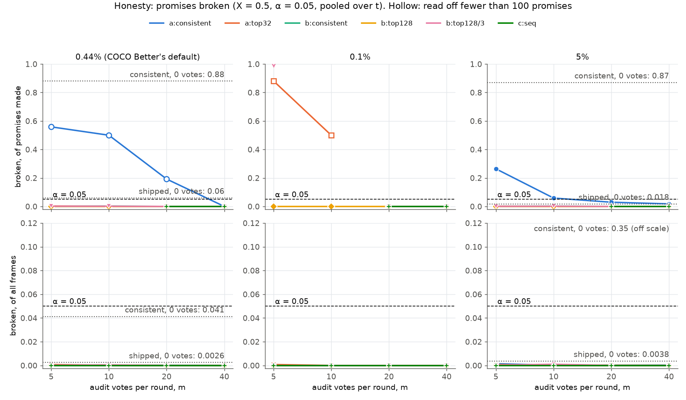
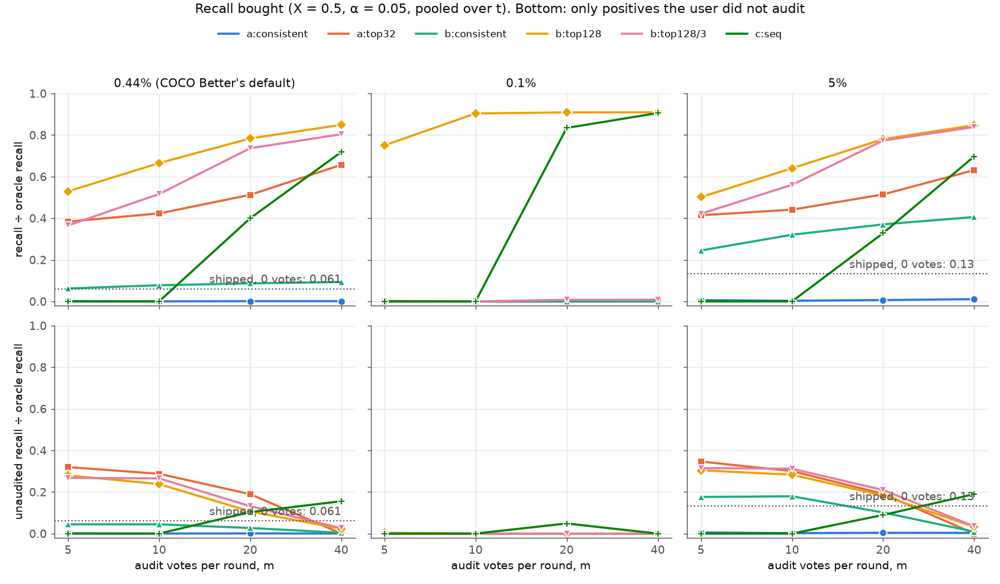
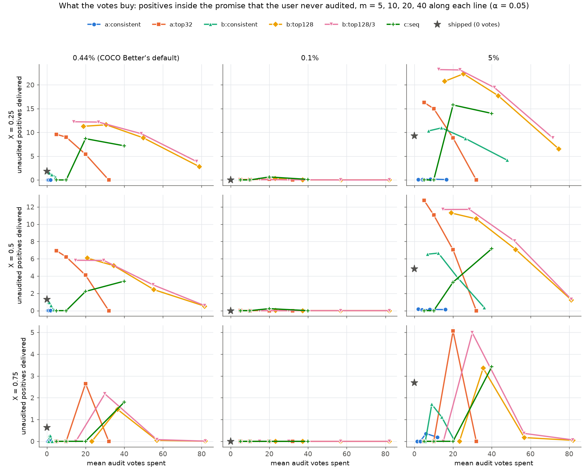

# How many audit votes does an honest precision-floor promise cost?

**About 35, and at these prevalences most of them buy a promise the user could
have had by reading.** Random verification keeps its promises. The user audits a
uniform sample of a candidate returned set, and a Clopper–Pearson lower bound
decides whether to promise it. The rule that halves a failed candidate breaks at
most 0.23% of its promises anywhere on the grid (α = 5–10%). The shipped estimator
breaks 6.0% at 0.44% (COCO Better's default) and the consistent one 88%. At a floor
of X = 50%, α = 5% and 10 audits a round, it spends **35 votes** on average (90th
percentile 39). For that it recovers **0.67** of the oracle's recall at 0.44%
(shipped: 0.061), **0.64** at 5% (shipped: 0.13) and **0.90** at 0.1% (shipped: 0).
But the sets a floor can honestly return are small: a median of 38 items at 0.44%
and 6 at 0.1%. So the audit usually ends up reading all of them: **57%** of those
promises at 0.44%, 42% at 5% and 100% at 0.1% cover only items the user voted on.
Simply reading the top 32 (32 votes, never wrong) recovers 0.73, 0.66 and 1.0.
What an audit adds over reading is positives the user never looks at: **5.2** per
session at 0.44%, **11** at 5%, **none** at 0.1%. The cheapest source of those is
one 5-vote audit of the top 32. It yields 6.9 unseen positives at 0.44% and 13 at
5%, but it promises in only 28% and 50% of sessions, and never at 0.1%.

Part of #4224. Data: the #4224 rank frames
([`2026-09-28-rank-frames`](../2026-09-28-rank-frames/README.md)), cut from the
#4220 and #4222 runs. Analysis:
`scripts/experiments/calibration/analyze_random_verification.py` (planted-answer
test: `selftest_analyze_random_verification.py`). Nothing here needed the GRID.

## What was run

- **Frames.** 7,861 frames of today's app on COCO Better, SigLIP, binary voting:
  144 class@band cells × 5 seeds, each at t = 25, 50, 100 and 150 votes. Three pool
  prevalences, which are scenarios, not claims about users:
  - 0.44% (COCO Better's default): 2,662 frames, about 11,000 unvoted images and
    50 positives each;
  - 0.1%: 2,328 frames, about 11 positives each;
  - 5%: 2,871 frames, about 1,000 images and 50 positives each.
- **Audits are exact.** Each frame stores the ranks of its corpus's positives, so
  the label of any audited item is known. A uniform draw without replacement from
  the top k is simulated as a hypergeometric draw. The draws are the only
  randomness: 20 per frame, seeded.
- **The promise.** Promise the top k at floor X if the one-sided Clopper–Pearson
  lower bound on its precision is ≥ X at level 1 − α. An audit that covers every
  item of the set (m ≥ k) is a **census**: its precision is exact and it spends no
  error budget.
- **Rules.**
  - `a:*`, one round (the issue's rule (a)). Audit m items of a candidate top k₀
    and promise it or nothing. `a:consistent` takes k₀ from the consistent
    estimator (nothing to audit where it promised nothing). `a:top16`, `a:top32`
    and `a:top64` use a fixed rank.
  - `b:*`, sequential shrinking (rule (b)). A failed round halves k and audits
    again, each round at α / R. Labels already seen inside the new top k are kept
    and m fresh items are added, which keeps every round's sample uniform.
    `b:top128` starts at 128 and can shrink six times, to 4. `b:top128/3` stops
    at 32. `b:consistent` starts at the consistent estimator's cut (R = 4). That
    is the issue's rule (d): the model proposes and the audit disposes.
  - `c:*`, stratified curve (rule (c)). Split the top 128 into bins at 4, 8, 16,
    32 and 64, spread the m audits round-robin from the top (capped at each bin's
    size), and promise the largest edge whose weighted cumulative lower bound is
    ≥ X. `c:union` bounds every sampled bin at α / J, the union bound over the J
    sampled bins. `c:seq` tests the edges in increasing order and stops at the
    first failure, a fixed-sequence procedure that is also level α.
  - **References:** the two stored baselines (`shipped`, `consistent`), and
    **read the top K** (K = 16, 32). That means voting on every one of the top K
    and promising the longest prefix at ≥ X. It is never wrong and costs K votes:
    the thing an audit has to beat.
- **Grid.** m ∈ {5, 10, 20, 40} (per round for `b`), α ∈ {0.05, 0.10},
  X ∈ {25, 50, 75%}, all three prevalences, every t.
- **Metrics** (`summary.csv`; by t and by band beside it):
  - promises made;
  - promises broken, of those made, and of all frames;
  - recall ÷ oracle recall, counting no promise as 0. The oracle is the largest
    recall of any top k at ≥ X;
  - audit votes, mean and 90th percentile;
  - **census, of promises:** the share of promises whose every item was audited;
  - **unaudited positives:** positives inside the promise that the user was never
    shown, per frame.

The last two are not in the issue. They are here because the first run showed
that most "recall" bought by auditing is the audit itself.

## Honesty: every audited rule keeps its promises

X = 50%, α = 5%, pooled over t. Top row: the issue's metric, the broken share of
promises made. Hollow markers are read off fewer than 100 promises. Bottom row:
the broken share of all frames.

- **What Clopper–Pearson guarantees is the bottom row.** For every frame whose
  candidate is below X, the chance of promising it is at most α. Across the whole
  grid no audited rule breaks more than **0.61%** of frames (`b:top128/3`, α =
  10%). At α = 5% the worst is 0.23% (`a:top64`). The consistent estimator
  breaks 35% of all frames at 5% prevalence (X = 50%).
- **Broken-of-made is a different number, and a one-round rule can fail it.**
  When a candidate is almost always below X, the few audits that pass are mostly
  lucky. `a:consistent` at 0.44% promises in 34 of 53,240 frame-draws at m = 5,
  and 56% of those break. At 5% prevalence and X = 25% it breaks 10–51% of the
  118–573 promises it makes. `a:top64` at 0.1% breaks 85% of 214 (α = 10%, X =
  25%).
- **Where every candidate gets a second chance, both rates stay under α.** Over
  all 72 cells of the grid (3 prevalences × 3 floors × 2 levels × 4 budgets):

| rule | worst broken, of promises made (cluster SE) | where |
|---|---|---|
| `b:top128` | 0.23% (0.02%) | 0.44%, X = 25%, α = 10%, m = 5 |
| `b:consistent` | 0.56% (0.17%) | 0.44%, X = 25%, α = 10%, m = 10 |
| `c:seq` | 0.02% (0.01%) | 0.44%, X = 75%, α = 10%, m = 40 |
| `c:union` | 0 | – |

So **yes, there is a rule and a budget with broken ≤ α in every prevalence
setting.** `b:top128` holds at every budget, both levels and every floor. The
stratified rules do too, where they promise at all. What they cost is below.

The minimum audit to make any promise that isn't a census is fixed by the bound.
m audits, all positive, give a lower bound of α^(1/m) (`min_audit.csv`):

| X | α = 5% | α = 10% |
|---|---|---|
| 25% | 3 | 2 |
| 50% | 5 | 4 |
| 75% | 11 | 9 |

Split over R = 6 rounds, the per-round level α / 6 raises these to 7 at X = 50%
and 17 at X = 75%. That is why `b:top128`'s promises at X = 75% are 83% census
(m = 10, 0.44%). A sampled round rarely holds 17 audits, let alone 17 positive
ones, so the rule shrinks until it has read the whole set.

## What the votes buy

X = 50%, α = 5%, pooled over t. Top row: recall ÷ oracle recall. Bottom row: the
same, counting only the positives inside the promise that the user was never
shown. A promise the user has fully audited adds nothing to the bottom row.

### 0.44% (COCO Better's default)

82% of frames have some top k at ≥ 50%. The mean oracle recall is 0.43, and the
oracle's cut is 38 items at the median (`oracle.csv`).

| rule | m | audit votes, mean (p90) | promises made | broken, of made | recall ÷ oracle | census, of promises | unaudited positives |
|---|---|---|---|---|---|---|---|
| shipped estimator | – | 0 | 4.4% | 6.0% | 0.061 | 0% | 1.3 |
| consistent estimator | – | 0 | 4.7% | 88% | 0.11 | 0% | 2.2 |
| read the top 16 | – | 16 (16) | 82% | 0% | 0.43 | 100% | 0 |
| read the top 32 | – | 32 (32) | 82% | 0% | 0.73 | 100% | 0 |
| `a:consistent` | 10 | 0.47 (0) | 0.020% | 50% | 0.00030 | 0% | 0.0052 |
| `a:top32` | 5 | 5 (5) | 28% | 0.28% | 0.38 | 0% | 6.9 |
| `a:top32` | 10 | 10 (10) | 30% | 0.020% | 0.42 | 0% | 6.2 |
| `b:consistent` | 10 | 1.3 (0) | 4.6% | 0.21% | 0.078 | 3.0% | 0.94 |
| `b:top128` | 5 | 21 (25) | 75% | 0.030% | 0.53 | 51% | 6.1 |
| `b:top128` | 10 | 35 (39) | 75% | 0.010% | 0.67 | 57% | 5.2 |
| `b:top128` | 20 | 55 (60) | 75% | 0% | 0.78 | 84% | 2.4 |
| `b:top128/3` | 10 | 29 (30) | 34% | 0.16% | 0.52 | 0% | 5.8 |
| `c:seq` | 20 | 20 (20) | 74% | 0% | 0.40 | 32% | 2.2 |
| `c:seq` | 40 | 40 (40) | 74% | 0% | 0.72 | 42% | 3.4 |

### 5%

98% reachable, mean oracle recall 0.74, and the oracle's cut is 86 items at the
median.

| rule | m | audit votes, mean (p90) | promises made | broken, of made | recall ÷ oracle | census, of promises | unaudited positives |
|---|---|---|---|---|---|---|---|
| shipped estimator | – | 0 | 21% | 1.8% | 0.13 | 0% | 4.8 |
| consistent estimator | – | 0 | 40% | 87% | 0.51 | 0% | 19 |
| read the top 16 | – | 16 (16) | 98% | 0% | 0.36 | 100% | 0 |
| read the top 32 | – | 32 (32) | 98% | 0% | 0.66 | 100% | 0 |
| `a:consistent` | 10 | 4.0 (10) | 0.38% | 5.9% | 0.0032 | 27% | 0.086 |
| `a:top32` | 5 | 5 (5) | 50% | 0.15% | 0.41 | 0% | 13 |
| `a:top32` | 10 | 10 (10) | 53% | 0.010% | 0.44 | 0% | 11 |
| `b:consistent` | 10 | 12 (40) | 34% | 0.16% | 0.32 | 8.6% | 6.7 |
| `b:top128` | 5 | 19 (24) | 96% | 0.020% | 0.50 | 41% | 11 |
| `b:top128` | 10 | 32 (39) | 96% | 0.010% | 0.64 | 42% | 11 |
| `b:top128` | 20 | 52 (60) | 96% | 0.010% | 0.78 | 69% | 7.1 |
| `b:top128/3` | 10 | 28 (30) | 59% | 0.17% | 0.56 | 0% | 12 |
| `c:seq` | 20 | 20 (20) | 95% | 0% | 0.33 | 24% | 3.3 |
| `c:seq` | 40 | 40 (40) | 95% | 0% | 0.70 | 26% | 7.2 |

### Against the shipped estimator, and against reading

Paired on the same frames (`d_recall_vs_*`, cluster SE in brackets):

| pool | `b:top128`, m = 10, over shipped | reading the top 32, over shipped | `b:top128`, m = 10, over reading the top 32 | `c:seq`, m = 40, over reading the top 32 |
|---|---|---|---|---|
| 0.44% | +0.26 (0.009) | +0.29 (0.009) | −0.028 (0.003) | −0.005 (0.003) |
| 5% | +0.38 (0.008) | +0.39 (0.007) | −0.014 (0.005) | +0.028 (0.005) |
| 0.1% | +0.32 (0.014) | +0.36 (0.015) | −0.034 (0.002) | −0.034 (0.002) |

Both recover a third of the corpus's positives that the shipped estimator leaves
out. But on recall, the shrinking audit is **worse** than reading the top 32, by
3 to 18 standard errors, and it spends about the same votes (35, 32 and 37
against 32). Only the stratified rule at 40 votes beats reading, and only at 5%.
At 0.44% the difference isn't resolvable (−0.005 ± 0.003). **What an audit adds is
the bottom row of the figure:** the positives inside the promise that the user
never had to see.

The best buy for unseen positives is a small one-round audit of a mid-sized
candidate. `a:top32` at m = 5 delivers 6.9 unseen positives per session at 0.44%
and 13 at 5%, for 5 votes. `b:top128` at m = 10 delivers 5.2 and 11, for 35 and
32. Each extra round spends m votes to certify a set half the size, and the last
rounds are censuses. More budget buys *less* unseen recall: at m = 40, 78% of
`b:top128`'s promises at 0.44% are censuses and it delivers 0.52 unseen positives.

`a:consistent` is not worth running. The consistent estimator's candidate breaks
88% of its X = 50% promises, and 10 audits reject nearly all of them. It promises
in 0.020% of frames at 0.44%, against the 4.7% the estimator itself claimed.
Starting the shrinking rule there (`b:consistent`) is honest, but it can only
act where the estimator passed its gate of 10 calibration positives: 4.7% of
frames at 0.44%, 40% at 5%.

The stratified rules can't promise anything at m ≤ 10. With six bins, no bin gets
more than 2 audits and none is censused, and a bound read off 1–2 audits at α / J
never reaches 50%. At m = 40 they read the top 16 and sample below it. That is a
"read the top, audit beyond" design, and it lands between the two: 0.72 and 0.70
of oracle recall with 3.4 and 7.2 unseen positives.

## Across floors

Each line runs m = 5, 10, 20, 40 left to right, at α = 5%. Rows share a y-axis.
The grey star is the shipped estimator, which audits nothing, so every positive
it returns is unseen. It breaks 1.2–6.0% of its promises, where the audited rules
break almost none.

| pool | X | rule | m | audit votes | promises made | broken, of made | recall ÷ oracle | census, of promises | unaudited positives |
|---|---|---|---|---|---|---|---|---|---|
| 0.44% | 25% | shipped estimator | – | 0 | 4.5% | 5.8% | 0.072 | 0% | 1.8 |
| 0.44% | 25% | read the top 32 | – | 32 | 86% | 0% | 0.64 | 100% | 0 |
| 0.44% | 25% | `a:top32` | 5 | 5 | 41% | 0.060% | 0.44 | 0% | 9.6 |
| 0.44% | 25% | `b:top128` | 10 | 31 | 86% | 0.020% | 0.75 | 42% | 12 |
| 0.44% | 75% | shipped estimator | – | 0 | 3.6% | 5.2% | 0.036 | 0% | 0.63 |
| 0.44% | 75% | read the top 32 | – | 32 | 76% | 0% | 0.80 | 100% | 0 |
| 0.44% | 75% | `a:top32` | 20 | 20 | 23% | 0% | 0.40 | 0% | 2.6 |
| 0.44% | 75% | `b:top128` | 10 | 36 | 66% | 0% | 0.56 | 83% | 1.5 |
| 5% | 25% | shipped estimator | – | 0 | 30% | 5.8% | 0.21 | 0% | 9.3 |
| 5% | 25% | read the top 32 | – | 32 | 99% | 0% | 0.57 | 100% | 0 |
| 5% | 25% | `a:top32` | 5 | 5 | 67% | 0% | 0.45 | 0% | 16 |
| 5% | 25% | `b:top128` | 10 | 25 | 99% | 0.010% | 0.75 | 19% | 22 |
| 5% | 75% | shipped estimator | – | 0 | 14% | 1.2% | 0.091 | 0% | 2.7 |
| 5% | 75% | read the top 32 | – | 32 | 93% | 0% | 0.73 | 100% | 0 |
| 5% | 75% | `a:top32` | 20 | 20 | 43% | 0% | 0.45 | 0% | 5.1 |
| 5% | 75% | `b:top128` | 10 | 36 | 88% | 0.010% | 0.53 | 72% | 3.4 |

The audit earns its votes where the promisable set is much larger than the audit.
At a low floor the oracle's cut is 112 items at 0.44% and 184 at 5%. There
`b:top128` delivers 12 and 22 unseen positives for 25–31 votes, and recovers 0.75
of the oracle against reading's 0.64 and 0.57. At X = 75% the cuts shrink to 14
and 46 items, the bound needs 11 all-positive audits (17 at α / 6), and
auditing turns back into reading. `a:top32` at m = 5 can't promise at 75% at all.

## 0.1%: nothing to audit

About 11 positives per corpus. At X = 50%, 36% of frames have no top k at ≥ 50%
at all. The oracle's cut is **6 items** at the median and 22 at the 90th
percentile.

| rule | m | audit votes, mean (p90) | promises made | broken, of made | recall ÷ oracle | census, of promises | unaudited positives |
|---|---|---|---|---|---|---|---|
| shipped / consistent estimator | – | 0 | 0% | – | 0 | – | 0 |
| read the top 16 | – | 16 (16) | 64% | 0% | 0.97 | 100% | 0 |
| read the top 32 | – | 32 (32) | 64% | 0% | 1.0 | 100% | 0 |
| `a:top32` | 5 | 5 (5) | 0.090% | 88% | 0.0023 | 0% | 0.0070 |
| `b:top128` | 10 | 37 (39) | 55% | 0% | 0.90 | 100% | 0.00020 |
| `b:top128` | 20 | 57 (60) | 55% | 0% | 0.91 | 100% | 0 |
| `c:seq` | 20 | 20 (20) | 55% | 0% | 0.83 | 75% | 0.23 |

Put plainly, **random verification cannot say anything here that reading the top
of the list doesn't**. Certifying X = 50% from a sample takes at least 5 audits,
all positive. The set worth certifying is usually about that size (6 items at the
median), so every audit rule that promises at 0.1% does it by reading the whole
set. `b:top128` spends 37 votes to deliver on average 0.0002 positives the user
didn't see. Reading the top 16 costs 16 votes and gets 0.97 of the oracle's
recall, and it is never wrong. It finds 4.0 positives for those 16 votes. At 0.1%
an honest promise costs about **4 votes per positive**, and the price is paid by
reading, not by an audit. The shipped estimator promises nothing at 0.1% at all,
because its gate never opens.

## Per band

X = 50%, α = 5%. Cells: promised / recall ÷ oracle / unaudited positives (/ mean
votes).

| pool | band | frames | reachable | shipped | read the top 32 | `a:top32`, m = 5 | `b:top128`, m = 10 |
|---|---|---|---|---|---|---|---|
| 0.44% | large | 980 | 96% | 5.4% / 0.054 | 0.71 | 49% / 0.45 / 13 | 94% / 0.68 / 9.3 / 32 |
| 0.44% | medium | 975 | 82% | 3.4% / 0.052 | 0.78 | 16% / 0.27 / 3.8 | 74% / 0.65 / 2.9 / 36 |
| 0.44% | small | 707 | 60% | 4.2% / 0.10 | 0.70 | 14% / 0.33 / 3.4 | 50% / 0.63 / 2.7 / 36 |
| 0.1% | large | 966 | 83% | 0% / 0 | 1.0 | 0.14% / 0.0025 / 0.011 | 74% / 0.92 / 0.0004 / 37 |
| 0.1% | medium | 883 | 56% | 0% / 0 | 1.0 | 0.060% / 0.0022 / 0.0055 | 47% / 0.89 / 0.0001 / 37 |
| 0.1% | small | 479 | 42% | 0% / 0 | 1.0 | 0.030% / 0.0013 / 0.0024 | 32% / 0.89 / 0.0001 / 37 |
| 5% | large | 980 | 100% | 36% / 0.20 | 0.65 | 79% / 0.54 / 21 | 100% / 0.70 / 17 / 29 |
| 5% | medium | 980 | 99% | 16% / 0.086 | 0.66 | 43% / 0.35 / 11 | 98% / 0.61 / 8.8 / 33 |
| 5% | small | 911 | 96% | 10% / 0.073 | 0.68 | 25% / 0.27 / 6.2 | 91% / 0.58 / 5.4 / 35 |

The shrinking rule's recall share barely moves across bands (0.63–0.68 at 0.44%,
0.58–0.70 at 5%). What moves is how much of it is unseen. Small objects' rankings
are worse (60% of frames reachable at 0.44%, against 96% for large), and the
audit reads more of what can be promised: 2.7 unseen positives for small at
0.44%, against 9.3 for large. The one-round
`a:top32` depends on the band far more. Its fixed candidate suits large objects
(49% promised at 0.44%) and rarely clears 50% for small ones (14%).

By vote checkpoint (`summary_by_t.csv`), nothing an audit does changes with t.
The oracle's recall is flat from 25 to 150 votes at 0.44% (0.43) and 0.1%
(0.35–0.37), and rises 0.67 → 0.80 at 5%. `b:top128` tracks it (0.66–0.67 of the
oracle at every t at 0.44%). The shipped estimator's promises depend on its gate,
so they open late (0.16% of frames at t = 25, 8.6% at t = 150, at 0.44%).

## Literal examples

X = 50%, α = 5%, m = 20, t = 150, draw 0 of 20 (`examples.csv` has every rule for
each cell). "Audited inside" counts the audited items that lie in the promised set.

**The audit catches the consistent estimator's broken cut (0.44%):**

| cell | seed | consistent cut: returned / precision | rule | audit | votes | promised | audited inside | precision | recall | oracle recall |
|---|---|---|---|---|---|---|---|---|---|---|
| bird@large | 0 | 102 / 45% | `a:consistent` | top 102: 7/20 fail | 20 | 0 | 0 | – | 0 | 1.0 |
| bird@large | 0 | 102 / 45% | `b:top128` | top 128: 8/20 fail; top 64: 19/29 fail; top 32: 32/32 (all) pass | 57 | 32 | 32 | 100% | 0.70 | 1.0 |
| apple@large | 2 | 149 / 33% | `a:consistent` | top 149: 6/20 fail | 20 | 0 | 0 | – | 0 | 0.86 |
| apple@large | 2 | 149 / 33% | `b:top128` | top 128: 9/20 fail; top 64: 26/32 pass | 40 | 64 | 32 | 67% | 0.86 | 0.86 |

The consistent estimator returns 102 birds at 45%, a broken promise. The audit
finds 7 of 20 and refuses. The shrinking rule settles on a top 32 it has fully read.
On `apple@large` the shrinking rule promises 64 items after reading 32 of them.
The top 64 is 67% apples, and it reaches the oracle's recall.

**A promise bigger than its audit (0.44%):**

| cell | seed | rule | audit | votes | promised | audited inside | precision | recall | oracle recall |
|---|---|---|---|---|---|---|---|---|---|
| airplane@large | 0 | `b:top128` | top 128: 7/20 fail; top 64: 23/28 pass | 40 | 64 | 28 | 67% | 0.98 | 0.98 |
| airplane@large | 0 | `a:top32` | top 32: 20/20 pass | 20 | 32 | 20 | 100% | 0.73 | 0.98 |
| skis@medium | 0 | `b:top128` | top 128: 8/20 fail; top 64: 24/28 pass | 40 | 64 | 28 | 73% | 0.85 | 0.98 |

`airplane@large` is the cell #4220's estimator could not promise at all despite
28 calibration positives. Here 40 audit votes certify a top 64 at 67%, and 36 of
those 64 items were never shown to the user.

**Nothing to promise (0.44%):**

| cell | seed | rule | audit | votes | promised | oracle recall |
|---|---|---|---|---|---|---|
| tv@small | 3 | `b:top128` | top 128: 1/20 fail; top 64: 0/29 fail; top 32: 1/32 (all) fail; top 16: 1/16 (all) fail; top 8: 1/8 (all) fail; top 4: 1/4 (all) fail | 56 | 0 | 0.021 |

The ranking has one television in its top 32, and only its top 2 is at ≥ 50%.
The shrinking rule spends 56 votes discovering that. This is the cell where #4220's
estimator promised 50% and returned 909 images at 1%. Here the answer is "no
promise", but it costs the user 56 votes to learn.

**0.1%: every promise is a census:**

| cell | seed | n_pos | rule | audit | votes | promised | audited inside | precision | recall | oracle recall |
|---|---|---|---|---|---|---|---|---|---|---|
| airplane@medium | 0 | 8 | `b:top128` | top 128: 0/20 fail; top 64: 2/31 fail; top 32: 8/32 (all) fail; top 16: 8/16 (all) pass | 57 | 16 | 16 | 50% | 1.0 | 1.0 |
| apple@large | 2 | 11 | `b:top128` | top 128: 0/20 fail; top 64: 2/30 fail; top 32: 8/32 (all) fail; top 16: 7/16 (all) fail; top 8: 4/8 (all) pass | 59 | 8 | 8 | 50% | 0.36 | 0.64 |
| apple@large | 2 | 11 | `c:seq` | bins <4: 4/4; <8: 0/4; <16: 1/3; <32: 0/3; <64: 0/3; <128: 1/3 | 20 | 8 | 8 | 50% | 0.36 | 0.64 |

`airplane@medium` has 8 airplanes in the corpus, all in the top 16. The rule
spends 57 votes to promise a top 16 the user has read in full. Reading the top 16
directly would have cost 16.

## Caveats

- **Open loop, and audit votes are not fed back.** Each frame is a fixed ranking
  from today's app. In the app, audit votes are votes: they would train the
  detector and move the ranking. That makes audits worth somewhat more than
  priced here, and the ranking a moving target.
- **"Unaudited positives" measures what a promise adds to the user's own
  reading, not what the user wants.** A user who would scroll the top 32 anyway
  loses nothing to a census. One who wants the matches handed over loses
  everything.
- **The rules were designed before the census finding, and not tuned after
  it.** Better designs are possible, and the data points at one: read the top
  few, then audit a larger set once. `c:seq` at m = 40 is one instance, and not
  the best.
- **The Clopper–Pearson bound treats a draw without replacement as a binomial.**
  That is conservative for a finite set. An exact hypergeometric bound would
  certify small sets with fewer audits.
- **One dataset, one embedder, and prevalences that are scenarios.**

## For #4224 (and #4246 / #4247)

1. **Random verification is the honest mechanism.** It keeps the promise by
   construction, at every prevalence tested, with no gate on calibration
   positives. The shipped estimator's promise needs that gate, which opens in
   4.7% of frames at 0.44%.
2. **Don't ask a user to audit a set they would read anyway.** Below about
   2m items, an audited promise is a census. For small promisable sets (0.1%
   everywhere, X = 75%, small objects) the honest UI is "here are the top k; your
   votes are the verification", not an audit.
3. **Where the promisable set is large (5%, X = 25%, large objects), a small
   one-shot audit pays.** 5 votes on a top 32 deliver 13 unseen positives at 5%.
   The shrinking audit spends 19–32 votes there for 11.
4. **What to price next:** a "read the top, audit beyond" rule tuned for unseen
   positives per vote, with an exact finite-population bound and the audit votes
   fed back into training. That needs the closed loop, so it is GRID work.

## Files

| file | what |
|---|---|
| `summary.csv` | every rule × m × α × X × prevalence, pooled over t: promises made, broken (of made, with cluster SE, and of all), recall, oracle, recall ÷ oracle, census share, unaudited recall and positives, votes (mean, p90), positives per vote, paired recall gain over the shipped estimator and over reading the top 32 |
| `summary_by_t.csv`, `summary_by_band.csv` | the same by vote checkpoint and by object size |
| `examples.csv` | literal audits at X = 50%, α = 5%, m = 20, t = 150 (draw 0) |
| `oracle.csv` | how big the promisable set is: the oracle's cut and recall per prevalence and floor |
| `min_audit.csv` | the fewest all-positive audits that reach X |
| `provenance.json` | input hashes, the grid, the seed and the rule definitions |
| `figures/` | `honesty.png`, `recall.png`, `cost.png` |

Rebuild: `python scripts/experiments/calibration/analyze_random_verification.py`
(about a minute on one core). It reads the rank frames from the repo and writes
here.
