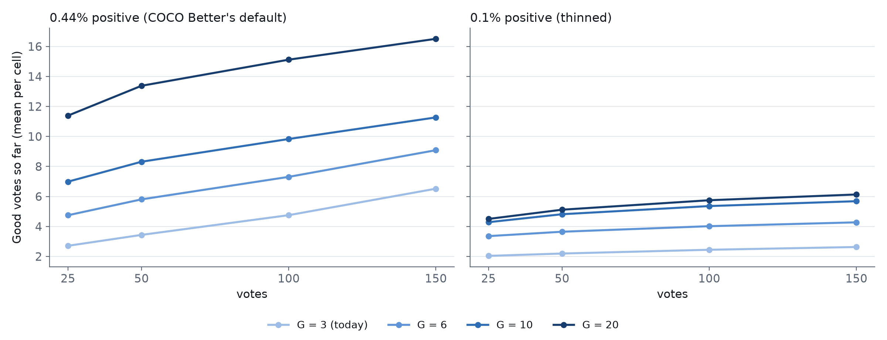
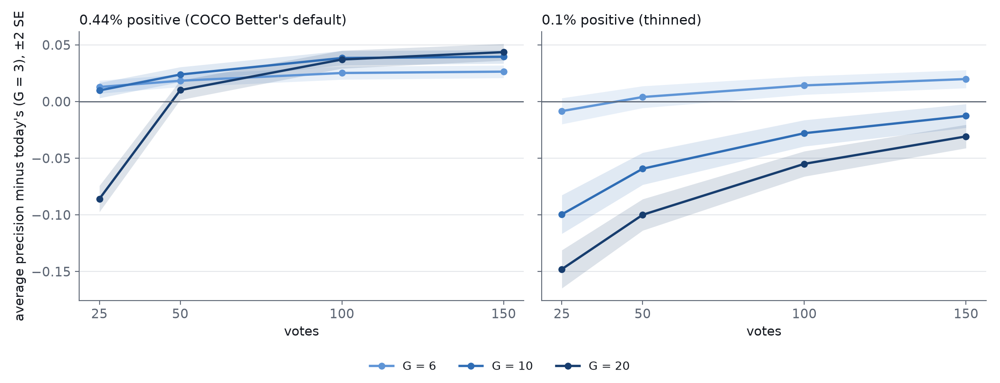

# Does staying in TextTop until G Goods help a low-prevalence session?

**Partly. A longer walk down the typed-query ranking mines more positives
wherever the corpus holds them, and a moderate one (G = 6) makes a better
detector in both pool settings tested. But no single G is right for both, and a
long walk (G ≥ 10) hurts whenever positives run out.**

- **0.1% positive (thinned; ~11 positives in a cell's ~11,000-image pool).**
  - Only G = 6 helps: average precision (AP) at vote 150 is **+0.020 ±
    0.004** over today's opening.
  - G = 10 and G = 20 never find their Goods, so they walk the text sort for
    all 150 votes and hand nothing to the learned phases. AP ends **−0.013**
    and **−0.031**, and sits −0.10 and −0.15 at vote 25.
  - No opening gives the #4220 precision estimator enough evidence. With about
    11 positives in the whole pool, calibration never holds the ~10 positives
    a promise needs: the best arm averages 4.3 at vote 150, and 1% of its
    cells pass the gate at all.
- **0.44% positive (COCO Better's default).**
  - Every G > 3 improves AP by vote 150: **+0.026** (G = 6), **+0.040**
    (G = 10), **+0.044** (G = 20).
  - G = 20 finds **13 Goods by vote 50** where today's opening finds 3.4, and
    puts **60%** of cells past the #4220 trust gate by vote 50, against 2%.
  - **But the promises it then makes are broken 51–71% of the time.** The #4220
    estimator assumes the app chose each voted item by the model's own score.
    The text walk chooses by the *text* score, which carries label information
    the model's score doesn't, and the estimate comes out too optimistic.

The decision rule fixed in #4222 names G = 20 at 0.44% and G = 3 at 0.1%.
They disagree, so by the plan's own clause **the recommendation is an adaptive
stop**, not a fixed G: walk the text sort until G Goods *or* until the walk
stops paying, then hand over. Until that's built and tested, **G = 6 is the
safe improvement**: it's the only arm better than today's opening in both
settings.

Plan: #4222, comment of 2026-09-28. The precision estimator and its gate come
from #4220 (PR #4225).

## What was run

- **Today's app** (#4184's r7: shipped cut, 70/30 split, acquisition offset)
  with one change: the opening's first round, `gG@top` — take the top of the
  typed-query sort until G Goods exist. Then, as today, the sort's midpoint
  until 4 Bads, then the learned phases.
  - G = 3 is today's opening, left unset so the control is the app itself.
  - G = 6, 10 and 20 are the arms.
  - Rounds have no click cap, so a G the corpus can't satisfy walks all session.
- **Two pool prevalences**, as scenarios. Neither is a claim about users' worlds.
  - **0.44%**: COCO Better's default pool.
  - **0.1%**: positives thinned across each cell before the split (the new
    `CALIB_TARGET_PREVALENCE`). This leaves about 23 positives per cell, 11 in
    the pool.
- **The grid:** 144 class@band cells × 5 seeds × 8 arms = 5,760 runs, 150 votes
  each, SigLIP, binary voting. #4220 precision frames were recorded at votes
  25/50/100/150. All 5,760 jobs completed.
- **Analysis:** `analyze_textgood_4222.py` (planted-answer test:
  `selftest_analyze_textgood_4222.py`, 8/8). Figures: `figure_textgood_4222.py`.

## Harvest: the walk finds what the corpus holds

| pool | G | Good votes at 25 / 50 / 150 | reached G by 150 | votes before the learned phases (median) |
|---|---|---|---|---|
| 0.1% | 3 (today) | 2.0 / 2.2 / 2.6 | 69% | 14 |
| 0.1% | 6 | 3.4 / 3.6 / 4.3 | 54% | 93 |
| 0.1% | 10 | 4.3 / 4.8 / 5.7 | 28% | 150 (never) |
| 0.1% | 20 | 4.5 / 5.1 / 6.1 | 0% | 150 (never) |
| 0.44% | 3 (today) | 2.7 / 3.4 / 6.5 | 90% | 7 |
| 0.44% | 6 | 4.7 / 5.8 / 9.1 | 83% | 10 |
| 0.44% | 10 | 7.0 / 8.3 / 11 | 74% | 15 |
| 0.44% | 20 | 11 / 13 / 17 | 59% | 53 |

At 0.1% the pool holds about 11 positives, and the text walk finds about half
of them whatever G is. Beyond G = 6 it just keeps walking past them.

## Detector quality: a moderate walk helps, a stuck one hurts

AP of the session's model, paired per cell against the same pool's G = 3 run
(720 pairs; ± is one SE):

| pool | G | AP change at vote 25 | at vote 50 | at vote 150 |
|---|---|---|---|---|
| 0.1% | 6 | −0.008 ± 0.006 | +0.004 ± 0.005 | **+0.020 ± 0.004** |
| 0.1% | 10 | −0.10 ± 0.009 | −0.059 ± 0.007 | −0.013 ± 0.005 |
| 0.1% | 20 | −0.15 ± 0.008 | −0.10 ± 0.007 | −0.031 ± 0.005 |
| 0.44% | 6 | +0.013 ± 0.003 | +0.018 ± 0.003 | **+0.026 ± 0.003** |
| 0.44% | 10 | +0.010 ± 0.003 | +0.024 ± 0.003 | **+0.040 ± 0.003** |
| 0.44% | 20 | −0.086 ± 0.006 | +0.010 ± 0.004 | **+0.044 ± 0.004** |

Today's opening ends at AP 0.35 (0.1%) and 0.45 (0.44%).

- **The positives help the model.** At 0.44% the text-walked positives pay
  for themselves by vote 50 even at G = 20.
- **A walk that never ends hurts it.** At 0.1%, G = 10 and G = 20 spend every
  vote on the text sort. The model gets no learned Hard negatives, and it's
  still behind at vote 150.

### Per band (AP change at vote 150; Good votes by vote 50)

| pool | G | large | medium | small |
|---|---|---|---|---|
| 0.1% | 6 | +0.037 (5.4 Goods) | +0.010 (3.7) | +0.007 (1.6) |
| 0.1% | 20 | −0.037 (8.1) | −0.035 (4.9) | −0.014 (2.2) |
| 0.44% | 6 | +0.035 (7.3) | +0.039 (6.6) | +0.003 (3.5) |
| 0.44% | 20 | +0.068 (20) | +0.059 (14) | −0.002 (6.0) |

**Small objects barely gain from any walk.** The typed-query sort is weak on
them: at 0.44%, G = 20 finds 6 Goods by vote 50 for small cells against 20 for
large ones.

## Trust: the gate opens, but the promise doesn't hold

Positives among the calibration votes (the #4220 gate is ≥ 10), and the #4220
estimator's gated promises at X = 50%:

| pool | G | calibration positives at 50 / 150 | past the gate by 50 | promises broken, of those made (vote 50 / 150) | cells with a kept promise at 150 |
|---|---|---|---|---|---|
| 0.1% | 3 | 1.8 / 2.0 | 0% | – | 0% |
| 0.1% | 20 | 3.8 / 4.3 | 1% | 100% / 67% (7 / 15 frames) | 0.3% |
| 0.44% | 3 | 2.4 / 4.1 | 2% | 17% / 2% | 8.5% |
| 0.44% | 6 | 3.9 / 5.6 | 4% | 22% / 4% | 9.1% |
| 0.44% | 10 | 5.5 / 7.0 | 7% | 33% / 17% | 8.3% |
| 0.44% | 20 | 8.8 / 10 | **60%** | **71% / 51%** | 26% |

- **At 0.1%**, a pool with 11 positives can't produce 10 calibration
  positives. This is a count problem as much as a prevalence problem: the
  corpus size is fixed near 11,000 here, and the same 0.1% in a corpus of a
  million images would hold a thousand positives. With ~4 positives, the
  honest answer is "not enough evidence yet".
- **At 0.44%, G = 20 reaches the gate but breaks the promise.** #4220 found the
  gated estimator broke 6% of promises on today's trajectory. Here, with the
  same gate, it breaks 51–71%.
  - The estimator fits P(positive | model score) on the voted items. Picking
    items by the model's score leaves that fit unbiased; picking them by the
    *text* score doesn't, because text rank carries label information the
    model's score lacks.
  - The text-walked positives are the easy ones, the top of the typed-query
    ranking, so the fitted curve thinks positives are easier to find than
    they are.
  - The gate counts evidence; it can't tell whether that evidence was drawn
    fairly.

## Literal examples

0.1% pool, G = 20, vote 150. Every one of these walked the text sort for all
150 votes:

| cell | seed | Good votes | AP (G = 20) | AP (today) |
|---|---|---|---|---|
| bottle@small | 2 | 1 | 0.00 | 0.00 |
| sink@large | 3 | 7 | 0.00 | 0.02 |
| skateboard@small | 0 | 17 | 0.15 | 0.32 |
| surfboard@large | 4 | 16 | **0.86** | 0.68 |

`skateboard@small` found 17 positives and still ended at half today's AP: every
vote came from the text sort, so the model never saw a learned Hard negative.
`surfboard@large` is the case the walk is for: a distinctive class the text
ranks well.

0.44% pool, G = 20, cells past the gate at vote 50: `tennis racket@medium`
(seed 1), `surfboard@large` (4), `baseball bat@small` (3) and
`motorcycle@large` (2). Each found 20 Goods in its first 24 votes and held 12
calibration positives, all from the top of the text ranking.

## Caveats

- **Corpus size is fixed** (~11,000 images per pool). The 0.1% setting
  therefore also means "about 11 positives exist". The two can't be separated
  here.
- **The rounds have no cap.** An arm that can't meet G walks all session. An
  adaptive stop (G or a falling Good rate) isn't expressible in today's
  opening grammar.
- **The FPR + FNR oracle moves the other way.** The best-cut cost at vote 150
  is +0.021 (0.44%, G = 20) and +0.027 to +0.086 (0.1%, G ≥ 6). Under the
  #4223 precision objective, the ranking (AP) is the relevant model measure;
  the oracle cost is reported in `quality_paired.csv`.
- **One dataset, one embedder:** COCO Better, SigLIP, binary voting.

## For the app, and what to build next

1. **Now:** raising today's Good target from 3 to 6 is the one change better
   in both settings (AP +0.026 and +0.020). It's small, safe, and one constant.
2. **#4222 next:** an **adaptive stop** for the text walk, "until G Goods or
   until the last k text picks yielded fewer than m Goods". It should capture
   G = 20's gain at 0.44% without G = 10/20's loss at 0.1%. It needs a stop
   condition the opening grammar doesn't have yet.
3. **#4221:** the precision estimator must **exclude text-walk votes**, or
   model their selection, before any promise rests on them. The gate alone
   doesn't make a promise safe once the opening changes.
4. **#4224:** at a few positives in the corpus, the control's honest state is
   "not enough evidence yet". The app should say so rather than promise.

## Files

| file | what |
|---|---|
| `harvest.csv` | per pool × G × vote: mean Good votes, share that reached G, median opening length |
| `trust_gate.csv` | mean calibration positives and share past the gate |
| `quality_paired.csv` | AP and oracle cost per arm, paired against G = 3, with SE |
| `promises_gated.csv`, `promises_kept.csv` | the #4220 estimator's gated promises at X = 25/50/75% |
| `verdict.json` | the fixed decision rule's output |
| `cells_harvest.csv`, `cells_quality.csv`, `cells_calpos.csv` | the per-cell rows behind the band table and the examples |

Raw cells and frames: `/expscratch/sgreenberg/textgood-4222/<pool>-g<G>/`
(`natural` is the 0.44% directory). Rebuild: `analyze_textgood_4222.py --base
/expscratch/sgreenberg/textgood-4222 --out … --jobs 16`, then
`figure_textgood_4222.py`.
