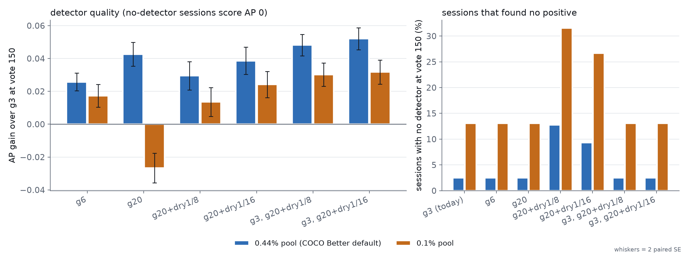
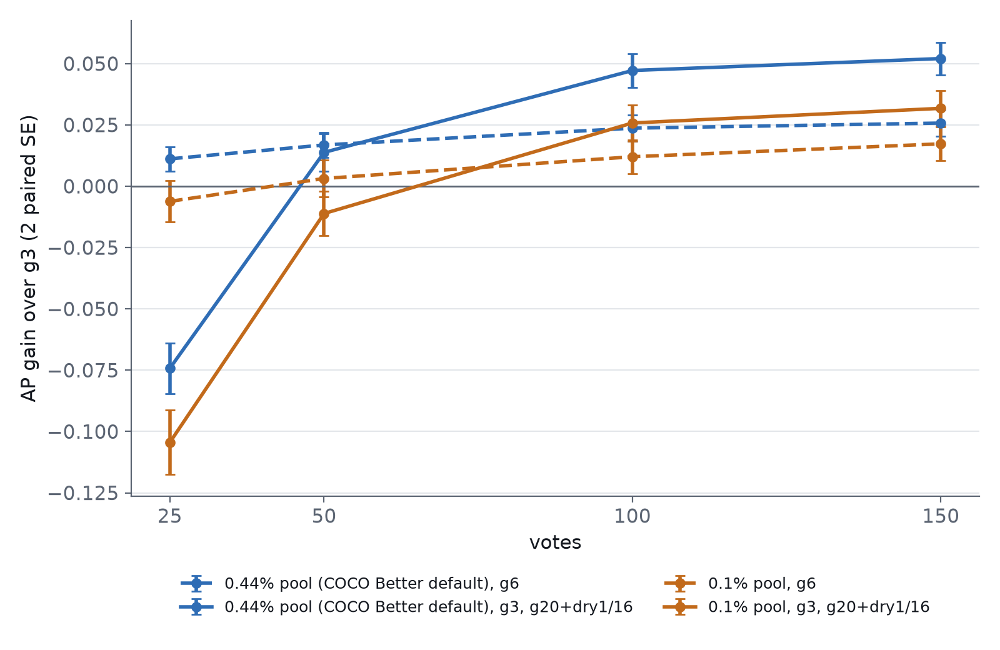

# Does a dry stop let the text opening walk longer, in both low pools?

**Yes, provided it never stops earlier than today's opening.** The winning opening is
`g3@top,g20+dry1/16@top,b4@mid`. It walks the text sort to 3 Goods exactly as the
app does, then keeps walking toward 20 until 16 picks in a row hold none. At vote 150
it raises average precision over today's `g3@top,b4@mid` by **+0.052 ± 0.003** at the
0.44% pool (COCO Better's default) and **+0.032 ± 0.004** at 0.1%. That is about twice
the best fixed target, g6 (+0.026 and +0.017). It leaves exactly as many sessions
without a detector as today: 2.5% and 13%.

The **bare** dry stop the #4222 report proposed (`g20+dry1/8@top`) is worse, because
it can quit *before* today's opening would. It fails 12.8% of sessions at 0.44% and
31% at 0.1% (today: 2.5% and 13%).

The floored walk has one cost. The session's detector is worse while the walk is still
running: −0.074 AP at vote 25 (0.44%) and −0.10 (0.1%). It pays that back by vote 50
at 0.44%, and between 50 and 100 at 0.1%.

Pools are scenarios, not claims about users. Part of #4222 (the adaptive stop its
report recommended); reads #4216's starved hunts too.

## What was run

- **Sessions.** Today's app on COCO Better (SigLIP, binary voting): 144 class@band
  cells × 5 seeds, 150 votes each. The only change is the opening, in #4254's grammar.
  There are two pools: 0.44% (COCO Better's default), and positives thinned to 0.1%
  (~11 in the pool per cell).
- **Arms.**
  - **Controls from #4222:** `g3` (today, the control), `g6` and `g20`. They were
    re-used after a one-seed check that current dev reproduces the g3 control.
    122 of 144 sessions matched pick for pick. The 22 that diverged did so at the
    same rate as two old g3 runs diverge from each other (18 of 144): ordinary run-to-run
    nondeterminism. The AP difference was −0.0007 ± 0.0010.
  - **Bare dry stops:** `g20+dry1/8@top,b4@mid` and `g20+dry1/16@top,b4@mid`
    (`g20d8`, `g20d16`).
  - **Floored dry stops:** `g3@top,g20+dry1/8@top,b4@mid` and
    `g3@top,g20+dry1/16@top,b4@mid` (`g3g20d8`, `g3g20d16`). Goods count globally, so
    the second round continues from the third Good. Its dry window counts only its
    own picks.
- **Decision rule, fixed on #4222 before any result.** Pick the arm with the largest
  mean paired AP gain over g3 at vote 150, averaged over the two pools. Only arms not
  below g3 by more than 2 paired SE in either pool are eligible. On a tie within one
  SE, take the simpler arm.
- **A session with no detector scores AP 0.** A session that finds no positive trains
  nothing and writes no AP row. The first analysis silently dropped those sessions, so
  the bare dry stops' gains were read only on the sessions where they succeeded. It
  reported +0.050 and +0.054 at 0.44%; counting every session gives +0.030 and +0.039.
  The rule is applied with every session counted. A random ranking would score about
  the prevalence (0.001–0.0044), so AP 0 is a fair floor.

## Results



Vote 150, all 720 cells per arm, paired against g3:

| opening | 0.44%: AP gain | 0.44%: no detector | 0.44%: Goods found | 0.1%: AP gain | 0.1%: no detector | 0.1%: Goods found | median opening, votes (0.44% / 0.1%) |
|---|---|---|---|---|---|---|---|
| g3 (today) | – (AP 0.43) | 2.5% | 6.5 | – (AP 0.31) | 13% | 2.6 | 7 / 14 |
| g6 | +0.026 ± 0.003 | 2.5% | 9.1 | +0.017 ± 0.003 | 13% | 4.3 | 10 / 93 |
| g20 | +0.043 ± 0.004 | 2.5% | 17 | **−0.027** ± 0.005 | 13% | 6.1 | 53 / 150 |
| g20+dry1/8 | +0.030 ± 0.004 | **13%** | 14 | +0.014 ± 0.004 | **32%** | 4.4 | 24 / 26 |
| g20+dry1/16 | +0.039 ± 0.004 | **9.3%** | 15 | +0.024 ± 0.004 | **27%** | 4.9 | 29 / 41 |
| g3, g20+dry1/8 | +0.048 ± 0.003 | 2.5% | 14 | +0.030 ± 0.004 | 13% | 5.0 | 28 / 33 |
| **g3, g20+dry1/16** | **+0.052 ± 0.003** | 2.5% | 15 | **+0.032 ± 0.004** | 13% | 5.3 | 39 / 50 |

± is one paired SE. **The rule picks `g3, g20+dry1/16`**: a mean gain of +0.042 ± 0.0025
across the pools. `g3, g20+dry1/8` scores +0.039 and misses the one-SE tie by
0.0002, so the two floored windows are effectively equal. The longer window walks
~10 votes longer and finds slightly more.

- **The floor is what makes the dry stop work.** A bare dry stop can hand over after
  its first empty window with 0–1 Goods, before today's opening would. Book@medium,
  seed 0:
  - `g20+dry1/8` quit at vote 16 with 1 Good; the learned sort found nothing more
    (AP 0.018);
  - g3 kept walking to vote 67 for its 3rd Good (AP 0.057);
  - the floored walk went on to vote 83 and 5 Goods (AP 0.039).

  At 0.44%, 92 bare `g20+dry1/8` sessions found no positive at all, against 18 for g3.
- **Where the walk pays, it pays a lot.** Dog@large seed 0: today stops at 3 Goods by
  vote 7 and ends at AP 0.55. The floored walk found 22 Goods by vote 31 and ends at
  0.94. Umbrella@large seed 3: 0.44 → 0.86.
- **Where it doesn't:**
  - Sink@medium seed 4: the walk ran dry at vote 48 with 7 Goods, and AP went
    0.44 → 0.26.
  - Keyboard@medium seed 4: the second round met 20 Goods but the session never handed
    over to a learned sort in 150 votes. AP went 0.57 → 0.39.
  - "Never handed over" is 12% of floored sessions at 0.44% (g3: 10%) and 32% at 0.1%
    (g3: 31%).
- **Oracle cost at vote 150** is 0.013 ± 0.002 lower (better) at 0.44% and flat at
  0.1% (+0.0025 ± 0.0018).

### The early cost



| votes | 0.44%: g6 | 0.44%: g3, g20+dry1/16 | 0.1%: g6 | 0.1%: g3, g20+dry1/16 |
|---|---|---|---|---|
| 25 | +0.011 | **−0.074** | −0.0062 | **−0.10** |
| 50 | +0.017 | +0.014 | +0.0032 | −0.011 |
| 100 | +0.024 | +0.047 | +0.012 | +0.026 |
| 150 | +0.026 | +0.052 | +0.017 | +0.032 |

While the walk runs, the session's detector is the one trained on its few text-found
votes, and it's worse than the learned sort's would be by then. A user who stops by
vote 25 is worse off; from vote 50 (0.44%) or ~75 (0.1%) on, they're better off.

## By object size (vote 150, `g3, g20+dry1/16`)

| band | 0.44%: AP gain | 0.1%: AP gain |
|---|---|---|
| large | +0.073 ± 0.006 | +0.064 ± 0.009 |
| medium | +0.071 ± 0.006 | +0.023 ± 0.005 |
| small | +0.010 ± 0.003 | +0.0061 ± 0.0026 |

Small objects barely move, which is the next point.

## #4216: the starved small hunts are not an opening problem

A hunt is **starved** if it found fewer than 3 positives in 150 votes. At 0.44% that is
70 cells (9.7%), 30% of `@small` cells. At 0.1% it is 31%, 70% of `@small`.

**All five openings that never quit early starve exactly the same cells,** in every
band. That includes g20, which walks the text sort for 53 votes, and g20 at 0.1%,
which walks it for all 150. The paired difference is 0 with SE 0.

Those cells are not short of positives: their test halves hold a median of 50, the same
as the cells that don't starve. Bench@small, spoon@small, laptop@small, person@small and
tv@small each starve on 4–5 of 5 seeds. Neither the text sort nor the learned sort
surfaces their positives within 150 votes, however the opening is arranged. That points
#4216 at the embedding of small objects (region voting, #4217), not at the opening.

## The precision floor under this opening

The merged floor (#4245) calibrates only on learned-sort votes, against the shipped
reference pool. With the floored dry stop (0.44%, X = 50%) it promises in **0.83%** of
frames, and 1 of 22 promises broke. Under today's g3 (#4256) it promised in 3.6%. With
all votes it would promise in 54% and break 68%.

So this opening makes the gated floor almost never promise. That is the coupling #4256
warned about, and one more reason for #4267's best-effort framing.

## What this means

- **Ship `g3@top,g20+dry1/16@top,b4@mid` as the opening,** subject to the owner's call
  on the early-session cost. It needs no new mechanism. The grammar (#4254) already
  expresses it, and the app's Autopilot runs the same rounds.
- **Don't ship a bare dry stop.** Any adaptive stop must be floored at today's walk.
- **Small objects need something other than the opening** (#4216 → #4217).

## Reproduce

```
# GRID (the #4222 launcher; arm names map to schedules, see its header)
VTS_REPO=<checkout> TEXTGOOD_BASE=<out> CALIB_MEM=2G \
  bash scripts/experiments/calibration/launch_textgood_4222.sh prepare natural-g3g20d16 ...
VTS_REPO=<checkout> TEXTGOOD_BASE=<out> CALIB_MEM=2G \
  bash scripts/experiments/calibration/launch_textgood_4222.sh arms natural-g3g20d16 ...
python scripts/experiments/calibration/analyze_drystop_4222.py \
  --arm 0.44%/g3=<textgood-4222>/natural-g3/results ... --arm 0.1%/g3g20d16=<out>/p0.001-g3g20d16/results --out <analysis>
python scripts/experiments/calibration/figure_drystop_4222.py
```

Arms are `<world>-g<G>`, `<world>-g<G>d<W>` (a bare dry stop) or `<world>-g<M>g<G>d<W>`
(floored at M Goods). The `natural` world is the launcher's historical name for the
0.44% pool. Planted-answer test: `selftest_analyze_drystop_4222.py` (12 checks,
including a no-detector session scored AP 0). The floor readout is
`analyze_provenance_4256.py` on the two floored 0.44% arms.

Files here:
- `opening.csv`, `harvest.csv`, `starved.csv`, `quality_paired.csv`, `verdict.json`: the tables above.
- `floor_summary.csv`: the floor readout.
- `order_quality_paired.csv`, `order_opening.csv`: the addendum's arms against g3.

## Addendum: today's two rounds first (#4282, run 2026-09-29)

Does the long walk's early cost come from training without the midpoint negatives
that `b4@mid` supplies, now that it runs last? The same opening with today's two rounds
first, `g3@top,b4@mid,g20+dry1/16@top`, was run in both pools (720 cells each, same
controls). The rule was fixed on #4282 before the run. Prefer the reordered opening if,
in both pools:
- (a) its vote-25 loss against g3 is at most half of `g3, g20+dry1/16`'s; and
- (b) its vote-150 AP is not below `g3, g20+dry1/16`'s by more than 2 paired SE.

Paired cell by cell against `g3, g20+dry1/16` (`order_quality_paired.csv` holds the
per-arm tables against g3):

| pool | vote 25 | vote 150 | vote-25 loss vs g3: floored → reordered |
|---|---|---|---|
| 0.44% | +0.038 ± 0.004 | −0.0011 ± 0.0007 | −0.074 → −0.036 (49% of the loss) |
| 0.1% | +0.037 ± 0.003 | −0.0015 ± 0.0007 | −0.10 → −0.067 (64%) |

**By the rule, keep `g3@top,g20+dry1/16@top,b4@mid`.** At 0.1%, (a) fails (64% > 50%)
and (b) fails narrowly (2.1 SE). The hypothesis is only half right: the early
negatives recover about half the early loss, not all of it.

**The trade is still the owner's to weigh.** The reordered opening gives back about
+0.04 AP at vote 25 for about −0.001 at vote 150. The two arms walk the same length
(median 40 and 51 votes), find the same Goods (15 and 5.3), and leave the same
sessions without a detector. If users often stop within the first 50 votes, the
reordered opening is the better product. The vote-150 rule doesn't see that. See #4282.
