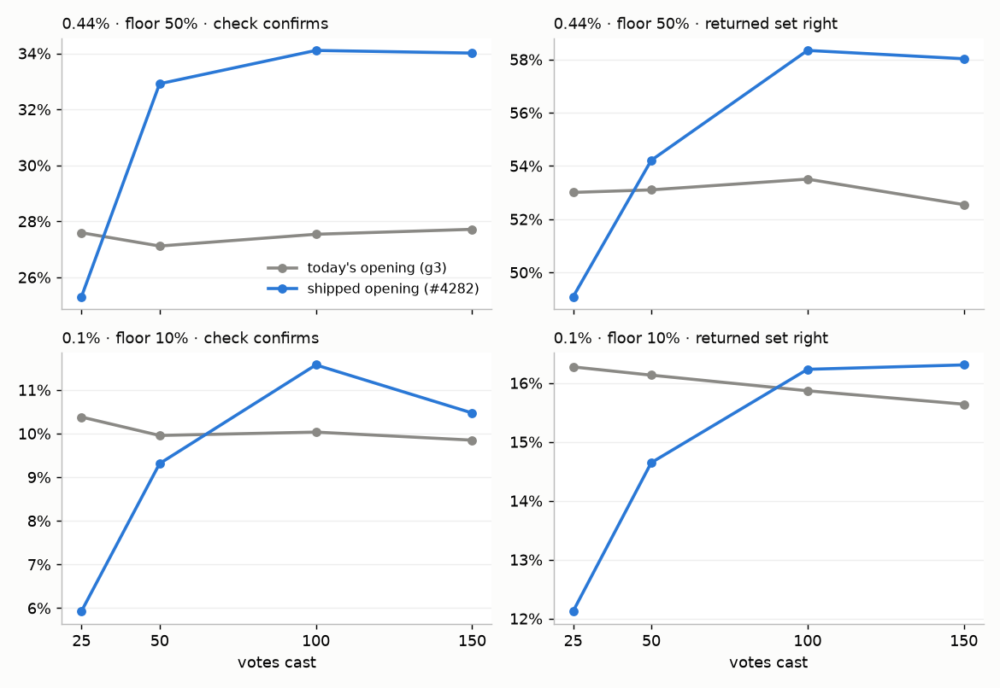

# Does the shipped opening change what the spot check returns?

**At 0.44%, yes, once the session is past ~50 votes. At 0.1%, no.** #4277 priced the
precision floor's spot check on rank frames from today's g3 opening. #4282 then shipped
`g3@top,b4@mid,g20+dry1/16@top`, which walks the text sort on toward 20 Goods, so a
session finds about twice as many positives by vote 150. This re-prices the same check,
with the same analyzer and seed, on frames from both openings over the same cells and
seeds.

At COCO Better's default pool (0.44%), after 150 votes:

- **At a 50% floor, the check confirms in 34% of sessions (today's opening: 28%).** The
  32 items it returns are **58%** right (53%), and they meet the floor in 58% of sessions
  (52%).
- **At a 10% floor, it confirms in 63% of sessions (58%).** It returns 55 items (53),
  43% right (40%). Recall rises from 0.44 to 0.49 of each class's test positives.
- **Before ~50 votes, the new opening is worse.** At vote 25 a 50% check confirms in 25%
  of sessions (28%), and its 32 items are 49% right (53%). This is the same early dip
  #4222 measured on AP: the long text walk hands over to the learned sort later.

At 0.1% the new opening finds twice the Goods (6.1 against 3.0 by vote 150), but the top of
the corpus's ranking is no cleaner: the top 32 is **17%** right (16%). A 50% floor still
never confirms (0.0% of sessions, both openings), and a 10% floor confirms in 10–11% of
sessions either way. The `@small` cells don't move at either pool, which matches #4216:
the positives are there, but neither sort surfaces them.



*The y-axes do not start at zero. Each point is the mean over 626–702 sessions × 20
simulated checks.*

Part of #4224; follows #4277 and #4282. Issue: #4287.

## What was run

- **Frames.** #4222 recorded precision frames (`CALIB_PFRAME_STEPS`, votes 25/50/100/150)
  for both openings on COCO Better, SigLIP, binary voting, 144 class@band cells × 5 seeds:
  - today's opening: `textgood-4222/{natural,p0.001}-g3`;
  - the shipped opening: `drystop-4222/{natural,p0.001}-g3b4g20d16`.
- **Export.** Both went through `export_rank_frames.py` at the same commit. Frame counts
  match exactly (0.44%: 2,662; 0.1%: 2,328), because the two openings starve the same
  sessions (#4222). So every comparison below pairs the same (class, seed, vote) frames,
  and no starvation difference is hiding in them.
- **Pricing.** `analyze_floor_candidate_4267.py`, unchanged, on each set: the
  #4267/#4277 schedule at 10/25/50/75/90%, α = 5%, 20 draws a frame, seed 4267. The
  #4222 grid has no 5% pool, so the analyzer's 5% input is the committed #4224 file in
  both runs, and it is left out here.
- **Check.** The same analyzer on the committed #4224 frames reproduces #4277's
  `best_attempt.csv` byte for byte.
- **The comparison.** `compare_floor_opening_4287.py` adds two things the per-arm
  output lacks:
  - absolute recall. `recall_share` divides by each arm's own oracle, and a better
    ranking raises the oracle too, so the ratio can hide a gain;
  - paired per-session differences, with SEs, for the quantities that don't depend
    on the simulated draws: the precision of the unchecked starting candidate and
    the oracle's recall at X.

## The check at vote 150

Old → new. "Returned right" is the mean precision of the set the line keeps. "Top K
right" is the unchecked starting candidate, which is what a headless run exports. Its
difference is paired on the same frames, with the SE in brackets.

| pool | X | check confirms | votes | returned | returned right | meets X | recall | top K right, Δ (paired) |
|---|---|---|---|---|---|---|---|---|
| 0.44% | 10% | 58% → 63% | 12 → 12 | 53 → 55 | 40% → 43% | 84% → 85% | 0.44 → 0.49 | +0.015 (0.0013) |
| 0.44% | 25% | 42% → 50% | 9.1 → 8.9 | 38 → 39 | 48% → 53% | 70% → 74% | 0.39 → 0.43 | +0.034 (0.0025) |
| 0.44% | 50% | 28% → 34% | 5 | 32 | 53% → 58% | 52% → 58% | 0.34 → 0.37 | +0.055 (0.0038) |
| 0.44% | 75% | 20% → 26% | 11 | 32 | 53% → 58% | 37% → 43% | 0.34 → 0.37 | +0.055 (0.0038) |
| 0.44% | 90% | 14% → 17% | 29 | 32 | 53% → 58% | 26% → 34% | 0.34 → 0.37 | +0.055 (0.0038) |
| 0.1% | 10% | 9.8% → 11% | 15 | 33 | 16% → 16% | 56% → 56% | 0.45 → 0.47 | +0.0008 (0.0003) |
| 0.1% | 25% | 0.9% → 0.8% | 10 | 32 | 16% → 17% | 33% → 35% | 0.45 → 0.47 | +0.0019 (0.0007) |
| 0.1% | 50% | 0.0% → 0.0% | 5 | 32 | 16% → 17% | 0.3% → 0.3% | 0.45 → 0.47 | +0.0068 (0.0015) |

Above 50% the candidate is the top 32 at every floor, so the returned set and its recall
are the same at 50%, 75% and 90%; only the check's pick count and how often it confirms
change. The likely range still contains the true precision in 99% of sessions under both
openings (`coverage_*` in `compare.csv`).

## By votes cast

X = 50% at 0.44%, X = 10% at 0.1% (the figure above). The top-K difference is paired.

| pool | X | votes | check confirms | returned right | top K right, Δ (paired) |
|---|---|---|---|---|---|
| 0.44% | 50% | 25 | 28% → 25% | 53% → 49% | −0.039 (0.0050) |
| 0.44% | 50% | 50 | 27% → 33% | 53% → 54% | +0.011 (0.0045) |
| 0.44% | 50% | 100 | 28% → 34% | 54% → 58% | +0.048 (0.0041) |
| 0.44% | 50% | 150 | 28% → 34% | 53% → 58% | +0.055 (0.0038) |
| 0.1% | 10% | 25 | 10% → 5.9% | 16% → 12% | −0.012 (0.0007) |
| 0.1% | 10% | 50 | 10% → 9.3% | 16% → 15% | −0.0053 (0.0005) |
| 0.1% | 10% | 100 | 10% → 12% | 16% → 16% | −0.0002 (0.0003) |
| 0.1% | 10% | 150 | 9.8% → 10% | 16% → 16% | +0.0008 (0.0003) |

## Literal examples

The top 32 of the test corpus at vote 150 and 0.44%, mean over 5 seeds (share right,
Goods found by then):

- **dog@medium:** 38% → **64%** right, with 4.4 → 20 Goods found. A 50% floor that
  was out of reach on average is now met.
- **umbrella@large:** 70% → **94%**, 3.6 → 21 Goods.
- **motorcycle@large:** 100% → 99%. It was already saturated, so more Goods change
  nothing.
- **scissors@medium:** 56% → 49%, 3.2 → 20 Goods. This is one of the 13% of classes that
  got worse (72% got better).
- **tv@small:** 5% → 5%, **bench@small:** 0% → 0%. Both starve the same way under either
  opening (1.4–1.8 Goods), so the check's short-case copy ("likely 11–73% right") is what
  these users will see.

## What it means for #4272 and #4273

- **At 0.44% the shipped opening makes the check a little better:** +6 points of
  confirms and +5 points of precision at 50%. No rule or copy needs to change. The
  #4277 numbers the issues quote are pooled over votes 25–150 under today's opening, so
  they now slightly understate a session past ~50 votes. The headless starting candidate
  at 0.44% and vote 150 is 24% right at 10% (22%) and 58% right at 50% (53%).
- **At 0.1% nothing changes.** The floor's weakness there is the count of positives in
  the corpus (#4224's 2026-09-28 comment), not the harvest, and a better opening can't
  fix it.
- **Early in a session the check is worse under the new opening.** A check run before
  ~50 votes returns a noisier top 32. This is not a reason to gate it: the range is
  honest either way (99% coverage at every vote count).
- **The closed loop is still unmeasured.** Check votes train the model, and that
  becomes testable once #4272's eval default arm exists.

## Files

- `compare.csv`: per pool × X × slice (all, t=150, band=small), both openings side by
  side, with the paired differences and their SEs.
- `best_attempt_g3.csv`, `best_attempt_shipped.csv`: the analyzer's `best_attempt.csv`
  for each opening.
- `rank_frames_{0p44,0p1}pct_{g3,shipped}.csv.gz`: the exported frames, in the #4224 schema
  ([README](../2026-09-28-rank-frames/README.md)). The g3 0.44% file comes from #4222's
  control, not #4220's r7 run that the committed file uses. They share the same opening
  and frame count.
- `check_by_votes.png`: the figure.

Reproduce, from `scripts/experiments/calibration/` (the export needs the GRID; the rest
runs anywhere from the committed frames):

```
python export_rank_frames.py --world 0.44%=…/natural-g3/results --world 0.1%=…/p0.001-g3/results --out G3 --jobs 32
python export_rank_frames.py --world 0.44%=…/natural-g3b4g20d16/results --world 0.1%=…/p0.001-g3b4g20d16/results --out SHIP --jobs 32
python analyze_floor_candidate_4267.py --frames G3 --out AN_G3      # each dir also needs the committed 5% file
python analyze_floor_candidate_4267.py --frames SHIP --out AN_SHIP
python compare_floor_opening_4287.py --old G3 --new SHIP --old-an AN_G3 --new-an AN_SHIP --out OUT
```

Set `OMP_NUM_THREADS=1` for the export. With BLAS threads on, 16 workers
oversubscribed a 16-core allocation and ran at a quarter of the speed.
