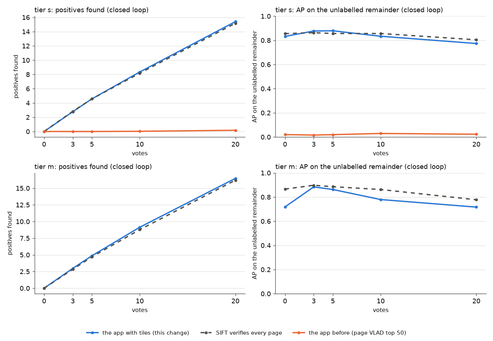
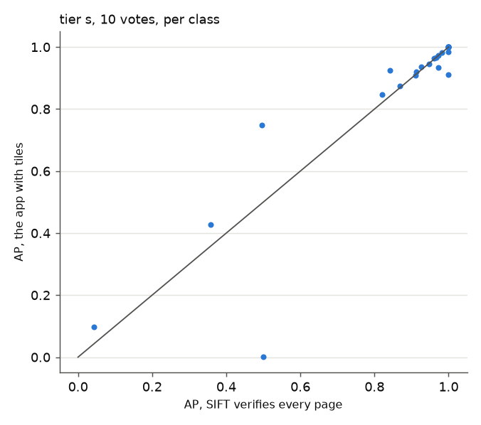

# The tiled Stage 1 in the app: end-to-end on FullMarks (#3928)

**Question.** #3928 built a Stage 1 that retrieves marks on document pages
(tiled VLAD) and priced it offline. Built into the app (PR #4378; the gates measured before the build are
[below](#the-gates-measured-before-the-build-m1m4)), does the app's own structural path
now find stamps and logos the way verifying every page does? At what cost per
vote?

**Answer: yes on finding, nearly on ranking.**

- **Tier `s` (5,000 pages):** replayed through the app's functions, the path
  matches verifying every page, class for class, at every vote count, for
  1.4 s a vote on a GPU. The path it replaces found almost nothing.
- **Tier `m` (50,000 pages):** it still finds as many positives as verifying
  every page, for 4.0 s a vote. It ranks the remainder 0.04–0.15 AP lower,
  where a large class outgrows the 1,000-page shortlist.

| closed loop, FullMarks v5.0 tier `s` (35 classes) | the app with tiles | SIFT verifies every page | the app before |
|---|---:|---:|---:|
| AP on the remainder, no votes (example sort) | 0.83 | 0.86 | 0.02 |
| AP, 10 votes | 0.87 | 0.87 | 0.04 |
| AP, 20 votes | 0.80 | 0.80 | 0.03 |
| positives found by 20 votes | **15.4** | 15.2 | 0.17 |

Paired against verifying every page: −0.02 [−0.07, +0.02] with no votes,
−0.01 [−0.05, +0.03] at 10 votes, −0.00 [−0.04, +0.05] at 20. **No
difference is resolvable.** Paired against the app before: +0.80
[+0.67, +0.91] at 10 votes.

**Tier `m` (50,000 pages): it finds as many, and ranks a little worse.**
There Stage 1 has to cut ~47,000 pages to 1,000:

| closed loop, tier `m` (36 classes) | the app with tiles | SIFT verifies every page* | paired difference |
|---|---:|---:|---|
| AP, no votes (example sort) | 0.72 | 0.87 | **−0.15** [−0.24, −0.06] |
| AP, 3 votes | 0.88 | 0.90 | −0.01 [−0.06, +0.04] |
| AP, 10 votes | 0.78 | 0.86 | **−0.08** [−0.17, −0.01] |
| AP, 20 votes | 0.74 | 0.78 | −0.04 [−0.11, +0.02] |
| positives found by 20 votes | **16.5** | 16.2 | |
| retrain, median (p90) | 4.0 s (4.6 s) | | |

\*approximate past the first votes (see Caveats). The app before this change
cannot be replayed at tier `m` (its matrix has no page vectors), but its tier-`s`
AP was 0.02–0.04.

- **Finding holds at scale:** the closed loop finds slightly more positives
  than verifying every page.
- **The ranking loses where Stage 1 cannot hold a class:** large classes
  whose members do not all fit in the 1,000-page shortlist (below).
- **Before the first vote**, the −0.15 is exactly what the offline eval
  priced for a 1,000-page shortlist at this size (0.72 against 0.87,
  2026-09-30 re-eval).



## What ran

`scripts/experiments/fullmarks/app_replay_tiled.py`. Every ranking comes from
the app's own functions, so this is the eval default arm for the path, by
delegation.

- **Media:** every tier page as a `sift_vlad_doc` media. SIFT runs at 8,192
  keypoints under the 2 MP cap, stored compact as the loader stores it.
  `tile_vectors` come from the cached projection, which
  `fit_tile_projection.py` fit on FullMarks v5.0 tier `s` (provenance:
  `measurements/tile_projection_v1.json`).
- **No votes:** `maybe_structural_rerank_example` with the class's query crop,
  which is example sort.
- **Each vote:** `maybe_structural_rerank` with the Goods so far as RegionYes
  (their largest FullMarks box), on a real `DetectorContext`. The
  verification cache carries across votes exactly as it does in the app.
- **Closed loop:** each vote labels the top unlabelled page of the current
  ranking from ground truth. The pools and positives are #4162's
  (`own_verified`).
- **Hardware:** an L40S and 16 CPUs, with K = 1,000 because CUDA is present.

**The comparison arms** come from #4162's template-matrix replay, on the same
pools, positives and 8,192-keypoint matches:

- `a1_max`: verify every page, max over templates;
- `a3s_production`: the app as shipped before this change, a page-VLAD SVM
  top 50 → SIFT.

## Cost

| per retrain, tier `s` | median | p90 | max |
|---|---:|---:|---:|
| a vote (cache warm) | 1.4 s | 1.6 s | 2.0 s |
| example sort (cold: crop against 1,000 pages) | 1.3 s | 1.6 s | 6.5 s |

- The cache holds ~1,000 fits per template (e.g. 3,253 after 3 votes on a
  logo class).
- Featuring and tiling the 4,999 pages took 6 min on 16 CPUs (SIFT
  dominates).
- In the app that is paid once at dataset load, like any structural dataset's
  local features.

## Per class



Most classes sit on the diagonal. The departures, all Tobacco800 logos or
StaVer/SPODS stamps:

| class | no votes: tiles / every page | 10 votes: tiles / every page | why |
|---|---|---|---|
| `tobacco800/logo_aah97e00-page02_1_0` | **0.42** / 0.99 | 0.98 / 1.00 | two crests, one mark (owner ruling 2026-09-17). The crop's tiles find one crest's pages; the first Goods bring the other |
| `tobacco800/logo_cgr96c00_1` | **0.34** / 0.79 | **0.00** / 0.50 | a 117-keypoint binarised crop that no tile vector describes. The #3928 cell found it at recall 0 too; tiles cannot fix it |
| `tobacco800/logo_ald41a00-ernest_1` | 0.77 / 0.95 | 0.93 / 0.97 | |
| `staver/stamp_stampds-00213_1` | **0.71** / 0.50 | 0.43 / 0.36 | a printed form box whose typed confusers match SIFT but not the tiles, so the shortlist keeps them out (as the 2026-09-18 cell found) |
| `spods/stamp_00612_1` | **0.70** / 0.54 | | the same effect |
| `tobacco800/logo_aeq93a00_1` | | **0.75** / 0.50 | the same effect, after votes |

- The one class that stays broken, `logo_cgr96c00_1`, is a query-crop problem.
  A better crop, or #3949's extra crops, is the lever.
- The two-crest class recovers with votes, which is the design working: each
  Good adds its own box as a query.

### Tier `m`: where it loses

| class | positives | no votes: tiles / every page | 10 votes: tiles / every page | why |
|---|---:|---|---|---|
| `tobacco800/logo_aah97e00-page02_1_0` | 354 | **0.13** / 0.97 | 0.75 / 1.00 | two crests; 354 members against a 1,000-page shortlist |
| `ucsf/logo_bat_leaf` | 200 | 0.33 / 0.82 | 0.65 / 0.96 | a large class; Stage-1 recall of its long tail |
| `tobacco800/logo_ald41a00-ernest_1` | 191 | 0.28 / 0.96 | | the same |
| `ucsf/logo_p_lorillard_crest` | 10 | 0.70 / | 0.04 / 1.00 | 9 of 10 found by 10 votes; **one** page left, ranked outside the shortlist |
| `ucsf/logo_bw_oval_emblem` | 16 | 0.19 / 0.88 | 0.00 / 0.55 | found 8 against 10 |
| `staver/stamp_stampds-00213_1` | 19 | **0.65** / 0.11 | **0.54** / 0.14 | the shortlist keeps typed confusers out (found 9 against 0) |

- **Two levers, neither built:**
  - a K that grows with the class once votes say it is large, so its members
    are still inside the shortlist;
  - moving the Stage-1 matmul to the GPU, which is also the 4.0 s per vote
    at 50,000 pages. Verification is ~1 s of it; the rest is scoring 2.8M
    tiles on the CPU.
- Both are follow-ups, not blockers. The tier-`s` result is exact, and at
  tier `m` the app now finds what exhaustive verification finds. At tier `s`
  the app before found 0.17 positives by 20 votes.

## Caveats

- **The comparison arms replay a template matrix; the app path runs live.**
  Both use the same 8,192-keypoint SIFT and pools. The matrix, though, is the
  #4162 build, with its own feature extraction run. Small per-page inlier
  differences are expected, and do not change a mean.
- **At tier `m` the #4162 matrix keeps templates only for positives in the
  exemplar's top 20.** Its closed-loop `a1_max` is therefore an approximation
  past the first few votes. It is the best exhaustive reference that exists at
  50,000 pages, where verifying every page per vote is the cost this stage
  exists to avoid.
- **One query crop per class** (#3949's extra crops are not in the roster
  yet).

## The gates measured before the build (M1–M4)

These were run on 2026-09-30, before #4378 was built, as the owner's
pre-registered gates. All four passed. Their run directory is
`/expscratch/sgreenberg/stage1-v50-3928/`, and their scripts are
`stage1_cell.py --from-compact / --fit-sources`, `stage1_votes.py` and
`bench_verify.py` in `scripts/experiments/fullmarks/`.

**Why Stage 1 was the limit.** FullMarks v5.0, 36 classes, mean AP:

| | tier `s` (5k pages) | tier `m` (50k pages) |
|---|---:|---:|
| SIFT verifies every page (8,192 keypoints) | 0.83 | 0.87 |
| **Tiled VLAD, 512 dims, top 1,000 → SIFT** | **0.80** | **0.72** |
| Tiled VLAD, 512 dims, top 500 → SIFT | 0.77 | 0.67 |
| Tiled VLAD alone | 0.47 | 0.38 |
| The app before, with 10 votes (page VLAD SVM, top 50 → SIFT) | 0.17 | — |

At tier `m` the top 1,000 keep 84% of verifying every page, from 2% of the
pages.

**M1, tiles from the stored features: PASS.** Tiles built from the compacted
features the app stores (fp16 keypoints, uint8 descriptors) rank like the
float extraction: tier `s`, K = 1,000, mean AP 0.798 against 0.799 (mean
paired difference −0.001, largest single-class gap 0.03).

**M2, does a projection transfer: PASS, with a rule for the fit.** Each
projection was fit on some sources only, and scored against the all-source
fit (tier `s`, paired over classes, 95% intervals):

| projection fit on | unseen sources, K = 1,000 | own sources, K = 1,000 | own sources, Stage 1 alone |
|---|---:|---:|---:|
| SPODS + StaVer | +0.03 [−0.02, +0.11] | −0.02 [−0.04, +0.01] | **−0.17** [−0.25, −0.10] |
| Tobacco800 + UCSF | +0.00 [−0.01, +0.01] | −0.02 [−0.07, +0.06] | −0.02 [−0.06, +0.01] |

Transfer holds. What hurts is fitting on pages dense with the marks being
searched: whitening flattens the directions those repeated marks occupy. So
the cached asset is fit on mark-sparse pages, FullMarks' distractor-dominated
all-source tier `s` (`fit_tile_projection.py`).

**M3, queries from votes: max over queries wins; an SVM over tiles loses.**
The shared vote sequence (#4162), 10 votes, scored on the unlabelled
remainder:

| 10 votes | Stage 1, `s` | → SIFT K = 1,000, `s` | Stage 1, `m` | → SIFT K = 1,000, `m` | → SIFT K = 500, `m` |
|---|---:|---:|---:|---:|---:|
| crop only | 0.38 | 0.82 | 0.28 | 0.66 | 0.60 |
| **max over crop + Good boxes** | **0.68** | **0.87** | **0.59** | **0.84** | **0.79** |
| SVM over tile rows (Bads flood) | 0.49 | 0.86 | 0.38 | 0.73 | 0.68 |

At tier `m`, max over queries beats the SVM by 0.11 [0.05, 0.18] through the
pipeline, and reaches 97% of verifying every page (0.84 against 0.87). The
vote sequence comes from the exhaustive ranking, which flatters Stage 1, but
the comparison between arms is fair.

**M4, verification cost: PASS on a GPU.** `verify_many`, one template against
1,000 pages at 8,192 keypoints:

| | L40S + 8 CPUs | 8 CPUs, no GPU |
|---|---:|---:|
| median Good-box template (138–485 keypoints) | **0.85 s** | 5.9 s |
| query crop (1,209 keypoints) | 1.3 s | 20 s |

The batched ratio test is nearly all of it. With the verification cache a
vote costs ~1 s on a GPU, and a CPU-only deployment verifies a shorter
shortlist (`TILED_TOP_K_CPU`).

## Reproduce

```bash
source scripts/experiments/pile/pile_env.sh   # the cached projection lives in the pile's models dir
python scripts/experiments/fullmarks/fit_tile_projection.py --tier s     # once; writes the cached asset
python scripts/experiments/fullmarks/app_replay_tiled.py --tier s \
    --matrix /expscratch/$USER/fullmarks/votes-4162/matrix-s --out <dir>/replay-s --workers 16
python docs/experiments/2026-09-30-fullmarks-tiled-stage1-app-3928/figures.py
```

`measurements/` also holds the gate measurements summarised below: M1 (`eval-m1-*`),
M2 (`eval-m2-*`), M3 (`m3-*`), M4 (`m4-*.json`) and the asset pricing
(`eval-v1asset.csv`).
