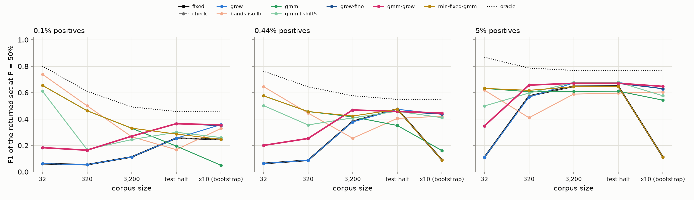
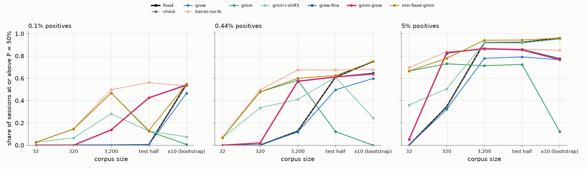
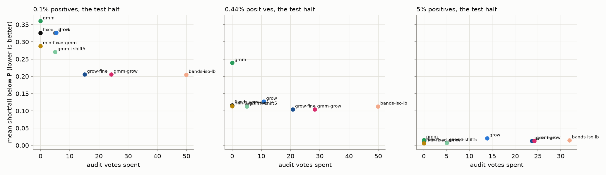
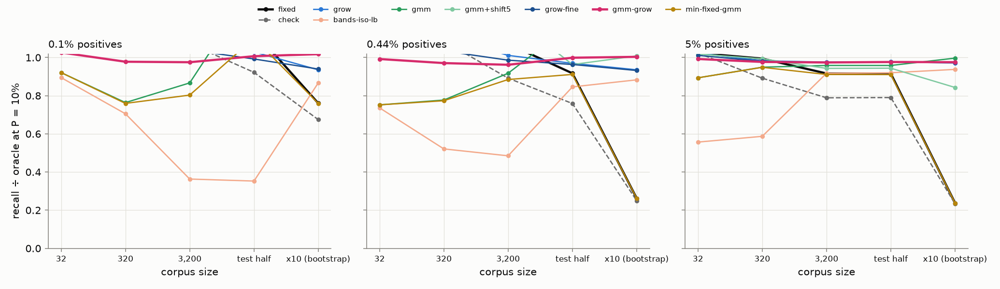

# Where should the precision floor's line go on a corpus of any size?

**Today's line is a fixed count, and it is right on exactly one corpus: the one it
was priced on.** At P = 50% the app keeps the top 32 unvoted items, whatever the
corpus holds (#4272). On COCO Better's 11k-image test half at 0.44% positives,
where every floor study so far was read, that top 32 is 61% right with an F1 of
0.48 against a best possible 0.55, and nothing here beats it there. On the same
detectors read against a corpus ten times larger, the top 32 keeps 5% of the
positives and F1 falls to **0.09**. On a 320-item corpus it returns all 32 at
4% right. At 5% positives the fixed count leaves half the recall on the table on
a 1,000-image corpus, and 94% of it on a 10,000-image one.

**A band walk with a few audit votes tracks the corpus at every size.** The
rule: audit 5 uniform picks in each rank band (the top 8, the next 8, the next
16, 32, 64, ... to the corpus's end), start at today's count, walk one band
deeper while the band-weighted share of right answers is at or above P and one
band shallower while it is not, and keep the deepest band that met P. It costs
**15–25 votes** on corpora up to ~10k items and about 40 on 100k. Against the
fixed count, its F1 is −0.02 on the one corpus the fixed count was tuned for and
**+0.09 to +0.52** everywhere else, with a shortfall below P that is the same or
smaller; its own reading of the returned set is within 0.05–0.08 of the truth.

**The owner's partially-labelled mixture is not the line, but it is the best
zero-vote guess on small corpora and at 5%.** The vote-anchored 2-component fit
on the corpus's scores sizes the set correctly where the positives form a
component: at 5% (76 kept against the oracle's 81 on 1,000 images), and on a
320-image corpus with 1–2 positives at 0.44% (2.9 kept against 1.9, F1 0.46
where the fixed count scores 0.09). Where they do not, it over-returns by **5×
to 66×**: 238 items on the 11k test half at 0.44% (the oracle keeps 52), 7,300
on the ×10 corpus, 6,100 on the ×10 corpus at 0.1%. That is #4201's failure, and
it grows with the corpus, because the mixture's high component holds a share of
the *mass*, not a count. Five audit picks from the top band recalibrate its
level but not its tail: `gmm+shift5` is the best rule at 5% (F1 0.68, 5 votes)
and returns 570–1,300 items on 3,200-image or 0.1% corpora. Seeding the band
walk with the mixture's proposal lands on the same band as starting from
today's count; it only moves the vote cost, down on small corpora and up on
large sparse ones.

Part of #4383. Data: the #4220 precision frames of the default arm at 0.1%,
0.44% and 5% positives (720 cells each), read at clicks 50 and 150, no new runs.
Harness: `scripts/experiments/calibration/analyze_line_estimate_4383.py`
(selftest: `selftest_analyze_line_estimate_4383.py`, 6 planted-answer checks).

## What was run

- **Corpora.** Each cell's test half (the corpus Find and a headless run
  return, ~11.3k images, ~50 positives at 0.44%, ~11 at 0.1%; thinned to 5% for
  the 5% arm, ~1,000 images) is resampled at its own prevalence to **32, 320
  and 3,200 items, the whole half, and a ×10 bootstrap** of it (113k images,
  ~500 positives; a resample with duplicates, so its rankings tie and its
  recall is flattered a little). Two draws per cell.
- **What a rule may see.** The corpus's unlabeled scores from the final model;
  the session's votes (Autopilot's picks, a biased sample: #4221, #4256); and
  audit picks drawn uniformly within a rank band, whose labels are unbiased by
  construction (#4257). Every rule returns at least one item (best effort, the
  owner's #4267 framing) and its own estimate of the returned set's precision.
- **Rules.** `fixed`, today's unchecked count (128 at 10%, 32 at 50% and 90%);
  `check`, today's spot check on this corpus (halve on failure, down to 32);
  `grow` (bands from 32) and **`grow-fine`** (bands from 8), the band walk
  above; `gmm`, the vote-anchored mixture's posterior read at the deepest k
  whose mean is at or above P; `gmm+shift5` / `gmm+shift`, that posterior with
  one logit offset fitted on 5 top-band audits or on every band's; **`gmm-grow`**,
  the fine band walk started at the mixture's proposal; `post` and
  `post+shift*`, the shipped #4220 estimator's shape with the same offsets;
  `bands-iso` / `-lb`, a monotone curve on every band's audits. `summary.csv`
  has all twelve; the tables below show the ones that matter.
- **Scored on** the returned set's precision, the share of sessions at or above
  P (`meets`), the mean shortfall max(0, P − precision), recall against the
  oracle's (the deepest cut at precision ≥ P), F1 against the best F1 any cut
  reaches, the audit votes spent, and `est_gap`, how far the rule's own estimate
  of its set's precision is from the truth. Cluster (category, seed) standard
  errors; paired differences against the fixed count in `paired_vs_fixed.csv`.

## The line at P = 50%, click 150

F1 of the returned set (the share right, in parentheses). The oracle is the best
cut of the same ranking.

| corpus | positives | oracle keeps | **fixed** (32) | **grow-fine** | **gmm** | **gmm+shift5** | best F1 |
|---|---:|---:|---|---|---|---|---:|
| 0.44%, 320 | 1.5 | 1.9 | 0.09 (4%) | 0.25 (13%) | **0.46** (39%) | 0.36 (24%) | 0.64 |
| 0.44%, 3,200 | 15 | 16 | 0.38 (28%) | **0.47** (46%) | 0.42 (46%) | 0.41 (37%) | 0.58 |
| 0.44%, test half (11k) | 50 | 52 | **0.48** (61%) | 0.46 (50%) | 0.35 (27%) | 0.46 (46%) | 0.55 |
| 0.44%, ×10 (113k) | 497 | 514 | 0.09 (74%) | **0.44** (52%) | 0.16 (10%) | 0.41 (36%) | 0.55 |
| 5%, 320 | 16 | 26 | 0.57 (44%) | **0.66** (61%) | 0.61 (54%) | 0.60 (48%) | 0.79 |
| 5%, 1,000 | 50 | 81 | 0.65 (83%) | 0.67 (65%) | 0.61 (52%) | **0.68** (69%) | 0.77 |
| 5%, ×10 (10k) | 501 | 809 | 0.11 (93%) | **0.63** (63%) | 0.54 (40%) | 0.58 (72%) | 0.77 |
| 0.1%, test half (11k) | 11 | 9 | 0.26 (17%) | **0.37** (35%) | 0.20 (17%) | 0.30 (24%) | 0.46 |
| 0.1%, ×10 (113k) | 112 | 92 | 0.25 (55%) | **0.35** (41%) | 0.05 (3%) | 0.26 (20%) | 0.46 |

Paired against the fixed count on the same corpus draws (F1, ± cluster SE):

| corpus | grow-fine | gmm | gmm+shift5 |
|---|---:|---:|---:|
| 0.44%, 320 | +0.16 ± 0.01 | +0.37 ± 0.01 | +0.27 ± 0.01 |
| 0.44%, 3,200 | +0.088 ± 0.004 | +0.035 ± 0.005 | +0.027 ± 0.004 |
| 0.44%, test half | **−0.019 ± 0.003** | −0.125 ± 0.005 | −0.017 ± 0.002 |
| 0.44%, ×10 | +0.35 ± 0.01 | +0.071 ± 0.004 | +0.32 ± 0.01 |
| 5%, 320 | +0.084 ± 0.004 | +0.032 ± 0.003 | +0.023 ± 0.002 |
| 5%, 1,000 | +0.020 ± 0.003 | −0.038 ± 0.003 | +0.030 ± 0.002 |
| 5%, ×10 | +0.52 ± 0.01 | +0.43 ± 0.00 | +0.46 ± 0.01 |
| 0.1%, test half | +0.11 ± 0.01 | −0.06 ± 0.01 | +0.045 ± 0.004 |
| 0.1%, ×10 | +0.10 ± 0.01 | −0.20 ± 0.01 | +0.014 ± 0.005 |

- **The fixed count wins on one row**, the 11k test half at 0.44%, by 0.02.
  That is the corpus every prior pricing used (#4257, #4277, #4287), where the
  oracle happens to keep ~52 items and 32 is close.
- **The band walk tracks the oracle's count** at every size: 15 against 16 on
  3,200 images at 0.44%, 42 against 52 on the test half, 388 against 514 on
  the ×10 corpus, 59 against 81 at 5%, 615 against 809 on the ×10 5% corpus,
  11 against 9 at 0.1%.
- **Its precision lands near P by construction** (46–65% at P = 50%), because
  it reads a point estimate at the crossing. It meets P in 57–65% of sessions
  at 0.44% and 0.1%, where the fixed count meets it in 0–75%, and in 77–87% at
  5% (fixed: 35–96%). Its shortfall is the same or smaller than the fixed
  count's on every row except the two ×10 rows (+0.01 to +0.02).

- **The mixture's own estimate is wrong where it over-returns.** Its
  `est_gap` is 0.25 on the test half at 0.44%, 0.41 on the ×10 corpus and 0.47
  at 0.1% ×10; the band walk's is 0.05–0.08 everywhere. The mixture believes
  its 238 items are 50% right; they are 27%.
- **Five audits fix the mixture's level, not its tail.** `gmm+shift5` matches
  the band walk on the two corpora where the mixture's shape is right (the
  test half at 0.44%, 1,000 images at 5%) for 5 votes instead of 20–25, and
  returns 573 items on 3,200 images at 0.44%, 574 on the 0.1% test half and
  1,300 on its ×10 corpus.
- **The rest.** `bands-iso-lb` (a monotone curve on every band's audits, 25–65
  votes) is never the best and often far worse; `post` (the shipped #4220
  estimator's shape) is the worst rule everywhere, with or without audits.
  `min-fixed-gmm`, the no-vote line, is [below](#the-line-with-no-votes-the-smaller-of-todays-count-and-the-mixtures-4389).

## The line at P = 10%

Here the objective is recall at ≥ 10% right, and a fixed 128 caps it.

| corpus | oracle keeps | fixed (128): recall ÷ oracle, meets | grow-fine | gmm | gmm+shift5 |
|---|---:|---|---|---|---|
| 0.44%, test half | 344 | 0.92, 81% | 0.96 (278 kept), 65%, 34 votes | 1.17 (1,151 kept, 7% right), 19% | 0.96 (424), 80%, 5 votes |
| 0.44%, ×10 | 3,417 | **0.26**, 88% | 0.93 (2,524), 79%, 47 votes | 1.37 (40,186 kept, 2% right), 0% | 1.01 (3,980), 49%, 5 votes |
| 5%, 1,000 | 488 | 0.92, 100% | 0.98 (379), 74%, 37 votes | 0.96 (383, 14% right), 89%, 0 votes | 0.94 (266), 99%, 5 votes |
| 5%, ×10 | 4,898 | **0.24**, 100% | 0.97 (3,696), 94% | 1.00 (5,620), 28% | 0.84 (2,309), 99% |
| 0.1%, test half | 61 | 1.14 (128 kept, 5% right), 11% | 0.99 (58), 51% | 1.38 (1,004), 14% | 1.18 (1,127), 16% |

(A ratio above 1 means the rule kept more positives than the oracle by returning
a set that is *below* P; read it with the `meets` share beside it.)

At 10% the mixture's over-return matters less, because the floor is low: at 5%
it keeps the right count for 0 votes. At 0.44% and below it still returns 3–12×
the oracle's set. The 0.1% half holds 11 positives, so no rule meets 10% in
more than half the sessions.

## The line at P = 90%

Mostly unreachable. On the 0.44% test half the oracle keeps 21 items, and the
best any rule meets 90% is 43% of sessions (`grow-fine`, 20 kept, 69% right,
17 votes; the fixed 32 is 61% right and meets it in 37%). At 5% on 1,000
images the oracle keeps 31; `grow-fine` keeps 27 at 87% right, `gmm+shift5` 23
at 88%, the fixed 32 is 83%. The mixture alone keeps 111 (45% right) at 0.44%
and 41 (79%) at 5%. Without a check the app keeps the same 32 at 90% as at 50%;
the walk at least shrinks.

## Early in the session (click 50)

The same ordering, one notch worse. On the 0.44% test half the fixed count's F1
is 0.43 and the walk's 0.41 (20 votes); on the ×10 corpus 0.08 against 0.39. At
5% on 1,000 images: 0.60, 0.61 (walk, 23 votes) and 0.61 (`gmm+shift5`, 5
votes). The mixture alone returns 1,109 items on the 0.44% test half at click 50
(10% right) and 24,000 on the ×10 corpus.

## Literal sessions (seed 0, click 150, P = 50%)

| session | corpus | positives | oracle keeps | fixed | grow-fine / gmm-grow | gmm | gmm+shift5 |
|---|---|---:|---:|---|---|---|---|
| airplane@large, 0.44% | 320 | 2 | 4 | 32, 6% right | 8, 25% | **5, 40%** | 6, 33% |
| | test half | 44 | 86 | 32, 100%, recall 0.73 | 64, 67%, recall 0.98 (15 votes) | 97, 44% | 79, 54% |
| | ×10 | 450 | 880 | 32, recall **0.07** | 512, 86%, recall 0.98, F1 0.91 (50 votes) | 2,443, 18% | 964, 46% |
| toothbrush@medium, 0.44% | test half | 50 | 60 | 32, 78%, F1 0.61 | 32, 78% (25 votes) | 78, 42% | 34, 74% |
| | ×10 | 501 | 612 | 32, recall 0.06 | 512, 58%, F1 0.58 (55 votes) | 4,723, 9% | 548, 54% |
| tv@small, 0.44% | test half | 37 | 0 (no cut reaches 50%) | 32, 6% | 8, 12% | 405, 2% | 5, 20% |
| dog@large, 5% | 1,000 | 45 | 90 | 32, 100%, recall 0.71 | 64, 70%, recall 1.0 | 90, 50% | 66, 68% |
| | ×10 | 464 | 928 | 32, recall 0.07 | 512, 88%, F1 0.93 (40 votes) | 894, 52% | 726, 64% |
| airplane@medium, 0.1% | test half | 8 | 16 | 32, 25% | 16, 50% (15 votes) | **14, 57%** | 15, 53% |
| | ×10 | 69 | 138 | 32, recall 0.46 | 128, 54%, recall 1.0 | 1,678, 4% | 165, 42% |

A weak class (tv@small) is where every rule fails together: the mixture believes
its 405 items are 50% right, the walk keeps its smallest band at 12%, and the
fixed count keeps 32 at 6%. No cut of that ranking reaches 50%.

## The line with no votes: the smaller of today's count and the mixture's (#4389)

AutoRun, the CLI, a cold Find and every session before its first check draw
the line with no audit votes. The owner ruled (2026-09-30) that this line is
**the smaller of today's count and the vote-anchored mixture's crossing**, to
be priced first. Rule `min-fixed-gmm` below (a third run of the same harness,
`provenance.json`; the other rules' rows are unchanged).

F1 of the returned set at P = 50% (the share right), click 150:

| corpus | positives | **fixed** | **gmm** | **min** | min − fixed (F1 ± SE) | min − fixed (shortfall) |
|---|---:|---|---|---|---:|---:|
| 0.44%, 32 | 0.1 | 0.06 (0%) | 0.58 (6%) | **0.58** (6%) | | |
| 0.44%, 320 | 1.5 | 0.09 (4%) | 0.46 (39%) | **0.46** (39%) | | |
| 0.44%, 3,200 | 15 | 0.38 (28%) | 0.42 (46%) | **0.42** (47%) | +0.041 ± 0.005 | −0.091 ± 0.004 |
| 0.44%, test half | 50 | **0.48** (61%) | 0.35 (27%) | 0.47 (62%) | −0.003 ± 0.001 | −0.003 ± 0.001 |
| 0.44%, ×10 | 497 | 0.09 (74%) | 0.16 (10%) | 0.09 (74%) | 0 | 0 |
| 5%, 320 | 16 | 0.57 (44%) | 0.61 (54%) | **0.62** (55%) | +0.043 ± 0.003 | −0.064 ± 0.002 |
| 5%, 1,000 | 50 | **0.65** (83%) | 0.61 (52%) | 0.65 (84%) | −0.003 ± 0.001 | −0.002 ± 0.001 |
| 5%, ×10 | 501 | 0.11 (93%) | 0.54 (40%) | 0.11 (93%) | 0 | 0 |
| 0.1%, test half | 11 | 0.26 (17%) | 0.20 (17%) | **0.29** (24%) | +0.031 ± 0.004 | −0.038 ± 0.004 |
| 0.1%, ×10 | 112 | 0.25 (55%) | 0.05 (3%) | 0.25 (55%) | 0 | 0 |

- **It is never worse than today's count on the shortfall below P**, at any
  size, prevalence or floor: every paired difference is at or below zero
  (`paired_vs_fixed.csv`). Where the mixture is right-sized (small corpora,
  5%) the shortfall falls by 0.06–0.09; where the mixture over-returns, the
  count caps it and nothing changes.
- **On F1 it is never worse beyond noise at P = 50% and 10%** (−0.003 ± 0.001
  on the bench corpus, 0 on the ×10 ones) and better by 0.03–0.12 on small and
  sparse corpora, where today's count returns everything.
- **At P = 90% it gives up a little recall for a better-kept promise** on the
  5% corpora: 29 kept instead of 32, 85% right instead of 83%, meets P in 55%
  of sessions instead of 54%, F1 −0.021 ± 0.002. That is the trade the
  objective asks for.
- It takes nothing from the band walk: the walk starts at this count.

## What the band walk costs

Median audit votes (90th percentile) at P = 50%, click 150:

| corpus size | 0.1% | 0.44% | 5% |
|---|---:|---:|---:|
| 32–3,200 | 15 (15) | 15 (15–20) | 15–25 (20–25) |
| the test half (~1k at 5%, ~11k otherwise) | 15 (15) | 20 (25) | 25 (25) |
| ×10 | 20 (30) | 40 (45) | 40 (45) |

Starting the walk at the mixture's proposal instead of today's count
(`gmm-grow`) reaches the same band and the same F1 within 0.01 on every row,
for fewer votes on small corpora (5 instead of 15 on 320 images) and more on
large sparse ones (55 instead of 32 on the 0.44% ×10 corpus, where the mixture
starts far too deep).

## What this says for the app

1. **Replace the fixed count with the band walk.** The spot check already draws
   uniform picks from a candidate and halves it on failure (#4272). The change
   is that a passing round *grows* the candidate to the next band, a failing
   one shrinks it, the bands go down to 8, and the walk stops at the deepest
   band that met P. The line then follows the corpus: 8 items on a sparse
   320-image Find set, ~40 on the 11k bench, ~400 on a 100k corpus.
2. **The mixture cannot draw the line on its own**, and five audits do not
   repair it on the corpora where it is wrong. It is the best guess *before any
   vote* on small corpora and at moderate prevalence, and the worst on large
   sparse ones. A headless run (AutoRun, CLI, cold Find) has to pick between
   today's count (right on an 11k corpus at 0.44%) and the mixture (right on a
   320-image one, or at 5%). The obvious untested rule is the smaller of the
   two.
3. **The walk's own reading is honest** (within 0.05–0.08 of the truth), so
   the control can show it, where the mixture's is off by 0.25–0.47 exactly
   where it over-returns.

### Questions for the owner

1. Adopt the band walk, in both directions and down to 8, as the check that
   draws the line in Find and Train?
2. Is 15–25 votes on a bench-sized corpus (40 on a 100k one) an acceptable
   price? A cheaper walk (fewer bands, 3 picks a band) is unpriced.
3. What draws the line with no votes: today's count, the mixture, or the
   smaller of the two?

## Caveats

- The ×10 corpus is a bootstrap resample of the test half: duplicate items tie
  in the ranking and share a label, which makes every rule's recall a little
  easier than on a real corpus of that size. The ordering of the rules does not
  depend on it: the fixed count's collapse is arithmetic (32 of 500 positives).
- The test half stands in for a Find corpus. The Train-time check reads the
  session's own unvoted pool instead, which is a different question (#4358).
- The band walk reads a point estimate, so it meets P in about 60% of sessions
  at 0.44%. A lower-bound variant (`grow-lb`) meets it as often as the fixed
  count and recovers less; the owner's "do your best" ruling (#4267) is what
  this report scores.
- Sessions are the default arm's at clicks 50 and 150, one seed each per cell
  at 0.44% and 0.1% (five at 5%); the 5% arm's test half was thinned to 5% as
  #4220 did.
- `check` here is today's rule on a fresh corpus: with the top 32 mostly above
  P, its 5 picks pass and it keeps 32, so it equals the fixed count in every
  table.

## Files

- `summary.csv`: every rule × world × click × size × floor, with cluster SEs.
- `paired_vs_fixed.csv`: each rule minus the fixed count on the same corpus draw.
- `provenance.json`: the input cell directories and their fingerprints.
- `figures/`: F1, meets-P and recall ÷ oracle against corpus size at P = 50% and
  10%; shortfall against votes on the test half.
- `examples.py`: the literal-session table from the per-row output.
- Rows: `/expscratch/sgreenberg/line-4383/full/rows.csv.gz` (1.7M rows).
