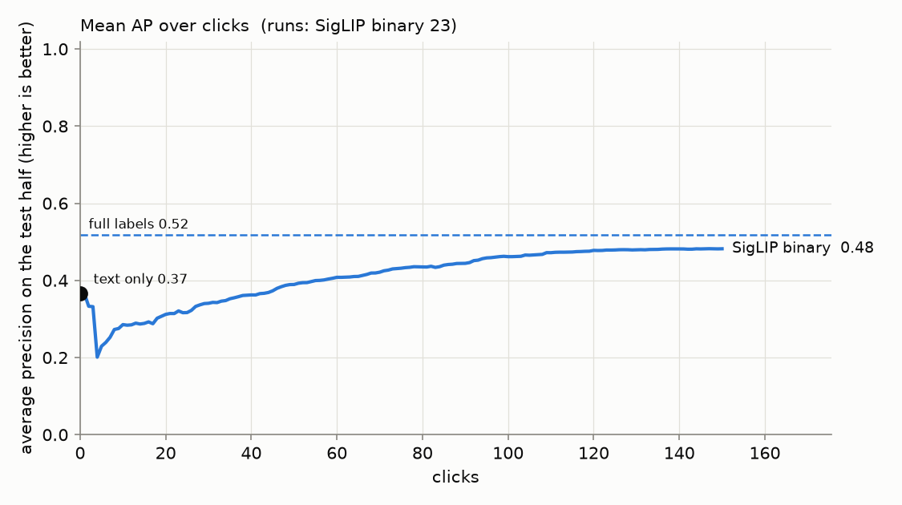
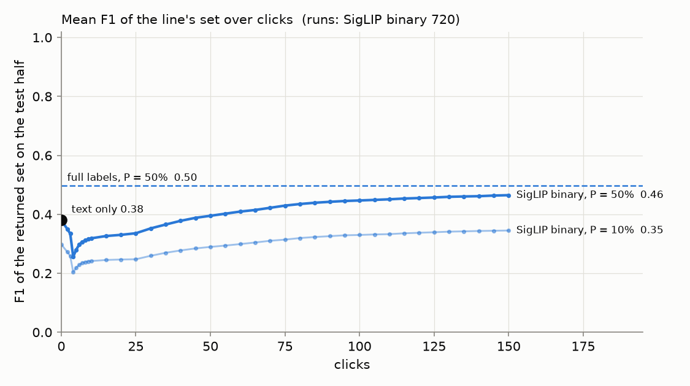
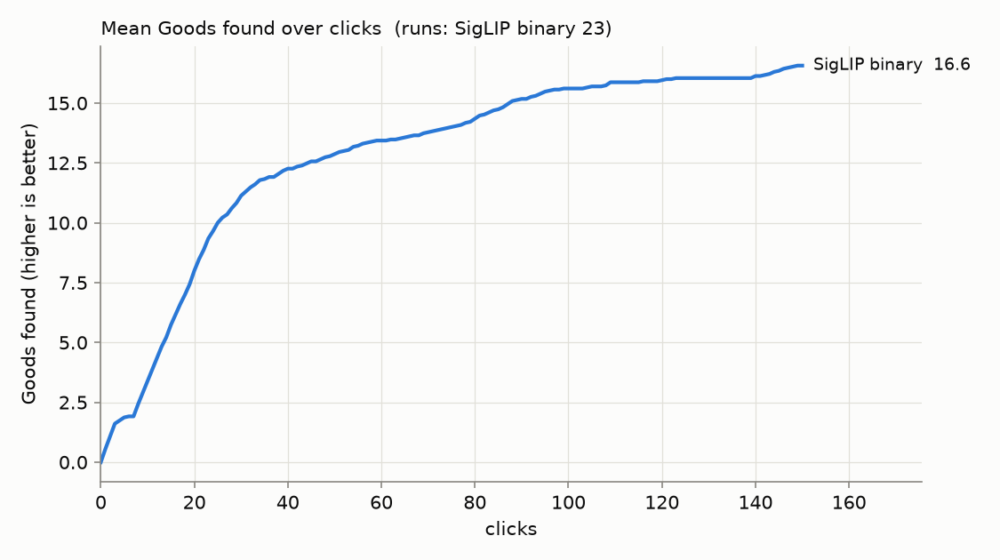
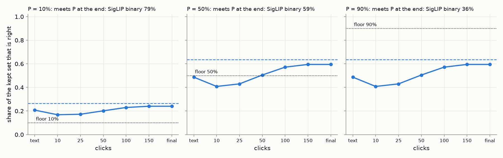
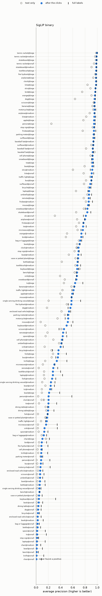
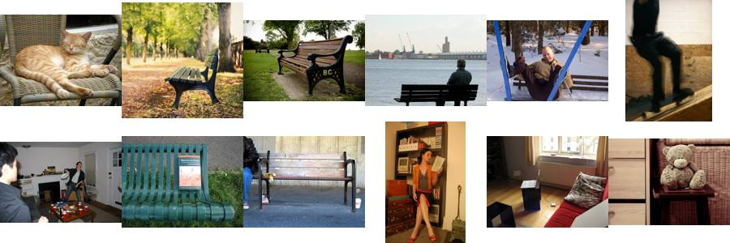
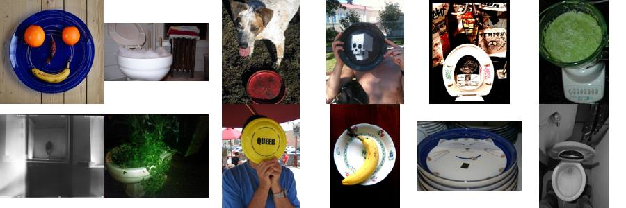
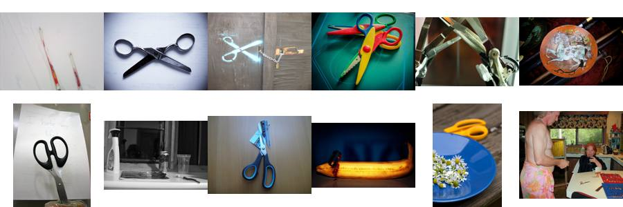

# State of the App: Binary Photo — 2026-09-30

> **Superseded by [the 2026-10-01 review](../2026-10-01-state-of-the-app-binary-photo/REPORT.md)** (#4402, 10 seeds): this one measured a line that was a fixed count and a check that halved a fixed candidate. Both changed the same day (#4388, #4389).

**Issues:** #4363 (this review), #4357 (the recipe). **Recipe:** `.claude/skills/state-of-the-app/SKILL.md`.
**Path:** SigLIP whole-image embedding, binary (Good/Bad) votes, Autopilot's shipped
opening (`g3@top,b4@mid,g20+dry1/16@top`, #4288), and the default precision
floor, P = 50%.
**Bench:** `coco_better`, all 49 classes at every size they have: 144 cells.
**Seeds:** 5 (720 runs). The run was stopped at five seeds on the owner's call,
once the review showed that the line is a fixed count (#4383, below), so this
review is the baseline that work starts from.
**Run:** `/expscratch/sgreenberg/state-of-the-app/2026-09-30` (job 791338, 14:02–14:58;
7.5–12 min and ~1.1 GB a run at 2 CPUs). Rank frames were recorded at every click
to 10 and every 5 after, so the curves below are read at those clicks.

A **review**, not an experiment: the app as it ships, the way a user meets it.
The user types a query and sees the text sort. They then vote for 150 clicks
while Autopilot picks what to show them. At the end they run the floor's spot
check once. Every curve runs from the **text-only ranking at click 0**, through
the clicks, to the **full-label ceiling**: the same head trained on every label
in the training half. There is no FPR + FNR anywhere (owner, #4357).

- **AP** is average precision of the detector's ranking of the held-out test
  half. It needs no threshold, so it is about the ranking only.
- **The line at P** is what the floor keeps on a fresh corpus (the test half)
  before any check: today that is the top 128 at P = 10% and the top 32 at
  50% and 90% (#4272). For each P the tables give the share of that set that
  is right, the share of runs meeting P, recall next to the **oracle's** (the
  best recall any cut of the same ranking reaches at precision ≥ P), and the
  set's **F1** next to the best F1 any cut reaches (owner, 2026-09-30: AP is
  all ranking; F1 is the returned set).

## Headline

| mean over 720 runs | text only | 25 clicks | 50 clicks | 150 clicks | full labels |
|---|---:|---:|---:|---:|---:|
| **AP** | 0.42 | 0.35 | 0.43 | **0.51** | 0.55 |
| **F1 of the returned set, P = 50%** | 0.38 | 0.34 | 0.40 | **0.47** | 0.50 |
| **Goods found** | — | 11 | 14 | **20** | — |

1. **150 clicks close about two thirds of the gap to full labels.** AP rises
   from 0.42 to 0.51 against a ceiling of 0.55. F1 of the returned set rises
   from 0.38 to 0.47 against 0.50, and the best cut of the final ranking would
   give 0.54.
2. **The first detector ranks worse than typing the query, for about 40
   clicks.** Mean AP falls from 0.42 to **0.26 at click 4**, once the first 3
   Goods and 1 Bad train a head, and is back at the text-only level only at
   **click 43**. F1 does the same: 0.38 → 0.26 → back at click 45.
   - Run by run, the median run holds its text-only AP for good only from
     **click 50**. 24% of runs are back by click 25, 51% by 50, 78% by 100,
     and **12% (85 runs) are still below the typed query at click 150**.
   - The dip lasts about as long as the opening's text walk (Find More Goods),
     which ends at a median click 35 (interquartile range 25–64) and runs in
     648 of 720 runs. During the walk the head trains on the walk's Goods and
     the opening's 4 Bads only. That is a hypothesis for the dip, not a
     measurement. While the walk runs, what Autopilot *asks* comes from the text
     sort and is unaffected; what a Find or an export returns is the head's
     ranking. Filed as **#4384**.
3. **Harvest is front-loaded.** 11 of the 20 Goods arrive in the first 25
   clicks. The last 100 clicks find 5.

### The line on a fresh corpus

| floor P (kept) | point | right | runs meeting P | recall | oracle recall at P | F1 | best F1 |
|---|---|---:|---:|---:|---:|---:|---:|
| 10% (top 128) | text only | 21% | 68% | 0.53 | 0.58 | 0.30 | 0.45 |
| | 150 clicks | **24%** | **79%** | 0.62 | 0.67 | 0.35 | 0.54 |
| | full labels | 27% | 91% | 0.68 | 0.77 | 0.38 | 0.58 |
| 50% (top 32) | text only | 49% | 51% | 0.31 | 0.42 | 0.38 | 0.45 |
| | 25 clicks | 43% | 41% | 0.28 | 0.34 | 0.34 | 0.39 |
| | 150 clicks | **60%** | **59%** | 0.38 | 0.51 | 0.47 | 0.54 |
| | full labels | 64% | 63% | 0.41 | 0.54 | 0.50 | 0.58 |
| 90% (top 32) | 150 clicks | 60% | **36%** | 0.38 | 0.38 | 0.47 | 0.54 |
| | full labels | 64% | 36% | 0.41 | 0.39 | 0.50 | 0.58 |

- **At the default 50%, the clicks take the kept set from 49% to 60% right,**
  within 4 points of full labels (64%). The top of the ranking is nearly as good
  as it gets; what limits the line is the class, not the loop (see below).
- **Recall trails the oracle at 50%: 0.38 against 0.51, and F1 0.47 against
  0.54.** The top 32 is a fixed count, while the oracle keeps as many as stay at
  ≥ 50%. That gap is the line rule, not the detector, and it is what **#4383**
  is about: the count never depends on the corpus. A Find set of 30 is returned
  whole, and a corpus ten times this one still gets 32.
- **Without a check, 90% keeps the same 32 as 50%.** It is met in 36% of runs,
  with a mean shortfall of 0.33.

## The spot check

| checks | confirmed | mean range | its width | truth (share right of what it checked) | range held the truth |
|---:|---:|---|---:|---:|---:|
| 702 | **2.1%** | 8%–69% | 0.61 | 29% | 98.6% |

The range is honest: it held the true precision of what it checked in 99% of
runs. But the check confirms almost nothing, because it checks the **unvoted**
top 32 of the session's own pool, and by click 150 Autopilot has already voted
most of the positives near the top: what it checks is 29% right on average,
while the same detector's top 32 on a fresh corpus is 60% right. What the check
should certify is **#4358**.

## Where the app does well and where it does poorly

| band (cells) | text only | 150 clicks | full labels | F1 at 150 | line at 50%: right | runs meeting 50% | Goods found |
|---|---:|---:|---:|---:|---:|---:|---:|
| large (49) | 0.70 | **0.80** | 0.82 | 0.68 | 87% | 90% | 29 |
| medium (49) | 0.38 | **0.49** | 0.51 | 0.46 | 59% | 63% | 20 |
| small (46) | 0.16 | **0.24** | 0.31 | 0.24 | 31% | 23% | 9.7 |

**Well:** sports equipment, fruit and other things a scene is *about*, with a
silhouette SigLIP knows.

| class | text only | 150 clicks | full labels |
|---|---:|---:|---:|
| tennis racket | 0.97 | **0.99** | 0.99 |
| kite | 0.81 | **0.95** | 0.97 |
| skateboard | 0.85 | **0.94** | 0.96 |
| baseball bat | 0.90 | **0.93** | 0.94 |
| surfboard | 0.87 | **0.92** | 0.93 |
| airplane | 0.83 | **0.91** | 0.91 |
| skis | 0.60 | **0.90** | 0.88 |

**Poorly:** furniture, tableware and cutlery: things that fill a scene rather
than define it.

| class | text only | 150 clicks | full labels | why (below) |
|---|---:|---:|---:|---|
| chair | 0.06 | **0.04** | 0.13 | clicks made it worse |
| bowl | 0.04 | **0.10** | 0.21 | loop |
| knife | 0.06 | **0.14** | 0.27 | loop |
| dining table | 0.11 | **0.14** | 0.19 | embedding |
| spoon | 0.07 | **0.20** | 0.28 | mixed |
| enclosed road vehicle | 0.16 | **0.21** | 0.25 | embedding |
| bench | 0.23 | **0.24** | 0.25 | embedding |
| bottle | 0.15 | **0.25** | 0.30 | mixed |
| book | 0.24 | **0.26** | 0.31 | mixed |
| fork | 0.15 | **0.27** | 0.33 | mixed |

**Why.** The ceiling separates two cases. When it is also low, the embedding
can't separate the class. When it is high but the final AP is not, the loop
failed to collect the labels. The confusers are the images Autopilot most often
showed as Bad (`why.py`, `why/why.csv`), with what COCO says they hold, ranked
by lift over the corpus.

- **chair: the clicks make it worse (0.06 → 0.04), and the ceiling is 0.13.**
  Bad clicks most often hold a **bench (16%, 10× the corpus rate) or a couch
  (18%, 10×)**. Whole-image SigLIP sees "a seat" and cannot tell which kind, and
  chair@small never finds a positive in any seed.
  
- **bowl: the loop.** The ceiling is 0.21 against a final 0.10. Its Bad clicks
  hold a **toilet (25%, 12×)** or broccoli (6%, 13×): round white things and
  food. A quarter of what Autopilot shows for "bowl" is a toilet.
  
- **knife: the loop.** The ceiling is 0.27 against a final 0.14. Bad clicks hold
  **scissors (12%, 51×)**, then fruit and food. The head learns "blade-shaped
  metal" before it learns "knife".
  
- **spoon: mixed.** Its confusers are knives and toothbrushes (each 34× the
  corpus rate): long thin things held in a hand.
- **dining table: the embedding.** The ceiling is 0.19, close to the final
  0.14. It confuses dining tables with chairs, couches and kitchen counters:
  "a room with a table", whichever kind.
- **person: the query, rescued by clicks, except at small.** The typed query
  ranks badly (0.10) and clicks lift it to 0.41, the biggest gain in the review.
  Its ceiling of 0.59 leaves the most headroom of any class. person@small never
  finds a positive in seed 0.

## Headroom (full labels minus 150 clicks)

The mean is 0.04 (0.55 − 0.51). It concentrates in a few classes: person
(0.18), knife (0.13), keyboard (0.12), bowl (0.12), tv (0.10), laptop (0.09) and
chair (0.09). Everything else is within 0.06 of its ceiling, and tennis racket,
airplane, skis and snowboard sit at or above it (a head trained on 150 chosen
labels can beat one trained on every label when the extra labels are noisy).

## What the clicks bought (150 clicks minus text only)

- **Most:** person +0.31, skis +0.30, sink +0.22, single serving drinking
  vessel +0.18. A query that ranks the class badly gets fixed by votes.
- **Least:** chair −0.02, bench +0.01, parking meter +0.02, bag or luggage
  +0.02, book +0.02. For those, 150 clicks do not beat typing.

## Images

**53 images have an effect of their own** (10+ clicks, |z| > 3, net of the
cell, label and phase they were clicked in): **7 helpful, 46 harmful**, against
1/9, 1/7, 2/10, 0/5 and 3/9 when images are shuffled within their buckets. So
the harmful side is real at 5 seeds and the helpful side is at chance, as at 7
seeds on 2026-09-24. Thumbnails and the full lists are in
[`images.md`](images.md).

- **Most harmful:** 409179 (10 clicks as a negative for 8 detectors, z −5.3),
  376442 (11 clicks, 3 classes, −0.10 AP per click) and 422517 (23 clicks, 10
  detectors). 422517 is a man on a park bench, clicked Bad for **parking meter**
  13 times (z −6.0), the strongest image × class pair in `harmful_pairs.csv`.
  Four pairs pass z < −3: (422517, parking meter), (84474, boat), (241790, bird)
  and (259712, dining table), all as negatives. These are the hand-review list
  (#4179's procedure); whether any is a label error needs the full-size image,
  not the thumbnail.
- **Most helpful:** 135270 and 113944, both clicked as negatives (+0.09 AP per
  click for 113944 over 5 detectors, early).
- **Early vs late:** every harmful image's damage is early (the `early` column
  in `images.md`); the same images are harmless late. A wrong-way early negative
  is the pattern, as in the 2026-09-24 review.

## Known regimes to flag, not to fix

- **Runs that never train a detector:** 18 of 720 (2.5%), all in the small
  band: chair@small in every seed, bowl@small in 3, knife@small in 3, and one
  seed each of bottle, enclosed road vehicle, laptop, person, tv and vase or
  potted plant. That is #4216's starved regime.
- **Runs that exhaust the nearby positives** before 150 clicks (airplane@large
  found 45 of ~50). Under the floor these show up in the spot check, which then
  checks what is left (#4358).
- **The line is a fixed count** (#4383): the top 32 at 50% and 90%, the top
  128 at 10%, whatever the corpus. Everything in "The line on a fresh corpus"
  is read on the 11.6k-image test half, where 32 happens to be close to the
  right size for strong classes. It is not a statement about other corpora.

## What to A/B next

- **#4384:** the first-detector dip: serve the text sort until the head earns
  it, blend early, or interleave Bads into the walk.
- **#4383:** draw the line where this corpus is estimated to cross P, instead of
  a fixed 32 / 128. Pricing in progress; this review's line section is its
  baseline.
- **#4358:** what the Train-time spot check should certify (today: the
  leftovers).
- **#4359:** Stable and Smart under the floor (Stable can't go yellow at a
  top-32 line).
- The four harmful image × class pairs above, for a hand review.

## Files

- `figures/`: `ap_over_clicks.png`, `f1_over_clicks.png`,
  `goods_over_clicks.png`, `line_at_floors.png`, `per_cell.png`.
- `why/`: `why.csv` and confuser sheets for chair, bowl and knife.
- `images.md` and `images/`: the per-image tables with thumbnails.
- Analysis tables on the GRID: `analysis-binary/{cells,lines,line_steps,curves,influence,images,harmful_pairs}.csv`
  and `summary.md`; the 8-class draft that preceded this review is kept as
  `analysis-binary-draft/`.
