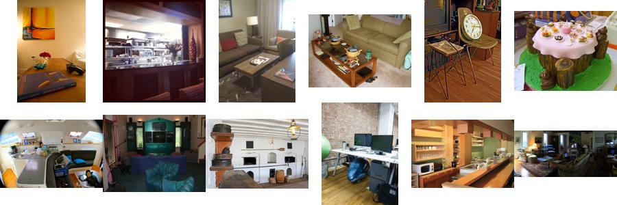
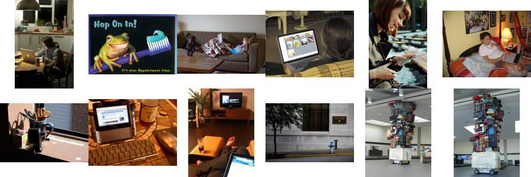

# State of the App: Binary Photo — 2026-09-30 (small draft)

> **Draft for the owner's comments, not the review.** This is the owner's
> "small set of classes at 1 seed" round (#4159's standing rule), run on the new
> precision-floor recipe (#4357) to settle how it reads before the overnight run.
> The numbers are **23 runs**, so they are noisy. Read them for shape and
> presentation. Every number below will be replaced by the 2026-09-30
> 14:00–19:00 run.
>
> **Owner's comments (2026-09-30), applied to that run:** the floor is written
> *P*, not X. The returned set's **F1 over clicks** is back, at the line's set,
> beside AP. Rank frames are now recorded at every click to 10 and every 5
> after, so the F1 curve has the resolution to show the early dip.

**Issues:** #4363 (this run), #4357 (the recipe). **Recipe:** `.claude/skills/state-of-the-app/SKILL.md`.
**Path:** SigLIP whole-image embedding, binary (Good/Bad) votes, Autopilot's
shipped opening, and the default floor (50%).
**Bench:** `coco_better`. The 8 standing smoke classes at every size they have:
airplane, bag or luggage, banana, book, dining table, dog, person and traffic
light. That is 23 cells at seed 0.
**Run:** `/expscratch/sgreenberg/state-of-the-app/2026-09-30` (job 791225;
7.5–12 min and ~1.1 GB a run at 2 CPUs).

The review follows the app as it ships:
- The user types a query and sees the text sort.
- They then vote for 150 clicks while Autopilot picks what to show them.
- At the end they run the floor's spot check once.

Every curve runs from the **text-only ranking at click 0**, through the clicks,
to the **full-label ceiling**: the same head trained on every label in the
training half. There is no FPR + FNR anywhere (owner, #4357).

- **AP** is average precision of the detector's ranking of the held-out test
  half. It needs no threshold.
- **The line at P** (the precision floor) is what the floor keeps on a fresh
  corpus (the test half), before any check: the top 128 at P = 10%, and the
  top 32 at 50% and 90%. For each P the tables give the share of that set that
  is right, the share of runs meeting P, and recall next to the **oracle's**
  recall (the best recall any cut of the same ranking reaches at
  precision ≥ P).

## Headline

| mean over 23 runs | text only | 25 clicks | 50 clicks | 150 clicks | full labels |
|---|---:|---:|---:|---:|---:|
| **AP** | 0.37 | 0.32 | 0.39 | **0.48** | 0.52 |
| **Goods found** | — | 10 | 13 | **17** | — |

1. **150 clicks close about three quarters of the gap to full labels.** AP
   rises from 0.37 to 0.48, against a ceiling of 0.52.
2. **The detector is worse than typing for the first ~40 clicks.** Mean AP
   drops from 0.37 to **0.20 at click 4**, once the first 3 Goods and 1 Bad
   train a head. The mean climbs back to the text-only AP only at **click 43**.
   - Run by run, the median holds its text-only AP from click 37 on. 30% of
     runs are back by click 25, 61% by 50 and 91% by 100.
   - Two runs never get back: book@medium and dining table@medium.
   - Literal examples: airplane@large goes 0.94 → 0.54 at click 4 (back at 36).
     banana@medium goes 0.52 → 0.05 (back at 65). dining table@large is still
     at 0.02 at click 50, where typing alone gave 0.21.
   - **The dip lasts about as long as the opening's text walk** (Find More
     Goods). The walk ends at a median click 45 (interquartile range 25–54).
     While it runs, what Autopilot *asks* comes from the text sort and is
     unaffected. What a Find or an export would return in that window is the
     detector's ranking. The walk adds only Goods, so the head sees few new
     negatives until it ends. That is a hypothesis for the dip, not a
     measurement.
3. **Harvest is front-loaded.** 10 of the 17 Goods arrive in the first 25
   clicks. The last 100 clicks find 4.

### The line on a fresh corpus

| floor P (kept) | point | right | runs meeting P | recall | oracle recall at P |
|---|---|---:|---:|---:|---:|
| 10% (top 128) | text only | 18% | 61% | 0.47 | 0.51 |
| | 150 clicks | **22%** | **74%** | 0.56 | 0.61 |
| | full labels | 25% | 87% | 0.65 | 0.72 |
| 50% (top 32) | text only | 44% | 43% | 0.28 | 0.35 |
| | 25 clicks | 39% | 35% | 0.25 | 0.31 |
| | 150 clicks | **57%** | **57%** | 0.37 | 0.48 |
| | full labels | 60% | 57% | 0.39 | 0.49 |
| 90% (top 32) | 150 clicks | 57% | **30%** | 0.37 | 0.39 |
| | full labels | 60% | 35% | 0.39 | 0.38 |

- **At the default 50%, the clicks take the kept set from 44% to 57% right.**
  That is within 3 points of what full labels give (60%). The ranking at the
  top is nearly as good as it gets. What limits the line is the class, not the
  loop (see below).
- **Recall trails the oracle at 50%: 0.37 against 0.48.** The top 32 is a fixed
  count, while the oracle keeps as many as stay at ≥ 50%. In airplane@large the
  top 32 is 100% right with recall 0.73, and the oracle reaches 0.98.
- **Without a check, 90% keeps the same set as 50%.** It is met in 30% of runs,
  with a mean shortfall of 0.36.

## The spot check

| checks | confirmed | mean range | its width | truth (share right of what it checked) | range held the truth |
|---:|---:|---|---:|---:|---:|
| 21 | **1** (dog@large) | 6.5%–67% | 0.60 | 31% | 21 / 21 |

The range is honest: it held the truth every time. But the check confirms
almost nothing, because it checks the **unvoted** top 32 of the session's own
pool, and by click 150 Autopilot has already voted most of the positives near
the top. airplane@large is the literal case:
- its line on a fresh corpus is 32 of 32 right;
- the session found 45 positives;
- the 32 unvoted items the check drew from were 34% right, so it reported
  "short" (range 1–66%).

What the check *should* certify is #4358.

## Where the app does well and where it does poorly

| band | text only | 150 clicks | full labels | line at 50%: right | runs meeting 50% | Goods found |
|---|---:|---:|---:|---:|---:|---:|
| large (8) | 0.66 | **0.81** | 0.83 | 89% | 88% | 26 |
| medium (8) | 0.29 | **0.44** | 0.48 | 56% | 63% | 16 |
| small (7) | 0.12 | **0.16** | 0.21 | 21% | 14% | 6.3 |

| class | text only | 150 clicks | full labels |
|---|---:|---:|---:|
| airplane | 0.85 | **0.92** | 0.92 |
| banana | 0.72 | **0.79** | 0.78 |
| traffic light | 0.45 | **0.56** | 0.56 |
| dog | 0.28 | **0.51** | 0.52 |
| person | 0.10 | **0.45** | 0.59 |
| bag or luggage | 0.27 | **0.31** | 0.33 |
| book | 0.24 | **0.26** | 0.36 |
| dining table | 0.14 | **0.17** | 0.17 |

**Why the weak classes are weak.** The ceiling separates the two cases:
- When the ceiling is also low, the embedding can't separate the class.
- When the ceiling is high but the final AP is not, the loop failed to collect
  the labels.

The confusers are the images Autopilot most often showed as Bad (`why.py`).

- **dining table: the embedding.** The ceiling is 0.17, the same as the final
  AP. What the detector confuses it with is *other tables*: coffee tables in
  living rooms, desks, and kitchen and restaurant counters. Bad clicks most often hold
  a chair (12%) or a couch (11%). Whole-image SigLIP sees "a room with a table"
  and cannot tell which kind.
  
- **book: partly the loop.** The ceiling is 0.36 against a final 0.26.
  book@medium finds 6 positives, and its AP stays at 0.02 against a ceiling of
  0.13. The confusers are *reading scenes*: people with laptops, tablets and
  e-readers. There is also a sculpture of stacked suitcases, which reads as a
  stack of books, picked twice. (Thumbnails can't settle whether
  any of these is a label error.)
  
- **person: the query, rescued by clicks, except at small.** The text query
  ranks badly (0.10). person@large goes from 0.26 to 0.95 with clicks, the
  biggest gain in the run. person@small never finds a positive, although its
  ceiling is 0.25.
- **bag or luggage: the embedding.** The ceiling is 0.33 against a final 0.31,
  and bag or luggage@small is at 0.01.

## Headroom (full labels minus 150 clicks)

The mean is 0.035. Nearly all of it is in two classes: person (0.14) and book
(0.10). Every other class is within 0.02 of its ceiling, and banana and
airplane sit at it. So on this sample, better clicking has little to buy
outside the small and medium cells of those two classes.

## What the clicks bought (150 clicks minus text only)

- **Most:** person +0.35 and dog +0.23. A text query that ranks the class badly
  gets fixed by votes.
- **Least:** book +0.017 and dining table +0.026. For those, 150 clicks barely
  beat typing.

## Images

Nothing to report at 1 seed. Only 42 images were clicked 3 or more times, and
none reached the 10 clicks the per-image test needs. The overnight seeds fill
this section.

## Known regimes to flag, not to fix

- **Runs that run out of nearby positives** (airplane@large found 45, and
  person@large 42). These used to show up as the fused threshold drifting
  (#4121). Under the floor they show up in the spot check instead, which is
  #4358.
- **Two runs never trained a detector:** book@small and person@small, with 0
  positives found.

## What to A/B next

Proposed; to be filed with the full report:
- **The first-detector dip.** Why does a head trained on 3 Goods and 1
  midpoint Bad rank so much worse than the text sort, and why does it stay
  there through the text walk (~40 clicks)? Arms to price:
  - keep the text sort as the ranking Find returns until the head beats it on
    its own votes;
  - interleave Bads into the walk.
- **The fixed top-32 line** loses recall to the oracle on strong classes (0.73
  against 0.98 on airplane@large). This is the growing-check idea from the
  #4223 comment.

## Review notes (for the owner)

Presentation choices I'd like your call on before the overnight run:
1. `line_at_floors.png` draws "150" and "final" as two identical points. The
   dashed ceiling has no label, and recall isn't plotted. I'd drop "final", label
   the ceiling, and add a recall-vs-oracle row.
2. The 90% panel repeats the 50% set until a check runs. It could be dropped,
   or kept as the "promise nobody checked" view.
3. Should the early dip get its own figure (AP over the first 50 clicks, per
   band), since it is the most user-visible finding?
4. The overnight run size: as many Binary seeds as the night allows, as on
   2026-09-26 (61 seeds then). Runs are now ~8–12 min, against ~7 then, so
   expect about 50.
