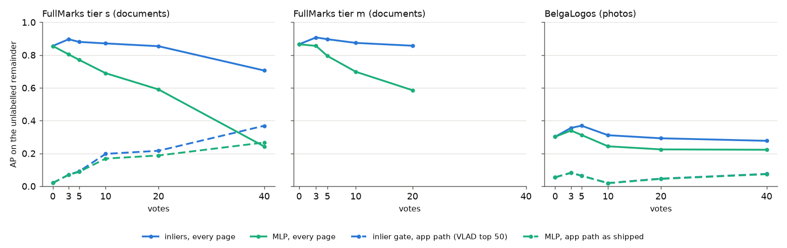
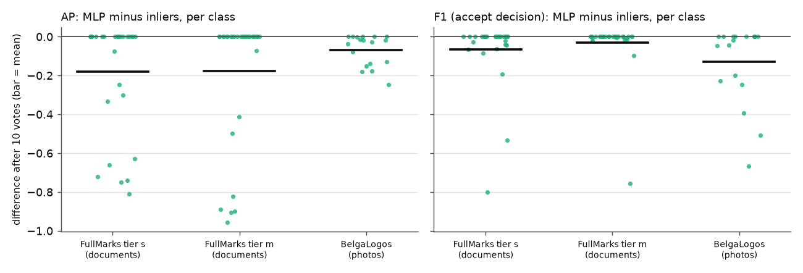
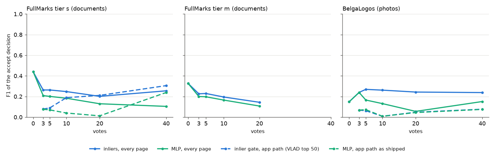

# Structural re-rank: the match-statistic MLP or the inliers? (#4169)

**Question.** From 3 votes on, the structural path (`sift_vlad`) re-ranked its
Stage-1 shortlist with a small MLP trained on match statistics from the votes.
Before that it used an inlier gate. #4162 found the MLP worse than ranking by
inliers on FullMarks. Should it go? And should it at least stay for the
threshold? The issue asked for a check on the photos it was built on before
shipping.

**Answer: remove it.** The MLP ranks worse than the best template's inlier
count on documents and on photos, and its accept decision is worse than the
gate's. It is never better in any class.

| MLP minus inliers, 10 shared votes, every page | FullMarks s | FullMarks m | BelgaLogos |
|---|---|---|---|
| classes | 29 | 31 | 18 |
| AP | **−0.18** [−0.29, −0.08] | **−0.18** [−0.30, −0.07] | **−0.07** [−0.11, −0.03] |
| F1 of the accept decision | **−0.07** [−0.13, −0.01] | **−0.03** [−0.08, −0.00] | **−0.13** [−0.23, −0.05] |
| classes where MLP is lower / higher (AP) | 10 / 0 | — | 12 / 0 |
| positives found by 40 votes (closed loop) | −0.9 [−2.1, −0.2] | (20 max) | −3.8 [−5.9, −2.1] |

Brackets are bootstrap 95% intervals over classes.

On the app's own path (VLAD SVM top 50, then the re-rank), swapping the MLP for
the gate gives:

| gate minus MLP, app path, 10 votes | FullMarks s | BelgaLogos |
|---|---|---|
| AP | +0.03 [−0.00, +0.07] | +0.00 |
| F1 | **+0.15** [+0.05, +0.26] | +0.00 |

The gains are small there because VLAD's top 50 rarely holds a positive
(#3928). The accept decision is the exception: on FullMarks the MLP's boundary
accepts almost nothing (F1 0.01–0.04 past 10 votes), and the gate's does not.



## Setup

- **Harness:** `scripts/experiments/fullmarks/vote_curve.py` (#4162) replays a
  template × page matrix. Every arm sees identical SIFT matches and differs
  only in how it scores them.
- **Readouts:**
  - *shared sequence* trains every arm on the same *v* votes (the query crop's
    top *v*, labelled from ground truth) and scores the unlabelled remainder;
  - *closed loop* lets each arm pick its own next vote.
- **Arms:**
  - `a1_max`: max over templates (the crop plus each Good's box), ranked by
    inliers;
  - `a5_mlp`: the same statistics, ranked by `train_verification_classifier`'s
    recipe from 3 votes;
  - `a3s_production`: the app as shipped (VLAD SVM top 50, MLP or cold gate);
  - `a3s_cold` and `a3s_inliers` (new here): the app path with the gate always,
    and with raw inliers inside the gate's saturation.
- **Accept decision (new readout):**
  - the gate accepts at ≥ 8 inliers (`DEFAULT_MIN_INLIERS`);
  - the MLP accepts at p ≥ 0.5;
  - F1 is scored on the remainder.
- **Corpora:**
  - **FullMarks v5.0**, tiers `s` (~4,900 pages) and `m` (~48k), 8,192
    keypoints. The #4162 matrices are reused as they stand. Tier `m`'s matrix
    has no page vectors, so only the every-page arms ran there.
  - **BelgaLogos** (10k press photos) at the shipped photo budget (1,024
    keypoints). OpenLogo, the corpus the MLP was built on, is no longer on the
    GRID (the pkl was deleted in August; the shared copy is empty). BelgaLogos is
    the same kind of data: in-the-wild logos with instance labels. It uses the
    benchmark's own protocol:
    - classes: the 18 logos with a curated `qset1` query and at least 10
      images carrying a clearly visible (`state 1`) instance;
    - query: the first `qset1` box;
    - positives: `state 1` images;
    - images with only partly visible instances are left out of the pool;
    - templates: each positive's features inside its largest `state 1` box.

    Builder: `scripts/experiments/structural_rerank_4169/belga_matrix.py`.

## Why the MLP loses

It does not learn a harder boundary. From ~10 votes it comes out **nearly
flat**, p ≈ 0.45–0.49 on every page, so its ordering is small-sample noise
that overrides a strong inlier signal. Pages with **no** geometric support
outrank true positives with 80 inliers. Literal cases after 10 shared votes,
from `measurements/examples.txt` (`examples.py`):

**FullMarks `spods/stamp_00716_1`**: 9 Goods, 1 Bad (`tobacco800/dic45f00_5`,
48 inliers). AP 0.94 by inliers, 0.13 by MLP.

| rank | by inliers | by MLP |
|---|---|---|
| 1 | POS `spods/00720`, 87 inliers (p 0.48) | neg `tobacco800/btt85f00-page2_1`, 0 inliers (p 0.49) |
| 2 | POS `spods/00719`, 85 | neg `ucsf/mybw0228#0`, 0 |
| 3 | POS `spods/00705`, 84 | neg `tobacco800/dic45f00_4`, 0 |

**FullMarks `spods/stamp_00612_1`**: 6 Goods, 4 Bads (`spods/00674`, `00680`,
`00701`, `00554`, 51–52 inliers each: hard negatives). AP 0.85 → 0.11. The
MLP's top 8 are all negatives with 35–51 inliers. The inliers' top 8 are all
positives with 64–80.

**BelgaLogos `VRT`**: 5 Goods, 5 Bads (4 inliers each). AP 0.50 → 0.25. The MLP
keeps the one strong positive (`07607823.jpg`, 19 inliers) first. Behind it
come zero-inlier images (`07663548.jpg`, `07671492.jpg`, …) ahead of
`07575593.jpg`, a positive with 10 inliers.

**Possibly a label problem, not a scorer one:** on BelgaLogos `US_President`,
the inlier ranking's top three are unlabelled images with 41–54 inliers
(`07696844.jpg`, `07707617.jpg`, `07674361.jpg`). That class is weak for every
arm (AP 0.18). Those images are worth a look before reading anything into it.



## The accept decision

Keeping the MLP only for the threshold was the issue's fallback option. It does
not survive either: its F1 is below the gate's on every corpus.



**Separate from this issue:** the gate itself is poorly calibrated for
documents at 8,192 keypoints. With every page verified, its F1 is 0.20–0.26
at tier `s` and 0.14–0.23 at `m`, because many negatives clear 8 inliers
(the hard negatives above carry 35–52). The shipped document budget is 1,024
keypoints, so this bites once #3911/#3928 raise it. Follow-up: #4367.

## What changed

- `maybe_structural_rerank` no longer trains anything. Stage 2 scores every
  fit with the inlier gate. Inside the gate's saturation (≥ 16 inliers) the
  shortlist is ordered by raw inliers, then Stage 1. The reported score is
  still the gate's, and the threshold is still 0.5 (= 8 inliers).
  - On FullMarks `s`, over the MLP, the raw-inlier order gains +0.029 AP at 10
    votes and +0.036 at 20. The saturating gate alone gains +0.029 at both.
  - The ordering matters more once a Stage 1 surfaces many strong fits (#3928).
- Removed: `train_verification_classifier`, `MIN_VERIFICATION_VOTES`, the
  `VerificationScorer.model` field, the `DetectorContext.verification_classifier`
  slot, and `maybe_structural_rerank`'s `bad_votes` parameter. Bad votes no
  longer enter Stage 2. A rule that learns from Bads (#4180's stop-list) has to
  beat the gate the same way.
- The labelset path still re-derives Bad elements' local features (for
  `label_local_features`). They are unused by the re-rank now, but #4180 would
  need them.

## Reproduce

```bash
# BelgaLogos matrix (~20 min on 32 CPUs)
python scripts/experiments/structural_rerank_4169/belga_matrix.py --out <dir>/matrix-belga
# Curves (FullMarks matrices from #4162; tier m: --max-v 20 --arms a0_exemplar,a1_max,a5_mlp)
python scripts/experiments/fullmarks/vote_curve.py --matrix <matrix> --tier s \
  --arms a0_exemplar,a1_max,a5_mlp,a3_vlad_svm,a3s_production,a3s_cold,a3s_inliers --out <curves>
python scripts/experiments/structural_rerank_4169/examples.py --matrix <matrix> ...
python docs/experiments/2026-09-30-structural-rerank-mlp-4169/figures.py
```

Run directory: `/expscratch/sgreenberg/structural-rerank-4169/` (sbatch
scripts, logs, the BelgaLogos matrix). `measurements/` holds each corpus's
`rows.csv`, `summary.md` (every arm, both readouts, both paired tables) and
`run.json`.
