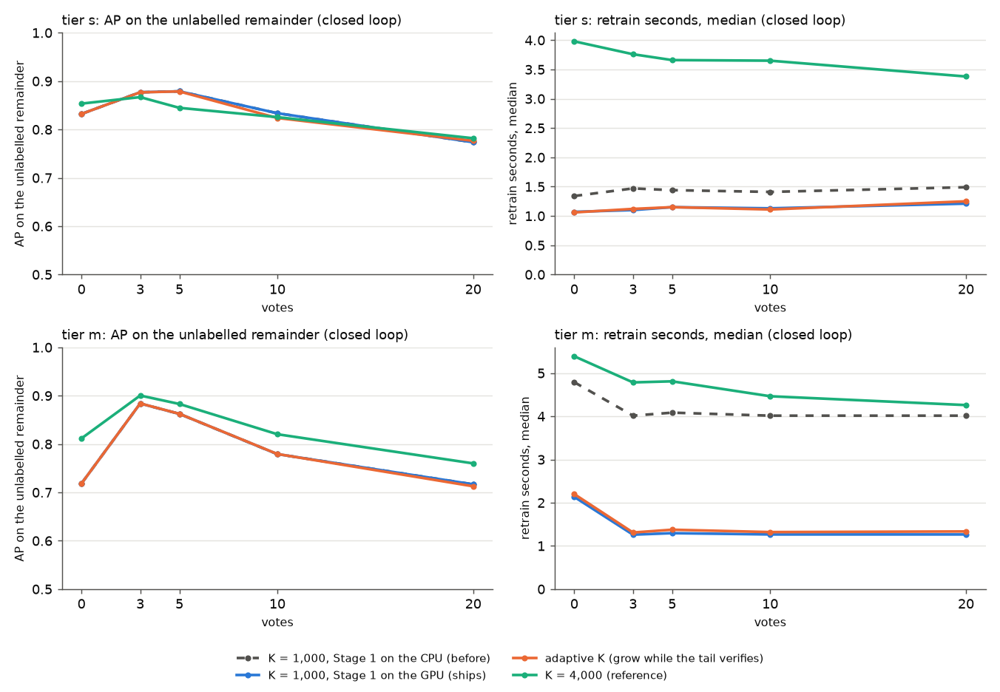

# Tiled Stage 1: scored on the GPU, and how big a shortlist (#4391)

**Question.** #3928 put the tiled Stage 1 into the app. At 50,000 pages it
found as many positives as verifying every page, but it cost 4.0 s a vote and
ranked 0.04–0.15 AP lower where large classes outgrow the 1,000-page
shortlist. Can the vote get cheaper, and does a shortlist that grows for large
classes recover the ranking? Arms and verdict rule were pre-registered on
#4391 before any run.

**Answer.**

- **Speed: yes.** Scoring the 2.7M tiles on the GPU brings a vote at 50,000
  pages from 4.0 s to **1.3 s** (median; p90 1.6 s). At 5,000 pages it goes
  from 1.4 s to 1.1 s. Every ranking is unchanged: AP identical in every class
  at both tiers.
- **Adaptive shortlist: no, and it does not ship.** Verifying another 1,000
  pages while ≥ 10% of the shortlist's last 250 pass the gate gains nothing:
  +0.000 [−0.000, +0.001] AP at 10 votes. Its p90 retrain of 5.2 s breaks the
  5 s budget.
- **A bigger fixed shortlist does help at 50,000 pages.** With the numbers in
  hand, **the owner chose K = 2,000 (2026-10-01)**: 1,000 without a GPU.

| tier `m`, vs K = 1,000 | AP, no votes | AP @10 | AP @20 | vote median / p90 |
|---|---:|---:|---:|---|
| K = 1,000 (was shipped) | 0.72 | 0.78 | 0.72 | 1.3 / 1.6 s |
| **K = 2,000 (ships)** | 0.77, +0.048 [+0.026, +0.071] | 0.81, +0.024 [+0.009, +0.042] | 0.74, +0.020 [+0.002, +0.045] | **2.4 / 3.1 s** |
| K = 4,000 | 0.81, +0.093 [+0.054, +0.134] | 0.82, +0.035 [+0.011, +0.062] | 0.76, +0.043 [+0.007, +0.092] | 4.5 / 6.1 s |

K = 2,000 is arm D, pre-registered on #4391 after A–C (`measurements/replay-m-k2000.csv`).
It keeps two thirds of K = 4,000's 10-vote gain at about half the cost, inside
the 5 s budget. The first sort before any vote (example sort) takes 3.1 s
median, against 2.1 s at K = 1,000.



The tier-`s` and tier-`m` AP of "before" (dashed) is hidden under the GPU arm,
because it is identical.

## Setup

- **Replay:** `scripts/experiments/fullmarks/app_replay_tiled.py
  --k-policies fixed,adaptive,cap`, closed loop through
  `maybe_structural_rerank(_example)` on a real `DetectorContext`, with the
  #3928 setup (FullMarks v5.0, `sift_vlad_doc` at 8,192 keypoints, the cached
  tile projection, #4162's pools and positives). It ran on an L40S with 16
  CPUs, 20 votes, 35 classes at tier `s` and 36 at tier `m`.
- **"Before"** is the #3928 replay (`measurements/before-*.csv`): the same
  code with Stage 1 on the CPU.
- **Speed microbenchmark:** `bench_stage1.py`, synthetic 2.7M tiles × 512 at
  47,000 pages. numpy takes 3.4–3.9 s a call, the fp16 → fp32 conversion
  mostly; the GPU takes ~7 ms warm. The shipped GPU path widens each chunk to
  float32 on the device, and a GPU test pins its scores to the CPU path within
  1e-5.

## Shortlist arms (tier `m`, paired against K = 1,000 over classes; measured before the K = 2,000 choice)

| arm | AP, no votes | AP @10 | AP @20 | retrain median / p90 / max | K > 1,000 |
|---|---:|---:|---:|---|---:|
| **K = 1,000 (ships)** | 0.72 | 0.78 | 0.72 | 1.3 / 1.6 / 2.3 s | 0 of 36 |
| adaptive | 0.72 | +0.000 [−0.000, +0.001] | −0.004 [−0.011, +0.001] | 1.3 / **5.2** / 7.8 s (20 votes: p90 6.6, max 23 s) | 14 of 36 |
| K = 4,000 | **0.81** | **+0.035** [+0.011, +0.063] | **+0.043** [+0.007, +0.094] | 4.5 / 6.1 / 7.5 s | 36 of 36 |

At tier `s` (5,000 pages) no arm is resolvable from K = 1,000: adaptive
−0.010 [−0.030, +0.000], K = 4,000 −0.008 [−0.028, +0.008] at 10 votes. At
that size the shortlist already holds a fifth of the tier.

**Why adaptive fails.** Its trigger is the gate, and on documents at 8,192
keypoints the gate passes hard negatives (#4367: F1 0.14–0.26). The tail of a
shortlist passes ≥ 10% in 14 of 36 classes. Those are not the large classes:
the extension lands on more confusers, not more members, so AP does not move
and the extra verification only costs time. A size signal that works needs a
calibrated accept decision first, which is #4367.

## What changed

- `vtscore/training/structural_stage1.py`: `_gpu_page_scores`.
  - It keeps a device copy of the cached fp16 tile matrix, dropped with it.
  - It takes the max per page with `scatter_reduce`.
  - It falls back to the CPU when CUDA is absent, short of memory
    (needs 3× the matrix free), or errors.
- **`TILED_TOP_K` 1,000 → 2,000** and **`TILED_TOP_K_CPU` 500 → 1,000** (owner's
  choice above).
- **`K_POLICY`:** `"fixed"` (default, shipped), `"adaptive"` and `"cap"` are the
  pre-registered arms. They stay as experiment knobs so this replay
  reproduces. `_rerank_growing` in `structural_similarity.py` runs exactly one
  re-rank under `"fixed"`.
- **The replay** takes `--k-policies` and records each retrain's K.

## Reproduce

```bash
source scripts/experiments/pile/pile_env.sh
python scripts/experiments/fullmarks/app_replay_tiled.py --tier m --k-policies fixed,adaptive,cap \
    --matrix /expscratch/$USER/fullmarks/votes-4162/matrix-m --out <dir>/replay-m --workers 16
python scripts/experiments/fullmarks/app_replay_tiled.py --tier m --k-policies cap --k-cap 2000 \
    --matrix /expscratch/$USER/fullmarks/votes-4162/matrix-m --out <dir>/replay-m-k2000 --workers 16
python docs/experiments/2026-09-30-tiled-stage1-speed-k-4391/figures.py
```

Run directory: `/expscratch/sgreenberg/speed-4391/`.
