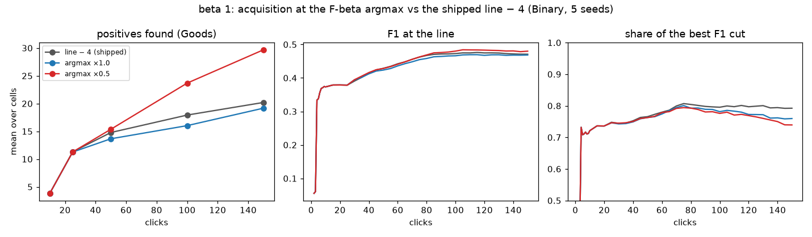
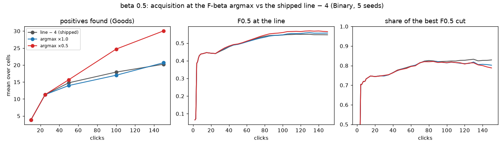
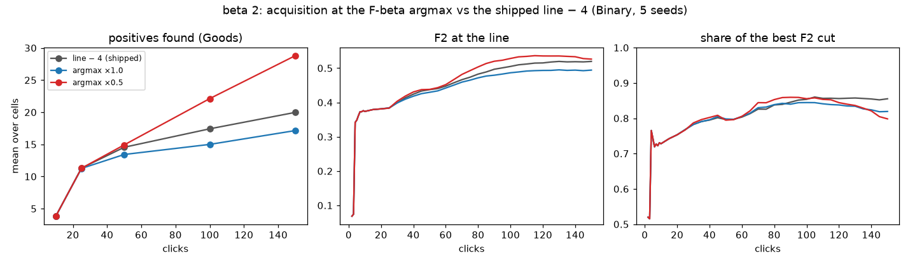

# Acquisition at the F-beta argmax: pricing Autopilot's cut under the balance (#4409, #4413 step 5)

**Issue:** #4409 (re-keyed from the floor's P crossing to the balance's F-beta
argmax by #4413). **Date:** 2026-10-01. **App:** `dev` at 98cdacc7c (the
balance's line and walk, steps 1–5 of #4413; the UI and the default flip of
step 6 do not touch the harness). **Harness arm:** `acq_p_crossing` (#4409):
the acquisition cut at a multiple of the depth of the mixture's F-beta argmax
over the unvoted ranking, read as a rank; the control is the shipped cut, four
inclusion steps stricter than the line (#2876). **Bench:** `coco_better`, 49
classes at every size, 144 cells × 5 seeds per arm, Binary SigLIP, Autopilot's
shipped opening, 150 clicks, the balance walk once at the end. **Arms:** beta
0.5 / 1 / 2 × {line − 4, argmax × 1.0, argmax × 0.5}: 9 arms, 6,480 runs.
**Runs:** `/expscratch/sgreenberg/p-aware-acq-4409/b<beta>-x<ctl|1.0|0.5>/analysis-binary`
(`compare_acq.py`, `figs_acq.py` here; `acq_summary.md` is the full table).

**Verdict (2026-10-01): ship the cut at half the argmax's depth (× 0.5).** *Reversed on 2026-10-02: see section 4, which re-scores the same runs on the owner's objective.* At every preset
it raises the returned set's F-beta and finds about nine more positives per
150 clicks, with AP up 0.02–0.03 and precision at the line up 0.05–0.11; the
plan's rule ("ship if it raises F-beta without losing Goods") is met three
times over. The full-depth cut (× 1.0) never beats the control. What × 0.5
does not do is let the line keep up with the better ranking: the set's share
of the best cut's F-beta falls, because the ceiling rises more than the line
follows. That is a line-side follow-up (#4427).

## 1. The returned set at click 150, each beta at its own balance

Paired against the control by cell (category × seed), mean difference ± SE
over 720 cells (702 trained):

| beta | arm | final AP | Goods @150 | F-beta at the line | precision | recall | kept | share of best |
|---|---|---:|---:|---:|---:|---:|---:|---:|
| 0.5 | line − 4 | 0.527 | 20.2 | 0.534 | 0.61 | 0.38 | 30 | 0.81 |
| 0.5 | × 1.0 | +0.016 ± 0.002 | +0.4 ± 0.4 | +0.009 ± 0.003 | +0.04 | −0.00 | −3 | −0.026 ± 0.007 |
| 0.5 | **× 0.5** | **+0.026 ± 0.002** | **+9.8 ± 0.3** | **+0.017 ± 0.003** | +0.06 | +0.00 | −4 | −0.040 ± 0.008 |
| 1 | line − 4 | 0.526 | 20.2 | 0.459 | 0.61 | 0.38 | 31 | 0.78 |
| 1 | × 1.0 | +0.005 ± 0.002 | −1.0 ± 0.3 | −0.002 ± 0.002 | +0.02 | −0.00 | −2 | −0.032 ± 0.007 |
| 1 | **× 0.5** | **+0.025 ± 0.002** | **+9.5 ± 0.3** | **+0.009 ± 0.002** | +0.05 | +0.00 | −3 | −0.052 ± 0.008 |
| 2 | line − 4 | 0.527 | 20.0 | 0.507 | 0.44 | 0.56 | 84 | 0.84 |
| 2 | × 1.0 | −0.012 ± 0.002 | −2.8 ± 0.3 | −0.025 ± 0.003 | −0.02 | −0.01 | +5 | −0.035 ± 0.007 |
| 2 | **× 0.5** | **+0.020 ± 0.002** | **+8.8 ± 0.3** | **+0.007 ± 0.003** | +0.11 | −0.03 | −22 | −0.055 ± 0.009 |

- **The harvest diverges after click 50.** Goods at 25 / 50 / 100 / 150
  clicks under beta 1: 11.3 / 14.8 / 17.9 / 20.2 on the control, 11.3 / 15.4 /
  23.7 / 29.7 under × 0.5. Half the argmax's depth is a region the model is
  mostly right about, so the Hard picks there are mostly positives, and
  those positives retrain the model: AP +0.025 by the end.
- **× 1.0 samples too deep.** At beta 2 the argmax runs up to the 128 cap, the
  picks come from the ranking's middle, and everything is worse (AP −0.012,
  Goods −2.8, F2 −0.025). At beta 0.5 and 1 it is a wash on the returned
  set with a small AP gain.
- **The line's share of the ceiling falls under × 0.5** (−0.04 to −0.055)
  while its own F-beta rises: the best cut of the better ranking keeps more
  than the balance's cap (32 / 128) or the walk's stop lets the line keep.
  Under beta 2 the walk keeps 62 where the control keeps 84, at +0.11
  precision and −0.03 recall. The per-click share curves split from the
  control after click 75, exactly where the AP gain opens.

## 2. By size band (click 150, × 0.5 against the control)

| beta | band | d F-beta | d Goods | d AP | d share |
|---|---|---:|---:|---:|---:|
| 0.5 | small | +0.011 | +5.8 | +0.019 | −0.059 |
| 0.5 | medium | +0.027 | +9.9 | +0.034 | −0.051 |
| 0.5 | large | +0.014 | +13.3 | +0.023 | −0.011 |
| 1 | small | −0.002 | +5.4 | +0.018 | −0.083 |
| 1 | medium | +0.017 | +9.5 | +0.034 | −0.055 |
| 1 | large | +0.011 | +13.0 | +0.022 | −0.018 |
| 2 | small | −0.013 | +4.7 | +0.012 | −0.093 |
| 2 | medium | +0.000 | +8.5 | +0.028 | −0.079 |
| 2 | large | +0.031 | +12.8 | +0.020 | +0.003 |

The gains are everywhere in AP and Goods; the returned set's F-beta gains
sit on medium and large objects, and on small objects it is flat (beta 0.5)
to slightly down (beta 2: −0.013), where the share drop is largest. Small
objects are where the ranking is weakest (AP 0.26), and a better ranking
there moves the ceiling without moving what 32 kept items can hold.

## 3. What ships, and what it leaves

- **Shipped:** under the balance, Autopilot's acquisition cut is the score at
  half the depth of the mixture's F-beta argmax over the unvoted ranking
  (`ACQUISITION_ARGMAX_FACTOR = 0.5`, `acquisition_threshold` in the library,
  read by `detector_acquisition_threshold` in the app and by the harness's
  default arm); with no mixture estimate it falls back to the line − 4 cut.
  Under the deprecated floor nothing changes.
- **Not swept:** × 0.25. The gain from × 1.0 to × 0.5 is monotone at every
  preset, so a shallower cut may harvest more still, until the picks stop
  teaching the boundary; the 150-click horizon cannot show that. Follow-up
  #4428.
- **The line follow-up (#4427):** the share drop says the balance's unchecked
  cap and the walk's stop under-return on a ranking that got better. The
  before-picture at 5 seeds is 0.81 / 0.78 / 0.84 (beta 0.5 / 1 / 2); the
  10-seed floor-era reading (#4408) was 0.82 / 0.79 / 0.82.
- **The cut sits below the line in 10–18% of steps** (× 0.5: 10.6% at beta
  0.5, 12.8% at 1, 17.5% at 2, over 300 cells each): the argmax can run past
  the balance's cap, and half of it past the walk's end. The picks sample
  where the model is mostly right, which is not always inside the set it
  returns; the ship keeps that, as priced.
- **Caveats:** 5 seeds; one bench; Binary SigLIP only; the control's own
  acquisition reads the line's inclusion through the fold-anchored re-cut,
  the arms read a rank, so the two differ in kind as well as depth.

## Files

- `acq_summary.md`: every table (`compare_acq.py` over the nine
  `analysis-binary` dirs); `figs_acq.py` draws `figures/acq_beta*.png`.
- On the GRID: each arm's `analysis-binary/{cells,balances,balance_steps,lines,curves}.csv`
  and `summary.md`; `driver2.log` is the run's record (the arrays, the 09:10
  disk-full stall and the redo of the 53 tasks it failed).

## 4. Revised 2026-10-02: on the owner's objective the cut is worse, and it was reverted

The owner's objective, stated on 2026-10-01 while #4427 was being measured:
**the F-beta of the withheld images above the threshold the app holds.** The
tables above score the line by its *rank count* instead: the balance's rule
re-drawn on the fresh ranking (`test_line_k_b*`, `balances.csv`), which keeps
the top 32 of the withheld half whatever the session did. Every session row
carries the withheld set's precision and recall at that row's threshold, so
the same runs can be read the owner's way (`withheld_at_threshold.py`; the
analyzer's headline since #4436): the last ordinary row is the unchecked
line, the last check row the line after the walk and its votes.

| beta | arm | F-beta above the threshold, unchecked | after the check | walk's effect | returned (unchecked → checked) | d vs line − 4, after |
|---|---|---:|---:|---:|---:|---:|
| 0.5 | line − 4 | 0.529 | **0.467** | −0.060 ± 0.005 | 40 → 67 | |
| 0.5 | × 1.0 | 0.573 | 0.379 | −0.186 ± 0.008 | 32 → 85 | −0.089 ± 0.007 |
| 0.5 | × 0.5 | 0.329 | 0.317 | −0.009 ± 0.007 | 12 → 102 | −0.150 ± 0.007 |
| 1 | line − 4 | 0.504 | **0.470** | −0.032 ± 0.004 | 41 → 73 | |
| 1 | × 1.0 | 0.508 | 0.415 | −0.087 ± 0.006 | 34 → 90 | −0.056 ± 0.005 |
| 1 | × 0.5 | 0.218 | 0.385 | +0.165 ± 0.007 | 13 → 101 | −0.085 ± 0.005 |
| 2 | line − 4 | 0.508 | **0.510** | +0.005 ± 0.004 | 80 → 114 | |
| 2 | × 1.0 | 0.479 | 0.488 | +0.014 ± 0.005 | 92 → 127 | −0.022 ± 0.004 |
| 2 | × 0.5 | 0.198 | 0.491 | +0.285 ± 0.011 | 35 → 128 | −0.019 ± 0.004 |

- **The harvest pushes the threshold up.** Under × 0.5 the picks take the
  positives out of the user's unvoted top (its top 32 is 15% right at the end
  against 40% under line − 4, `pools.csv`), so the score at the kept set's edge
  is high and few withheld images clear it: 13 returned instead of 41 at
  beta 1, F1 0.218 instead of 0.504. The rank-count reading could not see
  this: it re-draws the line at 32 on the fresh ranking.
- **After the check it is still worse at every preset** (−0.085 / −0.150 /
  −0.019): the check's votes and its deeper line recover much of the loss at
  beta 1 and 2, not at beta 0.5.
- **The check itself lowers the objective under line − 4 at beta ≤ 1**
  (−0.032 / −0.060): it deepens the line (41 → 73 returned at beta 1) and
  precision falls faster than recall rises; at beta 2 it is neutral. The
  floor-era 50% sessions (#4408) read the same way: 0.492 → 0.470.
- **The walk arms of #4427 are a wash** (beta 1, the × 0.5 cut, 5 seeds):
  the app's walk 0.384; 10 picks a band 0.361 (−0.023 ± 0.003, 18 more
  votes); a 0.02 tolerance 0.383; bands split past the start 0.387 (+0.003 ±
  0.002); both 0.385.

**Reverted:** `ACQUISITION_ARGMAX_FACTOR` is `None` again, so the balance keeps
the line − 4 re-cut; the harness arm (`acq_p_crossing`) keeps the factor as a
knob. The factor sweep (#4428) is re-read on this objective before any factor
is proposed again.
