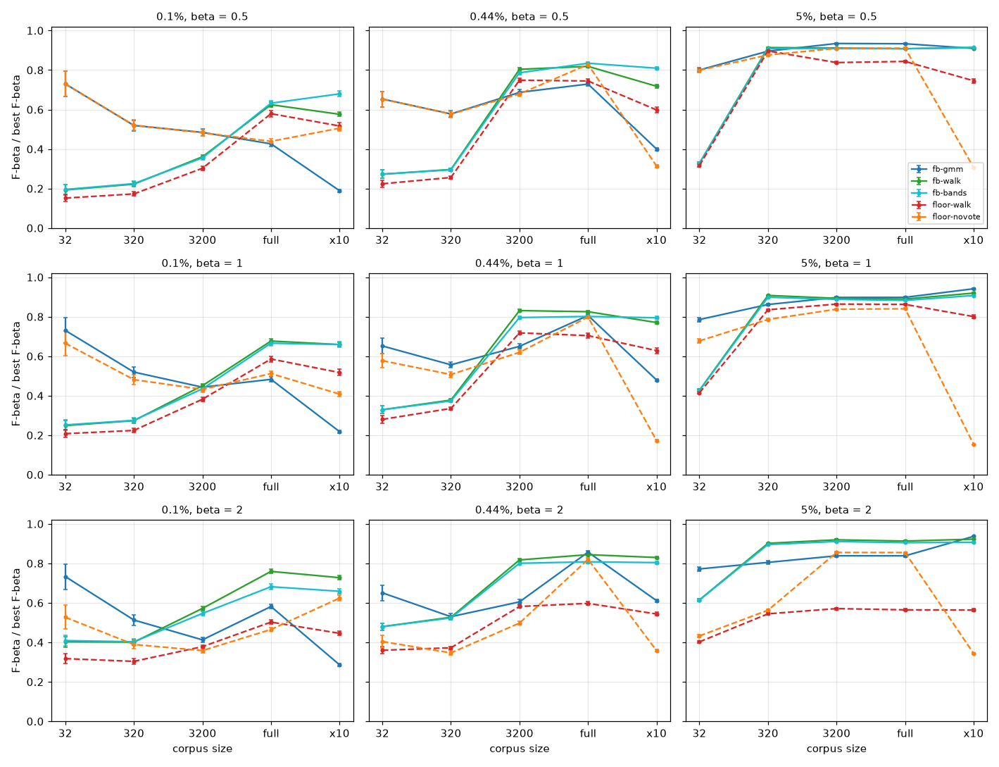
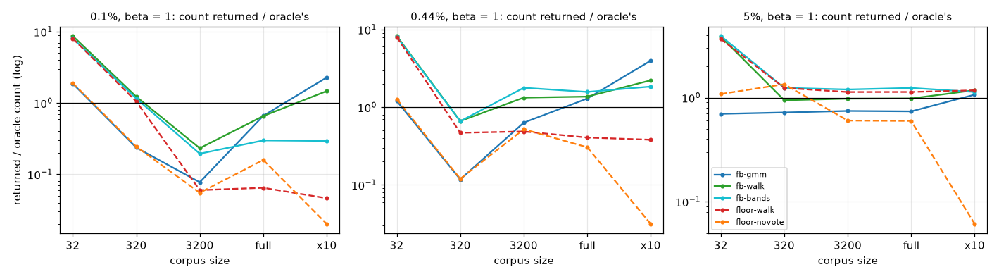

# Could the line be drawn at an F-beta optimum instead of a precision floor? (#4411)

**Issue:** #4411. **Date:** 2026-10-01. **Harness:**
`scripts/experiments/calibration/analyze_fbeta_line_4411.py` (figures:
`figure_fbeta_line_4411.py`). **Run:** `/expscratch/sgreenberg/fbeta-4411/full`
(job 797958, 74 s on 48 CPUs; `provenance.json`).

The owner's question (2026-10-01): the precision floor is one way to record a
preference; "what balance of precision and recall should we maximize?" is
another. Could users self-categorize by F-beta, with the line drawn at the
F-beta optimum and Autopilot driven from it?

## Answer

**Yes, it is feasible, with the same mechanism the floor uses: audits.** The
band walk with an F-beta stop (`fb-walk`) reaches 0.66–0.92 of the best F-beta
any cut gets on corpora of 3,200 items and up, at every prevalence and every
beta, and never collapses. Without audits it is not: the mixture's own F-beta
cut (`fb-gmm`) is the best rule on tiny corpora and at 5%, and returns 2–4× too
much on large sparse corpora (0.22–0.48 of the best F1 at ×10), because the
F-beta optimum needs the corpus's total positives and the mixture over-counts
them there (#3827). That is the same structure as the floor: the walk is the
line, the mixture is the no-vote fallback, and the fallback needs a cap.

What differs: the audited F-beta walk costs **about a third more votes** than
the floor's walk (28 against 20 on the 11.6k bench, 52 against 32 on a 100k
corpus); its own estimate of the set's F-beta is off by 0.15–0.21, against the
floor walk's 0.10–0.14 on precision; and an F-beta promise cannot be checked
the way "at least P of these are right" can. In return the preference is a
balance rather than a target, the metric is one number per preference
(F-beta over the best F-beta), and the optimum sits at the preference by
construction, which the floor's presets do not (an F1 cut lands at 91%
precision on large objects and 22% on small ones).

**The floor is not worse at its own target.** The tables below score the
floor's rules at F-beta through a preset mapping (beta 0.5 → P 90%, 1 → 50%,
2 → 10%), where they lose to the F-beta rules by 0.04–0.36. That is the mapping,
not the mechanism: a 10% floor is a far more recall-leaning preference than
F2, so the floor's walk at 10% returns well past the F2 optimum. At its own
objective the floor's walk tracks the oracle's count at every size (#4383).
The question is which preference the product asks for, and this report says
that either can be found.

## Setup

The inputs, worlds, sizes and draws are #4383's: the #4220 precision frames of
the default arm at 0.1%, 0.44% and 5% prevalence (720 cells each), read at
click 50 and 150, the test half resampled to 32, 320 and 3,200 items, the whole
half (~11.6k; ~1k at 5%) and a ×10 bootstrap. Every rule sees only the
corpus's scores, the session's votes and a few uniform audit picks per rank
band.

Rules, at beta = 0.5 (precision-leaning), 1 (balanced) and 2 (recall-leaning):

- `fb-gmm`: the vote-anchored mixture's posterior; tp(k) its cumulative sum,
  the total positives its total; k at the argmax of the estimated F-beta. No
  audits.
- `fb-walk`: the band walk (bands 8, 8, 16, 32, …; 5 uniform picks a band)
  with an F-beta stop: tp at each band edge from the audited bands, the total
  positives from the mixture; start at the mixture's argmax band, deeper while
  the estimate rises, else shallower while it rises.
- `fb-bands`: every band audited; tp and the total both from the picks.
- `floor-walk` / `floor-novote`: the shipped floor mechanism at the preset the
  preference maps to: the band walk at P, and the no-vote line
  min(schedule's count, mixture's crossing).

Scored as the returned set's F-beta over the best F-beta of any cut
(`fb_share`), with cluster (class × band, seed) SEs; `paired_vs_floor.csv`
pairs each rule against `floor-walk` on the same corpus.

## F-beta share of the best cut, click 150

Balanced (beta = 1):

| world | corpus | `fb-gmm` | `fb-walk` | `fb-bands` | `floor-walk` (P 50%) | `floor-novote` |
|---|---|---:|---:|---:|---:|---:|
| 0.1% | 320 | **0.52** | 0.27 | 0.28 | 0.22 | 0.48 |
| 0.1% | 3,200 | 0.44 | **0.45** | 0.43 | 0.38 | 0.43 |
| 0.1% | 11.6k | 0.48 | **0.68** | 0.67 | 0.59 | 0.51 |
| 0.1% | ×10 | 0.22 | **0.66** | 0.66 | 0.52 | 0.41 |
| 0.44% | 320 | **0.56** | 0.38 | 0.37 | 0.34 | 0.51 |
| 0.44% | 3,200 | 0.65 | **0.83** | 0.80 | 0.72 | 0.62 |
| 0.44% | 11.6k | 0.81 | **0.83** | 0.80 | 0.70 | 0.80 |
| 0.44% | ×10 | 0.48 | 0.77 | **0.79** | 0.63 | 0.17 |
| 5% | 320 | 0.86 | **0.91** | 0.90 | 0.84 | 0.79 |
| 5% | 1k | **0.90** | 0.89 | 0.88 | 0.86 | 0.84 |
| 5% | ×10 | **0.94** | 0.92 | 0.91 | 0.80 | 0.15 |

Cluster SEs are 0.00–0.03 everywhere but the 32-item corpora (0.04–0.07).
Beta = 0.5 and 2 tell the same story (`summary.csv`, the figure): `fb-walk`
0.58–0.91 on corpora of 3,200 and up; `fb-gmm` 0.19–0.40 on the ×10 sparse
corpora and 0.91–0.94 at 5%.

### What each rule returns (beta = 1, count / oracle's count, votes)

| world | corpus | `fb-gmm` | `fb-walk` | `fb-bands` | `floor-walk` |
|---|---|---|---|---|---|
| 0.1% | 11.6k | 114 / 173 | 113 / 173, 31 votes | 52 / 173, 60 | 11 / 173, 15 |
| 0.1% | ×10 | **3,583 / 1,571** | 2,308 / 1,571, 57 | 462 / 1,571, 75 | 73 / 1,571, 22 |
| 0.44% | 11.6k | 132 / 102 | 140 / 102, 30 | 161 / 102, 60 | 42 / 102, 21 |
| 0.44% | ×10 | **4,043 / 1,016** | 2,256 / 1,016, 56 | 1,876 / 1,016, 75 | 388 / 1,016, 32 |
| 5% | 1k | 39 / 52 | 51 / 52, 24 | 65 / 52, 42 | 59 / 52, 24 |
| 5% | ×10 | 559 / 524 | 617 / 524, 43 | 594 / 524, 60 | 615 / 524, 39 |

- **The mixture alone over-returns where it over-counts.** Its total-positives
  estimate is 28× the truth on the 0.1% ×10 corpus (#3827), the F-beta
  denominator is then dominated by it, and the estimated F-beta keeps rising
  with tp: 3,583 returned against 1,571. At 5%, where the count is right
  within 2×, it is the best rule.
- **The audits hold the walk.** With tp from the picks the walk stops at
  2,308 (1.5× the oracle) on that corpus and keeps 0.66 of the best F1; with
  the total from the picks too (`fb-bands`) it under-returns (462) and keeps
  the same 0.66, at 75 votes.
- **Tiny corpora are noise for every rule.** With 0–2 positives among 32–320
  items the oracle keeps 1–8, the walk's first band is 8, and the share is
  decided by whether the one positive is in it. `fb-gmm`, which returns 1–2,
  wins there by returning almost nothing.

## Cost, and honesty

Votes and the gap between a rule's own estimate of its F-beta and the truth,
beta = 1, pooled over worlds:

| corpus | `fb-walk` votes | `floor-walk` votes | `fb-bands` votes | `fb-walk` est. gap | `floor-walk` est. gap (precision) |
|---|---:|---:|---:|---:|---:|
| 320 | 23 | 16 | 35 | 0.15 | 0.10 |
| 3,200 | 22 | 18 | 47 | 0.17 | 0.10 |
| 11.6k | 28 | 20 | 54 | 0.15 | 0.11 |
| ×10 | 52 | 32 | 70 | 0.21 | 0.14 |

The F-beta walk audits more bands because its stop is an argmax, which needs
one band past the peak, and because it starts from the mixture's band rather
than a fixed schedule. Its estimate of the set's F-beta inherits the mixture's
total through the recall term, so it is less honest than the floor walk's
precision estimate; "how close we got" under F-beta would have to be stated
as a precision and a recall range rather than one number.

## What switching would mean

- **The preference:** a balance (three presets, beta 0.5 / 1 / 2, or a slider)
  instead of a floor. The optimum sits at the preference for every class,
  which the floor's presets do not.
- **The line:** the band walk with an F-beta stop, started at the mixture's
  band (`fb-walk`); the no-vote line the mixture's argmax **capped** by a
  schedule count, as the floor's is (uncapped it returns 2–4× too much on
  large sparse corpora, `fb-gmm` above).
- **Acquisition:** around the F-beta cut, the same code as #4409 with a
  different target depth.
- **The metric:** F-beta of the returned set over the best F-beta of any cut,
  one number per preference, with precision and recall beside it.
- **What is given up:** the checkable promise ("at least P of what you see is
  right", which 5 uniform picks can certify), ~a third more audit votes, and a
  less honest self-estimate. Every floor surface (the check's copy, `FloorState`,
  the eval's `min_precision` arm, #4408's per-P review, #4409's P-aware
  acquisition) would be reworked around beta.

## Files

- `summary.csv`: every rule's F-beta share, F-beta, precision, recall, count,
  votes per world × click × size × beta, with cluster SEs.
- `paired_vs_floor.csv`: each rule against `floor-walk` on the same corpus.
- `figures/`: `fb_share_by_size.png`, `count_vs_oracle.png`.
- Row-level table on the GRID: `rows.csv.gz` under the run directory.
