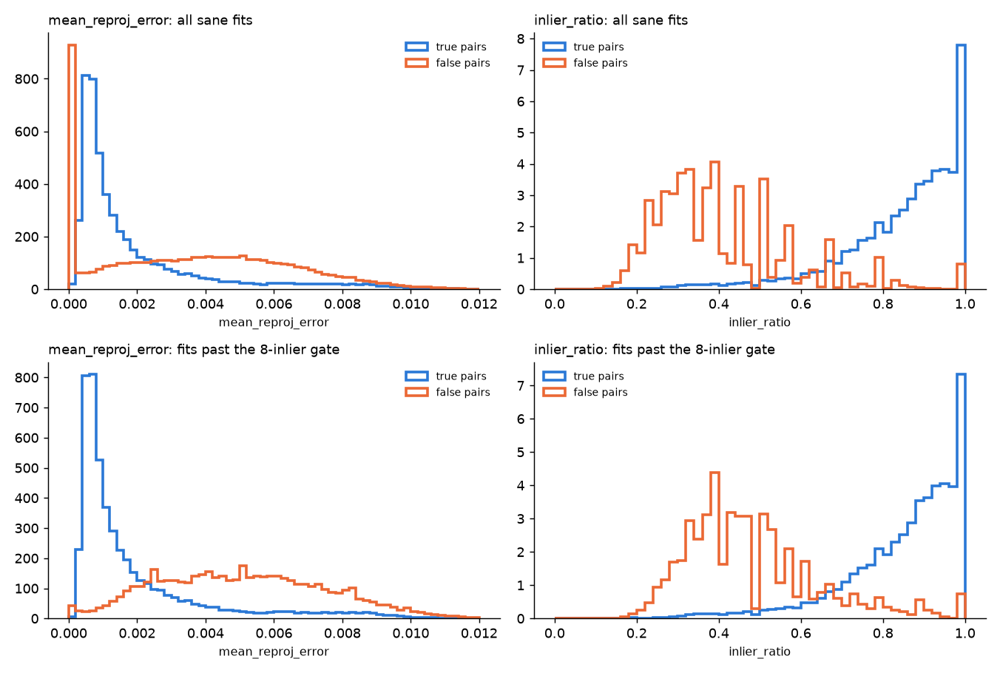

# Do the RANSAC fit statistics tell a true match from a false one? (#3349)

**Question (#3349, from #3329's inventory).** Structural search's RANSAC fit
computes a set of statistics: inliers, inlier ratio, tentative matches,
reprojection error, scale and spread. They were never validated. Until now
every corpus on the cluster was category-labelled, and on such a corpus a
"true pair" is two different objects, which correctly share no geometry.
FullMarks is **instance-level**: a class is one physical stamp or logo. So
here a true pair is real.

The issue also asked for a held-out ROC of the match-statistic verification
MLP. That head no longer exists: #4169 removed it, after it ranked worse than
the inliers on documents and photos. This report validates what replaced it.

**Answer.**

- **The inlier count is the right scorer.** It is the best single separator
  of true from false fits, AUC **0.95** at tier `s` and **0.97** at tier `m`.
- **Reprojection error is a trap if read alone.** Over all fits its AUC is
  **0.15–0.20**: it points the wrong way, so low error looks like a *false*
  match. False fits that get a sane model usually rest on 4–5
  correspondences, and a handful of points always fits almost perfectly.
  Only among fits with enough inliers does it mean what it seems to (AUC
  0.85–0.88 past the 8-inlier gate). Even there it says nothing for the
  query-crop template, which is matched across a large scale change (AUC
  0.55).
- **Past the gate (the hard negatives the line has to reject), inlier ratio,
  reprojection error, scale and spread all carry signal (AUC 0.83–0.88).**
  But none beats the inlier count consistently: the ratio leads at tier `s`
  (0.95 against 0.92) and trails at tier `m` (0.93 against 0.95). A
  multi-statistic accept rule is plausible. It would have to beat #4367's
  Bad-ceiling line end to end, and it is filed as #4434.



*Every template, tier `m`. Top: all fits with a sane model. Bottom: fits past
the 8-inlier gate. The false pairs' spike at reprojection error ≈ 0 is the
degenerate few-point fits, and it is gone past the gate.*

## Setup

- **Data:** #4162's template matrices, `fit_quality.py` on
  `/expscratch/$USER/fullmarks/votes-4162/matrix-{s,m}`. That is FullMarks
  v5.0, 36 roster classes, the `own_verified` pools (~5,000 pages at `s`,
  ~47,000 at `m`).
- **Templates:** each class has the query crop plus each positive page's box
  features (the production RegionYes template). Each was verified against
  every pool page with 8,192-keypoint SIFT, recording the 9 statistics of
  `match_stats_to_features`.
- **Pairs:** a pair is (template, page). It is true when the page carries the
  class. A template against its own page is excluded. Negatives are capped at
  200,000 a class (sampled).
- **AUC:** the probability that a random true pair outscores a random false
  one, with ties counted half. Reprojection error is negated, so a higher AUC
  always means "separates in the expected direction". It is checked against
  `sklearn.metrics.roc_auc_score` (identical to 1e-6).

## Results, every template

| statistic | tier `s`: AUC all fits / sane fits / **past the gate** | tier `m`: all / sane / **past the gate** |
|---|---|---|
| inlier count | 0.95 / 0.96 / **0.92** | 0.97 / 0.98 / **0.95** |
| inlier ratio | 0.86 / 0.96 / **0.95** | 0.86 / 0.95 / **0.93** |
| tentative count | 0.91 / 0.85 / **0.78** | 0.94 / 0.88 / **0.81** |
| mean reprojection error | **0.19** / 0.70 / **0.84** | **0.15** / 0.67 / **0.86** |
| median reprojection error | **0.20** / 0.72 / **0.85** | **0.16** / 0.69 / **0.88** |
| scale | 0.43 / 0.58 / **0.80** | 0.38 / 0.51 / **0.85** |
| inlier spread | 0.60 / 0.59 / **0.83** | 0.61 / 0.51 / **0.86** |
| reflection | 0.50 everywhere (never set: the 4-DoF fit cannot reflect) | |

A sane model (`model_ok`) is found for 93–97% of true pairs and 13–16% of
false ones. Past the gate there are 36k true against 123k false fits (tier
`s`), and 38k against 82k (tier `m`). That is the hard-negative pool #4367's
Bad ceiling already cuts down.

**The query crop alone** (tier `s`):
- inlier count AUC 0.94 overall, 0.92 past the gate;
- reprojection error **0.11** overall and only 0.55 past the gate.

The crop is cut and embedded separately and meets the page at a median scale
of 0.12. Its geometry is a cross-scale fit, whose residuals do not mean what a
same-page box template's do.

**Per class** (every template, past the gate, 30 classes with enough fits):

| statistic | median AUC | range |
|---|---:|---|
| reprojection error | 0.85 | 0.48–0.98 |
| inlier ratio | 0.90 | 0.21–1.00 |
| scale | 0.90 | 0.55–0.99 |
| spread | 0.94 | 0.56–1.00 |

Wide ranges: a pooled AUC is not a uniform one. `measurements/per_class_auc-*.csv`
holds every class.

## Reproduce

```bash
python scripts/experiments/fullmarks/fit_quality.py --matrix /expscratch/$USER/fullmarks/votes-4162/matrix-s --out <dir>/s
python scripts/experiments/fullmarks/fit_quality.py --matrix /expscratch/$USER/fullmarks/votes-4162/matrix-m --out <dir>/m
```

`measurements/` holds each tier's `summary.md`, `auc.csv` and
`per_class_auc.csv`. Note that tier `m`'s matrix holds templates only for
positives in the exemplar's top 20 (#4162).
