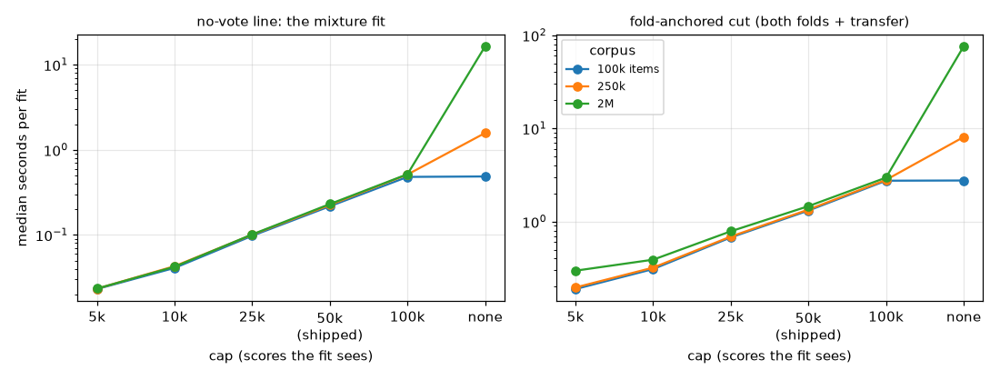
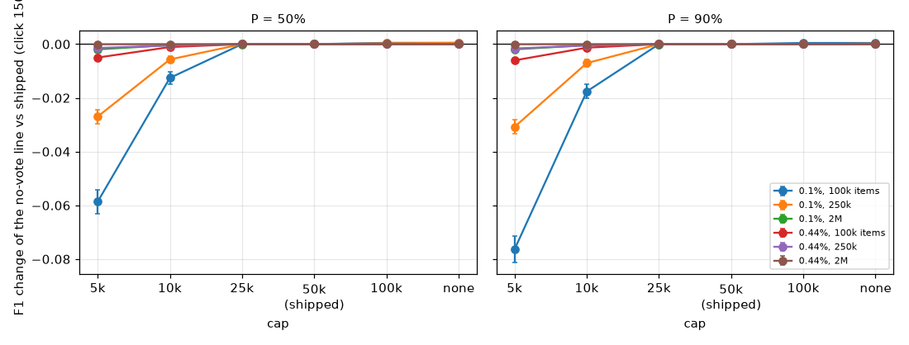
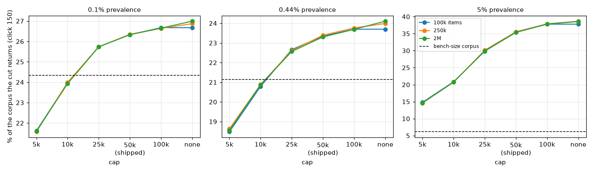

# What `_GMM_MAX_SAMPLES` changes, and saves, at the sizes it binds (#3827)

**Issue:** #3827. **Date:** 2026-10-01. **Harness:**
`scripts/experiments/calibration/analyze_gmm_cap_3827.py` (figures:
`figure_gmm_cap_3827.py`). **Run:** `/expscratch/sgreenberg/gmm-cap-3827/full`
(arrays 794590 + 796911, 2,160 cells × 2 click counts × 4 corpus sizes × 6
caps; `provenance.json`).

Every score mixture the app fits sees at most `_GMM_MAX_SAMPLES` = 50,000 scores;
above that, `gmm_fit_array` fits a deterministic seed-42 subsample. No study had
read the cap where it binds: every bench sort is under 50k, while a GUI Find
reaches ~250k and a CLI Find 2M+. The issue asked whether it could come down to
save time, and warned that doing so changes what the fit sees.

## Answer

- **The cap is not a precision knob; it sets how much the votes weigh.** Each
  vote counts `anchor_weight` points of the fitted sample (10 for the no-vote
  line's mixture, 0.3 for the fold-anchored cut), so the votes' share of a fit
  is `w·n / (min(N, cap) + w·n)`. Above the cap the cap fixes that share; below
  it, the share falls as the corpus grows. Removing the cap drowns the votes
  (0.001% of the fit at 2M); lowering it strengthens them.
- **Keep 50,000 for now.** On the line the user sees, nothing between 25k and
  no cap changes anything (≤ 5% of runs move a count, F1 within 0.001). 10k
  costs up to 0.018 F1 on the sparsest corpora. What does move is the
  fold-anchored cut, which draws no line under a floor but is where Autopilot's
  acquisition cut is read; there 10k would put the cut back where the bench
  tuned it on low-prevalence corpora, and much closer at 5%. That is an argument
  for fixing the vote weight, not for moving the cap: filed as #4406.
- **The saving is real but small.** 50k → 10k takes the fold-anchored cut from
  1.3–1.5 s to 0.31–0.39 s a fit (median; 5.8 → 1.2 s at the 90th percentile),
  and the no-vote mixture from 0.22 to 0.04 s. **No cap is ruled out on cost
  alone**: 76 s a cut fit at 2M (305 s at the 90th percentile), 16 s a mixture.

## Setup

The inputs are the #4220 precision frames of the #4383 study at 0.1%, 0.44% and
5% prevalence (720 cells each: 144 class × band cells × 5 seeds), read at click
50 and click 150. Each frame holds the test half's scores and labels, the
session pool's scores, the votes, and the calibration folds' haystacks and
held-out evidence.

**Every large corpus here is a bootstrap.** The bench's halves hold ~11.6k
items (the 5% world's thinned pool ~1k), so each corpus is the test half,
thinned to its world's prevalence, resampled with replacement to 100k, 250k or
2M items; each fold haystack and the final haystack are the session pool
resampled to the same size. A capped fit of a bootstrap corpus is a fit on a
smaller bootstrap of the same half. What the arms compare is therefore what a
cap-sized fit does to a fit of the bench's score distribution. A real 2M-item
corpus could have another shape. Absolute precision on these corpora is
inflated by duplicated top items, so the report reads only paired comparisons
against the shipped cap on the same corpus. The **bench-size corpus** (the
half itself, no resample, where the shipped cap does not bind) is the
reference: it is the size every threshold study tuned at.

**Arms:** the app's own code with `vtscore.training.thresholds.gmm._GMM_MAX_SAMPLES`
patched to 5k, 10k, 25k, 50k (shipped), 100k or no cap, asserted per fit.
**Readers:** the no-vote line (#4389: the smaller of the schedule's count and
`mixture_count`'s) and the fold-anchored cut, at inclusion 0 and at
Autopilot's acquisition offset (−4). Standard errors are clustered on
(world, class × band, seed). 5,400 of 95,808 cut fits had no fold haystacks
(the folds fell back: too few votes, or one class, mostly at click 50 at 0.1%);
their lines are read, their cuts are not.

## 1. What it costs

| cap | no-vote mixture fit | fold-anchored cut (2 folds + transfer) |
|---|---:|---:|
| 5k | 0.02 s | 0.19–0.30 s |
| 10k | 0.04 s | 0.31–0.39 s |
| 25k | 0.10 s | 0.68–0.79 s |
| **50k (shipped)** | **0.22 s** | **1.3–1.5 s** (p90 5.8 s) |
| 100k | 0.48–0.52 s | 2.7–3.0 s |
| none, 250k items | 1.6 s | 8.1 s |
| none, 2M items | 16 s (p90 89 s) | 76 s (p90 305 s) |

Medians over 3,992 fits a row, single-threaded, on GRID CPU nodes running the
array (so absolute times are under load; the ratios are what matter).



## 2. The cap sets how much the votes weigh

The votes' share of each fit, at click 150 (150 votes; ~45 held-out votes a
fold for the cut):

| corpus | no-vote mixture (w = 10) | fold-anchored cut (w = 0.3) |
|---|---:|---:|
| bench size, 0.1% / 0.44% (~11.6k) | 11% | 0.12% |
| bench size, 5% (~1k) | 60% | 1.6% |
| above the cap, cap 5k | 23% | 0.27% |
| above the cap, cap 10k | 13% | 0.14% |
| above the cap, **cap 50k** | **2.9%** | **0.027%** |
| no cap, 2M items | 0.07% | 0.001% |

So on any corpus above 50k the shipped cap makes the votes **4× lighter**
than on the ~11.6k-item corpus the anchor weights were tuned on, and a 10k cap
makes them about as heavy. The 5% world's bench pool is ~1k items, so its
reference sits at 60× the large-corpus weight, a regime no cap reaches.

## 3. The no-vote line barely notices it

F1 of the line the app keeps before any check, against the shipped cap on the
same corpus, click 150 (± SE; the share of runs whose count moved):

| world, corpus | P | cap 5k | cap 10k | cap 25k | no cap |
|---|---|---|---|---|---|
| 0.1%, 100k | 50% | −0.059 ± 0.005 (41%) | −0.013 ± 0.002 (12%) | 0 | 0.000 (1%) |
| 0.1%, 250k | 50% | −0.027 ± 0.003 (32%) | −0.006 ± 0.001 (10%) | 0 | 0.000 (1%) |
| 0.1%, 2M | 50% | −0.002 (17%) | 0.000 (4%) | 0 | 0.000 (1%) |
| 0.44%, 100k | 50% | −0.005 ± 0.001 (17%) | −0.001 (3%) | 0 | 0 |
| 0.1%, 100k | 90% | −0.076 ± 0.005 (48%) | −0.018 ± 0.003 (15%) | 0 | 0 |
| 0.1%, 250k | 90% | −0.031 ± 0.003 (38%) | −0.007 ± 0.001 (12%) | 0 | 0.000 (1%) |



- **From 25k up, the line does not move** (at most 5% of runs change a count,
  and F1 by ≤ 0.001, at every world, size, floor and click count).
- **Why so little:** on a corpus this large the mixture's count runs far past
  the schedule's 32, and the line keeps the smaller; a heavier vote weight
  tightens the mixture, which bites only where its count was near 32 already:
  the sparsest corpora at 100k–250k items. At 5% it never bites (the mixture
  says more than 32 in every arm).
- **The loss at 10k is a few fewer items, not worse ones:** 29 kept instead of
  32 at 0.1% / 100k, at the same precision (0.55 against 0.54) and shortfall
  (−0.001 ± 0.002 at P = 50%).
- Click 50 says the same with smaller effects (10k: at most −0.003 F1 above
  the cap).

## 4. The fold-anchored cut moves with it

The share of the corpus the cut returns at inclusion 0 (the line with no floor),
click 150, with the F1 of that set; the acquisition cut (offset −4) beside it:

| world | corpus | cap 5k | cap 10k | cap 25k | **cap 50k** | no cap | acquisition cut, 10k / 50k |
|---|---|---|---|---|---|---|---|
| 0.1% | bench size | 21.8% | 24.1% | 24.3% | **24.3%** | 24.3% | 6.8% / 6.9% |
| 0.1% | 100k–2M | 21.6% | 24.0% | 25.7% | **26.3%** | 26.7–27.0% | 6.8% / 7.6% |
| 0.44% | bench size | 18.7% | 20.9% | 21.1% | **21.1%** | 21.1% | 6.7% / 6.8% |
| 0.44% | 100k–2M | 18.5% | 20.8% | 22.6% | **23.3%** | 23.7–24.1% | 6.7% / 7.7% |
| 5% | bench size (~1k) | 6.1% | 6.1% | 6.1% | **6.1%** (F1 0.49) | 6.1% | 1.4% / 1.4% |
| 5% | 100k–2M | 14.7% (0.41) | 20.8% (0.35) | 30.0% (0.27) | **35.5%** (0.23) | 37.8–38.7% (0.21) | 5.8% / 10.2% |



- **At low prevalence a 10k cap puts the cut on a large corpus exactly where
  the bench-size corpus has it** (24.0% against 24.3%; 20.8% against 21.1%).
  The shipped 50k lets it drift 2 points looser, and no cap 3. The cut at
  inclusion 0 balances false positives against false negatives, so at 0.1–0.44%
  it returns a fifth of the corpus at 1–5% precision whatever the cap; F1 is
  not its objective, and it moves by ≤ 0.02.
- **At 5% the shipped cap lets the cut return a third of a large corpus**
  (35%, F1 0.23) where the 1k-item bench returns 6% (F1 0.49). Even 5k (15%)
  does not get back, because the bench's votes weigh 60× more than any cap
  allows.
- Under a floor this cut draws no line (#4272). It still reaches the user
  through **Autopilot's acquisition cut**, which on a large 5% corpus sits at
  10% of the corpus under the shipped cap against 1.4% at bench size. What that
  does to a session is not measured here; under a floor the acquisition cut
  already saturates near the line (#4333).
- At click 50 the cut moves much less (5%: 24–25% of a large corpus at every
  cap, 21% at bench size), because the held-out votes are fewer.

## Recommendation

1. **Keep `_GMM_MAX_SAMPLES` = 50,000.** Lowering it to save ~1 s a cut fit
   on corpora above 50k would change the vote weight on those corpora: harmless
   on the user's line from 25k up, and probably good for the cut at 10k, but it
   is a statistical change, and it would leave the weight still depending on
   the corpus size below the cap.
2. **Make the vote weight relative to the fitted sample** (#4406), so the
   votes weigh the same on any corpus. Then the cap only sets how precisely the
   mixture is estimated, and it can drop to 10–25k for the saving, priced as
   a pure precision change.
3. **Never remove the cap:** 76 s a cut fit at 2M, and the votes vanish.

## Reproduce

```bash
cd scripts/experiments/calibration
W="--world 0.44%=/expscratch/sgreenberg/div-4197/natural-new/results --world 0.1%=/expscratch/sgreenberg/div-4197/p0.001-new/results --world 5%=/expscratch/sgreenberg/guard-4303/h0.05-new/results"
# 144 shards, 4 CPUs each (OMP_NUM_THREADS=1), then merge:
python analyze_gmm_cap_3827.py $W --out OUT --steps 50,150 --jobs 4 --shard K/144
python analyze_gmm_cap_3827.py --merge OUT
python figure_gmm_cap_3827.py --run OUT --out figures
```

## Files

- `summary_lines.csv`: each arm's no-vote line (`gmm` and `min-fixed-gmm`) per
  world × click × size × floor × cap, paired against the shipped cap.
- `summary_cuts.csv`: where each arm's cut sits, how far it moved from the
  shipped cap's, and the F1 of its set.
- `timing.csv`: seconds per fit by size and cap.
- `figures/`: `cost_by_cap.png`, `line_by_cap.png`, `cut_by_cap.png`.
- Row-level tables on the GRID: `lines.csv.gz`, `cuts.csv.gz` under the run
  directory.
