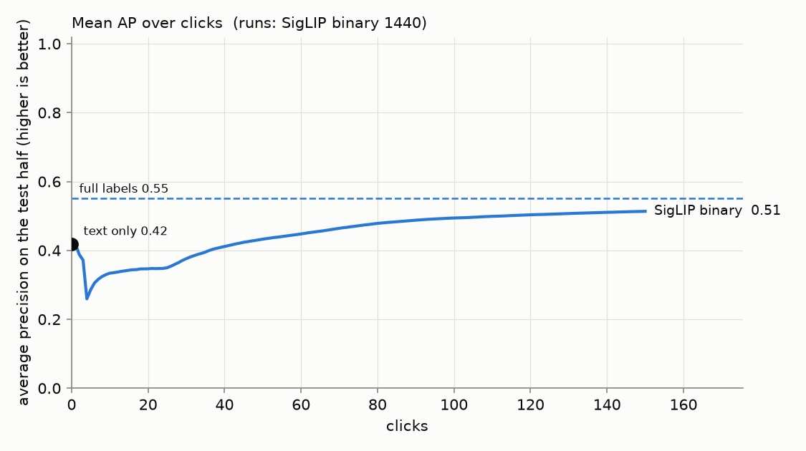
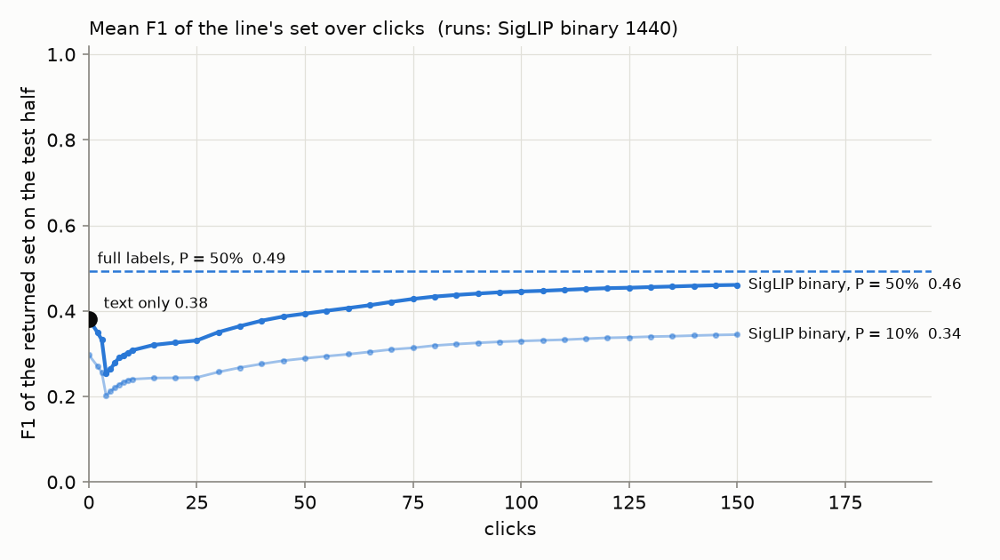
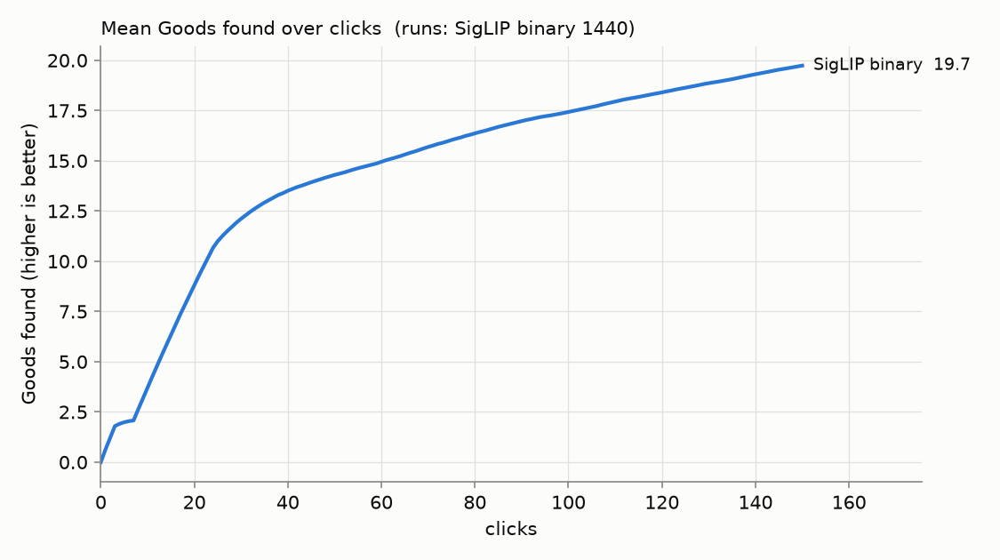
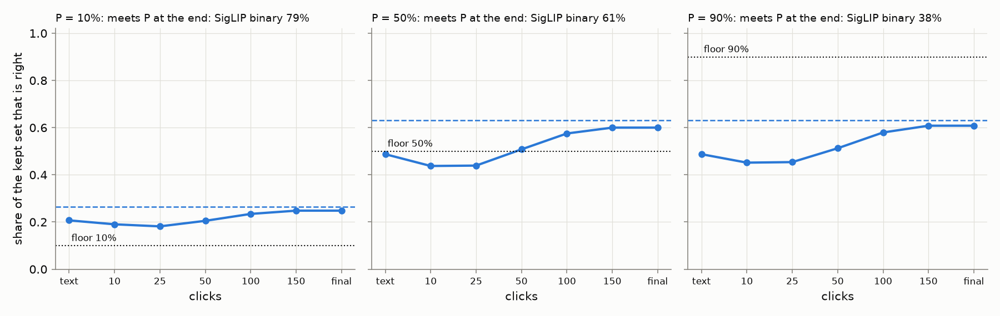
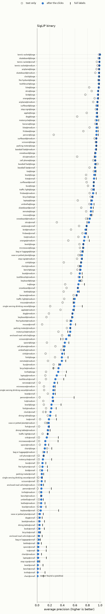
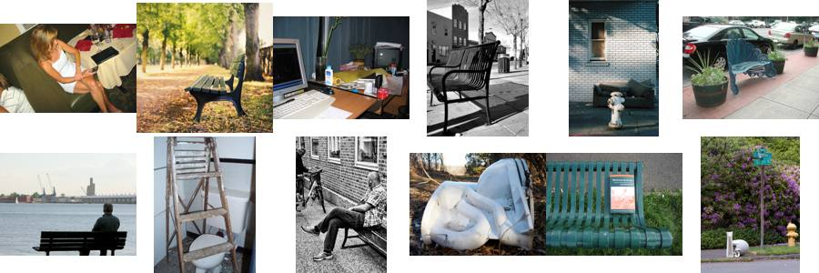
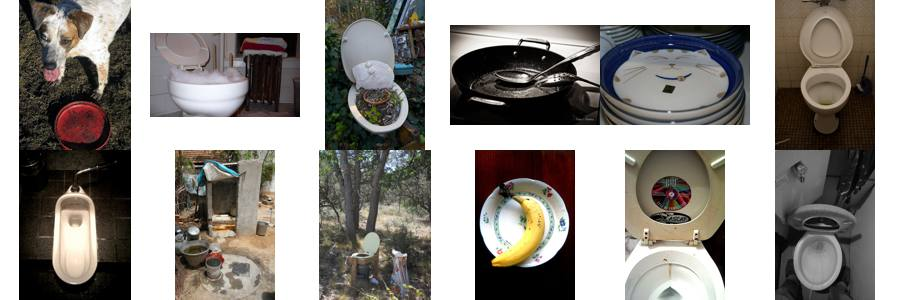
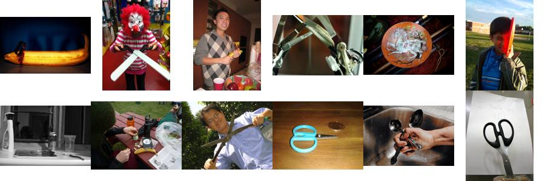

# State of the App: Binary Photo — 2026-10-01

**Issues:** #4402 (this review). **Recipe:** `.claude/skills/state-of-the-app/SKILL.md`.
**App:** `dev` at fa813db10: the spot check is the band walk (#4388), and before
any check the line keeps the smaller of the schedule's count and the
vote-anchored mixture's (#4389).
**Path:** SigLIP whole-image embedding, binary (Good/Bad) votes, Autopilot's shipped
opening (`g3@top,b4@mid,g20+dry1/16@top`, #4288), and the default precision
floor, P = 50%.
**Bench:** `coco_better`, all 49 classes at every size they have: 144 cells.
**Seeds:** 10 (1,440 runs).
**Run:** `/expscratch/sgreenberg/state-of-the-app/2026-09-30-walk2` (job 794693,
2026-09-30 22:24 to 00:30; median 6 min and ~1 GB a run at 1 CPU), from a frozen
worktree at c5f55732c. That commit adds one thing to `dev`: the rank frames
record how many items the shipped line keeps on the test half
(`test_line_k_p10/p50/p90`). It is a pure read; a first run without it
(`2026-09-30-walk`) is identical outside the timing columns, click for click.

A **review**, not an experiment: the app as it ships, the way a user meets it.
The user types a query and sees the text sort. They then vote for 150 clicks
while Autopilot picks what to show them. At the end they run the floor's spot
check once. Every curve runs from the **text-only ranking at click 0**, through
the clicks, to the **full-label ceiling**: the same head trained on every label
in the training half.

- **AP** is average precision of the detector's ranking of the held-out test
  half. It needs no threshold, so it is about the ranking only.
- **The line at P** is what the floor keeps on a fresh corpus (the 11.6k-image
  test half) before any check: the smaller of the schedule's count (the top 128
  at P = 10%, the top 32 at 50% and 90%) and the count the session's
  vote-anchored mixture says is at least P right, as a Find over a corpus
  holding the session's votes draws it. The text sort and the full-label model
  drew no line in a session, so they are read at the schedule's count. For each
  P the tables give the share of the kept set that is right, the share of runs
  meeting P, recall next to the **oracle's** (the best recall any cut of the
  same ranking reaches at precision ≥ P), and the set's **F1** next to the best
  F1 any cut reaches.

## Headline

| mean over 1,440 runs | text only | 25 clicks | 50 clicks | 150 clicks | full labels |
|---|---:|---:|---:|---:|---:|
| **AP** | 0.42 | 0.35 | 0.43 | **0.51** | 0.55 |
| **F1 of the returned set, P = 50%** | 0.38 | 0.33 | 0.39 | **0.46** | 0.49 |
| **Goods found** | — | 11 | 14 | **20** | — |

1. **150 clicks close about two thirds of the gap to full labels.** AP rises
   from 0.42 to 0.51 against a ceiling of 0.55. F1 of the returned set rises
   from 0.38 to 0.46 against 0.49, and the best cut of the final ranking would
   give 0.54.
2. **The first detector ranks worse than typing the query, for about 40
   clicks.** Mean AP falls from 0.42 to **0.26 at click 4**, once the first 3
   Goods and 1 Bad train a head, and is back at the text-only level at
   **click 43**. F1 does the same: 0.38 → 0.25 at click 4, back at click 45.
   Run by run, the median run holds its text-only AP for good only from click
   49; 24% of runs are back by click 25, 52% by 50, 78% by 100, and **12% (172
   runs) are still below the typed query at click 150**. Ten seeds confirm what
   five showed; it is **#4384**.
3. **Harvest is front-loaded.** 11 of the 20 Goods arrive in the first 25
   clicks; the last 100 clicks find 5.

### The line on a fresh corpus

| floor P | point | kept | right | runs meeting P | recall | oracle recall at P | F1 | best F1 |
|---|---|---:|---:|---:|---:|---:|---:|---:|
| 10% | text only | 128 | 21% | 68% | 0.53 | 0.58 | 0.30 | 0.45 |
| | 150 clicks | 124 | **25%** | **79%** | 0.61 | 0.67 | 0.35 | 0.54 |
| | full labels | 128 | 27% | 92% | 0.68 | 0.76 | 0.38 | 0.58 |
| 50% | text only | 32 | 49% | 51% | 0.31 | 0.42 | 0.38 | 0.45 |
| | 25 clicks | 30 | 44% | 43% | 0.27 | 0.33 | 0.33 | 0.38 |
| | 150 clicks | 31 | **60%** | **61%** | 0.38 | 0.50 | 0.46 | 0.54 |
| | full labels | 32 | 63% | 62% | 0.41 | 0.54 | 0.49 | 0.58 |
| 90% | 150 clicks | 30 | 61% | **38%** | 0.38 | 0.38 | 0.46 | 0.54 |
| | full labels | 32 | 63% | 36% | 0.41 | 0.39 | 0.49 | 0.58 |

- **At the default 50%, the clicks take the kept set from 49% to 60% right,**
  within 3 points of full labels (63%), and 61% of sessions meet the floor.
- **On this corpus the line keeps the schedule's 32 almost every time.** At
  click 150 the mixture says fewer in 4.4% of runs at P = 50% and 12% at 90%;
  early in a session more often (14% and 26% at click 5), when a young head's
  mixture is narrow. Read against the schedule's 32 on the same rankings, the
  shipped line is a little more often right and gives up a little recall:
  60.0% right against 59.3%, 61% of runs meeting 50% against 59%, F1 0.461
  against 0.464. That is the #4389 pricing's bench row (−0.003 F1) seen in the
  app's own sessions. The 11.6k-image half is the one corpus where 32 is about
  the right size; what the mixture buys on small and sparse corpora is in
  `docs/experiments/2026-09-30-line-estimate-4383/REPORT.md`, not here.
- **Recall trails the oracle at 50%: 0.38 against 0.50.** The line keeps about
  32, the oracle as many as stay at ≥ 50%. That gap is the line rule, not the
  detector; the spot check is what grows the set, and it runs in Train, not here.
- **At 90%, a run meets the floor 38% of the time,** with a mean shortfall of
  0.32. Without a check, 90% keeps nearly the same set as 50%.

## The spot check

At click 150 each session runs the band walk once on its own ranking: the
unvoted items, cut into bands of 8, 8, 16, 32, …, 5 uniform picks a band, deeper
while the picks' band-weighted share meets P, shallower while it does not.

| checks | confirmed | the set it keeps | picks | mean range | truth (share right of the kept set) | range held the truth |
|---:|---:|---|---|---|---:|---:|
| 1,403 | **49%** | 8 in 59%, 16 in 18%, 32 in 20%, 64 in 3% | median 15 (90th pct 20) | 11%–76% | 39% | 100% |

- **It confirms half the time, and keeps 8 more often than not.** A confirmed
  set is 59% right on average; a short one, 20%. The large band confirms 69% of
  the time (mean kept 21), medium 47%, small 27%.
- **It checks the session's leftovers.** The ranking it walks is the unvoted
  remainder of the session's own pool, and by click 150 Autopilot has voted on
  most of the positives near its top. So a short walk mostly means "found most
  of them already", not "the detector is wrong". The same detector's top 32
  on a fresh corpus is 60% right (above). What a Train-time check should
  certify is **#4358**.
- **The range is honest but wide:** it held the truth in all 1,403 checks, at
  a mean width of 0.65. Fifteen picks can say little more.

## Where the app does well and where it does poorly

| band (cells) | text only | 150 clicks | full labels | F1 at 150 | line at 50%: right | runs meeting 50% | Goods found |
|---|---:|---:|---:|---:|---:|---:|---:|
| large (49) | 0.70 | **0.80** | 0.82 | 0.68 | 87% | 92% | 29 |
| medium (49) | 0.38 | **0.49** | 0.51 | 0.45 | 60% | 64% | 20 |
| small (46) | 0.16 | **0.24** | 0.30 | 0.24 | 32% | 25% | 9.9 |

**Well:** sports equipment and other things a scene is *about*, with a
silhouette SigLIP knows.

| class | text only | 150 clicks | full labels |
|---|---:|---:|---:|
| tennis racket | 0.96 | **0.99** | 0.99 |
| skateboard | 0.87 | **0.94** | 0.96 |
| kite | 0.81 | **0.94** | 0.96 |
| surfboard | 0.88 | **0.93** | 0.94 |
| baseball bat | 0.91 | **0.93** | 0.93 |
| airplane | 0.83 | **0.91** | 0.91 |
| skis | 0.61 | **0.90** | 0.89 |

**Poorly:** furniture, tableware and cutlery: things that fill a scene rather
than define it.

| class | text only | 150 clicks | full labels | why (below) |
|---|---:|---:|---:|---|
| chair | 0.06 | **0.05** | 0.13 | clicks made it worse |
| bowl | 0.05 | **0.10** | 0.20 | loop |
| knife | 0.06 | **0.14** | 0.26 | loop |
| dining table | 0.12 | **0.14** | 0.20 | embedding |
| spoon | 0.07 | **0.20** | 0.28 | mixed |
| enclosed road vehicle | 0.15 | **0.20** | 0.24 | embedding |
| bottle | 0.15 | **0.24** | 0.29 | mixed |
| bench | 0.24 | **0.25** | 0.26 | embedding |
| fork | 0.15 | **0.27** | 0.33 | mixed |
| book | 0.24 | **0.27** | 0.32 | mixed |

**Why.** The ceiling separates two cases. When it is also low, the embedding
can't separate the class. When it is high but the final AP is not, the loop
failed to collect the labels. The confusers are the images Autopilot most often
showed as Bad (`why.py`, `why/why.csv`), with what COCO says they hold, ranked
by lift over the corpus.

- **chair: the clicks make it worse (0.06 → 0.05), and the ceiling is 0.13.**
  Bad clicks most often hold a **couch (18%, 10× the corpus rate) or a bench
  (16%, 10×)**, then a toilet (9%). Whole-image SigLIP sees "a seat" and cannot
  tell which kind, and chair@small never finds a positive in any of the 10
  seeds.
  
- **bowl: the loop.** The ceiling is 0.20 against a final 0.10. A quarter of
  its Bad clicks hold a **toilet (25%, 12×)**, and broccoli (6%, 13×): round
  white things and food.
  
- **knife: the loop.** The ceiling is 0.26 against a final 0.14. Bad clicks hold
  **scissors (11%, 46×)**, then oranges and pizza. The head learns
  "blade-shaped metal" before it learns "knife".
  
- **spoon: mixed.** Its confusers are toothbrushes (33×) and knives (31×): long
  thin things held in a hand.
- **dining table: the embedding.** The ceiling is 0.20, close to the final
  0.14. Its Bad clicks hold chairs (12%, 9×) and couches (11%, 6×): "a room
  with furniture", whichever kind.
- **bench: the embedding.** 0.24 → 0.25 against a ceiling of 0.26. Its Bads are
  other street furniture: parking meters (11×) and fire hydrants (5×).
- **person: the query, rescued by clicks.** The typed query ranks badly (0.10)
  and clicks lift it to 0.42, the biggest gain in the review. Its ceiling of
  0.59 leaves the most headroom of any class.

## Headroom (full labels minus 150 clicks)

The mean is 0.04 (0.55 − 0.51). It concentrates in a few classes: person
(0.18), knife (0.13), bowl (0.11), keyboard (0.10), chair (0.09), laptop (0.09)
and spoon (0.08). Everything else is within 0.08 of its ceiling, and tennis
racket, skis and snowboard sit at or above it (a head trained on 150 chosen
labels can beat one trained on every label when the extra labels are noisy).

## What the clicks bought (150 clicks minus text only)

- **Most:** person +0.31, skis +0.30, dog +0.24, sink +0.22, mouse +0.20,
  single serving drinking vessel +0.19. A query that ranks the class badly gets
  fixed by votes.
- **Least:** chair −0.01, bench +0.02, parking meter +0.02, bag or luggage
  +0.02, dining table +0.02. For those, 150 clicks do not beat typing. Baseball
  bat (+0.02) and tennis racket (+0.03) are here too, but because the typed
  query is already at the ceiling.

## Images

**418 images have an effect of their own** (10+ clicks, |z| > 3, net of the
cell, label and phase they were clicked in, of 8,543 tested): **127 helpful,
291 harmful**, against 6–9 helpful and 20–43 harmful in five shuffles of images
within their buckets. At 10 seeds both sides are real; at 5 the helpful side
was at chance. Thumbnails and the full lists are in [`images.md`](images.md).

- **The strongest harmful image × class pairs are correct negatives that share
  a cue with the class.** Checked at full size (not thumbnails), none of the
  top six is a label error:
  - 277888, clicked Bad for **banana** 14 times (z −28): stuffed toys on a bed,
    among them a brown bird with a yellow beak and feet;
  - 435811 for **airplane** (z −18): a depot of school buses;
  - 283700 for **tie** (z −14): a tow truck beside a coach;
  - 113521 for **kite** (z −11): a man on a bicycle in traffic;
  - 253491 for **apple** (z −11): an Apple keyboard and mouse;
  - 49979 for **stop sign** (z −8.3): motorcyclists at sunset.

  Each is a right answer that costs AP. The likely mechanism, not measured
  here: a Bad vote on an image that shares the class's colour, setting or name
  pushes the head away from that shared cue. Nothing here belongs in the
  corrections file.
- **The harm is early.** The harmful images do their damage in the first
  clicks and are harmless late: 277888 costs 0.089 AP a click early (14
  clicks) and nothing late (2).
- **Most helpful:** 67527, clicked Bad 22 times for 5 detectors, +0.13 AP a
  click (z 3.8), 20 of the 22 early.

## Known regimes to flag, not to fix

- **Runs that never train a detector:** 37 of 1,440 (2.6%), all in the small
  band: chair@small in every seed, knife@small in 7, bowl@small in 6, vase or
  potted plant@small in 3, and one or two seeds of eight others. That is
  #4216's starved regime.
- **Runs that exhaust the nearby positives** before 150 clicks. Under the floor
  they show up in the spot check, which then checks what is left (#4358).
- **The line on this corpus is close to the schedule's count** (above). The
  11.6k-image test half says nothing about what the mixture does on a corpus a
  tenth or ten times its size.

## What to A/B next

- **#4384:** the first-detector dip, confirmed at 10 seeds: serve the text sort
  until the head earns it, blend early, or interleave Bads into the walk.
- **#4358:** what the Train-time spot check should certify; today it walks the
  session's leftovers and keeps 8 in 59% of runs.
- **#4359:** Stable and Smart under the floor.
- **#4404:** early correct negatives that share a cue with the class (above):
  is it the cue, and does down-weighting early Bads remove the damage?

## Files

- `figures/`: `ap_over_clicks.png`, `f1_over_clicks.png`,
  `goods_over_clicks.png`, `line_at_floors.png`, `per_cell.png`.
- `why/`: `why.csv` and confuser sheets for chair, bowl and knife (from the
  first run's clicks, which are the same).
- `images.md` and `images/`: the per-image tables with thumbnails.
- Analysis tables on the GRID: `analysis-binary/{cells,lines,line_steps,curves,influence,images,harmful_pairs}.csv`
  and `summary.md` under the run directory.
