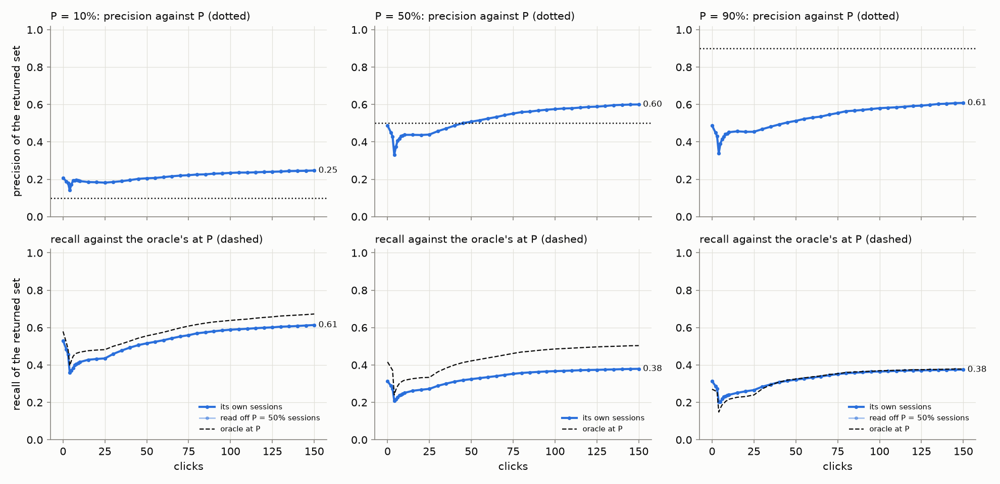
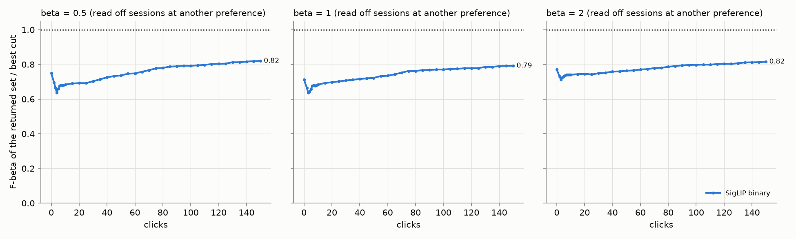

# State of the App per floor: sessions at P = 10 / 50 / 90%, scored at their own P (#4408)

**Issue:** #4408. **Date:** 2026-10-01. **Recipe:** `.claude/skills/state-of-the-app/SKILL.md`
(`perp.py`). **App:** `dev` at fa813db10 (the P = 50% run) and de04637bf (the 10% and
90% runs): the band-walk spot check (#4388) and the no-vote line (#4389); the
floor-era app, before the balance switch (#4413). **Path:** SigLIP whole-image,
binary votes, Autopilot's shipped opening, 150 clicks, the floor's spot check
once at the end. **Bench:** `coco_better`, 49 classes at every size, 144 cells
× **10 seeds per P** (4,320 runs). **Runs:** `/expscratch/sgreenberg/state-of-the-app/2026-09-30-walk2`
(50%), `2026-10-01-p10`, `2026-10-01-p90`; re-analyzed on 54efe9b47 (the
analyzer that scores the returned set at its own P and at each balance).

The owner's ruling (2026-10-01 02:20): the quality of what the app **returns**
matters more than its ranking, the user sets P, and F1 cannot see P (the 50% and
90% lines keep the same ~31 items and got the same F1). So each floor gets its
own sessions, and the returned set is scored at the P it aimed for: its
**precision against P** (below P breaks the promise, far above it leaves recall
behind) and its **recall against the oracle's recall at P** (the most any cut of
the same ranking returns at or above P).

This is the **floor-era control**: at 03:42 the owner ruled, after #4411, that
the preference becomes a balance (F-beta's beta, #4413). The balance's reading
of these same sessions is at the end, as the picture the switch is measured
against.

## 1. The floor-era session ignores P

| sessions at | final AP | ceiling AP | Goods found | check confirms |
|---|---:|---:|---:|---:|
| 10% | 0.513 | 0.55 | 19.3 | 91% |
| 50% | 0.514 | 0.55 | 19.7 | 48% |
| 90% | 0.514 | 0.55 | 19.8 | 25% |

The ranking and the harvest are the same at every floor, and the 10% and 90%
lines read off the 50% sessions are the lines their own sessions draw
(precision 0.248 against 0.247 at 10%; 0.608 against 0.608 at 90%,
`perp_summary.md`). Autopilot's acquisition does not read P (#4409, the survey
of 2026-09-30: for a top-32 line the acquisition cut saturates at the
estimator's strict end), and the line's count differs by P only at the margin
(#4389's mixture lowers it in 4% of runs at 50%). So reading every P off one
set of sessions was exact for this app. It stops being exact once acquisition
follows the preference, which is what #4413's step 5 prices.

## 2. The returned set at each P (its own sessions, click 150)

| P | kept | precision | gap to P | runs meeting P | recall | oracle recall at P | share |
|---|---:|---:|---:|---:|---:|---:|---:|
| 10% | 125 | 25% | **+0.15** | 79% | 0.61 | 0.67 | 0.91 |
| 50% | 31 | 60% | +0.10 | 61% | 0.38 | 0.50 | 0.75 |
| 90% | 30 | 61% | **−0.29** | 38% | 0.38 | 0.38 | 0.99 |

- **At 10% the app over-delivers precision and under-delivers recall.** The set
  is 25% right against a 10% target, and keeps 0.61 of the positives where a
  cut at 10% could keep 0.67. The count is the schedule's 128, which on this
  11.6k-image corpus stops well short of the 10% crossing.
- **At 50% it is about on target** (60% right, 61% of runs meeting P) and
  returns three quarters of what a 50% cut could.
- **At 90% the promise is broken in 62% of runs.** The set is 61% right
  against 90%. Its recall equals the oracle's at 90% only because that oracle
  keeps a tiny set; a `share` at or above 1 where the set does not meet P is
  not a success, it is a set that traded the promise for recall.
- **The text sort**, before any click, sits at 21% / 49% / 49% right at the
  three floors; 150 clicks move it to 25% / 60% / 61%. The click-4 dip (#4384)
  shows at every P: precision 18% / 43% / 44% at click 4, back above the text
  sort by click 8 (24% / 55% / 56%).
- **The spot check** confirms the line in 91% of runs at 10%, 48% at 50% and
  25% at 90%, walking the session's unvoted leftovers (#4358).

## 3. The balance's before-picture (the same sessions, F-beta over the best cut)

Read off these floor sessions, with the line the balance would keep before any
check (the mixture's F-beta argmax under the cap, `test_line_k_b*`):

| beta | point | kept | precision | recall | F-beta | best F-beta | share |
|---|---|---:|---:|---:|---:|---:|---:|
| 0.5 | text | 32 | 0.49 | 0.31 | 0.44 | 0.49 | 0.75 |
| 0.5 | 150 clicks | 32 | 0.59 | 0.38 | 0.53 | 0.59 | **0.82** |
| 0.5 | full labels | 32 | 0.63 | 0.41 | 0.57 | 0.62 | 0.87 |
| 1 | text | 32 | 0.49 | 0.31 | 0.38 | 0.45 | 0.71 |
| 1 | 150 clicks | 32 | 0.59 | 0.38 | 0.46 | 0.54 | **0.79** |
| 1 | full labels | 32 | 0.63 | 0.41 | 0.49 | 0.58 | 0.83 |
| 2 | text | 128 | 0.21 | 0.53 | 0.40 | 0.48 | 0.77 |
| 2 | 150 clicks | 128 | 0.24 | 0.62 | 0.47 | 0.56 | **0.82** |
| 2 | full labels | 128 | 0.27 | 0.68 | 0.52 | 0.61 | 0.86 |

- The share at click 150 is 0.82 / 0.79 / 0.82 at beta 0.5 / 1 / 2, and it is
  the same off the 10%, 50% and 90% sessions (0.819 / 0.820 / 0.819 at beta 0.5).
  That is the number the switch has to beat: sessions run at beta, with the
  F-beta walk and acquisition at the F-beta argmax (#4413 steps 4 and 5).
- On this corpus the mixture's argmax never undercuts the cap, so the kept set
  is the cap's 32 / 32 / 128: the balance's before-picture is the fixed count
  scored at F-beta.

## Files

- `figures/returned_at_own_p.png` (each P off its own sessions, `perp.py`),
  `figures/returned_at_beta.png` (the 50% sessions at each balance).
- `perp_summary.md`: the per-P table with the 50% sessions' reading of the
  other floors beside each.
- On the GRID: each run's `analysis-binary/{cells,lines,line_steps,balances,balance_steps,curves}.csv`
  and `summary.md`; the side-by-side under `2026-10-01-perp/perp/`.
