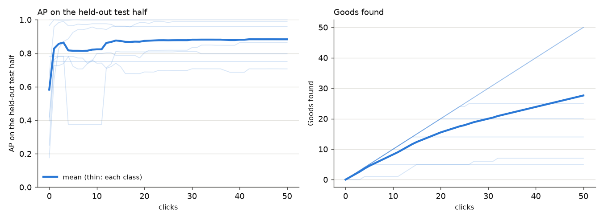
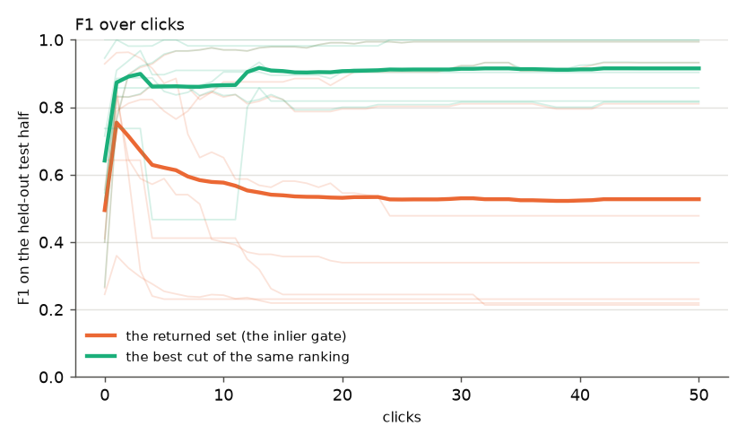
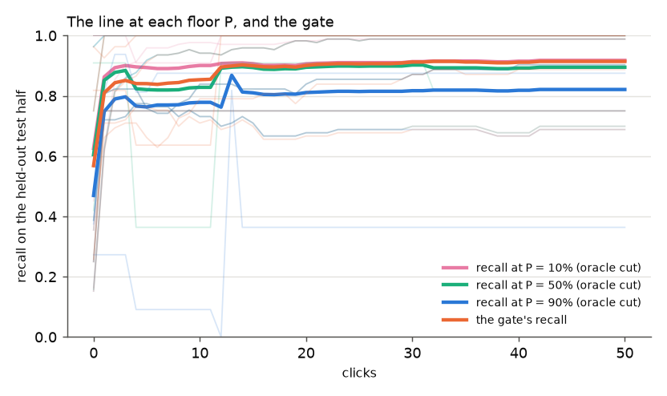
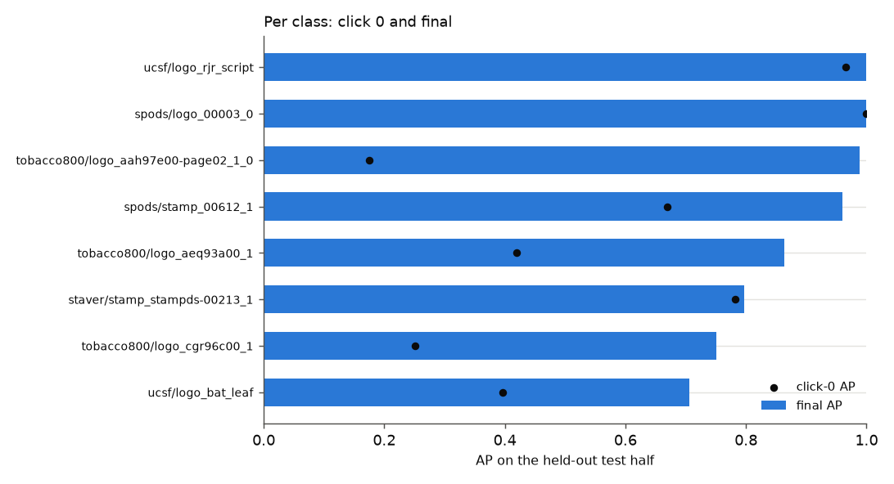
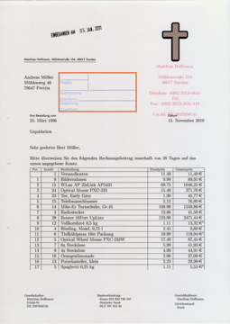
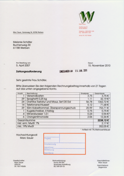

# State of the App: Structural Document (round 1, 8 classes)

**2026-10-01, round 1 of #4392.** This is the first review of the app's
structural path on documents as it ships: `sift_vlad_doc`, the tiled Stage 1
(#3928), GPU scoring with a 2,000-page shortlist (#4391), and the inlier gate.
It runs on FullMarks v5.0 tier `m` (~47,000–50,000 pages per class).

Per the skill, round 1 settles the presentation on a **small class set (8)**
before widening to the whole roster. How the review works follows the owner's
Document Logo decisions in `.claude/skills/state-of-the-app/SKILL.md`:

- the harness calls the app's own functions;
- click 0 is example sort from the class's query crop;
- each class runs one closed loop of 50 clicks;
- there is no full-label ceiling and no spot check;
- the returned set is the gate, shown beside oracle cuts at P.

**Every number is on a held-out half.** Each class's pool is split in half by
a hash of the page id. The simulated user clicks only in one half, and every
readout is on the other, as the photo reviews do with their test half.

## 1. Headline

| mean over 8 classes | AP | Goods found | the returned set (gate): precision / recall / F1 | best cut's F1 |
|---|---:|---:|---|---:|
| click 0 (example sort) | 0.58 | 0 | 0.73 / 0.57 / 0.49 | 0.64 |
| 10 clicks | **0.82** | 8.2 | 0.54 / 0.85 / 0.58 | 0.87 |
| 25 clicks | **0.88** | 18 | 0.49 / 0.91 / 0.53 | 0.91 |
| 50 clicks (final) | **0.88** | 28 | 0.48 / 0.91 / 0.53 | 0.92 |

- **The ranking is good and learns fast.** AP goes from 0.58 to 0.82 in 10
  clicks, then levels off near 0.88. Goods found grows at about one per click
  until a class's click half runs out of positives.
- **The returned set is the weak part.** By 25 clicks it is 0.38 F1 below the
  best cut of the very same ranking (0.53 against 0.91). The ranking puts the
  positives in front; the gate draws the line in the wrong place.





**The line at each floor P.** The structural path has no precision-floor
estimator, so a P-cut here is an **oracle**: the deepest cut of the ranking
whose precision is ≥ P.

| | recall at P = 10% | P = 50% | P = 90% | the gate's recall |
|---|---:|---:|---:|---:|
| click 0 | 0.63 | 0.60 | 0.47 | 0.57 |
| 10 clicks | 0.90 | 0.83 | 0.78 | 0.85 |
| 50 clicks | 0.92 | 0.89 | 0.82 | 0.91 |

The gate's recall sits close to the 50% cut's. Its F1 is far lower because its
**precision** is wrong in a class-dependent way (section 3).



## 2. The spot check

The structural path has none (owner decision). This section is omitted.

## 3. Where the app does well and where it does poorly



| class | positives (test half) | click-0 AP | final AP | the gate: returned / precision / recall | the 50% cut returns |
|---|---:|---:|---:|---|---:|
| `tobacco800/logo_aah97e00-page02_1_0` | 354 (171) | 0.18 | **0.99** | 169 / 1.00 / 0.99 | 338 |
| `spods/logo_00003_0` | 30 (10) | 1.00 | 1.00 | 49 / 0.20 / 1.00 | 20 |
| `ucsf/logo_rjr_script` | 52 (27) | 0.97 | 1.00 | 86 / 0.31 / 1.00 | 54 |
| `spods/stamp_00612_1` | 31 (16) | 0.67 | 0.96 | 130 / 0.12 / 1.00 | 32 |
| `tobacco800/logo_aeq93a00_1` | 116 (62) | 0.42 | 0.86 | 56 / 0.98 / 0.89 | 112 |
| `staver/stamp_stampds-00213_1` | 19 (11) | 0.78 | 0.80 | 92 / 0.12 / 1.00 | 18 |
| `tobacco800/logo_cgr96c00_1` | 9 (4) | 0.25 | 0.75 | 22 / 0.14 / 0.75 | 6 |
| `ucsf/logo_bat_leaf` | 200 (93) | 0.40 | **0.71** | 65 / 0.98 / 0.69 | 130 |

"Returned" counts pages in the test half. The 50% cut counts the ranking's
deepest cut at precision ≥ 50%.

- **Small classes:** the gate returns **3–8× too many**. On
  `spods/stamp_00612_1` it returns 130 test pages for 16 positives (precision
  0.12), where the ranking's 50% cut would return 32. These are the hard
  negatives that clear 8 inliers on a page with ~6,000 keypoints (#4367).
- **Large classes:** the gate returns **too few**. On `ucsf/logo_bat_leaf` it
  returns 65 for 93 positives (precision 0.98, recall 0.69), where the 50% cut
  returns 130.
- **So a fixed 8-inlier gate is miscalibrated in both directions.** The
  direction depends on the class, which is sharper than #4367's framing (it
  saw only over-acceptance).
- **The weakest ranking is `ucsf/logo_bat_leaf`** (final AP 0.71): 200
  members, banded letterhead pages, a small leaf. Round 2 should look at its
  low-ranked members to say whether the misses sit beyond the 2,000-page
  shortlist or fail verification.
- **`tobacco800/logo_cgr96c00_1`** (a 117-keypoint query crop) still opens
  weakly (0.25). Its first Good click lifts it (+0.50 AP, section 6), which is
  the design working: a Good adds its own box as a query.

## 4. Headroom

There is no full-label ceiling in structural mode (owner decision), so this
section is omitted.

## 5. What the clicks bought

Final AP minus click-0 AP, by class:

- **Large gains on the hard openings:**
  - `logo_aah97e00` +0.81 (the two-crest class; the second crest arrives with
    the first Goods);
  - `logo_cgr96c00` +0.50;
  - `logo_aeq93a00` +0.44;
  - `spods/stamp_00612_1` +0.29;
  - `ucsf/logo_bat_leaf` +0.31.
- **Nothing to buy where example sort already works:** `spods/logo_00003_0`
  and `ucsf/logo_rjr_script` open at 0.97–1.00.
- **`staver/stamp_stampds-00213_1`: clicking barely beats the crop**
  (0.78 → 0.80). Section 6 shows why.

## 6. Images

Credit is a click's change in test AP. **Each class ran once, so every credit
below is a single observation** (the skill's rule for the structural path);
small credits are refit noise.

| | class | page clicked | label | click | credit |
|---|---|---|---|---:|---:|
| helpful | `tobacco800/logo_cgr96c00_1` | `tobacco800/sia26d00` | Good | 1 | **+0.50** |
| helpful | `tobacco800/logo_aah97e00-page02_1_0` | `ucsf/fmgk0164#0` | Good | 1 | +0.47 |
| helpful | `staver/stamp_stampds-00213_1` | `staver/stampds-00223` | Good | 12 | +0.34 |
| harmful | `staver/stamp_stampds-00213_1` | `staver/stampds-00213` | Good | 4 | **−0.41** |
| harmful | `ucsf/logo_bat_leaf` | `ucsf/hfyl0214#0` | Good | 16 | −0.04 |

**The one large harm is a correct Good vote.** On the StaVer form-box stamp,
the Good on `stampds-00213` costs 0.41 AP, and a later Good on
`stampds-00223` wins most of it back.

| `stampds-00213`: −0.41 | `stampds-00223`: +0.34 |
|---|---|
|  |  |

- Both boxes hold the same printed form box. On `00213` the box also takes in
  the typed lines around it.
- That box becomes a Stage-1 query and a Stage-2 template, and its descriptors
  are glyphs, which match any typed page. This is #4170's mechanism (templates
  from Goods pick up printed text), now seen in the app's own loop.

The bat-leaf "harms" (−0.03 to −0.04) are correct, cleanly boxed marks (the
B.A.T. leaf on letterheads). They are within refit noise.

## 7. Known regimes to flag

- **A class's click half can run out of positives before 50 clicks.**
  `spods/logo_00003_0` ran out after 20, `ucsf/logo_rjr_script` after 26 and
  `tobacco800/logo_cgr96c00_1` after 5.
  - Its later clicks are all Bads. Bads do not enter the structural path
    (#4169), so its ranking is then frozen and the retrain takes ~0.1 s.
  - The two stamp classes stop one short instead (14 of 15 and 7 of 8 found).
    The last click-half member never reaches the top of the ranking within 50
    clicks.
- **Featuring a 50,000-page tier takes ~1 h of SIFT on 16 CPUs**, paid once by
  the feature cache (35 GB at `/expscratch/$USER/fullmarks/features/`;
  delete it after the review).

## 8. What to A/B next

1. **A calibrated accept decision** (#4367, now with both directions measured).
   The gate's F1 is 0.38 below the ranking's best cut. Candidates are a
   per-detector inlier threshold learned from the votes, or the
   precision-floor machinery the photo paths use, ported to inlier scores.
2. **Text-bearing templates** (#4170): mask or down-weight glyph descriptors
   in Good-box templates. The StaVer stamp's −0.41 click is the literal case.

## For round 2

- Widen to every roster class (36). The skill pairs widening classes with
  repeats, but the structural path is deterministic, so classes only.
- Look at `ucsf/logo_bat_leaf`'s low-ranked members.
- Owner feedback on the presentation (tables, figures, the oracle-cut framing)
  goes into the skill before then.

## Reproduce

```bash
source scripts/experiments/pile/pile_env.sh
python scripts/experiments/fullmarks/sota_documents.py --tier m --max-v 50 --classes <8 classes> \
    --matrix /expscratch/$USER/fullmarks/votes-4162/matrix-m \
    --feature-cache /expscratch/$USER/fullmarks/features --out <run dir>/round1b
python scripts/experiments/fullmarks/sota_documents_analyze.py --run <run dir>/round1b
```

Run directory: `/expscratch/sgreenberg/state-of-the-app/2026-10-01-documents/`.
That holds `round1` too, the abandoned variant scored on the unlabelled
remainder; positives running out made it read as collapse. `measurements/`
holds this round's `steps.csv` (every click × class) and `clicks.csv`.
