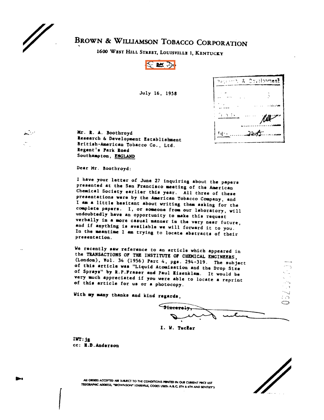

# State of the App: Structural Document

**2026-10-01, #4392.** This is the first review of how the app finds stamps
and logos in scanned documents, as it ships today:

- `sift_vlad_doc`;
- the tiled Stage 1 (#3928);
- GPU scoring with a 2,000-page shortlist (#4391);
- the inlier gate as the returned set.

**The bench:** FullMarks v5.0, all 36 roster classes, tier `m` (~47,000–50,000
pages per class).

How the review runs follows the owner's Document Logo decisions in
`.claude/skills/state-of-the-app/SKILL.md`:

- the harness calls the app's own functions;
- click 0 is example sort from each class's query crop;
- each class runs one closed loop of 50 clicks;
- there is no full-label ceiling and no spot check;
- the returned set (the gate) is shown beside oracle cuts at P.

**Every number is on a held-out half.** Each class's pool is split in half by
a hash of the page id. The simulated user clicks only in one half, and every
readout is on the other, as the photo reviews do with their test half.

Round 1 (8 classes) settled the presentation. This is round 2, the whole
roster.

## 1. Headline

| mean over 36 classes | AP | Goods found | the returned set (gate): precision / recall / F1 | best cut's F1 |
|---|---:|---:|---|---:|
| click 0 (example sort) | 0.78 | 0 | 0.55 / 0.79 / 0.53 | 0.82 |
| 10 clicks | **0.90** | 8.1 | 0.39 / 0.92 / 0.44 | 0.92 |
| 25 clicks | **0.91** | 14 | 0.38 / 0.93 / 0.43 | 0.93 |
| 50 clicks (final) | **0.91** | 18 | 0.37 / 0.93 / 0.42 | 0.93 |

- **The ranking is very good, and clicks finish it fast.** Example sort from
  one crop opens at 0.78. Ten clicks take it to 0.90, and it holds there.
  Goods found grows about one per click until a class's click half runs out.
- **The returned set is the weak part.** At every point after the first
  clicks, the gate's F1 is about **0.50 below the best cut of the same
  ranking** (0.42 against 0.93 at the final click). The ranking puts the
  positives first; the gate draws the line in the wrong place.


**The line at each floor P.** The structural path has no precision-floor
estimator, so a P-cut here is an **oracle**: the deepest cut of the ranking
whose precision is ≥ P.

| | recall at P = 10% | P = 50% | P = 90% | the gate's recall |
|---|---:|---:|---:|---:|
| click 0 | 0.81 | 0.80 | 0.70 | 0.79 |
| 10 clicks | 0.94 | 0.91 | 0.87 | 0.92 |
| 50 clicks | 0.94 | 0.92 | 0.88 | 0.93 |

The gate's recall matches the 50% cut's. Its F1 is low because its precision
is wrong, and wrong in a class-dependent direction (section 3).


## 2. The spot check

The structural path has none (owner decision). This section is omitted.

## 3. Where the app does well and where it does poorly


**By source, final AP:**

| source | final AP | classes |
|---|---:|---:|
| SPODS | 0.98 | 17 |
| StaVer | 0.90 | 2 |
| Tobacco800 | 0.88 | 13 |
| UCSF | 0.75 | 4 |

Every SPODS logo and most SPODS stamps reach AP 1.00. The per-class table for
every class is in `measurements/summary.md`.

**The returned set is miscalibrated in both directions.** The fixed 8-inlier
gate returns precision below 0.5 for **27 of 36 classes**:

- **Small classes get far too many pages.** `spods/stamp_00716_1`'s gate
  keeps precision 0.04 at recall 1.00. `spods/stamp_00612_1` returns 130 test
  pages for 16 positives, where the ranking's 50% cut returns 32. These are
  hard negatives that clear 8 inliers on a page with ~6,000 keypoints
  (#4367).
- **Large classes get too few.**
  - `ucsf/logo_bat_leaf`: precision 0.98, recall 0.68. The 50% cut returns
    twice as many pages.
  - `tobacco800/logo_afm90c00-first_1_0`: 0.88 / 0.69.
  - `tobacco800/logo_ald41a00-ernest_1`: 0.98 / 0.88.
- **A single threshold cannot serve both kinds of class.** This is sharper
  than #4367, which saw only over-acceptance.

**Where the ranking is weak, Stage 1 is why.** At the final click, almost every
test positive the ranking misses sits **beyond the 2,000-page shortlist**, so
Stage 2 never verified it. Only 4 positives in the whole roster were
shortlisted and then failed the gate:

| class | final AP | test positives | beyond the shortlist | shortlisted, failed the gate |
|---|---:|---:|---:|---:|
| `ucsf/logo_bw_oval_emblem` | 0.50 | 10 | **5** | 0 |
| `tobacco800/logo_afm90c00-first_1_0` | 0.70 | 43 | **13** | 0 |
| `ucsf/logo_bat_leaf` | 0.71 | 93 | **28** | 1 |
| `tobacco800/logo_ald41a00-ernest_1` | 0.88 | 84 | 10 | 0 |

They are small marks in text-dense tiles. A tile is 0.25 × 0.18 of the page,
and these marks are 0.06–0.11 of its width, so a tile's VLAD is mostly the text
around them:

| `ucsf/logo_bw_oval_emblem`, rank 20,100 | `ucsf/logo_bat_leaf`, rank 24,495 |
|---|---|
|  |  |
| a 0.09 × 0.02 oval inside a dense letterhead line | a faint, small leaf in the corner, few keypoints |

- **Some misses sit just past the cut:** `afm90c00` at 2,007; `bat_leaf` at
  2,275 and 2,331. #4391 measured what a longer shortlist buys (K = 4,000:
  +0.035 AP).
- **Others sit tens of thousands deep:** the two above, at 20,100 and 24,495.
  No shortlist length reaches them; a finer tile for small marks might.

**One class gets worse with clicks:** `tobacco800/logo_asg54f00_1`, 0.67 →
0.41. It has **3** test positives, so one positive slipping past a confuser
moves AP by ~0.25. Its first Good click costs exactly that (section 6). This
is a small-class reading, not a mechanism.

## 4. Headroom

There is no full-label ceiling in structural mode (owner decision), so this
section is omitted.

## 5. What the clicks bought

Final AP minus click-0 AP:

- **Large gains:**
  - `logo_aah97e00` +0.81 (two crests; the second arrives with the first
    Goods);
  - `logo_cgr96c00` +0.50 (a 117-keypoint crop; its first Good is a far
    better query);
  - `logo_aeq93a00` +0.44;
  - `logo_ald41a00` +0.39;
  - `ucsf/logo_bat_leaf` +0.31.
- **Nothing to buy where example sort is already right:** 11 classes open at
  AP ≥ 0.97, mostly SPODS logos.
- **Clicking barely beats the crop:** `staver/stamp_stampds-00213_1`, 0.78 →
  0.80 (section 6).
- **Clicking costs:** `tobacco800/logo_asg54f00_1`, −0.26 (section 3), and
  three SPODS stamps that open near 1.00, by −0.01 to −0.03.

## 6. Images

Credit is a click's change in test AP. **Each class ran once, so every credit
below is a single observation**; small credits are refit noise.

| | class | page clicked | label | click | credit |
|---|---|---|---|---:|---:|
| helpful | `ucsf/logo_p_lorillard_crest` | `ucsf/fydf0107#0` | Good | 2 | **+0.51** |
| helpful | `tobacco800/logo_cgr96c00_1` | `tobacco800/sia26d00` | Good | 1 | +0.50 |
| helpful | `tobacco800/logo_aah97e00-page02_1_0` | `ucsf/fmgk0164#0` | Good | 1 | +0.47 |
| helpful | `staver/stamp_stampds-00213_1` | `staver/stampds-00223` | Good | 12 | +0.34 |
| harmful | `staver/stamp_stampds-00213_1` | `staver/stampds-00213` | Good | 4 | **−0.41** |
| harmful | `ucsf/logo_p_lorillard_crest` | `ucsf/gnwh0113#0` | Good | 1 | −0.30 |
| harmful | `tobacco800/logo_asg54f00_1` | `tobacco800/bjn43c00-page02_2` | Good | 1 | −0.25 |

**Every large harm is a correct Good vote.** The clearest case is the StaVer
form-box stamp. The Good on `stampds-00213` costs 0.41 AP, and a later Good on
`stampds-00223` wins most of it back:

| `stampds-00213`: −0.41 | `stampds-00223`: +0.34 |
|---|---|
|  |  |

- Both boxes hold the same printed form box. On `00213` the box also takes in
  the typed lines around it.
- That box becomes a Stage-1 query and a Stage-2 template, and its descriptors
  are glyphs, which match any typed page. This is #4170's mechanism (templates
  from Goods pick up printed text), in the app's own loop.

**The Lorillard crest swings** −0.30 then +0.51 on its first two Goods, on 4
test positives: the small-class volatility of section 3.

## 7. Known regimes to flag

- **A class's click half can run out of positives before 50 clicks.** It
  happens to **25 of 36** classes: every SPODS class, the smaller StaVer
  class, and the small Tobacco800 logos.
  - Its later clicks are all Bads. Bads do not enter the structural path
    (#4169), so its ranking is then frozen and a retrain takes ~0.1 s (the
    per-class medians in `measurements/summary.md`).
  - Where a class still has positives to find, a retrain is ~2–3 s at 50,000
    pages.
- **Classes with ≤ 5 test positives** (`asg54f00`, `cgr96c00`,
  `p_lorillard_crest`, several small Tobacco800 logos) move ~0.2 AP per
  positive. Read their rows as anecdotes.
- **The feature cache** (35 GB, `/expscratch/$USER/fullmarks/features/`) holds
  tier `m`'s SIFT, so a re-run skips an hour. Delete it once the review closes.

## 8. What to A/B next

1. **A calibrated accept decision (#4367).** The returned set is the largest
   gap in the path: F1 0.42 against 0.93 for the best cut. It fails in both
   directions, so a fixed inlier count cannot fix it. Candidates:
   - a per-detector threshold learned from the votes on the inlier scale;
   - the precision-floor machinery the photo paths use, ported to inlier
     scores.
2. **Small marks in text-dense tiles.** Stage-1 misses are the ranking's
   limit on the four weakest classes. Two candidates:
   - a second, finer tile layer;
   - weighting tile descriptors by distinctiveness, against text glyphs.

   Filed as #4415.
3. **Text-bearing templates (#4170):** mask or down-weight glyph descriptors
   in Good-box templates. The StaVer stamp's −0.41 is the literal case.

## Reproduce

```bash
source scripts/experiments/pile/pile_env.sh
python scripts/experiments/fullmarks/sota_documents.py --tier m --max-v 50 \
    --matrix /expscratch/$USER/fullmarks/votes-4162/matrix-m \
    --feature-cache /expscratch/$USER/fullmarks/features --out <run dir>/round2
python scripts/experiments/fullmarks/sota_documents_analyze.py --run <run dir>/round2
```

- **Run directory:** `/expscratch/sgreenberg/state-of-the-app/2026-10-01-documents/`.
  - `round1b` is the 8-class presentation round.
  - `round1` is an abandoned variant scored on the unlabelled remainder; once
    clicking had used up the positives it read as collapse.
- **`measurements/`** holds this round's files:
  - `steps.csv` (every class × click);
  - `clicks.csv` (every click, with its credit);
  - `positives_final.csv` (each test positive's place at the end);
  - `summary.md` (every class).
