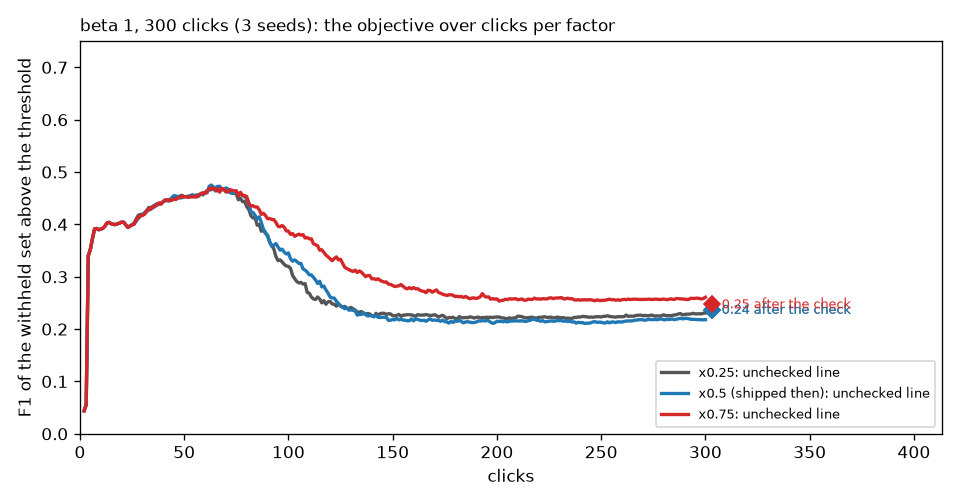

# The acquisition factor below and above 0.5, and past 150 clicks (#4428)

**Issue:** #4428, filed when #4409 shipped the cut at half the F-beta argmax's
depth: the gain from × 1.0 to × 0.5 was monotone, so a shallower cut might
harvest more still. **Date:** 2026-10-02. **App:** dev at ee6605262 (frozen
worktree). **Arms:** × 0.25 at beta 0.5 / 1 / 2 (144 Binary cells × 5 seeds,
150 clicks) and, at beta 1 over 300 clicks (3 seeds), × 0.25 / the shipped
× 0.5 / × 0.75. Read beside the #4409 arms (line − 4, × 1.0, × 0.5) on the
objective the owner stated meanwhile - **the F-beta of the withheld images
above the threshold the app holds** (the review's headline since #4436) - and
not on the rank-count line the sweep was filed on. **Verdict:** no factor
beats line − 4; shallower is a little worse still; and at 300 clicks every
harvesting factor collapses to the same place. The half-argmax cut was
reverted while this ran (#4437); the rank cut stays as a harness arm.

## 1. × 0.25 at 150 clicks, beside yesterday's arms

| beta | arm | F-beta above the threshold, unchecked | after the check | returned (unchecked → checked) | d vs line − 4, after |
|---|---|---:|---:|---:|---:|
| 0.5 | line − 4 | 0.529 | **0.467** | 40 → 67 | |
| 0.5 | × 1.0 | 0.573 | 0.379 | 32 → 85 | −0.089 ± 0.007 |
| 0.5 | × 0.5 | 0.329 | 0.317 | 12 → 102 | −0.150 ± 0.007 |
| 0.5 | × 0.25 | 0.344 | 0.307 | 14 → 109 | −0.159 ± 0.007 |
| 1 | line − 4 | 0.504 | **0.470** | 41 → 73 | |
| 1 | × 1.0 | 0.508 | 0.415 | 34 → 90 | −0.056 ± 0.005 |
| 1 | × 0.5 | 0.218 | 0.385 | 13 → 101 | −0.085 ± 0.005 |
| 1 | × 0.25 | 0.223 | 0.377 | 13 → 108 | −0.092 ± 0.005 |
| 2 | line − 4 | 0.508 | **0.510** | 80 → 114 | |
| 2 | × 1.0 | 0.479 | 0.488 | 92 → 127 | −0.022 ± 0.004 |
| 2 | × 0.5 | 0.198 | 0.491 | 35 → 128 | −0.019 ± 0.004 |
| 2 | × 0.25 | 0.189 | 0.487 | 30 → 136 | −0.022 ± 0.004 |

The harvesting cuts track line − 4 until about click 60, when the user's
unvoted top runs out of positives; the kept set's edge score then climbs and
the withheld set above it empties (13 images returned instead of 41). × 0.25
is × 0.5 a little worse. The rank-count reading (`objective_beta*.md`, second
table) still rises as the factor falls - more Goods, higher AP, F1 at the
re-drawn line +0.01 - which is the harvest the objective penalises.

## 2. 300 clicks at beta 1 (3 seeds)

| arm | F1 above the threshold, unchecked | after the check | walk's effect | precision after | recall after | returned (unchecked → checked) |
|---|---:|---:|---:|---:|---:|---:|
| × 0.25 | 0.231 | 0.237 | +0.006 ± 0.008 | 0.15 | 0.71 | 13 → 233 |
| × 0.5 | 0.218 | 0.237 | +0.018 ± 0.008 | 0.15 | 0.70 | 13 → 228 |
| × 0.75 | 0.261 | 0.247 | −0.011 ± 0.008 | 0.16 | 0.71 | 14 → 224 |

Past 150 clicks the three factors converge: 15 positives are left unvoted in
the pool, the unchecked line returns 13 withheld images at F1 0.22–0.26, and
the check then walks deep into a pool that has nothing left (224–233 images
returned at 15% precision). The rank-count reading says 0.48 for all three.
There is no line − 4 arm at 300 clicks in this sweep; the 150-click control
(0.470 after the check) already sits twice as high.

## 3. What this closes and what it leaves

- **Closed:** the factor. Nothing below 1.0 beats the line − 4 cut on the
  objective at any preset or horizon; the shallower, the worse. The knob
  (`acq_p_crossing`) stays for the harness.
- **Left to #4427:** the end-of-session check, which lowers the objective
  under line − 4 at beta ≤ 1 and, after a harvest, walks into an empty pool.
- **Caveats:** one bench of 11.6k images at 0.44% prevalence, where a harvest
  depletes the pool within 150 clicks; 3 seeds at 300 clicks; Binary SigLIP.

## Files

- `objective_beta{0.5,1,2}.md`, `objective_c300.md`: `compare_arms.py`
  (in `../2026-10-02-line-vs-ceiling-4427/`) over the re-scored arms;
  `figures/` from `figs_objective.py` there. `driver3.sh` ran the arms.
- On the GRID: `/expscratch/sgreenberg/acq-sweep-4428/b*-x0.25`, `b1-*-c300`.
