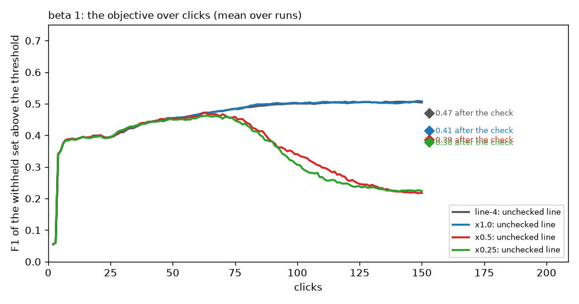

# The line against the ceiling, and what "the returned set" means (#4427)

**Issue:** #4427, opened from the acquisition pricing (#4409) when the line's
share of the best cut fell under the shallower acquisition. **Date:**
2026-10-02. **Data:** the #4409 arms (dev at 98cdacc7c: line − 4, the F-beta
argmax × 1.0 and × 0.5, at beta 0.5 / 1 / 2, 144 Binary cells × 5 seeds
each), the #4428 sweep's × 0.25 arms (dev at ee6605262), and five walk arms
at beta 1 under the × 0.5 cut (dev + #4431's knobs, `vts-4427-walk`). Rank
frames and session rows throughout; nothing here needed a new model.
**Scripts:** `ceiling_gap.py` (the line against the best cut on the frames),
`../2026-10-01-acquisition-fbeta-4409/withheld_at_threshold.py` (the objective
off the session rows), `compare_arms.py`, `figs_objective.py`.

**What it found, in order.** (1) On the withheld half the unchecked line
keeps 0.79 of the best cut's F1 at beta 1; the best cut is deeper than the
cap in four frames of five, and a line that landed at min(best, 64) would
keep 0.94. (2) The walk cannot get there: the peak sits between its 32 and
64 edges and five picks a band make the first deeper step a coin flip. (3)
Under the × 0.5 acquisition the drop in share had a different cause: the
harvest strips the user's unvoted top, so the walk, which only sees the
user's pool, ends shallow. (4) Which raised the question the owner settled:
**the objective is the F-beta of the withheld images above the threshold
the app holds** - not the rank-count line the review had been reading. (5) On
that objective the × 0.5 cut was worse at every preset and was reverted
(#4437); the walk arms are a wash; and the end-of-session check itself
lowers the objective under the line − 4 cut at beta ≤ 1.

## 1. The unchecked line against the best cut (rank frames, withheld half)

`ceiling_gap.py` over the #4409 frames, beta 1, 143 categories × 5 seeds.
`kept` is the line the balance's rule draws on the withheld ranking (the
mixture's argmax under the cap of 32), `best k` the size of the cut with the
highest F1 there.

| arm | click | kept | best k (mean / median) | cap binds | best > cap | share at kept | at a cap of 64 | at 128 | at min(best, 64) |
|---|---:|---:|---:|---:|---:|---:|---:|---:|---:|
| line − 4 | 50 | 30.6 | 103 / 45 | 0.94 | 0.83 | 0.766 | 0.798 | 0.660 | 0.903 |
| line − 4 | 150 | 30.5 | 102 / 46 | 0.91 | 0.82 | 0.792 | 0.837 | 0.669 | 0.938 |
| × 0.5 | 50 | 30.5 | 103 / 47 | 0.93 | 0.82 | 0.763 | 0.800 | 0.660 | 0.903 |
| × 0.5 | 150 | 26.9 | 100 / 46 | 0.73 | 0.81 | 0.739 | 0.836 | 0.656 | 0.940 |

- A blanket cap of 64 buys +0.02 to +0.04 of share; 128 loses 0.13: the gain
  is not in the cap but in landing at each session's own peak, which sits at
  a median of 46, between the walk's edges.
- At beta 0.5 the cap is about right (best k median 27–32); at beta 2 the
  unchecked line (cap 128) is deeper than the best cut's median 66–85 and the
  share at the kept size is 0.80–0.86.

## 2. The walk's resolution and noise, and the walk arms

The walk's bands are 8 / 8 / 16 / 32 / 64 / …; it starts at the cap, audits
five picks a band, goes deeper on a strict rise of its F-beta estimate and
ends at the peak. In the control arm it ended at 32 in 655 of 720 cells. Five
arms at beta 1 under the × 0.5 cut (`objective_walk.md`, `figures/objective_walk.png`),
scored on the objective after the check:

| arm | F1 above the threshold, after the check | d vs the app's walk | check votes |
|---|---:|---:|---:|
| the app's walk | 0.384 | | 20.8 |
| 10 picks a band | 0.361 | −0.023 ± 0.003 | 38.8 |
| a 0.02 tolerance past a flat step | 0.383 | −0.001 ± 0.001 | 23.2 |
| bands split in two past the start | 0.387 | +0.002 ± 0.002 | 21.0 |
| both | 0.385 | +0.000 ± 0.002 | 24.2 |

Nothing to ship: more picks walk deeper and lose precision, finer bands and
the tolerance change nothing. On the review's rank-count reading every arm
was *identical* (0.469), which is what exposed that reading: it re-draws the
balance's rule on the withheld ranking and never sees the check.

## 3. The harvest and the objective

Under the × 0.5 cut the picks take the positives out of the user's unvoted
top: at click 150 its top 32 holds 2.7 positives (9% right) against 9.4 (29%)
under line − 4, 20 positives are left unvoted against 30, and the Good bin
holds 30 against 20 (`pools.csv`, the review's Diagnostic section, #4430).
The walk reads that depleted top and rightly ends shallow (52 cells at
k = 1). The rank-count reading could not see any of it; the owner's
objective can. Each session row carries the withheld set's precision and
recall at that row's threshold, so the same runs read the owner's way
(`withheld_at_threshold.py`; the review's headline since #4436):

| beta | arm | F-beta above the threshold, unchecked | after the check | walk's effect | returned (unchecked → checked) | d vs line − 4, after |
|---|---|---:|---:|---:|---:|---:|
| 0.5 | line − 4 | 0.529 | **0.467** | −0.060 ± 0.005 | 40 → 67 | |
| 0.5 | × 1.0 | 0.573 | 0.379 | −0.186 ± 0.008 | 32 → 85 | −0.089 ± 0.007 |
| 0.5 | × 0.5 | 0.329 | 0.317 | −0.009 ± 0.007 | 12 → 102 | −0.150 ± 0.007 |
| 0.5 | × 0.25 | 0.344 | 0.307 | −0.035 ± 0.008 | 14 → 109 | −0.159 ± 0.007 |
| 1 | line − 4 | 0.504 | **0.470** | −0.032 ± 0.004 | 41 → 73 | |
| 1 | × 1.0 | 0.508 | 0.415 | −0.087 ± 0.006 | 34 → 90 | −0.056 ± 0.005 |
| 1 | × 0.5 | 0.218 | 0.385 | +0.165 ± 0.007 | 13 → 101 | −0.085 ± 0.005 |
| 1 | × 0.25 | 0.223 | 0.377 | +0.154 ± 0.007 | 13 → 108 | −0.092 ± 0.005 |
| 2 | line − 4 | 0.508 | **0.510** | +0.005 ± 0.004 | 80 → 114 | |
| 2 | × 1.0 | 0.479 | 0.488 | +0.014 ± 0.005 | 92 → 127 | −0.022 ± 0.004 |
| 2 | × 0.5 | 0.198 | 0.491 | +0.285 ± 0.011 | 35 → 128 | −0.019 ± 0.004 |
| 2 | × 0.25 | 0.189 | 0.487 | +0.294 ± 0.010 | 30 → 136 | −0.022 ± 0.004 |

- **The harvesting cuts collapse after click 60.** Their unchecked line
  tracks line − 4 until the unvoted top runs out of positives, then the score
  at the kept set's edge climbs and the withheld set above it empties: 13
  images returned at click 150 instead of 41, F1 0.22 instead of 0.50. The
  check recovers part of it by voting 20 more items and deepening the line,
  not enough: −0.085 at beta 1 after the check, −0.150 at beta 0.5. The
  × 0.25 cut is a little worse still. **Reverted** (#4437): the balance keeps
  the line − 4 re-cut, and the rank cut stays as a harness arm.
- **The check lowers the objective under line − 4 at beta ≤ 1** (−0.032 ±
  0.004, −0.060 ± 0.005): it deepens the line (41 → 73 returned at beta 1)
  and precision falls faster than recall rises; at beta 2 it is neutral. The
  floor-era 50% sessions (#4408) read the same way, 0.492 → 0.470. The
  unchecked line at the cap is a better returned set on fresh data than the
  walked line.

## 4. What this leaves

- **The review** now headlines the objective (#4436: `thresholds.csv`, the
  `thr_*` cells columns, `objective_over_clicks.png`), with the rank-count
  line as a secondary table and the user's own corpus as a diagnostic
  (#4430). Every balance-era verdict before this report was read on the
  rank-count line; the ones that mattered (#4409) have been re-read here.
- **The check is the next question.** A spot check that lowers the
  objective at the two precision-leaning presets is doing the opposite of
  its job. Three ways to take it, for the owner: leave it; make it advisory
  (report the walk's ranges but do not move the threshold); or re-design its
  stop so it never deepens the line past a band whose audited precision
  fell below the start's, and price that on the objective.
- **The ceiling gap of section 1 stands** (0.79 of the best cut at the
  unchecked line, 0.94 reachable), but it is a rank-count figure. On the
  objective the question becomes which threshold, not which count, and the
  frames do not hold the score at the best cut; a harness column for it
  (the withheld F-beta at the best threshold of each step) would let the
  next study read the gap the owner's way.
- **Caveats.** One bench (`coco_better`, 11.6k images, 0.44% prevalence):
  the harvest depletes a pool this size within 150 clicks and would dent a
  100k-image corpus proportionally less; 5 seeds; Binary SigLIP only.

## Files

- `ceiling_gap.md` / `ceiling_gap.py`: the unchecked line against the best
  cut on the frames, per arm, beta and click.
- `objective_beta1.md`, `objective_walk.md`: `compare_arms.py` over the
  re-scored arms (the objective first, the rank-count reading and the
  diagnostic after); `figures/objective_beta{0.5,1,2}.png`,
  `figures/objective_walk.png` from `figs_objective.py`.
- On the GRID: `/expscratch/sgreenberg/p-aware-acq-4409/` (the #4409 arms,
  re-scored on 2026-10-02) and `/expscratch/sgreenberg/acq-sweep-4428/`
  (the × 0.25 and 300-click arms, the walk arms, every table above).
