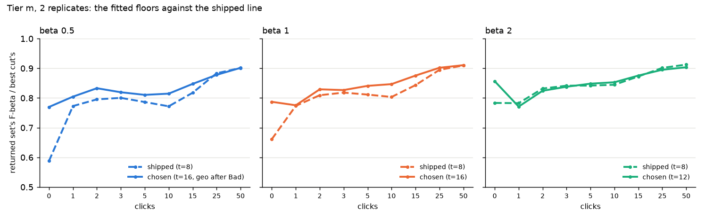

# A document line that follows the balance (#4458): no fitted rule passes

**Question.** The photo path's line follows the user's balance, F-beta at
beta 0.5 / 1 / 2 (#4413). The document line ignores it: it is the Bad ceiling
(#4367), or H1's gated 8-inlier line before the first Bad (#4440), whatever
beta is. #4457 measured the cost. By 25 clicks the returned set reaches
0.89–0.90 of the best cut's F-beta at every beta. Early on, a beta-0.5 user
gets 0.59 of their best cut at click 0. Can a per-beta rule close that gap?

**Answer: not with the rule family tried.** The rules fitted on tier `s` did
not pass the pre-registered bar on tier `m` at any beta, so every beta keeps
the shipped line. The one gain that held is the opening: at click 0, a higher
inlier floor lifts beta 0.5 by +0.18 [+0.04, +0.31]. But it was not tested on
its own, and tier `m` has now been seen.



## Method

**Frames instead of closed loops.** The structural line does not change which
page the user clicks next, so the sessions are the same at every beta; only
the returned set differs. So `sota_documents.py --frames` saves per-page
state along the shipped sessions: each page's verified inliers and best-fit
geometry, and the votes' fits. Every candidate rule is then scored exactly,
offline. Click 0 gets its own frame (new here): the example sort's shortlist
and each shortlisted page's fit to the crop.

- **Tier `s`:** 33 classes, clicks 0, 1, 2, 3, 5, 10, 15, 25; used for the
  choice.
- **Tier `m`:** 36 classes × 2 replicates (the second with the halves
  swapped), the same clicks plus 50; used for the bar.

**Check:** the shipped rule on the frames reproduces the harness's
returned-set F1 in 259 of 263 tier-`s` frames and 619 of 645 tier-`m` frames.
Of the 30 that differ, 27 are pages at exactly the Bad ceiling + 1 inliers.
The app dropped those through a rounding bug (#4464, since fixed), so the
frames score the rule as intended.

**The rule family** (pre-registered on #4458, with one correction before any
results), per beta:
- `t`, a minimum inlier count in every state: 8, 10, 12, 16, 20, 24 or 32;
- the geometry cuts (#4434) at click 0, on or off;
- the geometry cuts with votes but no Bad yet, on or off;
- the ceiling offset `d` after the first Bad (accept inliers > ceiling + `d`):
  none, −2, 0, +2, +4 or +8;
- the geometry cuts after the first Bad, on or off.

The shipped line is `t=8`, click 0 off, pre-Bad on, `d=0`, post-Bad off.
The plan held beta 1 at the shipped line. The tier-`s` search found the
8-inlier floor too loose at every beta, which would have left the slider
non-monotone, so **the owner amended the plan to fit beta 1 too**. That was
before any tier-`m` frame was scored.

**Score:** the returned set's F-beta as a share of the best F-beta any cut of
the app's order reaches, on the test half.

**Bar (tier `m`, paired by class):** the mean share over clicks 0–25 above
shipped, with the 95% lower bound > 0, and no click (0–50) with a lower bound
below −0.02.

## Tier `s`: the choice

| beta | chosen | tier `s` share, clicks 0–25 | shipped |
|---|---|---:|---:|
| 0.5 | `t=16`, geometry also after the first Bad | 0.843 | 0.753 |
| 1 | `t=16` | 0.840 | 0.780 |
| 2 | `t=12` | 0.851 | 0.820 |

All three keep the shipped switches otherwise. The 8-inlier floor lets in too
many hard negatives early on, even for a recall-leaning user. (Full ranking:
`measurements/search.md`.)

## Tier `m`: the bar

| beta | mean share, clicks 0–25: shipped → chosen | difference [95%] | worst click (lower bound) | verdict |
|---|---|---|---|---|
| 0.5 | 0.776 → 0.819 | +0.043 [−0.009, +0.091] | click 25: −0.072 | fails |
| 1 | 0.800 → 0.833 | +0.033 [−0.000, +0.068] | click 1: −0.039 | fails |
| 2 | 0.836 → 0.843 | +0.008 [−0.012, +0.027] | click 1: −0.039 | fails |

For beta 1, the lower bound is −0.0001 to −0.0005 across bootstrap seeds, and
click 1 fails the per-click limit outright. Per-click tables are in
`measurements/score-tier-m.md`.

- **The opening gain held, at least for beta 0.5.** Click 0's line is the
  example sort's plain 8-inlier gate, and it over-returns.
  - beta 0.5: 0.59 → 0.77 (+0.18 [+0.04, +0.31]);
  - beta 1: +0.13 [−0.02, +0.25];
  - beta 2: +0.07 [−0.00, +0.14].
- **After click 0 the gain is small and mixed.** A fixed floor hurts classes
  whose true matches have few inliers:
  - beta 1: `ucsf/logo_bw_oval_emblem` −0.19, `ucsf/logo_bat_leaf` −0.15 and
    `tobacco800/logo_aeq93a00_1` −0.11, all faint or small marks;
  - beta 0.5 also hurts the two harmful-click classes, `asg54f00` (−0.42) and
    `stampds-00213` (−0.40).

## Next, on fresh data

Tier `m` has been seen, click 0 included, so a follow-up needs data it has not
scored. That could be FullMarks tier `l`, or a third split of tier `m` that is
disjoint from both replicates' test halves. Candidates:

1. **A floor at click 0 only:** a beta-dependent minimum for the example
   sort's line, the one place the gain held.
2. **A per-detector floor:** relative to the Goods' own leave-one-out inliers,
   so a faint mark's line sits lower than a crisp logo's.

## Reproduce

```bash
source scripts/experiments/pile/pile_env.sh
cd scripts/experiments/fullmarks
python sota_documents.py --tier s --max-v 25 --frames 0,1,2,3,5,10,15,25 \
    --matrix /expscratch/$USER/fullmarks/votes-4162/matrix-s \
    --feature-cache /expscratch/$USER/fullmarks/features --out <dir>/s
python sota_documents.py --tier m --max-v 50 [--swap-halves] --frames 0,1,2,3,5,10,15,25,50 \
    --matrix /expscratch/$USER/fullmarks/votes-4162/matrix-m \
    --feature-cache /expscratch/$USER/fullmarks/features --out <dir>/m-rep1  # and m-rep2
python balance_rules.py search --frames <dir>/s/frames --cuts measurements/cuts.json --out <dir>/search-s
python balance_rules.py score --frames <dir>/m-rep1/frames --frames <dir>/m-rep2/frames \
    --cuts measurements/cuts.json --chosen <dir>/search-s/chosen.json --out <dir>/score-m
```

The run directory is `/expscratch/sgreenberg/balance-4458/`, which holds the
frames (94 MB, not in the repo). `measurements/` holds the tier-`s` search,
the chosen rules, the tier-`m` per-click scores, and #4434's geometry cuts.
