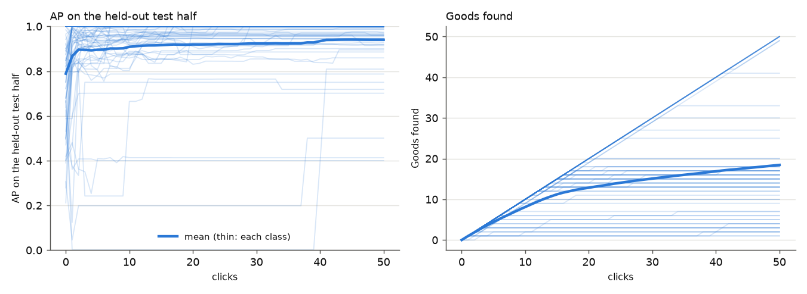
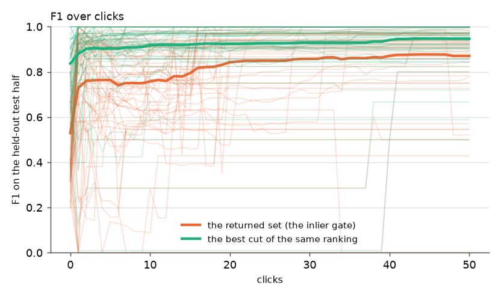
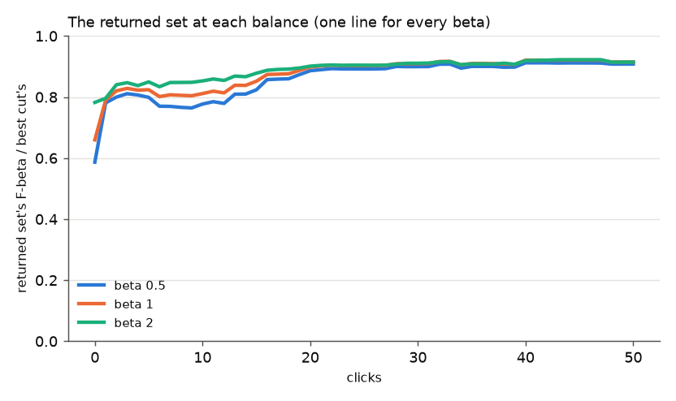
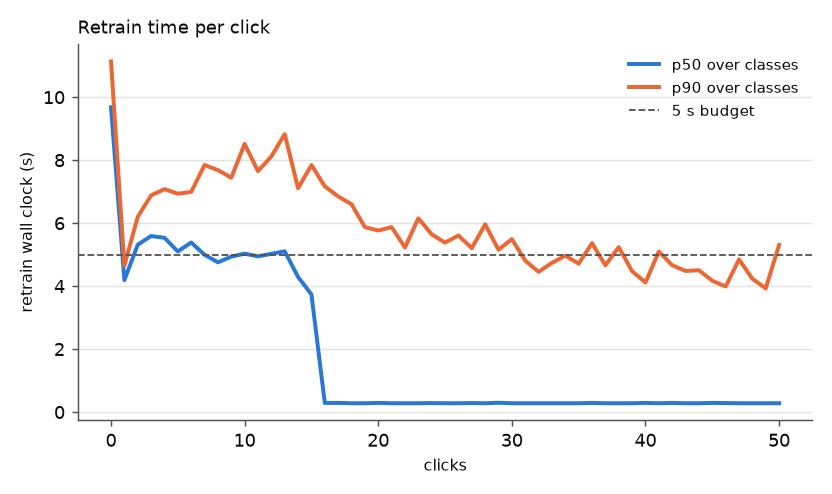
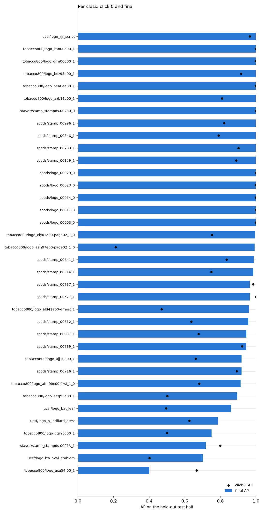
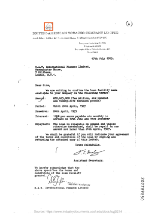
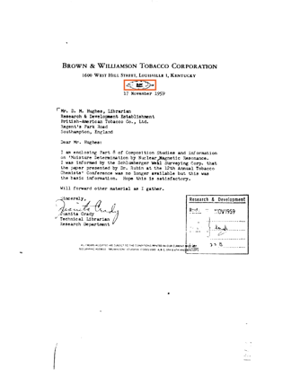
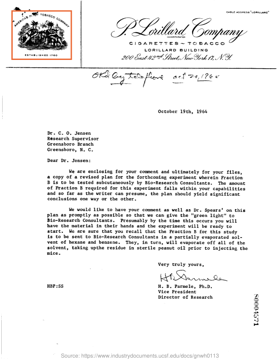
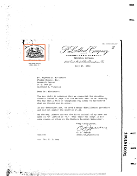

# State of the App: Document Logo, round 3

**2026-10-03, #4457.** This is the second full review of how the app finds
stamps and logos in scanned documents. Since round 2 (#4392, 2026-10-01),
three changes to what the app returns shipped, and one speed fix:

- **#4367:** the returned set's line is the Bad ceiling: a page must fit
  better than every Bad vote did.
- **#4415:** a second, finer tile layer in Stage 1.
- **#4440 (H1):** before the first Bad vote, a verified page must also fit
  tightly (inlier ratio ≥ 0.75, median reprojection error ≤ 0.004887).
- **#4453 (speed only):** GPU Stage 1 no longer falls back to the CPU on
  32 GB cards.

**What is new in the review:**

- **The balance:** the photo path's preference, F-beta at beta 0.5 / 1 / 2
  (#4413). The document line ignores beta, so the same returned set is scored
  at every beta.
- **Two replicates per class.** The second swaps the click and test halves
  (owner, 2026-10-03).
- **The app's GPU type**, a V100, so retrain times are what a user waits.

**How the review runs:** the bench is FullMarks v5.0, all 36 roster classes,
tier `m` (~47,000–50,000 pages per class). The rest follows the skill's
Document Logo decisions:

- the harness calls the app's own functions;
- click 0 is example sort from each class's query crop;
- each class runs a closed loop of 50 clicks;
- every number is scored on the half of the pages the user never clicks.

Means pool both replicates unless a row says otherwise. Comparisons with
round 2 use replicate 1, which has round 2's halves, paired by class
(bootstrap 95%).

## 1. Headline

| mean over 36 classes, 2 replicates | AP | Goods found | returned set: precision / recall / F1 | best cut's F1 |
|---|---:|---:|---|---:|
| click 0 (example sort) | 0.79 | 0 | 0.53 / 0.80 / 0.53 | 0.84 |
| 10 clicks | **0.91** | 8.1 | 0.78 / 0.84 / **0.76** | 0.92 |
| 25 clicks | **0.92** | 14 | 0.90 / 0.86 / **0.85** | 0.93 |
| 50 clicks (final) | **0.94** | 18 | 0.93 / 0.87 / **0.87** | 0.95 |

**Against round 2 (replicate 1, paired by class):**

| | round 2 → now, 25 clicks | difference [95%] |
|---|---|---|
| returned-set precision | 0.38 → 0.91 | **+0.53 [+0.42, +0.64]** |
| returned-set recall | 0.93 → 0.89 | −0.044 [−0.088, −0.003] |
| returned-set F1 | 0.43 → 0.88 | **+0.45 [+0.35, +0.55]** |
| AP | 0.91 → 0.93 | +0.021 [+0.006, +0.039] |

- **The returned set was round 2's weak part, and it is fixed.** Round 2's
  gate returned the right pages and far too many others: precision 0.38. The
  Bad ceiling (#4367) and H1 (#4440) took its F1 from 0.43 to 0.88 at
  25 clicks. That is within 0.06 of the best cut of the same ranking, where
  round 2 was 0.50 below it.
- **The cost is a little recall.** Pages that fit well, but not better than
  every Bad, now fall below the line (section 3).
- **The ranking gained 0.02 AP,** consistent with what the fine tile layer
  measured on its own (#4415). This review does not separate the changes.





### The returned set at each balance

The photo path's preference is a balance, F-beta at beta 0.5
(precision-leaning), 1 or 2 (recall-leaning) (#4413). **The document line
ignores it** (#4458). Each preset is scored as the returned set's F-beta, as a
share of the best F-beta any cut of the same ranking reaches:

| 2 replicates | beta 0.5 | beta 1 | beta 2 | precision | recall |
|---|---:|---:|---:|---:|---:|
| click 0 | 0.59 | 0.66 | 0.78 | 0.53 | 0.80 |
| 10 clicks | **0.78** | 0.81 | 0.85 | 0.78 | 0.84 |
| 25 clicks | 0.89 | 0.90 | 0.90 | 0.90 | 0.86 |
| final | 0.91 | 0.92 | 0.91 | 0.93 | 0.87 |

- **By 25 clicks, one line serves all three balances about equally:** 0.89
  to 0.90 of each one's best cut.
- **Early on, precision-leaning users lose most.** At click 0 a beta-0.5
  user gets 0.59 of their best cut, against 0.78 at beta 2. The opening's line
  is the plain inlier gate (H1's cuts apply only once there is a Good to vote
  with), and it over-returns.



### Retrain time on the app's GPU

| V100, 2 replicates | median | p90 |
|---|---:|---:|
| click 0 (example sort) | 9.7 s | 11 s |
| after a Good click | **5.5 s** | **7.9 s** |
| after a Bad click | 0.27 s | 0.32 s |

- **A Good click costs ~5 s on the V100, over the 5 s budget at p90.** Each
  new Good adds a template, verified against the 2,000-page shortlist. A Bad
  adds no template (Bads stay out of the ranking, #4169), so its retrain only
  re-reads cached fits.
- **The L40S runs were about twice as fast,** with an overall p90 of 3.0 s
  against 6.6–6.8 s here. But this V100 shared its node with the live app and
  another user's vLLM jobs, so part of the gap may be contention, not the card.



**Floor-style cuts at P** (an oracle, since the structural path has no
precision estimator) are in `measurements/rep*/summary.md` and
`figures/line_at_floors.png`, as in round 2.

## 2. The spot check

The structural path has none (owner decision). This section is omitted.

## 3. Where the app does well and where it does poorly



| source | final AP, 2 replicates | classes |
|---|---:|---:|
| SPODS | 0.98 | 17 |
| Tobacco800 | 0.93 | 13 |
| UCSF | 0.88 | 4 |
| StaVer | 0.78 | 2 |

The weakest classes (final AP, replicate 1 / replicate 2):

| class | final AP | why |
|---|---|---|
| `tobacco800/logo_asg54f00_1` | 0.40 / 0.50 | 3 test positives; its first Good costs ~0.3 (section 6) |
| `staver/stamp_stampds-00213_1` | 0.72 / 0.41 | the form-box stamp: Goods whose box is mostly printed text (#4170) |
| `ucsf/logo_p_lorillard_crest` | 0.79 / 0.81 | 4 test positives; its first Good costs 0.50–0.67 in both replicates |
| `ucsf/logo_bw_oval_emblem` | 0.70 / 1.00 | a small oval in a dense letterhead line; 3 of 10 test positives beyond the shortlist in replicate 1 |

**The returned set, by class.** At 25 clicks (replicate 1), 3 of 36 classes
have returned-set precision below 0.5; round 2 had 27.
- The three are `tobacco800/logo_bqz95d00_1` (0.38),
  `spods/stamp_00996_1` (0.40) and `tobacco800/logo_cgr96c00_1` (0.43).
- Recall below 0.6: `asg54f00` (0.33), `stampds-00213` (0.55) and
  `tobacco800/logo_ajj10e00_1` (0.59).

**Where the misses are.** At the final click:

| | test positives | beyond the 2,000-page shortlist | verified, but below the line |
|---|---:|---:|---:|
| replicate 1 | 1,040 | 42 | 42 |
| replicate 2 | 1,052 | 35 | 123 |

- **Stage 1 misses are fewer than in round 2:** 42 / 35 beyond the shortlist,
  against 76 (fine tiles, #4415). They concentrate in `ucsf/logo_bat_leaf`
  (13 / 11) and `tobacco800/logo_ajj10e00_1` (13 / 8).
- **The new kind of miss is a positive that fits but not better than a
  Bad.** That is the Bad ceiling's recall cost, and it sits mostly in one
  class: `tobacco800/logo_ajj10e00_1`, with 35 and 53 such positives out of
  ~190. Why that class is not yet read (section 8).

| `ucsf/logo_bat_leaf`, beyond the shortlist | `ucsf/logo_bw_oval_emblem`, beyond the shortlist |
|---|---|
|  |  |

## 4. Headroom

There is no full-label ceiling in structural mode (owner decision), so this
section is omitted.

## 5. What the clicks bought

Final AP minus click-0 AP, both replicates:

- **Large gains:**
  - `tobacco800/logo_aah97e00-page02_1_0` +0.74;
  - `tobacco800/logo_ald41a00-ernest_1` +0.53;
  - `tobacco800/logo_cgr96c00_1` +0.42;
  - `ucsf/logo_bw_oval_emblem` +0.40;
  - `tobacco800/logo_aeq93a00_1` +0.38;
  - `spods/stamp_00612_1` +0.34.
- **Nothing to buy where example sort is already right:** 11 classes open at
  AP ≥ 0.97.
- **Clicking costs a little in two classes:** `stampds-00213` and
  `asg54f00`, each −0.04 net. Both are harmful-click classes (section 6).

## 6. Images

Credit is a click's change in test AP. Each replicate is one observation per
class, so a credit is a single observation.

| | class | page clicked | label | click | credit |
|---|---|---|---|---:|---:|
| helpful | `ucsf/logo_p_lorillard_crest` | `ucsf/fydf0107#0` | Good | 2 | **+0.69** (rep 1) |
| helpful | `tobacco800/logo_aah97e00-page02_1_0` | `ucsf/fmgk0164#0` | Good | 1 | +0.59 (rep 1) |
| helpful | `tobacco800/logo_ald41a00-ernest_1` | `tobacco800/vbd23f00` | Good | 1 | +0.44 (rep 1) |
| helpful | `staver/stamp_stampds-00213_1` | `staver/stampds-00223` | Good | 10 | +0.42 (rep 1) |
| harmful | `ucsf/logo_p_lorillard_crest` | `ucsf/gmkg0055#0` | Good | 1 | **−0.67** (rep 2) |
| harmful | `staver/stamp_stampds-00213_1` | `staver/stampds-00213` | Good | 3 | −0.56 (rep 1) |
| harmful | `ucsf/logo_p_lorillard_crest` | `ucsf/gnwh0113#0` | Good | 1 | −0.50 (rep 1) |
| harmful | `tobacco800/logo_asg54f00_1` | `tobacco800/bjn43c00-page02_2` | Good | 1 | −0.31 (rep 1) |

**Every large harm is still a correct Good vote,** as in round 2. #4170
measured this: 5 of 1,328 Good clicks cost ≥ 0.2 AP, all in three classes. It
also measured two candidates; neither the stop-list nor keeping the crop
removes the harm.

| `stampds-00213`: −0.56 | `stampds-00223`: +0.42 |
|---|---|
|  |  |

| Lorillard, `gnwh0113`: −0.50 | Lorillard, `fydf0107`: +0.69 |
|---|---|
|  |  |

The Lorillard crest has 4 test positives. Its first Good costs 0.50–0.67 in
both replicates, and in replicate 1 the next Good wins it back. In replicate
2 the recovery waits until click 41.

## 7. Known regimes to flag

- **A class's click half runs out of positives before 50 clicks** in 26 of 36
  classes, in both replicates. Its later clicks are all Bads, so its returned
  set changes only through the Bad ceiling, and retrains are ~0.3 s.
- **Classes with ≤ 5 test positives** (`asg54f00`, `cgr96c00`,
  `p_lorillard_crest`, several small Tobacco800 logos) move ~0.2 AP per
  positive. Their two replicates can differ by 0.3; read their rows as
  anecdotes.
- **The feature cache** (35 GB, `/expscratch/$USER/fullmarks/features/`)
  saves an hour of SIFT per run. It is still in use.

## 8. What to A/B next

1. **Retrain time after a Good, on the app's V100: 5.5 s median.** Measure it
   on a V100 node to itself, to separate the card from contention. Then
   profile the new template's verification against the shortlist (the GPU
   ratio test against CPU RANSAC).
2. **A line that follows the balance (#4458).** Today one line serves every
   beta well by 25 clicks. Before that, a precision-leaning user gets 0.59–0.78
   of their best cut. The cost is now measured; price beta-aware rules offline
   first.
3. **The Bad ceiling's recall cost in `tobacco800/logo_ajj10e00_1`:** 35–53
   verified positives below the line. Read what the ceiling-setting Bad looks
   like before proposing a rule.

## Reproduce

```bash
source scripts/experiments/pile/pile_env.sh
cd scripts/experiments/fullmarks
for flags in "" "--swap-halves"; do
  python sota_documents.py --tier m --max-v 50 $flags \
      --matrix /expscratch/$USER/fullmarks/votes-4162/matrix-m \
      --feature-cache /expscratch/$USER/fullmarks/features --out <run dir>/<rep>
  python sota_documents_analyze.py --run <run dir>/<rep>
done
```

- **Run directory:** `/expscratch/sgreenberg/sota-docs-4457/`. It holds
  `rep1`, `rep2`, and `pooled` (both replicates as one curve set, which the
  figures here come from, except `per_class.png`, which is replicate 1). Job
  837418 ran on a V100 (rack7n06) from dev at 95ad0c40d.
- **`measurements/rep1`, `measurements/rep2`** hold each replicate's
  `steps.csv`, `clicks.csv`, `positives_final.csv`, `run.json` and
  `summary.md`.
