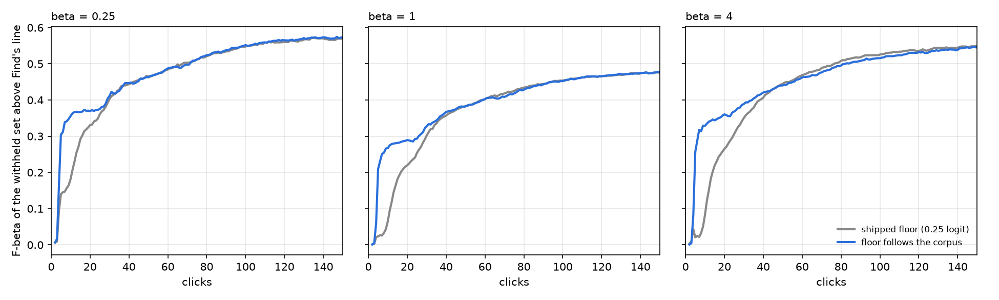

# The labels line's spread floor follows the corpus (#4492)

**Decision (owner, 2026-10-04):** ship the relative floor at 0.5 × the corpus's robust spread, after the
end-to-end runs. They confirmed the offline pricing at every preset.

## The problem

For its first ~15 clicks the labels line (#4452) returned a median of **one image**. The Good component sat where
the true positives were, but the corpus fit read no positives. The cause was the model's spread floor: an absolute
0.25 logit units, on both the class model and the corpus's negative bulk. An early head compresses every score. On
the withheld half, the robust spread of the logit scores is about 0.09 at click 5 and 0.18 by click 150. A bulk held
2.5× wider than the data covers the positives, so the Good share went to zero.

## The fix

Once a corpus is known, the floor is 0.5 × its robust logit spread (1.4826 × MAD), on both components. The class
model keeps its raw pooled spread, so every corpus floors it afresh. The fix uses only the corpus's own scores,
which Find already has, and it makes the line invariant to rescaling the logit scale.

## End to end

Binary, COCO Better, all 144 cells, 5 seeds, one set of sessions per preset (2,160 runs). Each is paired with the
#4474 review's sessions on the same cell and seed. The objective is F-beta of the withheld half above Find's line.

| preset | click 5 | 7 | 10 | 15 | 25 | 50 | 75 | 150 | after the check |
|---:|---:|---:|---:|---:|---:|---:|---:|---:|---:|
| 1/4 | +0.22 | +0.25 | +0.22 | +0.09 | +0.02 | 0.00 | 0.00 | 0.00 | +0.005 |
| 1 | +0.25 | +0.29 | +0.26 | +0.12 | +0.045 | 0.00 | −0.007 | 0.00 | −0.003 |
| 4 | +0.32 | +0.39 | +0.31 | +0.15 | +0.07 | −0.005 | −0.009 | −0.004 | −0.002 |

The table gives the paired difference, relative floor minus shipped. Standard errors are 0.012 or less early and
0.002 late.

- **At beta 1, F1 at clicks 5 to 10 goes from 0.03 to 0.08 to 0.28 to 0.34.** The median returned set grows from
  1 image to 29 to 45.
- **The ranking is unchanged:** AP and Goods found are identical, to the third decimal.
- **The late cost is small:** at most −0.010, at beta 4 around clicks 75 to 125.
- **Click 3:** the shipped line returned more than 200 images in 48% of sessions there; the fix does so in 4%.

## Costs the owner accepted

- **More early sessions return more than 200 images:** 16 to 24% at beta 1 and 25 to 40% at beta 4 at clicks 5
  to 25, against 6 to 15% and 7 to 24% shipped. After the check the shares are equal within 2 points.
- **Find corpora with no positives (offline, 702 sessions):** the median stays 1 to 2 wrong images. The early 90th
  percentile grows, to 57 to 119 wrong on 1,000 images at beta 1, clicks 5 to 15, against 1 to 5. The shipped line
  had that tail from click 25 on (#4466).
- **200-image Find corpora at the bench's prevalence (about 1 positive):** −0.035 F1 early.

## Dead ends

- **A calibration curve fitted on the votes.** Its estimated total was 3,500 to 8,500 positives against 53. The
  opening's votes are chosen on the text score, not the detector's, and no vote reaches the bulk.
- **A hybrid of that curve with the corpus mixture.** It failed the same way.
- **#4466's negative-tail models at early clicks.** They still kept one image.

## Files

Runs are under `/expscratch/sgreenberg/state-of-the-app/2026-10-04-floor-b025|b1|b4`, against `2026-10-03-b*`.
The capture is `2026-10-04-b1-pframes`, with precision frames at 18 clicks. The scripts are in
`/expscratch/sgreenberg/sel-4492/`: `floors.py`, `floors_find.py`, `compare_e2e.py` and `figure_e2e.py`.
