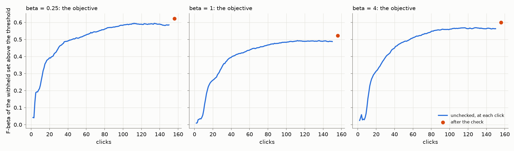
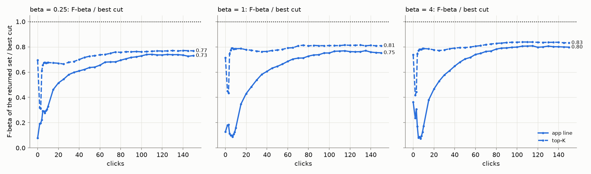
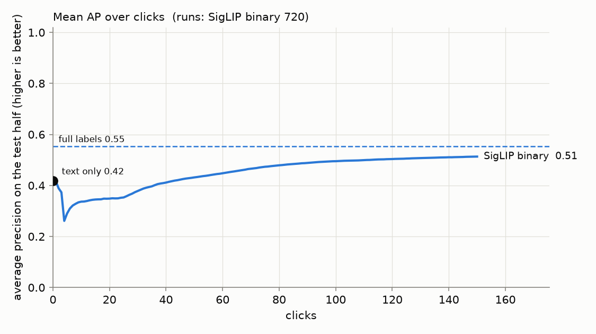
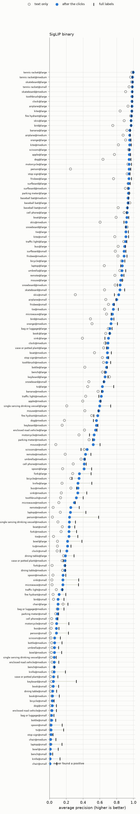
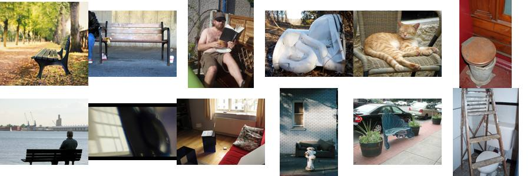
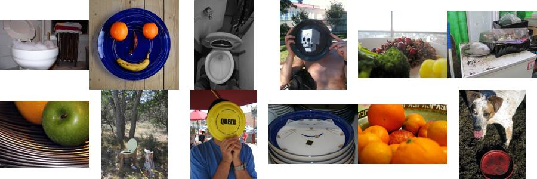
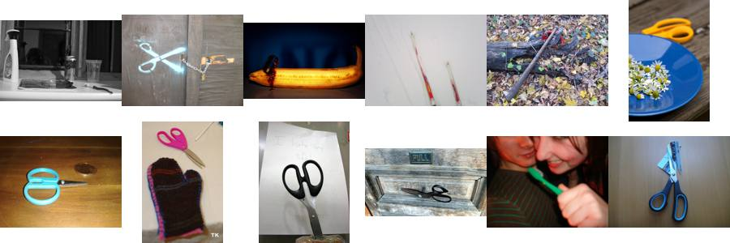
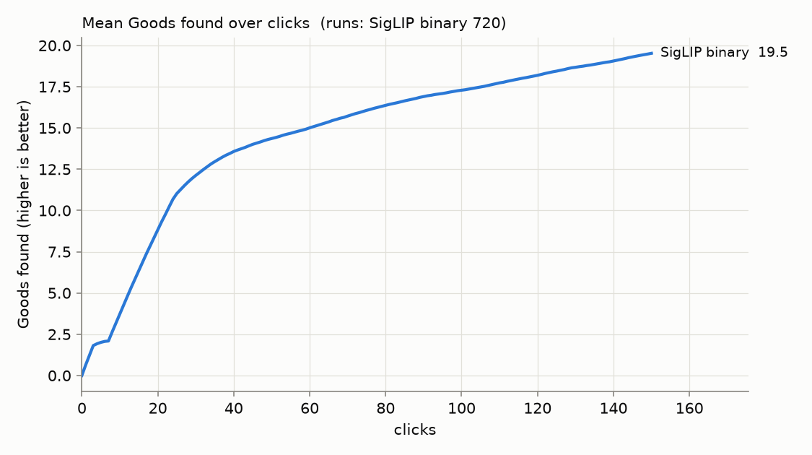

# State of the App: Binary Photo — 2026-10-04

**Issue:** #4474. **Recipe:** `.claude/skills/state-of-the-app/SKILL.md`.
**App:** `dev` at c894c86e8. The line comes from the labels (#4452), and the
presets are beta 1/4, 1 and 4 (#4448). The review tooling reads that line at
those presets (#4471). The spot check is advisory at every preset: it measures,
and its picks are votes, but it never moves the line.
**Path:** SigLIP whole-image embedding, binary (Good/Bad) votes, Autopilot's shipped
opening.
**Bench:** `coco_better`, all 49 classes at every size they have: 144 cells.
**Seeds:** 5. **Sessions:** one set per preset (`SOTA_BETA=0.25|1|4`), 720 runs each, 2,160 in all.
**Runs:** `/expscratch/sgreenberg/state-of-the-app/2026-10-03-b025`, `-b1` and `-b4`.
Seed 0 ran 2026-10-03 22:39–23:20 as #4471's verification. Seeds 1–4 ran
2026-10-03 23:43 to 2026-10-04 02:50, at about 9 minutes and 0.8 GB a run on 1
CPU. All runs used a frozen worktree at c894c86e8.
**Analysis:** `analyze.sh` per run, then
`perp.py --kind balance` (`perbeta_summary.md`). The analyzer carries #4474's
fix: the check's range is now scored on the set it audited.

A **review**, not an experiment: the app as it ships, the way a user meets it.
The user types a query and sees the text sort, then votes for 150 clicks while
Autopilot picks what to show. At the end they run the spot check once. **Each
preset is read off its own sessions:** the beta-1/4 numbers come from sessions
that aimed at 1/4, and so on.

- **The objective** (#4427) is the F-beta, at the preset's beta, of the
  withheld test half above the threshold the app holds. The test half is the
  10,900 images Find would search. The threshold is the one Find draws there:
  the labels' line with its corpus side fitted on that half. It is read at the
  last click before the check ("unchecked", what AutoRun or an unchecked
  session leaves) and after the check.
- **The share of the best cut** is the returned set's F-beta over the best
  F-beta any cut of the same ranking reaches. It separates the line from the
  ranking.
- **AP** is average precision of the ranking of the test half. It needs no
  threshold.

## Headline

**The objective, each preset off its own sessions** (702 trained runs each):

| preset | 25 clicks | 50 clicks | 100 clicks | 150 clicks, unchecked | **after the check** | returned, median | returned > 200 |
|---:|---:|---:|---:|---:|---:|---:|---:|
| 1/4 | 0.42 | 0.51 | 0.58 | 0.59 | **0.62** | 26 | 1% |
| 1 | 0.29 | 0.42 | 0.48 | 0.49 | **0.52** | 47 | 6% |
| 4 | 0.35 | 0.49 | 0.56 | 0.56 | **0.60** | 80 | 26% |

1. **The presets return what they promise.** After the check, the 1/4 preset
   returns a median of 26 images at precision 0.70 and recall 0.40. The
   balanced preset returns 47 at 0.57 and 0.54. The recall preset returns 80
   at 0.42 and 0.68.
2. **The spot check is worth more per vote than Autopilot's late clicks.**
   Paired within sessions, clicks 100 to 150 add +0.023 ± 0.003 at every
   preset. The check's 21 to 31 uniform picks add +0.037 ± 0.004,
   +0.034 ± 0.003 and +0.036 ± 0.003 at 1/4, 1 and 4, and cut the share of
   runs returning more than 200 images from 6/19/31% to 1/6/26%. #4482
   priced the trade at beta 1: a session that stops at 125 clicks and checks
   beats one that clicks to 150 without checking, by +0.025 at about equal
   votes; 150 clicks plus the check is still best, by 0.009 over 100 plus
   the check. (An earlier draft read the 100-to-150 gain as +0.002 to
   +0.005 off two columns with different denominators: the 26 sessions
   whose first Good came after click 100 have no line at 100.)
3. **The early session, read apples to apples (owner, 2026-10-04): one
   thresholding rule on both sorts.** Under each sort's **own line in the
   app**, the text sort's blind GMM cut returns about 4,500 of the 10,900
   images (F1 0.02), and the detector's labels line returns a median of
   **one image for its first 15 clicks** (F1 0.03 at clicks 4 to 7, 0.22 at
   15). Both are useless early, and the detector's is the less bad one from
   click 4 at beta 1 (2 at 1/4, 15 at 4). Under **set-constant top 32 on
   both** (128 at beta 4), the detector's ranking overtakes the text sort's
   at click 6 (0.40 at click 10 against the text sort's 0.38; at beta 4,
   click 40). Earlier drafts compared the detector's line with the text
   sort's top 32 and read "worse than the typed query for 35 to 50 clicks";
   that crossed rules and is withdrawn. What stands: for about 15 clicks the
   labels line (#4452) has no idea how many positives there are. The opening
   takes its Goods from the top of the text sort, the class model puts
   positives far above where most of them sit, and Find's prevalence
   estimate reads 0.0000 against a true 0.43%, so the cut keeps the one
   image it is surest of. The ranking is not the cause: its best cut matches
   the text sort's from click 7, and AP's dip (0.42 → 0.26 at click 4, back
   by 43) is the same as in the 2026-09-30 review. #4452 was priced at click
   150 and on Find corpora, never on the early session. The ranking's own
   dip is #4384.

**The returned set, one rule per row.** "App line" is what each sort's own
line in the app returns: the text sort's blind GMM cut, the detector's labels
line, and the full-label model's threshold as the harness applied it.
"Top-K" is set-constant at the old cap on every sort: 32 at beta ≤ 1, 128 at
beta 4. Compare within a rule, never across. Detector rows are the last click
before the check.

| preset | rule | text sort | 25 clicks | 50 clicks | 150 clicks | full labels | returned at 150, median / text sort |
|---:|---|---:|---:|---:|---:|---:|---:|
| 1/4 | app line | 0.01 | 0.36 | 0.47 | **0.57** | 0.21 | 35 / 4,500 |
| 1/4 | top 32 | 0.47 | 0.42 | 0.49 | **0.57** | 0.62 | 32 / 32 |
| 1 | app line | 0.02 | 0.26 | 0.38 | **0.48** | 0.28 | 48 / 4,500 |
| 1 | top 32 | 0.38 | 0.34 | 0.39 | **0.46** | 0.50 | 32 / 32 |
| 4 | app line | 0.15 | 0.32 | 0.46 | **0.55** | 0.59 | 79 / 4,500 |
| 4 | top 128 | 0.49 | 0.40 | 0.47 | **0.56** | 0.62 | 128 / 128 |

Two things the rules show together. Under the app's own lines the detector
wins at every point from click 4 on, because the text sort's line returns
most of the corpus. Under top-K the ranking alone is compared, and 150
clicks of detector beat the text sort by 0.08 to 0.10 at every preset. The
full-label model's own line is the odd row: at beta 1 it returns about 840
images at precision 0.20 (F1 0.28 against a best cut of 0.58), which says
the labels line mis-sizes its set even when every label is known; that is
filed as a finding, not a fix.

**The ranking** barely depends on the preset (the beta-1 sessions):

| | text only | 25 clicks | 50 clicks | 150 clicks | full labels |
|---|---:|---:|---:|---:|---:|
| **AP** | 0.42 | 0.35 | 0.43 | **0.51** | 0.55 |
| **Goods found** | — | 11 | 14 | **20** | — |

150 clicks close about two thirds of the gap from the typed query to full
labels, as in the 2026-10-01 review. The line changed tonight; the ranking did
not. AP falls from 0.42 to 0.26 at click 4 and is back at the text level by
click 43.

## The spot check

The check walks bands of the unvoted ranking, about 5 picks a band, and since
#4452 it never moves the line. Its range describes the set it audited.

| preset | votes | range | width | truth | range held the truth |
|---:|---:|---|---:|---:|---:|
| 1/4 | 21 | 0.18 – 0.82 | 0.65 | 0.45 | 100% |
| 1 | 22 | 0.12 – 0.81 | 0.69 | 0.38 | 100% |
| 4 | 31 | 0.075 – 0.79 | 0.71 | 0.29 | 100% |

The range is honest: it held the truth in all 702 runs at every preset. It is
also nearly uninformative: "likely 12–81% right" tells a user little. The
check's value today is its retrain (headline, point 2), not its range (#4483).

An earlier analyzer scored the range against the set the line *keeps* (3 to 14
images here) rather than the set the check *audited* (16 or 64). It read
coverage as 50 to 69%. #4474 fixes that, so reviews from #4427 on were
understating the range.

## Where the app does well and where it does poorly

**By size band** (beta 1; the objective after the check, AP of the ranking):

| band (cells) | objective | returned, median | text AP | AP at 150 | full-label AP | Goods found |
|---|---:|---:|---:|---:|---:|---:|
| large (49) | 0.77 | 48 | 0.70 | 0.79 | 0.82 | 28 |
| medium (49) | 0.48 | 44 | 0.38 | 0.48 | 0.51 | 20 |
| small (46) | 0.28 | 47 | 0.16 | 0.24 | 0.31 | 9.7 |

**Well:** sports equipment and other things a scene is *about* (beta 1, trained
runs, objective after the check):

| class | objective | text AP | AP at 150 | full-label AP |
|---|---:|---:|---:|---:|
| tennis racket | 0.96 | 0.97 | 0.99 | 0.99 |
| skateboard | 0.91 | 0.85 | 0.94 | 0.96 |
| kite | 0.90 | 0.81 | 0.95 | 0.97 |
| airplane | 0.88 | 0.83 | 0.91 | 0.91 |
| baseball bat | 0.88 | 0.90 | 0.93 | 0.94 |
| surfboard | 0.87 | 0.87 | 0.92 | 0.93 |

**Poorly:** furniture, tableware and cutlery, things that fill a scene rather
than define it:

| class | objective | returned, median | text AP | AP at 150 | full-label AP | why (below) |
|---|---:|---:|---:|---:|---:|---|
| chair | 0.08 | 99 | 0.09 | 0.06 | 0.15 | clicks made it worse |
| bowl | 0.16 | 75 | 0.05 | 0.12 | 0.24 | loop |
| dining table | 0.17 | 91 | 0.11 | 0.14 | 0.19 | embedding |
| knife | 0.18 | 23 | 0.08 | 0.17 | 0.31 | loop |
| spoon | 0.22 | 34 | 0.07 | 0.20 | 0.28 | mixed |
| enclosed road vehicle | 0.23 | 71 | 0.17 | 0.22 | 0.27 | embedding |
| bench | 0.25 | 30 | 0.23 | 0.24 | 0.25 | embedding |
| bottle | 0.27 | 47 | 0.16 | 0.27 | 0.32 | mixed |
| fork | 0.28 | 80 | 0.15 | 0.26 | 0.33 | mixed |

**Why.** The ceiling separates two cases. When it is also low, the embedding
can't separate the class. When it is high but the final AP is not, the loop
failed to collect the labels. The confusers are the images Autopilot most often
showed as Bad (`why.py`, `why/why.csv`), ranked by lift over the corpus.

- **chair: the clicks make it worse (AP 0.09 → 0.06), and the ceiling is 0.15.**
  Bad clicks most often hold a **couch (17%, 9× the corpus rate) or a bench
  (15%, 10×)**, then a toilet (8%). Whole-image SigLIP sees "a seat" and cannot
  tell which kind, and chair@small never trains a detector in 5 of its 5 seeds.
  The line then returns a median of 99 images at an objective of 0.08.
  
- **bowl: the loop.** The ceiling is 0.24 against a final 0.12. Almost a quarter
  of its Bad clicks hold a **toilet (23%, 11×)**, and broccoli (7%, 14×): round
  white things and food.
  
- **knife: the loop.** The ceiling is 0.31 against a final 0.17. Bad clicks hold
  **scissors (11%, 47×)**, then pizza and broccoli. The head learns
  "blade-shaped metal" before it learns "knife".
  
- **spoon: mixed.** Its confusers are knives (29×) and toothbrushes (29×): long
  thin things held in a hand.
- **dining table: the embedding.** The ceiling is 0.19, close to the final 0.14.
  Its Bad clicks hold couches (12%, 6×) and chairs (10%, 8×): "a room with
  furniture", whichever kind.
- **bench: the embedding.** 0.23 → 0.24 against a ceiling of 0.25. Its Bads are
  other street furniture: parking meters (10×) and fire hydrants (4×).
- **bottle and fork: mixed.** Bottle's confusers are toothbrushes (45×), cups
  and parking meters (15× each). Fork's are knives (28×) and broccoli (13×).

## Headroom (full labels minus 150 clicks)

The mean is 0.04 (0.55 − 0.51). It concentrates in a few classes: person
(0.17), knife (0.14), bowl (0.12), tv (0.11), keyboard (0.11) and laptop (0.10).
Tennis racket, airplane, skis and snowboard sit at or above their ceiling: a
head trained on 150 chosen labels can beat one trained on every label when the
extra labels are noisy.

## What the clicks bought (150 clicks minus text only)

The mean is +0.09 AP (0.42 → 0.51). Person gains the most, +0.32 (0.10 → 0.42):
the typed query ranks it badly and clicks rescue it. Skis gains +0.30 and sink
+0.21. Chair loses 0.02. Bench, bag or luggage, parking meter and dining table
gain at most 0.02: for these, typing the query is as good as clicking.

Harvest is front-loaded: 11 of the 20 Goods arrive in the first 25 clicks.

## Images

2,572 images were clicked 10 or more times (beta-1 sessions). **5 are helpful and
32 harmful** past |z| > 3. Shuffling images within each (cell, label, phase)
bucket gives at most 3 helpful and 6 harmful, so the harmful side is real
(`images.md` has every one with its thumbnail). The harmful ones are Bad clicks
that cost a specific detector AP every time they are clicked:

- **376442**, a toilet with a dark stuffed toy in the bowl: Bad for **frisbee**
  9 times, −0.12 AP a click. Its round white seat reads as a white disc.
- **277888**, a row of plush toys on a white sheet: Bad for **banana** 7
  times, −0.09 AP a click.
- **422517**, a black-and-white photo of a man on a park bench: Bad for
  **parking meter** 13 times, −0.06 AP a click.
- **186207**, a bed with red embroidered pillows and a crest: Bad for **tennis
  racket** 9 times, −0.017 AP a click.

Three of these four were harmful in the 2026-10-01 review too. They are what
#4404 is about: early Bad votes that share a cue with the class.

## Known regimes to flag, not to fix

- **Detectors that never train:** 18 of 720 runs per preset (2.5%), all at the
  small band, mostly chair (5), bowl (3) and knife (3): 150 clicks never surface
  a positive.
- **Weak sessions over-return** (#4466): when the labels barely separate, the
  line returns hundreds of images, and thousands early in a session (at click 25
  the 90th percentile at beta 1 is about 2,000). The check repairs most of it
  (19% → 6% over 200 at beta 1). Pricing on #4466 found no corpus-side rule
  worth shipping; the options are the owner's.
- **No run exhausted its positives** before 150 clicks (#4121's regime did not
  occur).

## What to A/B next

- **The early session's line (#4384, on the returned set):** the labels line
  returns one image for its first 15 clicks because its prevalence estimate
  collapses under the opening's labels. Apples to apples it is still less
  bad than the text sort's own line from click 4, and the ranking beneath it
  overtakes the text sort's by click 6. The fix is an estimate that stays
  honest when the only Goods so far are the easiest ones; a set-constant
  floor would hide it and does not scale with the Find corpus (owner).
- **The full-label model's own line under-sizes its set.** With every label
  known it returns about 840 images at F1 0.28 against a best cut of 0.58
  (beta 1). The line's model of where positives sit is off even with
  perfect labels.
- **#4482: priced.** Per vote, check-style picks are worth about twice
  Autopilot's late clicks (+0.047 for 22 picks at click 100 against +0.023
  for 50 clicks), and they add up rather than substitute.
- **#4483: a tighter check range.** The current one is honest but 0.65 to 0.71
  wide.
- **#4404: correct early Bad votes that share a cue with the class.** The same
  harmful images keep showing up.

## Files

- `perbeta_summary.md`: every table above per preset, from `perp.py --kind balance`.
- `figures/`: the objective and the returned set per preset, AP and Goods over clicks, every cell.
- `images.md`, `images/`: the helpful and harmful images, with thumbnails.
- `why/`: the confuser sheets and `why.csv`.
- Runs and full analyses: `/expscratch/sgreenberg/state-of-the-app/2026-10-03-b025|b1|b4/analysis-binary/`.
