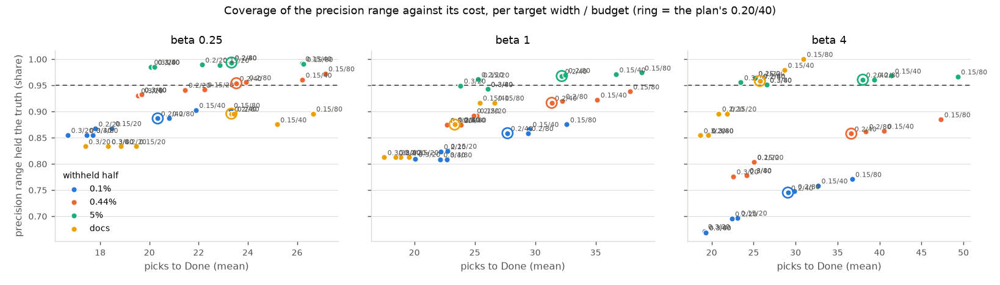
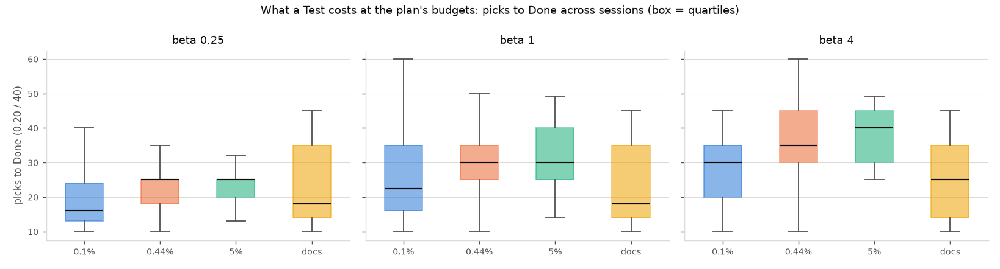
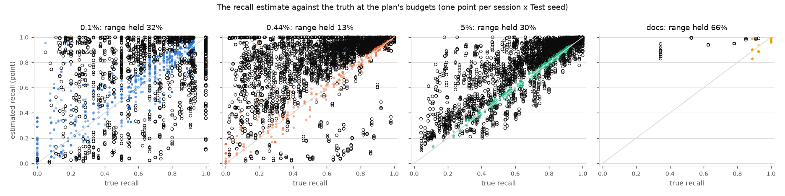
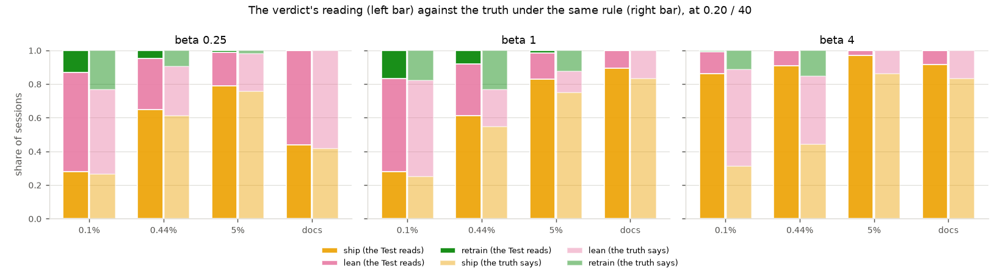

# What do Test mode's targets and budgets cost, and do its ranges hold? (#4523)

**The precision half of Test mode works at the plan's values, and the recall
half does not work at any of them.** With a precision-width target of 0.20
and 40 picks a phase (`docs/plans/test-mode.md` §2), a Test costs **20–38
picks** (median 16–40, 90th percentile 30–45) and its precision range holds
the truth in **92–96%** of sessions on COCO Better's default pool at beta ≤ 1
and **96–99%** on a 5% corpus, against the 95% it claims. Tightening the
target to 0.15 buys 1–3 points of coverage for 4–10 more picks; loosening it
to 0.30 loses 1–3 points for 4–10 fewer. Where the range falls short — **75–89%
at 0.1% positives, 86% at beta 4 on the default pool** — no width or budget
on the grid recovers it, because the shortfall is the estimator's, not the
stop's: on a line that keeps hundreds of items of which 1–2% are right, each
5-pick band that finds nothing is read through the Jeffreys prior as about
8% right, and summed over six or seven such bands the range settles around 9%
with the truth below its lower end (**0% coverage above 1,024 kept items, 99%
below 64**). The **recall range holds the truth in 13–38%** of sessions on
photos. The walk below the line ends after one band of five picks in 88–95%
of sessions (the dry run or a range already narrower than 0.25), and the
model-assisted tail it then rests on is usually a little short of the truth
and sometimes hundreds over. Walking to the 40-pick budget instead (no dry
run, no width stop) raises recall coverage to **75–94%** on photos at about
30 more picks, but on a document class, which has no class model, the same
walk swings the other way (recall bias −0.56): there the recall estimate is
worth **only its words, and the words are right one time in three**. The
verdict's reading agrees with the truth's **70–89%** of the time at beta ≤ 1
and **40–52%** at beta 4, where it says *ship* for lines the truth would lean
shallower. At 0.1%, 18–28% of sessions have **nothing to test**: the line
keeps fewer than five images.

**What this fixes for #4524.** The matches phase: keep **0.20 / 40**. The
misses phase: with a class model, **walk to the 40-pick budget** (no dry-run
stop, no width stop); without one, audit the first band and report recall in
words only. Both are the study's recommendation, not the owner's ruling; the
plan's values stay in `LineBudgets` until #4524 ships them. Two estimator
findings are filed as follow-ups rather than fixed here: the prior's mass on
big sparse lines (precision), and the *Lean* reading at beta 4 (verdict).

Part of #4520; follows #4527 (the test sample). Harness:
`vtscore/eval/line_test_arm.py` (the arm), `scripts/experiments/calibration/analyze_line_test_4523.py`
(the replay; selftest `selftest_analyze_line_test_4523.py`, 15 planted-answer
checks), `figure_line_test_4523.py`, `launch_line_test_4523.sh`. The viewer for
the training sessions behind the Test corpora is [`viewer.html`](viewer.html).

## What was run

- **Sessions.** The shipped app on COCO Better, SigLIP whole-image binary
  voting on every class (144 cells), 150 clicks, the text opening, the balance
  line at each preset beta (1/4, 1, 4), 3 seeds: 432 sessions per world and
  beta. Three worlds: the default pool (0.44% positive), positives thinned to
  0.1% (test and pool both; cells left with fewer than 15 positives are
  skipped, so 370 of 432 ran), and the Train pool's negatives thinned so
  positives are 5% of it (the withheld half stays at 0.44% and is thinned to
  5% in the replay, as #4383's corpus draws were). One document run on six
  FullMarks tier-m classes (`sota_documents.py`, 50 clicks, frames at 25 and
  50; the structural line serves beta 1/4 and 1 in one run and beta 4 in
  another), 12 frames a beta.
- **The Test.** After the last ordinary click the withheld half is ranked by
  the final model, Find's labels line is fitted on it and cut at the session's
  beta (the headline's returned set), and the Test autopilot of #4527 runs on
  that frozen ranking with every pick answered from the truth: the matches
  phase above the line, the misses phase below it, to Done. The model's item
  posteriors from the same fit are the recall estimator's auxiliary. Documents
  have no class model, so their walk below the line runs on the Jeffreys prior
  alone and their unreached tail counts nothing.
- **The grid.** Precision-width targets 0.15 / 0.20 / 0.30 × per-phase
  budgets 20 / 40 / 80, at the plan's walk below the line; and, at 0.20 / 40,
  four other walks: no dry-run stop; no dry-run and no width stop (the walk
  runs to its budget); the model's prior at one pick's weight instead of
  five; and both relaxations at that weight. Four Test seeds per session and
  grid point: **192,660 Tests** over 3,669 photo sessions and 24 document
  frames. Every Test is a replay of the saved withheld-half snapshot
  (`task_*__testscores.npz`), since Test votes never train; the in-run arm's
  rows (`task_*__linetest.csv`, the plan's values) are the control.
- **Scored on** the picks to Done per phase and why each phase ended; whether
  the precision, recall and F-beta ranges at Done held the truth, their
  widths and the point estimates' error; whether the *found* words matched
  the truth's; at every band edge, whether the re-estimated ranges held; and
  the verdict's reading against the truth's under the same rule. Coverage
  shares carry (category, seed)-cluster standard errors in `summary.csv`.

## The matches phase: the precision range

Coverage of the precision range (share of sessions whose 95% range held the
truth) by target width and per-phase budget, at the plan's walk below the
line. The column the plan proposes is **0.20 / 40**; cluster SEs are
0.002–0.024.

| withheld half | beta | 0.15 / 20 | 0.15 / 40 | 0.15 / 80 | **0.20 / 40** | 0.20 / 80 | 0.30 / 20 | 0.30 / 40 |
|---|---:|---:|---:|---:|---:|---:|---:|---:|
| 0.1% | 1/4 | 0.87 | 0.90 | 0.90 | **0.89** | 0.89 | 0.86 | 0.86 |
| 0.1% | 1 | 0.83 | 0.87 | 0.88 | **0.86** | 0.86 | 0.81 | 0.81 |
| 0.1% | 4 | 0.70 | 0.76 | 0.77 | **0.75** | 0.75 | 0.67 | 0.67 |
| 0.44% | 1/4 | 0.94 | 0.96 | 0.97 | **0.95** | 0.96 | 0.93 | 0.93 |
| 0.44% | 1 | 0.89 | 0.92 | 0.94 | **0.92** | 0.92 | 0.87 | 0.88 |
| 0.44% | 4 | 0.80 | 0.86 | 0.89 | **0.86** | 0.86 | 0.78 | 0.78 |
| 5% | 1/4 | 0.99 | 0.99 | 0.99 | **0.99** | 0.99 | 0.99 | 0.99 |
| 5% | 1 | 0.96 | 0.97 | 0.97 | **0.97** | 0.97 | 0.95 | 0.94 |
| 5% | 4 | 0.96 | 0.97 | 0.97 | **0.96** | 0.96 | 0.96 | 0.95 |
| documents | 1/4 | 0.83 | 0.88 | 0.90 | **0.90** | 0.90 | 0.83 | 0.83 |
| documents | 1 | 0.81 | 0.92 | 0.92 | **0.88** | 0.88 | 0.81 | 0.81 |
| documents | 4 | 0.90 | 0.98 | 1.00 | **0.96** | 0.96 | 0.85 | 0.85 |

*Each point is one grid point; the ring is 0.20 / 40. Coverage rises with
picks within a world, but the worlds sit on separate levels: more picks do
not move 0.1% or beta 4 onto the 95% line. Read the panels separately; a
mean across them would hide exactly that.*

**Cost at 0.20 / 40.** Mean picks to Done 20 / 28 / 29 at 0.1% (beta 1/4,
1, 4), 24 / 31 / 37 at 0.44%, 23 / 32 / 38 at 5%, 23–26 on documents; 90th
percentiles 30–45. Of those, 5–9 are the misses phase (below). The matches
phase ends on its width in 62–95% of sessions, on its budget in 0–20%
(mostly at beta 4, whose lines are biggest), and by exhausting its bands
(a censused line, exact by construction) in 1–34% (mostly at 0.1%, whose
lines are smallest).

**Why 0.1% and beta 4 fall short, and why no budget fixes it.** The range
misses *above* the truth: at 0.1% / beta 4, 25% of ranges have a lower end
above the true precision and 0.2% an upper end below it. The miss tracks the
line's size, not the picks spent:

| line keeps | sessions | coverage | true precision | estimate | picks |
|---:|---:|---:|---:|---:|---:|
| ≤ 64 | 644 | 0.99 | 0.44 | 0.45 | 21 |
| 65–256 | 228 | 0.92 | 0.081 | 0.13 | 35 |
| 257–1,024 | 184 | 0.28 | 0.016 | 0.087 | 43 |
| > 1,024 | 152 | 0.00 | 0.002 | 0.091 | 38 |

A beta-4 line on an 11k-image corpus with 11 positives keeps 700 items on
average and about 1% of them are right. Its bands (8, 8, 16, 32, 64, 128,
256, 512 …) each get one round of five picks that finds nothing, and the
Jeffreys posterior for 0 of 5 has mean 0.5 / 6 ≈ 8%. One such band's range
reaches down to 0.01%, but the line's precision is the *size-weighted sum* of
six or seven of them, and sums concentrate: the joint range lands on 2–23%
with the truth at 0.2–0.8% (`book@medium` seed 1: 1,103 kept, 0.3% right,
range 1.5–23%; `laptop@large` seed 2: 1,631 kept, 0.7%, range 1.6–22%). The
allocation rule then spends its remaining rounds where the F-beta range would
shrink most, which is never a band whose posterior is already narrow, so the
budget runs out before any band is audited enough to move the prior. This is
the estimator's prior, not the stop rule, and it is filed as a follow-up: a
pooled or hierarchical rate across the empty bands, or a flat prior on the
*union*, would fix it; so would audits in proportion to band size. Until
then the honest reading of a wide sparse line's precision range is "at most
this", and the app's own regime — beta ≤ 1 on a corpus at the default pool
or richer — is where the range means what it says.

**The band edges.** *Lean the Threshold* reads the same draws at every band
edge. Those ranges hold less often than the line's own: precision 42–76% of
edges, F-beta 39–73%, because the deepest edges (the whole corpus) are
estimated from the model's tail alone.

## The misses phase: the recall range

At the plan's walk the recall range is not a range. It holds the truth in
13–14% of sessions at 0.44%, 25–38% at 0.1%, 26–32% at 5%, 65–67% on
documents (where it is a point near 1.0 and the truth is often 1.0). The walk
below the line takes one round of five picks from the first band under the
line and stops in 88–95% of sessions: on the dry run (no match found and the
model expects little below) in 12–88%, or because the recall range is already
narrower than 0.25 in 9–88%. What it then reports is the model's count in the
bands it never reached, as a point (`tail_from_model` 97–100% of sessions).

That point is wrong in both directions. Its median error is −0.1 to −12
positives (the model under-counts the tail), its 90th percentile +0 to +163
(at 0.1% / beta 1/4 the fit occasionally admits a tail of hundreds). Either
way the range is too narrow to hold: at 0.44% / beta 1 it sits above the
truth in 82% of sessions (`toothbrush@medium` seed 1: true recall 0.51, range
0.85–0.94, the model's tail 0.5 against 17 positives really there;
`spoon@large` seed 1: true 0.42, range 1.00–1.00, tail 0.006 against 27).

**Walking deeper.** The other walks at 0.20 / 40 (`summary.csv`, the `walk`
column; the first row of each world is the plan):

| withheld half | beta | walk | picks | below | recall held | F-beta held | precision held |
|---|---:|---|---:|---:|---:|---:|---:|
| 0.44% | 1 | plan (dry run 5%, width 0.25) | 31 | 6 | 0.13 | 0.49 | 0.92 |
| 0.44% | 1 | no dry run | 34 | 9 | 0.14 | 0.49 | 0.92 |
| 0.44% | 1 | **to the budget** (no dry run, no width stop) | 62 | 37 | **0.75** | **0.83** | 0.92 |
| 0.44% | 1 | to the budget, model weight 1 | 62 | 36 | 0.82 | 0.86 | 0.92 |
| 0.1% | 1 | plan | 28 | 9 | 0.38 | 0.57 | 0.86 |
| 0.1% | 1 | to the budget | 56 | 37 | 0.80 | 0.80 | 0.86 |
| 5% | 1 | plan | 32 | 5 | 0.32 | 0.74 | 0.97 |
| 5% | 1 | to the budget | 66 | 39 | 0.92 | 0.95 | 0.97 |
| documents | 1 | plan | 23 | 5 | 0.67 | 0.75 | 0.88 |
| documents | 1 | to the budget | 58 | 40 | **0.27** | 0.27 | 0.88 |

Across every photo world and beta, walking to the budget holds recall 61–94%
of the time and F-beta 61–95%, for 29–31 more picks a session (57–68 in all,
90th percentile 65–80). Dropping only the dry run, or lowering the model's
weight, changes nothing on its own: the width stop fires instead. On
documents, which have no model, the deep walk's audited bands take the
Jeffreys prior — 0 of 5 reads as 8% of a band of thousands of pages — and the
count of positives below the line explodes (recall bias −0.56, held 21–27%).
With no model the walk must stop after the first band, and the recall it
reports is not a measurement.

**The words.** The *found* words the verdict shows match the truth's words in
27–36% of sessions at 0.44%, 39–46% at 0.1%, 62–71% at 5%, 33% (beta ≤ 1) to
75% (beta 4) on documents. That is the honest answer to "what is the recall
estimate worth at 0.1%": its words, and they are right two times in five.

## The verdict

Under the study's proposed rule — *lean* when another band edge's F-beta
reads 0.05 or more above the line's, *retrain* when the F-beta range cannot
reach 0.5, else *ship* — the reading agrees with the truth's under the same
rule in 82% / 70% / 52% of sessions at 0.44% (beta 1/4, 1, 4), 82% / 81% /
40% at 0.1%, 87% / 80% / 89% at 5%, 98% / 90% / 92% on documents.

Where it disagrees it says *ship*: at beta 4 the truth would lean in 41–58%
of sessions (the best edge is shallower than the line in 31% of them) and the
Test leans in 9–13%, because the estimated edge gain (median 0.002, 90th
percentile 0.05 at 0.44%) is a fraction of the true one (0.04, 0.14). The
edges' F-beta rests on the recall estimate above, so this is the same
finding seen from the verdict page. When the Test does say *lean*, following
it gains 0.03–0.14 of true F-beta on average. The *retrain* reading is rare
on both sides (0–17% of sessions) and agrees where it fires.

## Nothing to test

At 0.1% the line keeps fewer than one round (5 images) in 28% / 22% / 18% of
sessions (beta 1/4, 1, 4); at 0.44%, 16% / 9% / 8%; at 5%, 3.5% / 0 / 0. The
line never keeps nothing. These sessions are the *Nothing to test* state and
are excluded from every coverage share above; they are the denominator's
missing part at 0.1%.

## The harness check

The replay reproduces the in-run arm's rows at the plan's values on the
line's count in 2,372 of 2,373 cells (one differs by one item) and on the
phase in all of them; the row is identical in 190. The rest differ in the
model-assisted numbers (the tail, the count below, recall and F-beta) in the
third or fourth decimal, and in which band the allocation picks next in 21%
of cells, because the snapshot the run saved holds float32 scores and a class
model rounded to six decimals, and the corpus fit is re-done on those. The
aggregates agree: mean picks 28.6 against 28.6, precision coverage 0.869
against 0.872, recall coverage 0.208 against 0.213 (`harness_check.json`).
The dump now saves float64 scores and the unrounded model (this PR), so the
next run's replay is bit-exact.

The training sessions behind the Test corpora are ordinary runs of the app;
their cost over clicks and crossover against the typed query are in
[`figures/cost_vs_clicks.png`](figures/cost_vs_clicks.png),
[`figures/cost_vs_clicks_runs.png`](figures/cost_vs_clicks_runs.png) and
[`figures/average_precision_vs_clicks.png`](figures/average_precision_vs_clicks.png)
(beta 1; the 0.1% arm never beats its text sort on cost within 150 clicks,
as #4222 found), and in the [viewer](viewer.html).

## Decisions made without the owner (2026-10-05, overnight)

- **The pick rule.** `pick.csv` names, per world and beta, the cheapest grid
  point whose precision coverage reaches 0.93 (95% less two points of
  sampling slack). It settles on 0.30 / 20 wherever every point qualifies
  (0.44% at beta 1/4, every 5% row) and finds nothing eligible at 0.1% or at
  0.44% / beta 4. The report recommends **0.20 / 40** anyway: the cheaper
  point saves 4 picks for 1–3 points of coverage, and the owner's objective
  is the withheld F-beta, which the recall half decides.
- **The misses walk.** Recommended as "to the budget with a model, one band
  without", from the variant table; a width target of 0.25 on recall is never
  binding once the tail is a point, so it is dropped rather than tuned again.
- **The 5% world** is the Train pool thinned (the app's #4303 knob) with the
  withheld half thinned in the replay; the alternative (positives raised) does
  not exist in the harness.
- **The verdict rule's constants** (0.05 gain, 0.5 bar) were set before the
  run and not tuned to it. Their raw inputs (`edge_gain_est`, `edge_gain_true`,
  the F-beta ranges) are in `rows.csv.gz` on the GRID
  (`/expscratch/sgreenberg/line-test-4523/analysis/`) for another cut.
- **Documents** are six classes, one session each, not the 36-class roster:
  enough to show the no-model behaviour, not to price it.

## Follow-ups

- #4539 — the precision range on a big sparse line: the Jeffreys prior's mass
  across many empty bands.
- #4540 — *Lean the Threshold* at beta 4: the edge estimate under-reads the
  true gain.
- #4524 reads this report's recommendations into the Test view.

## Files

- `summary.csv` — per world × beta × width × budget × walk: sessions, picks
  (mean, p50, p90, per phase), stop shares, coverage with cluster SEs, range
  widths, estimate bias and error, edge coverage, tail error, *found* match,
  verdict shares and agreement.
- `pick.csv` — the pick rule's choice per world and beta beside the default.
- `harness_check.json`, `provenance.json` — the replay-against-harness check
  and the inputs (cells, hashes, grid, seeds).
- `figures/` — the four study figures and the training sessions' curves.
- `viewer.html` — the training sessions' interactive viewer (beta 1).
