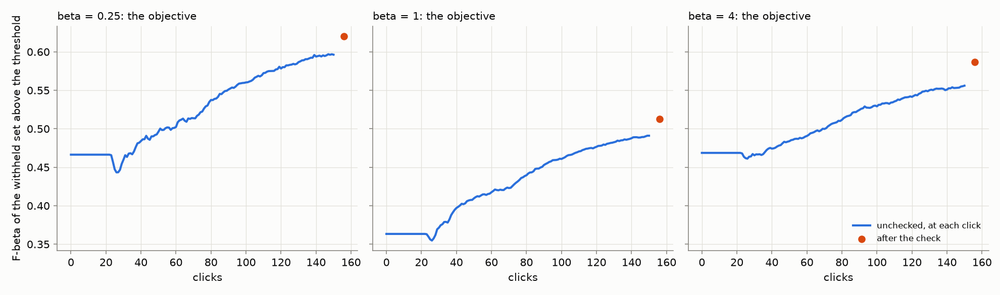
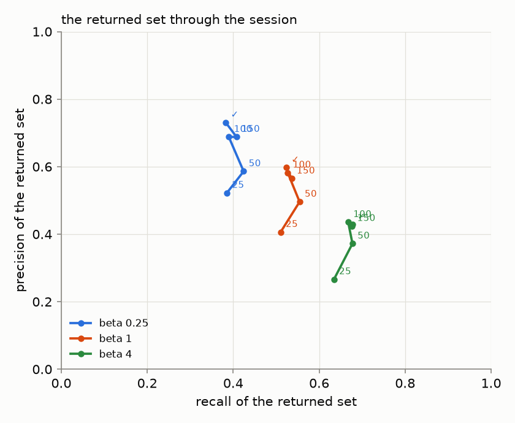
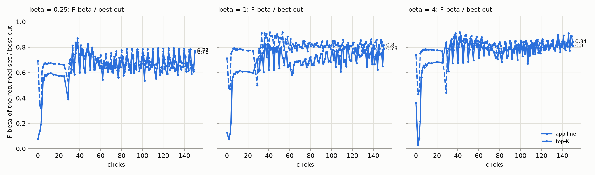
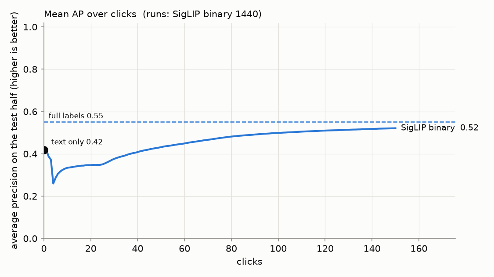
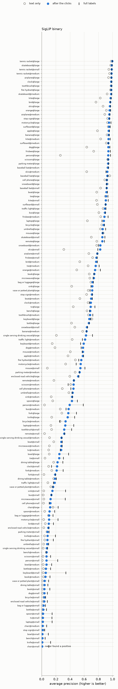
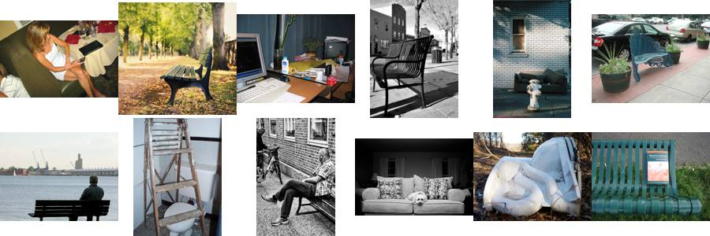
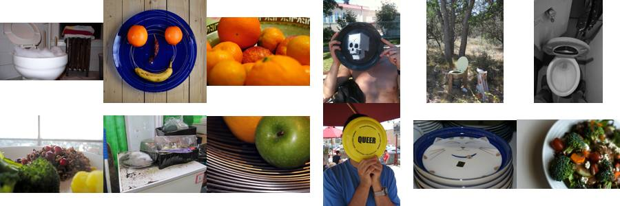
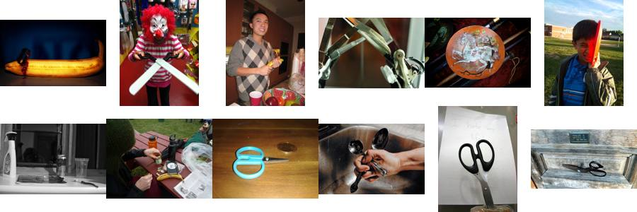
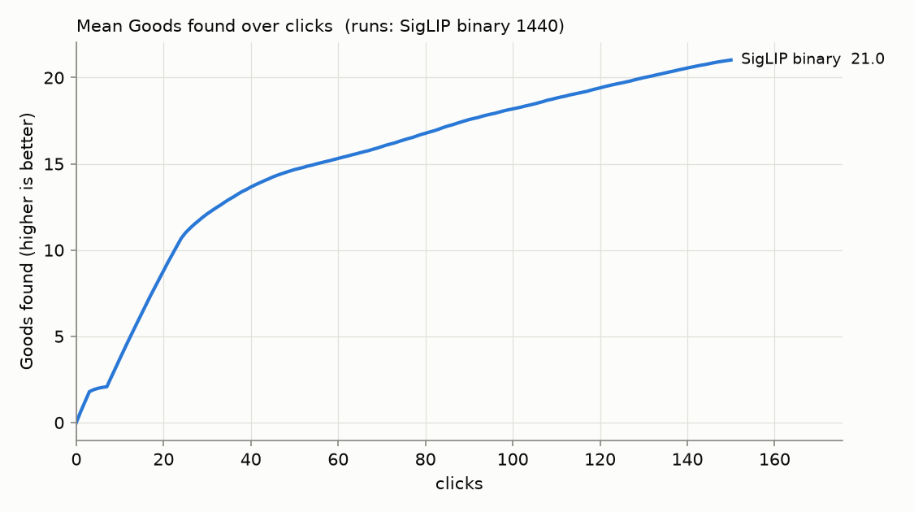

# State of the App: Binary Photo — 2026-10-05

**Issue:** #4510. **Recipe:** `.claude/skills/state-of-the-app/SKILL.md`.
**Interactive viewer:** [`viewer.html`](viewer.html), the beta-1 run's sessions (`2026-10-05-b1`, the app's default preset).
**App:** `dev` at 19ed74aaa. The line comes from the labels (#4452), and its spread floor follows the corpus
(#4492). Autopilot runs the spot check itself when the labels separate weakly (#4496, PR #4503). The presets are
beta 1/4, 1 and 4.
**Path:** SigLIP whole-image embedding, binary (Good/Bad) votes, Autopilot's shipped opening.
**Bench:** `coco_better`, all 49 classes at every size they have: 144 cells.
**Seeds:** 10. **Sessions:** one set per preset (`SOTA_BETA=0.25|1|4`), 1,440 runs each and 4,320 in all, plus one
full-label ceiling pass shared by the three.
**Runs:** `/expscratch/sgreenberg/state-of-the-app/2026-10-05-b025`, `-b1` and `-b4`, with the ceiling in
`-b1/ceiling`. All ran from frozen worktrees at 19ed74aaa, at about 7 to 12 minutes a run on 1 CPU:
- **Seeds 0 to 3** ran 07:53 to 10:23. The first version of this report read them.
- **Seeds 4 to 9** ran 14:15 to 17:49, for the deck's per-click curves (#4519).

**Analysis:** `analyze.sh` per run on all 10 seeds with #4528's tooling, then `perp.py --kind balance`
(`perbeta_summary.md`, `precision_recall_path.csv`).

A **review**, not an experiment: the app as it ships, the way a user meets it.
- **The session.** The user types a query and sees the text sort, then votes for 150 clicks while Autopilot picks
  what to show. When the labels separate weakly, Autopilot stops to run a spot check. At the end the user runs the
  check once more.
- **Presets.** Each preset is read off its own sessions.
- **The objective** (#4427) is the F-beta, at the preset's beta, of the withheld test half above the threshold the
  app holds. The test half is the 10,900 images Find would search, and the threshold is the labels line Find
  draws there.
- **The share of the best cut** separates the line from the ranking. **AP** measures the ranking alone.

## Headline

**The objective, each preset off its own sessions** (1,403 trained runs each):

| preset | 25 clicks | 50 clicks | 150 clicks, unchecked | **after the check** | returned, median (unchecked / after) | returned > 200 (unchecked / after) |
|---:|---:|---:|---:|---:|---:|---:|
| 1/4 | 0.43 | 0.51 | 0.61 | **0.64** | 27 / 21 | 5% / 0% |
| 1 | 0.34 | 0.42 | 0.50 | **0.53** | 44 / 44 | 11% / 5% |
| 4 | 0.42 | 0.48 | 0.57 | **0.60** | 72 / 80 | 29% / 28% |

1. **The presets return what they promise.** After the check:
   - the 1/4 preset returns a median of 21 images at precision 0.73 and recall 0.38;
   - the balanced preset returns 44 at 0.60 and 0.52;
   - the recall preset returns 80 at 0.43 and 0.68.
2. **The early session returns a real set.** At clicks 5, 10 and 25 the labels line returns a median of 16/24/31
   images at 1/4, 29/39/53 at 1 and 48/75/129 at 4. Its objective there is 0.40/0.45/0.43, 0.28/0.34/0.34 and
   0.34/0.41/0.42. Under each sort's own line in the app, the detector beats the text sort's blind cut by click
   2, 4 and 5 at the three presets; that cut returns about 4,500 images, F1 0.02.
3. **The check still pays, at the end and mid-session.** The end-of-run check adds +0.024 ± 0.003,
   +0.022 ± 0.002 and +0.033 ± 0.002, for about 21 votes (30 at beta 4). It cuts the share of runs returning more
   than 200 images from 5%, 11% and 29% to 0%, 5% and 28%. Mid-session, Autopilot ran it in 43 to 45% of sessions
   ([below](#the-spot-check)).
4. **The ceiling's own line still goes too deep (#4490).** With every label known, Find's line scores
   0.47/0.44/0.61 at the three presets, against the 150-click session's 0.60/0.49/0.56. At beta 1 it returns a
   mean of 297 images at precision 0.37. Only beta 4, which rewards depth, comes out ahead.

### The returned set through the session

Per preset, the returned set's precision against its recall at 25, 50, 100 and 150 clicks and after the check
(#4519; means over the trained runs with a line by that click, the returned size a median):

| preset | point | precision | recall | F-beta | returned, median |
|---:|---|---:|---:|---:|---:|
| 1/4 | 25 | 0.52 | 0.39 | 0.43 | 31 |
| 1/4 | 50 | 0.59 | 0.42 | 0.51 | 33 |
| 1/4 | 100 | 0.69 | 0.39 | 0.59 | 26 |
| 1/4 | 150 | 0.69 | 0.41 | 0.61 | 27 |
| 1/4 | after the check | 0.73 | 0.38 | 0.64 | 21 |
| 1 | 25 | 0.41 | 0.51 | 0.34 | 54 |
| 1 | 50 | 0.50 | 0.55 | 0.42 | 46 |
| 1 | 100 | 0.58 | 0.53 | 0.49 | 42 |
| 1 | 150 | 0.57 | 0.54 | 0.50 | 44 |
| 1 | after the check | 0.60 | 0.52 | 0.53 | 44 |
| 4 | 25 | 0.27 | 0.63 | 0.42 | 130 |
| 4 | 50 | 0.37 | 0.68 | 0.48 | 77 |
| 4 | 100 | 0.44 | 0.67 | 0.55 | 66 |
| 4 | 150 | 0.42 | 0.68 | 0.57 | 72 |
| 4 | after the check | 0.43 | 0.68 | 0.60 | 80 |

**The clicks buy precision, not recall.** From click 25 to click 100, precision rises by about 0.17 at every preset
(0.52 → 0.69, 0.41 → 0.58, 0.27 → 0.44). Recall moves by at most 0.04: each preset holds its recall from the
start, so the line sits where the preset puts it and the set sharpens around it. After click 100 the points barely
move. The check then adds precision at 1/4 and 1 (+0.04 and +0.03) and almost nothing at 4. The machine-readable
path is `precision_recall_path.csv`.

### The returned set, one rule per row

"App line" is what each sort's own line returns: the text sort's blind GMM cut, the detector's labels line, and
for the full-label ceiling Find's labels line from every training label (#4486). "Top-K" is set-constant at the
old cap on every sort: 32 at beta ≤ 1 and 128 at beta 4. Compare within a rule, never across. The values are
F-beta at the preset; detector columns are the last click before the check.

| preset | rule | text sort | 25 clicks | 50 clicks | 150 clicks | full labels |
|---:|---|---:|---:|---:|---:|---:|
| 1/4 | app line | 0.01 | 0.38 | 0.46 | **0.60** | 0.47 |
| 1/4 | top 32 | 0.47 | 0.41 | 0.49 | **0.58** | 0.61 |
| 1 | app line | 0.02 | 0.30 | 0.39 | **0.49** | 0.44 |
| 1 | top 32 | 0.38 | 0.33 | 0.39 | **0.47** | 0.49 |
| 4 | app line | 0.15 | 0.38 | 0.44 | **0.56** | 0.61 |
| 4 | top 128 | 0.49 | 0.40 | 0.47 | **0.57** | 0.62 |

Under top-K, where only the rankings are compared, 150 clicks of detector beat the text sort by 0.08 to 0.11 at
every preset. Under the app's own lines the gap is far larger, because the text sort's line returns most of the
corpus.

### The ranking

The ranking barely depends on the preset (the beta-1 sessions):

| | text only | 25 clicks | 50 clicks | 150 clicks | full labels |
|---|---:|---:|---:|---:|---:|
| **AP** | 0.42 | 0.35 | 0.43 | **0.52** | 0.55 |
| **Goods found** | — | 11 | 15 | **21** | — |

150 clicks close about three quarters of the gap from the typed query to full labels. AP still dips after the
opening (0.42 → 0.35 at click 25, #4384) and is back at the text level by about click 50.

**Against the last review (#4474, 2026-10-04), one note.** The objective at click 25 rose from 0.42/0.29/0.35 to
0.43/0.34/0.42, the work of #4492's spread floor. After the check it is within 0.02 of the last review
(0.64/0.53/0.60 against 0.62/0.52/0.60). The final AP rose from 0.51 to 0.52, and Goods from 20 to 21.

## The spot check

The check walks bands of the unvoted ranking, about 5 picks a band. It never moves the line; its picks are votes
the next retrain learns from.

- **At the end of the session**, every trained run checks once. Its precision range is 0.64 to 0.70 wide and held
  the truth in every run (1,403 of 1,403 per preset), as in the last review (#4483 is about the width).
- **Mid-session, Autopilot runs it when the labels separate weakly** (#4496: the labels line's d' below 1.5, from
  10 votes, again 25 votes after the last check ended). It does so only once Autopilot has left its text-sort
  opening, where no detector is trained (#4508 is about the opening).

| preset | sessions prompted | first prompt, median click (quartiles) | checks per prompted session | clicks spent checking, median | Goods among those picks |
|---:|---:|---|---|---:|---:|
| 1/4 | 45% | 68 (44, 85) | 1: 279, 2: 321, 3: 52 | 40 (23%) | 16% |
| 1 | 45% | 68 (45, 85) | 1: 290, 2: 304, 3: 50 | 40 (23%) | 16% |
| 4 | 43% | 66 (43, 85) | 1: 412, 2: 212 | 30 (27%) | 13% |

Between two thirds and four fifths of first prompts come in Autopilot's `hard` phase (68%, 75% and 81%), the rest
in `new` or `done`. Priced against the same sessions without it (#4496, round 2), this prompt adds +0.012 to
+0.025 at click 150 and nothing before about click 50.

## Where the app does well and where it does poorly

**By size band** (beta 1; the objective after the check, AP of the ranking):

| band (cells) | objective | returned, median | text AP | AP at 150 | full-label AP | Goods found |
|---|---:|---:|---:|---:|---:|---:|
| large (49) | 0.77 | 45 | 0.70 | 0.80 | 0.82 | 30 |
| medium (49) | 0.49 | 41 | 0.38 | 0.50 | 0.51 | 22 |
| small (46) | 0.29 | 39 | 0.16 | 0.25 | 0.30 | 11 |

**Well:** sports equipment and other things a scene is *about* (beta 1, trained runs, objective after the check):

| class | objective | text AP | AP at 150 | full-label AP |
|---|---:|---:|---:|---:|
| tennis racket | 0.97 | 0.96 | 0.99 | 0.99 |
| skateboard | 0.91 | 0.87 | 0.94 | 0.96 |
| kite | 0.89 | 0.81 | 0.94 | 0.96 |
| airplane | 0.88 | 0.83 | 0.91 | 0.91 |
| baseball bat | 0.87 | 0.91 | 0.93 | 0.93 |
| surfboard | 0.87 | 0.88 | 0.93 | 0.94 |

**Poorly:** furniture, tableware and cutlery, things that fill a scene rather than define it:

| class | objective | returned, median | text AP | AP at 150 | full-label AP | why (below) |
|---|---:|---:|---:|---:|---:|---|
| chair | 0.07 | 82 | 0.09 | 0.07 | 0.15 | clicks made it worse |
| bowl | 0.15 | 86 | 0.05 | 0.13 | 0.23 | loop |
| dining table | 0.18 | 98 | 0.12 | 0.15 | 0.20 | embedding |
| spoon | 0.20 | 24 | 0.07 | 0.19 | 0.28 | mixed |
| knife | 0.20 | 32 | 0.08 | 0.20 | 0.30 | loop |
| enclosed road vehicle | 0.22 | 75 | 0.15 | 0.22 | 0.24 | embedding |
| bench | 0.26 | 36 | 0.24 | 0.25 | 0.26 | embedding |
| bottle | 0.27 | 45 | 0.16 | 0.27 | 0.30 | mixed |
| book | 0.28 | 38 | 0.25 | 0.29 | 0.33 | embedding |
| fork | 0.30 | 55 | 0.15 | 0.26 | 0.33 | mixed |

**Why.** The ceiling separates two cases. When it is also low, the embedding can't separate the class. When it is
high but the final AP is not, the loop failed to collect the labels. The confusers are the images Autopilot most
often showed as Bad (`why.py`, `why/why.csv`), ranked by lift over the corpus. They are the same confusions as in
the last two reviews: the data has not changed, and neither has the embedding.

- **chair: the clicks make it worse (AP 0.09 → 0.07), against a ceiling of 0.15.** Bad clicks most often hold a
  **couch (18%, 10× the corpus rate) or a bench (15%, 10×)**, then a toilet (8%). Whole-image SigLIP sees "a seat"
  and cannot tell which kind. chair@small never trains a detector in any of its 10 seeds.
  
- **bowl: the loop.** The ceiling is 0.23 against a final 0.13. A quarter of its Bad clicks hold a **toilet (24%,
  12×)**, and broccoli (8%, 16×): round white things and food.
  
- **knife: the loop.** The ceiling is 0.30 against a final 0.20. Bad clicks hold **scissors (10%, 45×)**, then
  pizza: the head learns "blade-shaped metal" before it learns "knife".
  
- **spoon: mixed.** Its confusers are toothbrushes (32×) and knives (29×): long thin things held in a hand.
- **dining table: the embedding.** The ceiling is 0.20, close to the final 0.15. Its Bad clicks hold chairs (12%,
  9×) and couches (12%, 7×): "a room with furniture", whichever kind.
- **enclosed road vehicle: the embedding.** 20% of its Bad clicks hold none of COCO's 80 categories. Buses and
  trains make up a quarter more, the vehicles this class's boundary excludes.
- **bench and book: the embedding.** Bench's Bads are other street furniture: parking meters (10×) and fire
  hydrants (4×). Book's are scissors and keyboards (10× each) and teddy bears (9×).
- **bottle and fork: mixed.** Bottle's confusers are toothbrushes (44×), cups and parking meters (15× each).
  Fork's are knives (26×) and broccoli (13×).

## Headroom (full labels minus 150 clicks)

The mean is 0.03 (0.55 − 0.52). It concentrates in a few classes: person (0.13), knife (0.11), bowl (0.10),
spoon (0.09), chair (0.09), keyboard (0.09) and laptop (0.08). Skis, airplane and baseball bat sit at or above
their ceiling: a head trained on 150 chosen labels can match one trained on every label when the extra labels
are noisy.

## What the clicks bought (150 clicks minus text only)

The mean is +0.10 AP (0.42 → 0.52). Person gains the most, +0.36 (0.10 → 0.47): the typed query ranks it badly and
clicks rescue it. Skis gains +0.30, and dog and sink +0.24 each. Chair loses 0.01. Bag or luggage, bench and
parking meter gain at most 0.02: for these, typing the query is as good as clicking.

Harvest is front-loaded: 11 of the 21 Goods arrive in the first 25 clicks.

## Images

8,620 images were clicked 10 or more times (beta-1 sessions). **125 are helpful and 275 harmful** past |z| > 3.
Shuffling images within each (cell, label, phase) bucket gives at most 13 helpful and 39 harmful. At 10 seeds,
then, both sides are real, where 4 seeds could show only the harmful side. `images.md` has every one with its
thumbnail.

**The harmful side is the larger and costs more per click.** The worst cost a detector up to 0.11 AP every time
they are clicked as Bad; the most helpful add at most 0.02. The worst:

- **84474**, seaplanes moored at a harbour dock: Bad for **boat** 17 times, −0.11 AP a click. Float planes on the
  water read as boats.
- **376442**, a toilet with a dark stuffed toy in the bowl: Bad for **frisbee** 16 times, −0.11 AP a click. Its
  round white seat reads as a white disc.
- **277888**, a row of plush toys on a white sheet: Bad for **banana** 14 times, −0.089 AP a click.
- **422517**, a black-and-white photo of a man on a park bench: Bad for **parking meter** 17 times, −0.064 AP a
  click.
- **186207**, a bed with red embroidered pillows and a crest: Bad for **tennis racket** 16 times, −0.020 AP a
  click.

The last four were the four worst in the last review too. They are what #4404 is about: early Bad votes that
share a cue with the class.

## Known regimes to flag, not to fix

- **Detectors that never train:** 37 of 1,440 runs per preset (2.6%), all at the small band. They are chair (10),
  knife (7), bowl (6), vase or potted plant (3), bottle, laptop and tv (2 each), and one each of bag or luggage,
  book, enclosed road vehicle, person and spoon. 150 clicks never surface a positive.
- **Weak sessions still over-return at beta 4:** 28% of runs return more than 200 images after the check (#4466,
  closed: no corpus-side rule was worth shipping). At beta 1/4 and 1 the check brings it to 0% and 5%.
- **One run exhausted its positives** before 150 clicks: airplane@large, seed 1, at beta 1/4 (all 53 found).
  #4121's regime is otherwise absent.

## What to A/B next

- **#4508: the weak-separation check during Autopilot's opening.** Checking anywhere earned +0.02 to +0.05 at
  clicks 20 to 50 (#4496, round 1). The shipped check, past the opening, earns nothing there. It needs a
  background retrain during the opening.
- **#4490: with every label known, Find's labels line goes too deep.** The ceiling's line returns a mean of 297
  images at precision 0.37 at beta 1, and loses 0.13 at 1/4 and 0.05 at 1 to the 150-click session's line on a
  better ranking.
- **#4384: the ranking's early dip** (AP 0.42 → 0.35 by click 25, back by about 50). The line no longer collapses
  early; the ranking under it still does.
- **#4483: a tighter check range.** The current one is honest but 0.64 to 0.70 wide.
- **#4404: correct early Bad votes that share a cue with the class.** The same harmful images keep showing up.

## Files

- `perbeta_summary.md`: every per-preset table above, from `perp.py --kind balance`.
- `precision_recall_path.csv`: each preset's returned set at 25, 50, 100 and 150 clicks and after the check
  (#4519).
- `figures/`: the objective, the returned set and its path per preset; AP and Goods over clicks; every cell.
- `images.md`, `images/`: the helpful and harmful images, with thumbnails.
- `why/`: the confuser sheets and `why.csv`.
- Runs and full analyses: `/expscratch/sgreenberg/state-of-the-app/2026-10-05-b025|b1|b4/analysis-binary/`. The
  4-seed analyses are kept beside them as `analysis-binary-4seeds/`. The prompt counts come from
  `/expscratch/sgreenberg/sota-1005/prompts.py`.
