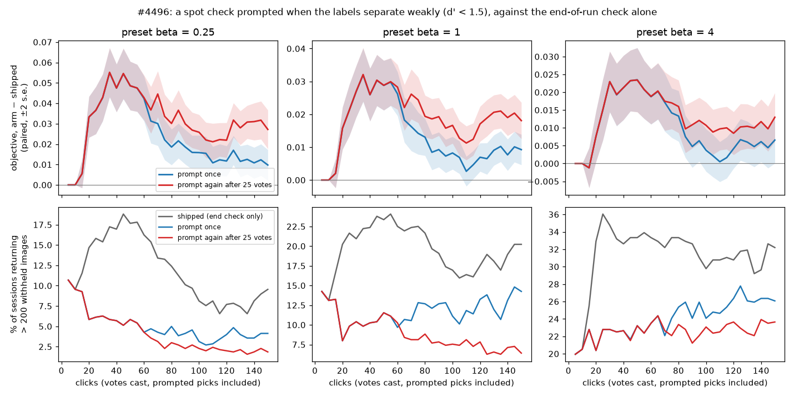

# A spot check prompted when the labels separate weakly (#4496)

**Status (2026-10-05):** priced end to end. Both arms win at every preset. Prompting again 25 votes after each prompted check is the better rule. How to ship it is the owner's call; see the end of this report.

## The question

#4466 found that over-returning is a weak-separation problem.
- **The marker:** sessions whose labels separate weakly (d' = (Good mean − Bad mean) / spread below 1.5) return more than 200 withheld images 37 to 77% of the time from click 5 on, against 2 to 18% for the rest. No cut rescues their F.
- **The partial repair:** the end-of-run spot check repairs most of it. Since #4452 the check never moves the line, so its effect comes entirely from its roughly 20 band-uniform picks becoming training votes.

On the #4492 capture at click 150, weakly separated sessions go from F 0.14 to 0.20 after the check, and those returning more than 200 fall from 74% to 19%. The app never asks for a check: the user must press Check on the Train Manual tab, and Autopilot never checks.

So the question was whether spending those votes **mid-session**, as soon as the labels separate weakly, beats spending them on acquisition, at equal clicks.

## The arm

The harness gets a new mode, `spot_check="weak"` (`vtscore/eval/voting_iterations.py`). It keeps the end-of-run check and adds the check the app would prompt.
- **Trigger:** at the first ordinary step from click 10 whose labels line has `LabelsLine.separation` below `WEAK_SEPARATION_D` = 1.5. The spread used is the class model's own, floored on the corpus (#4492), so d' does not depend on the logit scale.
- **The check:** the simulated user runs the app's check then and there.
- **Cost accounting:** its picks are clicks. They count in the vote count and the 150-vote budget, so every comparison is at equal votes.
- **Two arms:** **prompt once**, and **prompt again**, which re-prompts 25 votes after each prompted check ends while separation stays weak.

Binary, COCO Better, 144 cells × 5 seeds at presets 1/4, 1 and 4: 4,320 sessions. Each is paired with the #4492 end-to-end run on the same cell and seed, i.e. the shipped code with the end-of-run check only.

## Results

The objective is F-beta of the withheld half above Find's line, at the session's preset. Values are the paired difference, arm minus shipped, over all 702 sessions; standard errors are 0.002 to 0.006.

| preset | arm | click 12 | 20 | 30 | 50 | 75 | 100 | 150 | after the check |
|---:|---|---:|---:|---:|---:|---:|---:|---:|---:|
| 1/4 | once | −0.002 | +0.033 | +0.043 | +0.049 | +0.022 | +0.016 | +0.010 | +0.006 |
| 1/4 | again | −0.002 | +0.033 | +0.043 | +0.049 | +0.034 | +0.026 | +0.027 | +0.010 |
| 1 | once | −0.002 | +0.016 | +0.027 | +0.029 | +0.014 | +0.008 | +0.009 | +0.003 |
| 1 | again | −0.002 | +0.016 | +0.027 | +0.029 | +0.024 | +0.017 | +0.018 | +0.010 |
| 4 | once | −0.003 | +0.008 | +0.023 | +0.023 | +0.014 | +0.004 | +0.007 | −0.002 |
| 4 | again | −0.003 | +0.008 | +0.023 | +0.023 | +0.017 | +0.011 | +0.013 | +0.005 |

- **Prompts are common.** 63% of sessions (440 to 443 of 702) dip below d' = 1.5 at some click from 10 on. Offline, any single click flags only 12 to 24%, but most sessions cross the line at some point. The first prompt starts around click 17 in the median session.
  - Prompted sessions gain +0.075 at click 50 at preset 1/4, +0.046 at 1 and +0.037 at 4.
- **The two arms are the same sessions until a second prompt can fire, around click 50.** After that, prompting again holds its gain and prompting once fades. At click 150, prompting again earns twice the gain: +0.027, +0.018 and +0.013 against +0.010, +0.009 and +0.007.
- **Fewer large returns.** Sessions returning more than 200 withheld images, shipped against prompting again:

  | preset | at click 50 | at click 150 |
  |---:|---|---|
  | 1/4 | 18% → 6% | 10% → 2% |
  | 1 | 23% → 12% | 20% → 6% |
  | 4 | 33% → 23% | 32% → 24% |

- **The ranking improves.** Final AP is +0.013 when prompting again and +0.004 to +0.005 when prompting once. AP at click 25 is +0.022. By the end, prompting again finds +1.4 to +1.6 more Goods.
- **Before the first check pays off,** clicks 12 to 15 lose 0.001 to 0.003.

## Costs

- **Fewer Goods early.** Goods found by click 25 fall by 0.73 (11.0 → 10.3), because the check's picks are band-uniform, not Good-seeking. About 13 to 17% of them are Goods. They come back later: +1.4 to +1.6 Goods by the end when prompting again.
- **Clicks spent on prompted checks, per prompted session.**

  | preset | prompt once: median picks, share of the first 150 clicks | prompt again: median picks, share, checks |
  |---:|---|---|
  | 1/4 and 1 | 20, 14% | 40 to 45, 28%, up to 4 |
  | 4 | 30, 20% (the walk starts at 128) | 60, 35%, up to 3 |

  The harness answers every pick, so these costs are already inside the gains above. A real user may tire of checking sooner than of voting.

## Sanity

A session that never meets the trigger draws nothing extra from the random generator, so it should match the baseline exactly. It does when the two runs used the same CPU vendor.
- **Drift:** 0 to 26 of about 260 never-prompted sessions per run drift late. They are sessions whose baseline ran on an Intel node and whose arm ran on the AMD node (rack7n11): floating-point drift flips a late acquisition tie.
- **No bias:** their paired mean at click 150 is 0.000 to 0.001 ± 0.001, so the drift adds noise, not bias.
- **Logged:** see `scripts/experiments/lessons/2026-10-04-cpu-vendor-drift-breaks-pairing.md`.

## What it means, and the ship decision

For a weakly separated session, uniform picks within the line's bands are better training votes than the acquisition picks they replace. They teach the head the negatives inside and around the line, which acquisition never reaches. The gain lands where the user is (clicks 20 to 50) and stays.

The harness cannot tell how the picks are presented, so the same rule can ship in two ways:

1. **A prompted check.** When `separation` < 1.5 (and again 25 votes after the last prompted check), the Train tab turns its Check button into a call to action, and Autopilot runs the check itself. This reuses the check modal and its ranges, but it interrupts the user.
2. **Band-uniform acquisition.** When separation is weak, the next roughly 20 picks are drawn band-uniformly over the line's ranking, inside the ordinary voting flow, with no modal. The votes are the same; the user never sees a "check".

Either needs `separation` in the balance payload. Nothing in the app reads it yet.

## Files

- **Runs:** `/expscratch/sgreenberg/state-of-the-app/2026-10-04-weak-b025|b1|b4` (prompt once) and `2026-10-04-weakr-b025|b1|b4` (prompt again), against `2026-10-04-floor-b*`.
- **Scripts** (`/expscratch/sgreenberg/check-weak/`):
  - `dprime.py`, `summarize.py` and `check_effect.py`: the offline trigger study.
  - `compare_weak.py`: the paired comparison.
  - `prompt_cost.py`: the clicks spent.
  - `figure_weak.py`: the figure.
