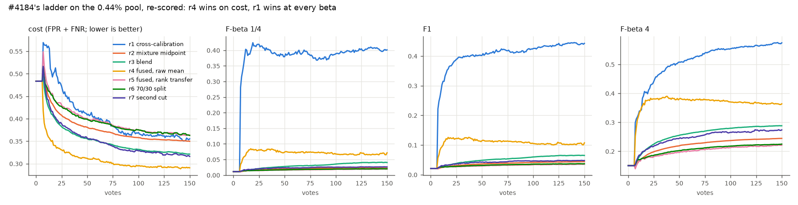
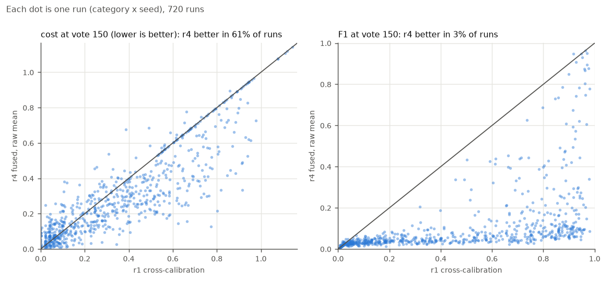
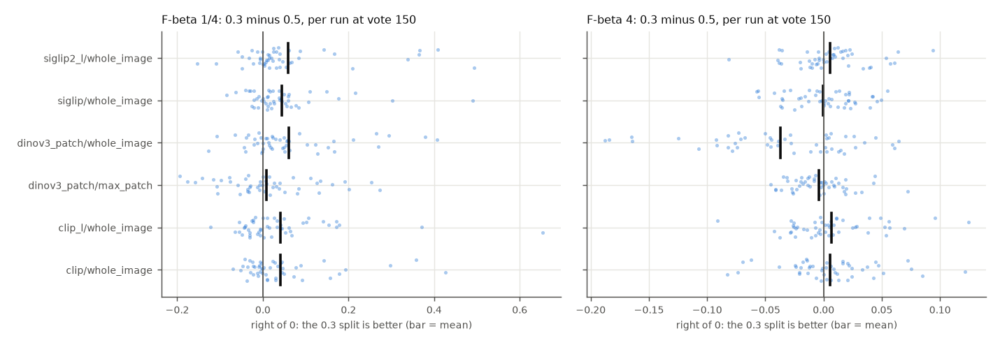

# The Cost-era studies, re-scored at F-beta 1/4, 1 and 4 (issue #4582)

**No new runs.** Every Cost-era verdict was a paired Δcost at Inclusion 0 (FPR + FNR). Each per-step row also
carries the withheld half's precision and recall at that step's threshold, so the F-beta of the returned set
at the app's three presets can be computed from the same rows. This report re-reads what survives of each
study, checks that it reproduces the report's own Δcost, and then replaces cost with F-beta.
Part of #4581; the plan is `docs/plans/cost-to-fbeta.md` (PR #4587).

**What the threshold is.** A Cost-era row's precision and recall were measured above the line *that arm drew
in that era* (the mixture midpoint, the blend, the fused cut), not today's labels line (#4452). So every
F-beta below means "F-beta above the line that arm drew". That is what the arm decision changed. It is not
the objective a balance-era review reads.

## The answer, one line per decision

| decision (Cost winner) | F-beta 1/4 | F1 | F-beta 4 | what is owed |
|---|---|---|---|---|
| #4184 ladder at 0.44%: r4 "fused, raw mean" best, r1 cross-calibration worst | **flips**: r1 best by 0.33 | **flips**: r1 best by 0.34 | **flips**: r1 best by 0.21 | Nothing. These rungs are retired as line rules (#4452), and the metric, not the prevalence, explains the #4519 reversal |
| #3287 split 0.3 on single-vector spaces | holds, +0.023 to +0.036 | holds, +0.022 to +0.031 | tie (CLIP-L: holds) | nothing |
| #3287 split 0.5 on `dinov3_patch` | **flips**: 0.3 better by 0.015 to 0.047 | **flips**: 0.3 better by 0.012 to 0.020 | holds on whole-image (0.5 better by 0.027), tie on max-patch | **#4583** |
| #3314 keep K = 2 folds (more folds helped cost but cost too much time) | holds: more folds *hurt* (K=6 −0.008); but **K=1 beats K=2 by 0.0085** | holds; K=1 beats K=2 by 0.0028 | K≥3 better by at most 0.003, under the 0.005 margin | **#4583** (K=1 at the low betas) |
| #3826 text-sort *display* line: keep the GMM midpoint (cost +0.053 against the guarded line) | **flips**: guarded better by 0.29 | **flips**: guarded better by 0.22 (as the study already said) | tie (0.000 ± 0.020) | **#4136** (already owns it) |
| #3826 A/B: guarded line as the opening's line fails | holds: guarded worse by 0.037 | holds: worse by 0.031 | holds: worse by 0.015 | nothing for acquisition; see #4136 for display |
| #4219 keep the SVM head (lrconv lost in region voting) | holds (−0.004, n.r.) | holds (−0.006, n.r.) | holds: lrconv worse by 0.012 | nothing |
| #4114 / #4219 binary: lrconv beat the SVM on cost | no difference (±0.001) | no difference | no difference overall; small objects +0.015 | nothing: the Cost-era line returned too much for F-beta to separate the heads (below) |

Not re-scored, because nothing that would let them be re-scored survives:

| study | what is left | where its question goes |
|---|---|---|
| #4184 at the 5% pool | cells deleted 2026-10-01 (`scratch-deletions.md`) | not needed: the 0.44% pool separates the metric from the prevalence on its own (below) |
| #3319 acquisition offset grid | `acq-3319` is gone from `/expscratch`, with no deletion record; the report keeps tables only | #3546 (the offset sweep rides there) |
| #2865 Inclusion cut rule | `cut-incl-2865` deleted 2026-09-18 | #3546 (κ, cut rule) |
| #2852 population-anchored calibration | `archive/calibration-anchored` deleted 2026-09-18 | #3546 (κ, cut rule) |
| #3551 blend endpoints | cells gone; its viewer page carries FPR and FNR but not precision, recall, or the withheld half's counts | nothing; the plan already rates it below a run (the fallback fires on about 1% of steps) |

## Where the cells came from, and the reproduction check

Three sources survive (`rescore_fbeta_4582.py` docstring):

- **cells** on `/expscratch`: #4184's 0.44% ladder (7 rungs × 720 runs) and the #3826 A/B (2 × 84).
- **the committed `viewer.html` pages** of #3287, #3314, #4114 and #4219. Their cells were deleted, but each
  page stores every run's raw series of every metric at every click (`runs` in the payload, quantised to
  1/1000). Precision and recall are among those metrics, so per-run F-beta is recoverable to about 0.001.
- **#3826's per-sort part tables**: `tp`, `fp`, `n_adm`, `n_pos` and `n` for every candidate line on each of the
  1,120 labelled text sorts.

F-beta follows `analyze_progression_4184.fbeta`: a returned set with nothing right (or nothing returned)
scores 0. Each study is paired, windowed and given SEs as its own analyzer did it:

| study | window per run | pairing and SE | report Δcost | re-derived here |
|---|---|---|---|---|
| #4114 lrconv − svm | clicks 1–150 at which every arm has a row (`analyze_stage_b.aulc`) | run; SE over category means | −0.0098 ± 0.0027 | −0.0098 ± 0.0027 |
| #4219 svmc01 − svm | same | same | +0.0057 ± 0.0026 | +0.0057 ± 0.0026 |
| #4219 region lrconv − svm | same | same | −0.0010 ± 0.0039 | −0.0010 ± 0.0039 |
| #3287 0.3 − 0.5, SigLIP | each arm's own rows in a vote band, pooled by inverse variance (`analyze_calfrac`) | run; bootstrap | −0.012 ± 0.003 | −0.012 ± 0.003 |
| #3314 K=6 − K=2, region, votes 1–25 | the band's steps (`analyze_folds_3314`) | run; bootstrap | −0.0057 ± 0.0012 | −0.0057 ± 0.0012 |
| #4184 r5 − r4 | every click, filled from the typed query (`analyze_progression_4184`) | run | +0.083 ± 0.0031 | +0.083 ± 0.003 |
| #3826 A/B | app-visible rows, by vote count (`analyze_ab`) | run; SE over runs | +0.016 ± 0.0048 | +0.016 ± 0.0048 |
| #3826 offline | one sort | sort; SE clustered on query (`analyze_3826`) | +0.053 ± 0.011 | +0.053 ± 0.011 |

Every pairing reproduces its report, so the F-beta columns below come from the same runs and windows as
the original verdicts. Δ is always *challenger − incumbent*. Positive F-beta and negative cost favour the
challenger. Bold means more than 2 SE from zero.

## 1. #4184, the ladder: the metric alone reverses it

#4184 scored the deck's rungs in cost at 0.44% and 5%. #4519 re-ran them in F1 at 1% and the middle of the
ladder turned into a detour. That re-run changed the metric, the prevalence and the last rung at once. Re-scoring
the original 0.44% cells changes only the metric, and the reversal is all there:



*Mean over 720 runs per rung, filled from the typed query until a detector shows. In cost (left), r4 is lowest
throughout and r1 (blue) is among the worst. At every beta, r1 is far above every other rung, and r4 is a
distant second.*

| at vote 150 | cost | F-beta 1/4 | F1 | F-beta 4 | AP |
|---|---:|---:|---:|---:|---:|
| r1 cross-calibration | 0.36 | **0.40** | **0.44** | **0.57** | 0.51 |
| r2 mixture midpoint | 0.35 | 0.025 | 0.044 | 0.25 | 0.39 |
| r3 blend | 0.32 | 0.040 | 0.065 | 0.29 | 0.39 |
| r4 fused, raw mean | **0.29** | 0.071 | 0.11 | 0.36 | 0.41 |
| r5 fused, rank transfer | 0.36 | 0.019 | 0.035 | 0.22 | 0.39 |
| r6 70/30 split | 0.36 | 0.020 | 0.037 | 0.23 | 0.38 |
| r7 second cut | 0.32 | 0.026 | 0.048 | 0.27 | 0.43 |

Each step against the one before, at vote 150 (paired over 720 runs):

| step | Δcost | ΔF-beta 1/4 | ΔF1 | ΔF-beta 4 |
|---|---|---|---|---|
| r1 → r2 | −0.006 ± 0.006 | **−0.38 ± 0.013** | **−0.40 ± 0.012** | **−0.33 ± 0.009** |
| r2 → r3 | **−0.029 ± 0.002** | **+0.016 ± 0.003** | **+0.021 ± 0.003** | **+0.044 ± 0.003** |
| r3 → r4 | **−0.030 ± 0.003** | **+0.031 ± 0.004** | **+0.042 ± 0.005** | **+0.076 ± 0.006** |
| r4 → r5 | **+0.073 ± 0.003** | **−0.052 ± 0.005** | **−0.072 ± 0.006** | **−0.14 ± 0.006** |
| r5 → r6 | −0.001 ± 0.002 | **+0.001 ± 0.0004** | **+0.002 ± 0.001** | **+0.004 ± 0.002** |
| r6 → r7 | **−0.047 ± 0.003** | **+0.006 ± 0.001** | **+0.011 ± 0.001** | **+0.049 ± 0.004** |

- **The whole reversal is the first step.** r1 → r2 (cross-calibration to the mixture midpoint) cost nothing in
  cost at vote 150 (−0.006 ± 0.006; −0.025 over clicks 1–150). It lost 0.33 to 0.40 of F-beta at every beta.
  The steps after it agree in sign between cost and F-beta, except r4 → r5, where both say it hurt.
- **The prevalence does not change the reading.** At 1% in F1 (#4519, vote 150) r1 ends at 0.48 and r2 to r7
  between 0.048 and 0.20. At 0.44% here, r1 ends at 0.44 and r2 to r7 between 0.035 and 0.11. Same shape,
  lower level. So the #4184 → #4519 reversal is the metric. This settles the metric-against-prevalence half of
  #4548 item 3; an r1-against-r8 read at 0.44% still needs today's harness.
- **Why cost missed it.** Cost weighs a false-positive *rate*. At 0.44% a midpoint line that returns 25 times
  too much raises FPR by only a few points, while it takes recall to 1. The examples below show runs where r4
  "wins" on cost with a precision of 0.03 to 0.11.



*Each dot is one run. Left: r4 has the lower cost in 61% of runs. Right: r4 has the higher F1 in 3%.*

**Literal runs** (vote 150; 128 of 720 runs have r4 cheaper by more than 0.05 *and* r1's F1 higher by more than 0.3):

| run | r1 cost | r4 cost | r1 precision / recall | r4 precision / recall | r1 F1 | r4 F1 |
|---|---:|---:|---|---|---:|---:|
| `tv@large` seed 1 | 0.39 | 0.14 | 0.90 / 0.61 | 0.038 / 0.96 | 0.73 | 0.072 |
| `tie@medium` seed 2 | 0.22 | 0.13 | 0.62 / 0.79 | 0.030 / 1.0 | 0.69 | 0.058 |
| `mouse@large` seed 0 | 0.19 | 0.029 | 0.67 / 0.81 | 0.11 / 1.0 | 0.74 | 0.20 |
| `frisbee@small` seed 0 | 0.24 | 0.13 | 0.57 / 0.76 | 0.040 / 0.96 | 0.65 | 0.077 |

**What is owed: nothing.** r2 to r5 only ever placed the line, and the line has been the labels line since
#4452. r6 (the 0.3 split) and r7 (the acquisition offset) still ship, and their steps agree in sign at every
beta, but they were measured under a mixture line: the split is #4583's and the offset #3546's.

## 2. #3287, the calibration split: holds on single-vector spaces, flips on `dinov3_patch` at beta ≤ 1

The shipped split is 0.3 for single-vector spaces and 0.5 for `dinov3_patch` (`PRODUCTION_SPLIT_BY_SPACE`).
Paired 0.3 − 0.5, pooled over the four vote bands (12 classes × 4 seeds per space, `vg_scale_any`):

| space | Δcost | ΔF-beta 1/4 | ΔF1 | ΔF-beta 4 | ΔAP |
|---|---|---|---|---|---|
| `siglip` | **−0.012 ± 0.003** | **+0.029 ± 0.004** | **+0.027 ± 0.004** | +0.003 ± 0.003 | +0.002 ± 0.004 |
| `siglip2_l` | **−0.012 ± 0.003** | **+0.036 ± 0.006** | **+0.031 ± 0.005** | +0.004 ± 0.003 | +0.007 ± 0.005 |
| `clip` | **−0.011 ± 0.003** | **+0.023 ± 0.004** | **+0.022 ± 0.004** | +0.004 ± 0.003 | +0.004 ± 0.005 |
| `clip_l` | **−0.016 ± 0.003** | **+0.032 ± 0.006** | **+0.028 ± 0.005** | **+0.010 ± 0.003** | +0.003 ± 0.004 |
| `dinov3_patch` whole-image | **+0.015 ± 0.005** | **+0.047 ± 0.007** | **+0.020 ± 0.004** | **−0.027 ± 0.004** | −0.002 ± 0.003 |
| `dinov3_patch` max-patch | −0.002 ± 0.002 | **+0.015 ± 0.007** | **+0.012 ± 0.005** | +0.001 ± 0.002 | +0.003 ± 0.003 |

- **Single-vector spaces: settled.** 0.3 wins at beta 1/4 and 1 by about twice its cost margin, ties at beta 4
  (wins on CLIP-L), and no band is resolvably against it at any beta (the per-band rows are in `data/paired.csv`).
- **`dinov3_patch`: the decision flips at beta ≤ 1.** Cost kept 0.5 because 0.3 lost on whole-image (+0.015).
  On F-beta, 0.3 is better at beta 1/4 and 1 on both geometries, and worse only at beta 4 on whole-image.
  The pattern fits a split that moves the line: more training votes give a line that returns less, which
  the precision end rewards and the recall end does not.
- **AP does not move** for 0.3 (at most 0.007 in any space), so this is the cut and not the ranking, as a split should be.



*Each dot is one run (category × seed), paired. At beta 1/4 (left) every space's mean is right of zero. At beta 4
(right), `dinov3_patch` whole-image is left of zero, with a tail of runs where 0.3 loses 0.1 to 0.19.*

The tail at beta 4, literally (`dinov3_patch` whole-image, vote 150): `kite` seed 0 returns precision 1.0 /
recall 0.72 at 0.3 against 0.76 / 0.93 at 0.5, so F-beta 4 falls from 0.91 to 0.73 while F-beta 1/4 rises from
0.77 to 0.98. `clock` seed 3: 1.0 / 0.48 against 0.56 / 0.67. A typical run moves little: `umbrella` seed 2,
0.32 / 0.67 against 0.35 / 0.69.

**What is owed: #4583.** It re-measures the split under the labels line at the three presets, and these rows
say where to look: `dinov3_patch` at beta 1/4 and 1 is where today's 0.5 is most likely wrong.

## 3. #3314, the fold count: K = 2 holds against more folds, but not against one

K = 2 was kept because every fold count that helped cost cost at least 2.3× the per-step retrain. Paired
K − 2, pooled over bands, all three geometries (144 cells; each K re-cuts the same steps):

| K − 2 | Δcost | ΔF-beta 1/4 | ΔF1 | ΔF-beta 4 |
|---|---|---|---|---|
| K = 1 | **+0.0041 ± 0.0004** | **+0.0085 ± 0.0011** | **+0.0028 ± 0.0008** | **−0.0037 ± 0.0004** |
| K = 3 | **−0.0014 ± 0.0002** | **−0.0030 ± 0.0005** | **−0.0010 ± 0.0004** | **+0.0013 ± 0.0002** |
| K = 6 | **−0.0024 ± 0.0003** | **−0.0079 ± 0.0009** | **−0.0035 ± 0.0007** | **+0.0027 ± 0.0003** |
| K = 8 | **−0.0028 ± 0.0003** | **−0.0095 ± 0.0011** | **−0.0044 ± 0.0007** | **+0.0032 ± 0.0003** |

- **More folds move the line toward recall.** They help beta 4 a little (at most +0.003, under the study's
  0.005 margin) and hurt beta 1/4 and 1. So "do not add folds" holds at every beta, now on benefit as well as on time.
- **New: one fold beats two at beta 1/4** (+0.0085) and at beta 1 (+0.0028; resolvable at beta 1/4 on every geometry, at beta 1 only on `dinov3_patch` whole-image), and halves the
  calibration time. The effect is small, under 0.01, and was measured on the mixture line.

**What is owed: #4583** should carry K = 1 beside K = 2 at the beta 1/4 preset.

## 4. #3826, the text-sort line: the display flips, the acquisition does not

The offline study scored each candidate line on 1,120 labelled text sorts. The guarded line
(`gmm_guarded_z3`) against the shipped midpoint, one sort each, SE clustered on query:

| guarded − midpoint | Δcost | ΔF-beta 1/4 | ΔF1 | ΔF-beta 4 |
|---|---|---|---|---|
| a text sort's line | **+0.053 ± 0.011** | **+0.29 ± 0.014** | **+0.22 ± 0.016** | +0.000 ± 0.020 |

The trajectory A/B ran the guarded line as the opening's line (Autopilot's Bad phase samples beside it) and
scored the detectors that followed. Same pairing as the report, 84 runs:

| guarded − midpoint | Δcost | ΔF-beta 1/4 | ΔF1 | ΔF-beta 4 | ΔAP |
|---|---|---|---|---|---|
| all votes | **+0.016 ± 0.005** | **−0.037 ± 0.016** | **−0.031 ± 0.013** | **−0.015 ± 0.006** | −0.003 ± 0.005 |
| votes 6–20 | **+0.071 ± 0.013** | −0.019 ± 0.009 | **−0.024 ± 0.010** | **−0.043 ± 0.009** | **−0.038 ± 0.008** |
| votes 21+ | **+0.010 ± 0.004** | **−0.041 ± 0.018** | **−0.034 ± 0.015** | **−0.012 ± 0.006** | +0.001 ± 0.006 |

- **As a display line, the guarded rule wins at beta 1/4 and 1 by a lot, and ties at beta 4.** The midpoint
  returns 12 to 54 times as many images as there are matches (the study's own finding), and only a
  recall-heavy beta forgives that.
- **As the opening's line, it loses at every beta.** The Bad phase votes beside the guarded line, at the top of
  the ranking, and the detectors that follow are worse at every preset.
- So the two jobs the midpoint does today want different rules, which is #4136's question: the display line
  can be priced alone on the objective, without a trajectory A/B.

**What is owed: #4136** (already open). The A/B's no-ship holds at every beta, so nothing is owed for acquisition.

## 5. #4114 and #4219, the head: settled, and F-beta of the Cost-era line cannot separate heads

| lrconv − svm (clicks 1–150) | Δcost | ΔF-beta 1/4 | ΔF1 | ΔF-beta 4 | ΔAP |
|---|---|---|---|---|---|
| binary, all (702 runs) | **−0.0098 ± 0.0027** | +0.001 ± 0.001 | +0.001 ± 0.001 | +0.003 ± 0.002 | **−0.0048 ± 0.0020** |
| binary, small objects | **−0.034 ± 0.007** | **+0.002 ± 0.001** | **+0.003 ± 0.001** | **+0.015 ± 0.003** | **+0.005 ± 0.002** |
| binary, large objects | +0.004 ± 0.003 | +0.002 ± 0.003 | +0.001 ± 0.003 | −0.004 ± 0.004 | **−0.012 ± 0.004** |
| region voting (138 runs) | −0.001 ± 0.004 | −0.004 ± 0.002 | −0.006 ± 0.003 | **−0.012 ± 0.005** | **−0.012 ± 0.004** |

- **The no-switch decision holds at every beta.** In region voting, the case it rested on, the logistic head is
  no better at any beta and worse at beta 4.
- **Binary F-beta cannot tell the heads apart, because neither returned set was any good.** Above the fused cut
  on COCO Better (0.44%), mean F1 is 0.042 to 0.044 for every head (beta 1/4: 0.023 to 0.025), so a ranking gain
  barely reaches it. This is the same failure section 1 shows: the Cost-era line returned far too much.
  AP sides with the SVM overall (−0.005), as the plan expected.
- `svmc01` (SVM at C = 0.1) loses at beta 1 and 4 too (−0.003, −0.013), as it did on cost.

**What is owed: nothing.** If the head is ever reopened, it has to be read above the labels line, where the
returned set is worth scoring.

## Reproducing

```bash
cd scripts/experiments/calibration
export LD_LIBRARY_PATH=/cluster/apps/python/3.12.3/lib   # GRID
srun --ntasks=1 --cpus-per-task=4 --mem=48G python rescore_fbeta_4582.py --out OUT   # ~6 min
python figures_4582.py --data OUT --out OUT/figures
```

`data/` holds the outputs this report quotes:
- `paired.csv`: every Δ, by study, arm, stratum, window and metric.
- `levels_*.csv` and `curves_*.csv`: means per arm.
- `runs_*.csv`: each run's last click, for the examples.
- `provenance.json`: what was read.

The cell-based studies read `/expscratch/sgreenberg/progression-4184` and `/expscratch/sgreenberg/textcut-ab-3826`,
both of which still exist. The viewer-based ones read only committed files.
