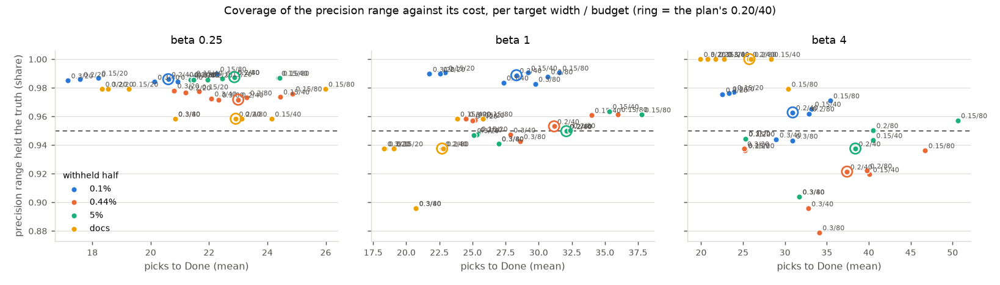

# Does a pooled prior above the line fix Test mode's precision range on big sparse lines? (#4539)

**Yes, mostly: at the plan's 0.20 / 40 the precision range now holds the truth
in 92–99% of sessions in every world and beta, against 75–99% before, for the
same picks (±2).** At 0.1% positives it goes from 0.89 / 0.86 / 0.75 (beta 1/4,
1, 4) to **0.99 / 0.99 / 0.96**; on documents from 0.90 / 0.88 / 0.96 to
**0.96 / 0.94 / 1.00**; on lines that keep more than 1,024 items at 0.1% /
beta 4 from **0% to 95%**. One cell stays under the #4523 bar of 0.93: COCO
Better's default pool at beta 4, **0.92 ± 0.008** (was 0.86). The 5% world
gives back 1–2 points (0.97 → 0.95 at beta 1, 0.96 → 0.94 at beta 4), still
above the bar. Recall is untouched; this changes only the bands above the line.

Part of #4520; follows #4523, whose saved snapshots this replays (no new
training). Code: `vtscore/training/thresholds/line_test.py` (`POOLED_WEIGHT`,
the audited-first width stop). Analysis: `analyze_line_test_4523.py` at the
same grid and seeds as #4523, output under
`/expscratch/sgreenberg/line-test-4523/analysis-4539/`.

## What changed

- **The prior.** Each band above the line used to start from its own
  Jeffreys prior, so an empty band of five picks read as about 8% right and a
  big sparse line, the size-weighted sum of six or seven such bands, read as
  about 9% with the truth near 1% (#4523, "Why 0.1% and beta 4 fall short").
  Now a band's prior is the pooled share of every pick above the line
  (Jeffreys on the pool) at one round's weight (`POOLED_WEIGHT` = 5 picks),
  drawn once per Monte Carlo column and shared by every band, so the draws
  stay joint. A band's own round weighs as much as the pool, so a rich band
  near the top still reads richer than a poor one near the line.
- **The width stop.** Pooling can narrow the range on one or two bands'
  picks, which made the matches phase stop before the bands nearest the top
  had been seen. The width stop now waits until every band above the line
  has had a round (or is exhausted); before, wide independent priors implied
  that rule without stating it. One planted-answer test that pinned the old
  "width after one round" behaviour now pins this one.

## The precision range at 0.20 / 40

| withheld half | beta | coverage before | **after** | ± SE | picks before | after |
|---|---:|---:|---:|---:|---:|---:|
| 0.1% | 1/4 | 0.89 | **0.99** | 0.004 | 20 | 21 |
| 0.1% | 1 | 0.86 | **0.99** | 0.003 | 28 | 28 |
| 0.1% | 4 | 0.75 | **0.96** | 0.007 | 29 | 31 |
| 0.44% | 1/4 | 0.95 | **0.97** | 0.005 | 24 | 23 |
| 0.44% | 1 | 0.92 | **0.95** | 0.006 | 31 | 31 |
| 0.44% | 4 | 0.86 | **0.92** | 0.008 | 37 | 37 |
| 5% | 1/4 | 0.99 | 0.99 | 0.003 | 23 | 23 |
| 5% | 1 | 0.97 | 0.95 | 0.005 | 32 | 32 |
| 5% | 4 | 0.96 | 0.94 | 0.007 | 38 | 38 |
| documents | 1/4 | 0.90 | **0.96** | 0.026 | 23 | 23 |
| documents | 1 | 0.88 | **0.94** | 0.043 | 23 | 23 |
| documents | 4 | 0.96 | **1.00** | 0 | 26 | 26 |

*Compare with #4523's figure of the same name: the worlds no longer sit on
separate levels below the 95% line. The 0.30 / 20 point now covers 0.94–0.99
everywhere but 0.44% / beta 4 (0.94) for 17–25 picks, which reopens the
cheaper point the pick rule wanted (`pick.csv`).*

The range is also narrower (0.10–0.18 wide, was 0.11–0.19) and less biased
(mean point − truth within ±0.017 everywhere, was up to +0.034). Where it
still misses it misses high, as before, but 3–7% of the time instead of up
to 25%. At 0.44% / beta 4 the remaining shortfall is in mid-sized lines
(257–1,024 kept: 0.85; > 1,024: 0.90); the pool there mixes a rich top with
a poor tail, and a weight of five picks lets the top pull the deep bands up.
That is the next lever (a weight that falls with the band's distance from
the top, or a two-level pool) and not worth a second round tonight.

**What follows for the rest of Test mode.** The F-beta range's coverage
rises with precision's at 0.1% (0.57 / 0.57 / 0.36 → 0.70 / 0.71 / 0.60),
and the verdict's agreement with the oracle moves 0.40 → 0.47 at 0.1% /
beta 4; both are still bounded by the recall half, which #4542's deeper walk
addresses. Band-edge precision coverage rises 2–18 points (0.44–0.80).

## The harness check

`harness_check.json` reports no identical rows this time, by design: the
in-run rows were written by #4523's code, with independent priors. The
replay is the same code path as #4523's, which matched its harness rows.
