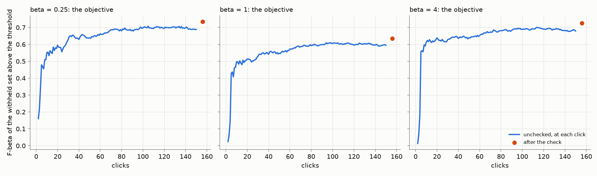
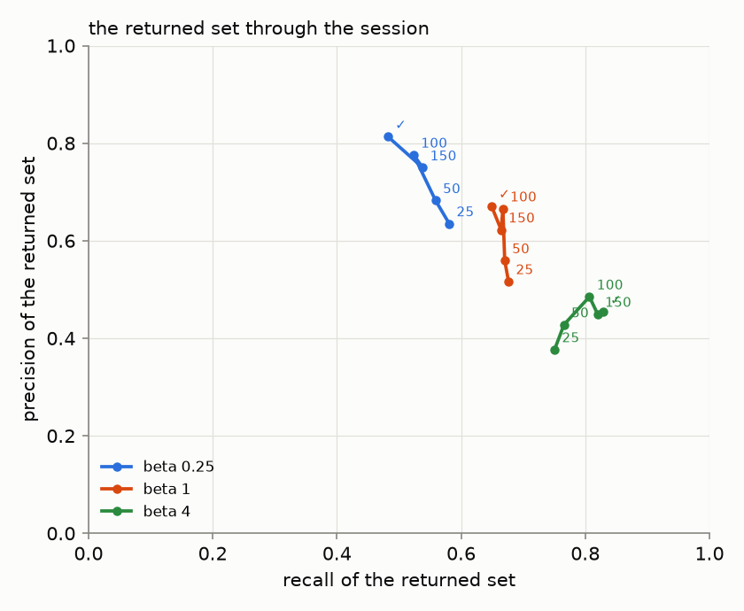
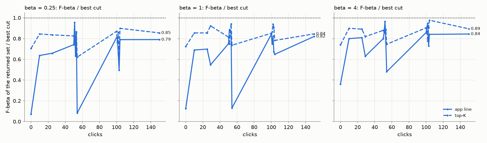
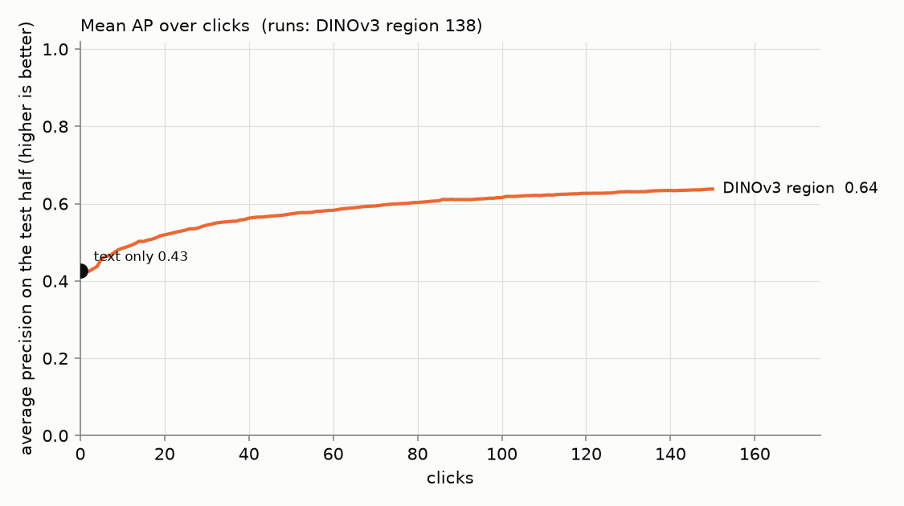
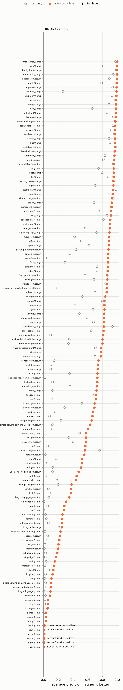

# State of the App: Region Photo — 2026-10-06

**Issue:** #4534. **Recipe:** `.claude/skills/state-of-the-app/SKILL.md`.
**App:** `dev` at e530b4c0d (2026-10-05 evening). The app is the same one the Binary Photo review of 2026-10-05
read (#4510): the labels line (#4452), the corpus-relative spread floor (#4492), Autopilot's weak-separation
check (#4496), and presets of beta 1/4, 1 and 4.
**Path:** the region path. DINOv3 patch embeddings, with box votes trained as patches and a photo scored by
its best patch (`max_patch`). It opens on SigLIP's text sort.
**Bench:** `coco_better`, 144 cells (49 classes at every size they have).
**Seeds:** 1 (seed 0). **Sessions:** one set per preset (`SOTA_BETA=0.25|1|4`), trajectory pass only (no
full-label ceiling; see [Not covered](#not-covered)).
**Runs:** `/expscratch/sgreenberg/state-of-the-app/2026-10-06-b025`, `-b1` and `-b4`, from a frozen worktree at
e530b4c0d.
- A run takes a median of 42 minutes on one core (p90 61, the slowest 144) and peaks at 18 to 22 GB.
- So the per-user memory cap, not CPUs, sets how many run at once: about 43.
- Seed 0 ran 2026-10-05 21:37 to 2026-10-06 07:30.

**Read here:** the **138 cells complete at all three presets at 07:31**.
- Six cells were still running: toothbrush@medium, traffic light@medium and @small, tv@large and @medium,
  umbrella@small. The 09:00 deadline would not wait for them.
- So that every preset reads the same cells, those six are left out of all three.
- The analysis of all 144 is queued behind them, and this report will be re-read off it.
- Seed 1 is running too, at the owner's word ("Let the seed finish. We'll use the results later").

**Analysis:** `analyze.sh` (`SOTA_PATH=region`) per preset on the 138 cells, then `perp.py --kind balance`
(`perbeta_summary.md`, `precision_recall_path.csv`).

A **review**, not an experiment: the app as it ships on the region path, the way a user meets it.
- **The session.** The user types a query and sees the text sort, then votes for 150 clicks while Autopilot picks
  what to show. When the labels separate weakly, Autopilot stops to run a spot check. At the end the user runs the
  check once more.
- **The objective** (#4427) is the F-beta, at the preset's beta, of the withheld test half above the threshold
  the app holds there.
- **AP** measures the ranking alone.
- **One seed is thin.** Read the differences between presets as indicative. Seed 1 will firm them up.

## Headline

**The objective, each preset off its own sessions** (133 trained runs each; 5 cells never trained a detector,
see [below](#where-it-does-well-and-where-it-does-poorly)):

| preset | 25 clicks | 50 clicks | 150 clicks, unchecked | **after the check** | the check's effect | returned, median (unchecked / after) | returned > 200 (unchecked / after) |
|---:|---:|---:|---:|---:|---|---:|---:|
| 1/4 | 0.57 | 0.64 | 0.69 | **0.73** | +0.046 ± 0.009 | 40 / 31 | 6% / 1% |
| 1 | 0.50 | 0.55 | 0.59 | **0.63** | +0.040 ± 0.007 | 50 / 48 | 9% / 4% |
| 4 | 0.63 | 0.64 | 0.68 | **0.72** | +0.046 ± 0.009 | 82 / 95 | 28% / 26% |

1. **The presets return what they promise.** After the check:
   - the 1/4 preset returns a median of 31 images at precision 0.81 and recall 0.48;
   - the balanced preset returns 48 at 0.67 and 0.65;
   - the recall preset returns 95 at 0.45 and 0.83.
2. **The region path is ahead of the binary path at every preset and every checkpoint.**
   - Binary Photo, 2026-10-05 (#4510, the same app at 10 seeds): 0.64/0.53/0.60 after the check, against
     0.73/0.63/0.72 here. At 25 clicks: 0.43/0.34/0.42, against 0.57/0.50/0.63.
   - One seed is not 10, but a gap of 0.1 at every point is larger than one seed's noise.
   - This is a description of the two paths as they ship, not an A/B: the paths differ in embedding, votes and
     scoring.
3. **The check pays about twice what it pays on the binary path:** +0.040 to +0.046, against +0.022 to +0.033. It
   cuts the share of runs returning more than 200 images from 6% and 9% to 1% and 4% at 1/4 and 1. At 4 it
   barely moves (28% to 26%).

### The returned set through the session

Per preset, the returned set's precision against its recall at 25, 50, 100 and 150 clicks and after the check
(means over the trained runs with a line by that click, the returned size a median):

| preset | point | precision | recall | F-beta | returned, median | runs |
|---:|---|---:|---:|---:|---:|---:|
| 1/4 | 25 | 0.64 | 0.58 | 0.57 | 44 | 116 |
| 1/4 | 50 | 0.68 | 0.56 | 0.64 | 40 | 124 |
| 1/4 | 100 | 0.78 | 0.52 | 0.70 | 37 | 126 |
| 1/4 | 150 | 0.75 | 0.54 | 0.69 | 40 | 133 |
| 1/4 | after the check | 0.81 | 0.48 | 0.73 | 31 | 133 |
| 1 | 25 | 0.52 | 0.68 | 0.50 | 59 | 116 |
| 1 | 50 | 0.56 | 0.67 | 0.55 | 53 | 124 |
| 1 | 100 | 0.67 | 0.67 | 0.61 | 48 | 126 |
| 1 | 150 | 0.62 | 0.66 | 0.59 | 50 | 133 |
| 1 | after the check | 0.67 | 0.65 | 0.63 | 48 | 133 |
| 4 | 25 | 0.38 | 0.75 | 0.63 | 104 | 116 |
| 4 | 50 | 0.43 | 0.77 | 0.64 | 72 | 124 |
| 4 | 100 | 0.49 | 0.81 | 0.69 | 78 | 126 |
| 4 | 150 | 0.45 | 0.82 | 0.68 | 82 | 133 |
| 4 | after the check | 0.45 | 0.83 | 0.72 | 95 | 133 |

**As on the binary path, the clicks buy precision, not recall.**
- From click 25 to 100, precision rises 0.11 to 0.15 at every preset, while recall holds within 0.06.
- The dip from 100 to 150 is composition, not decay.
  - On the runs with a frame at both clicks, the objective rises: 0.72 → 0.74, 0.65 → 0.67 and 0.71 → 0.73.
  - The 19 to 24 sessions that join the table later are weaker: their objective at 150 is 0.36, 0.27 and 0.40.
- The check then adds precision at 1/4 and 1 (+0.06 and +0.05). At 4, precision and recall each move only +0.01.

### The returned set, one rule per row

The detector's own line (the labels line) against a set-constant top-K, at the preset's beta. Compare within a
rule, never across.

| preset | rule | text sort | 25 clicks | 50 clicks | 150 clicks |
|---:|---|---:|---:|---:|---:|
| 1/4 | app line | 0.01 | 0.48 | 0.58 | **0.66** |
| 1/4 | top 32 | 0.48 | 0.59 | 0.63 | **0.69** |
| 1 | app line | 0.02 | 0.43 | 0.50 | **0.57** |
| 1 | top 32 | 0.39 | 0.48 | 0.51 | **0.56** |
| 4 | app line | 0.15 | 0.55 | 0.59 | **0.66** |
| 4 | top 128 | 0.49 | 0.57 | 0.61 | **0.67** |

**The labels line matches a fixed top-K on the same ranking.** Under top-K, the detector beats the text sort from
the first trained clicks.

### The ranking

The ranking barely depends on the preset (shown: the beta 1 sessions):

| | text only | 25 clicks | 50 clicks | 150 clicks |
|---|---:|---:|---:|---:|
| **AP** | 0.43 | 0.53 | 0.57 | **0.64** |
| **Goods found** | — | 11 | 15 | **25** |

**No early dip.** The binary path's AP falls after its opening (0.42 to 0.35 at click 25, #4384) and is back by
about click 50. The region path's AP rises from the first trained click (0.43 to 0.53 at 25). The other presets
read the same: AP 0.64 and 0.64 at 150, Goods 25 and 23.

## The spot check

The check walks bands of the unvoted ranking, about 5 picks a band. It never moves the line; its picks are votes
the next retrain learns from.
- **At the end of the session,** every trained run checks once.
  - About 21 votes at 1/4 and 1, 30 at 4.
  - The precision range is 0.62 to 0.70 wide, and it held the truth in every run (133 of 133 per preset).
- **Mid-session,** Autopilot runs the check when the labels separate weakly (#4496). It does so in **23% of
  sessions**, against 43 to 45% on the binary path: DINOv3's labels separate more often.

| preset | sessions prompted | first prompt, median click (quartiles) | checks per prompted session | clicks spent checking, median | Goods among those picks |
|---:|---:|---|---|---:|---:|
| 1/4 | 32 of 138 | 82 (54, 108) | 1: 21, 2: 9, 3: 2 | 22 | 21% |
| 1 | 32 of 138 | 82 (53, 103) | 1: 17, 2: 14, 3: 1 | 28 | 23% |
| 4 | 32 of 138 | 82 (49, 106) | 1: 23, 2: 9 | 30 | 19% |

## Where it does well and where it does poorly

**By size band** (beta 1; trained runs; the objective after the check, and the ranking's AP):

| band (cells) | objective | returned, median | text AP | AP at 150 | Goods found |
|---|---:|---:|---:|---:|---:|
| large (48) | 0.81 | 51 | 0.71 | 0.87 | 36 |
| medium (46) | 0.65 | 47 | 0.38 | 0.69 | 25 |
| small (44; 39 trained) | 0.39 | 52 | 0.19 | 0.36 | 14 |

Against the binary path (0.77/0.49/0.29 by band), the gain is in **medium and small**: +0.16 and +0.10, against
+0.04 for large.

**The binary path's hardest classes are where regions help most:**

| class | binary objective (10 seeds) | region objective | region AP at 150 |
|---|---:|---:|---:|
| chair | 0.07 | 0.47 | 0.36 |
| enclosed road vehicle | 0.22 | 0.58 | 0.59 |
| book | 0.28 | 0.65 | 0.68 |
| bottle | 0.27 | 0.40 | 0.45 |
| knife | 0.20 | 0.35 | 0.39 |

**Poorly, still:** tableware and the dining table. Bowl 0.10 (median 209 returned; bowl@small never trains),
spoon 0.27, dining table 0.31. No confuser sheets were made for the region path, so this report does not say why.

**Well:** tennis racket 0.99, traffic light 0.96 (large only), airplane and baseball bat 0.90, orange 0.89, apple
and banana 0.86.

**Never trained a detector** (no Good found in 150 clicks): book, bowl, chair, knife and person, all at small.
On the binary path, chair@small never trains in any of 10 seeds.

## Not covered

- **The full-label ceiling.**
  - A ceiling run takes about 80 GB and an hour, against 24 GB and 40 minutes for the clicks. It did not fit
    tonight beside the clicks under the per-user memory cap.
  - So there is no headroom section and no ceiling column. A follow-up runs it for some seeds (#4534 allows that).
- **Seeds 1 and up.**
  - Seed 1 is running and will be added.
  - The binary review's per-image influence lists need repeat clicks, so they are not reported on one seed.
- **The six slow cells** above, to be added from the queued full analysis.

## Files

- `perbeta_summary.md`: every per-preset table above, from `perp.py --kind balance`.
- `precision_recall_path.csv`: each preset's returned set at 25, 50, 100 and 150 clicks and after the check.
- `figures/`: the objective, the returned set and its path per preset; AP and Goods over clicks; every cell.
- Runs and analyses:
  - `/expscratch/sgreenberg/state-of-the-app/2026-10-06-b025|b1|b4/`, with the 138-cell analyses in
    `-b025-common|-b1-common|-b4-common/analysis-region/`;
  - `perp.py`'s output in `2026-10-06-perp-common/`.
- The prompt counts come from `/expscratch/sgreenberg/sota-region-4534/prompts.py`.
