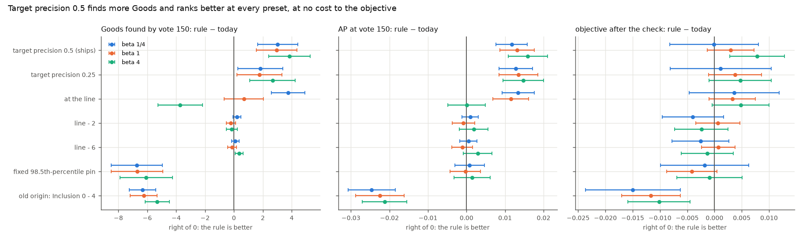
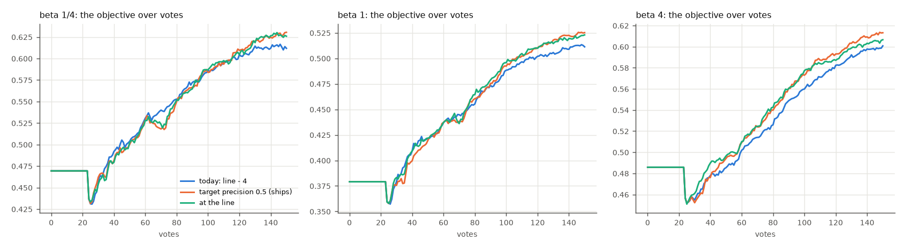
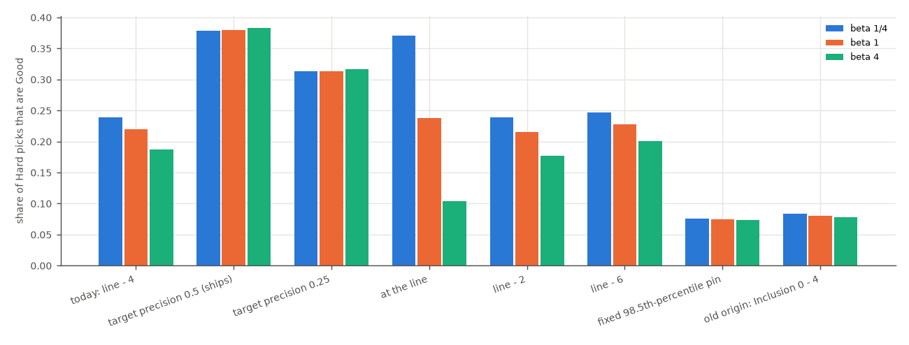

# What should Autopilot's acquisition cut be? (issue #3546)

**Ship target pick precision 0.5.** Autopilot's Hard and New picks should sample where the labels line's own
model puts even odds on an item being a match. They should not sample at today's line − 4 Inclusion steps,
which under the balance had saturated into a rank pin nobody chose. Against today's cut, at every preset:

| target precision 0.5 − today | beta 1/4 | beta 1 | beta 4 |
|---|---|---|---|
| Goods found by vote 150 | **+3.0 ± 0.7** | **+3.0 ± 0.7** | **+3.8 ± 0.7** |
| Hard picks that are Good | **0.38 vs 0.24** | **0.38 vs 0.22** | **0.38 vs 0.19** |
| AP at vote 150 | **+0.012 ± 0.002** | **+0.013 ± 0.002** | **+0.016 ± 0.003** |
| objective at vote 150 | **+0.019 ± 0.005** | **+0.014 ± 0.003** | **+0.012 ± 0.003** |
| objective after the check | +0.000 ± 0.004 | +0.003 ± 0.002 | **+0.008 ± 0.003** |
| objective, mean over votes 1–150 | −0.000 ± 0.002 | +0.002 ± 0.001 | **+0.008 ± 0.001** |

It is never resolvably worse than today's cut on any read. Part of #4581; the plan is
[`docs/plans/cost-to-fbeta.md`](../../plans/cost-to-fbeta.md).

## What today's cut is

`detector_acquisition_threshold` re-cut the fold-anchored estimator four Inclusion steps stricter than the line:
`threshold_at(inclusion_for_threshold(line) − 4)`. #4333 found that under the floor's top-32 line this
saturated, and step zero here confirmed it under the balance, on #4583's shipped arms. The cut sits near the
**98.5th pool percentile at every preset**, flat from vote 50 to 150. At beta ≤ 1 it sits *below* the line in
87–93% of runs by vote 150, so it samples looser than what the user is shown.

## What was run

| | |
|---|---|
| app | today's default arm (the balance, the labels line, the weak check), only the acquisition cut changed |
| bench | `coco_better`, binary SigLIP, 144 class@band cells × **3 seeds**, 150 votes, the user's pool at 1%, the withheld half at the bench's 0.44% |
| rules | today's cut (`ctl`, line − 4); at the line (offset 0); line − 2; line − 6; a fixed 98.5th-percentile rank pin; the old origin, Inclusion 0 − 4 (#4333's floor-off arm); target pick precision 0.5 and 0.25 |
| presets | beta 1/4, 1, 4: 24 arms × 432 runs = 10,368 runs, all on one commit of `claude/acq-cut-3546`; 0 lost, 2 starved per arm |

Three seeds were enough for a screen. The objective's σ for an acquisition change is 0.08 at beta 1 (#4584), so
432 runs resolve about 0.008, and the effects below are many SE wide. The two new rules were harness knobs when
the grid ran (`acq_origin`, `acq_target_p`), with tests. The target precision reads
`target_precision_threshold`: the first unvoted score, best first, whose labels-line corpus posterior falls
below *p*. Scoring is the #4583 analyzer's: the objective filled from the typed query until a detector shows,
and the line after the weak check. Each rule minus today's cut is paired on (category, seed), with the SE
clustered on category. Bold means more than 2 SE from zero.

## Result



*Each rule minus today's cut, ±2 SE, one colour per preset. Target precision 0.5 is right of zero on Goods and
AP at every preset, and on or right of zero on the objective. The old origin and the fixed pin are left of zero
on Goods; the old origin also loses AP and the objective.*

| rule (beta 1) | Goods by 150 | Hard picks Good | AP @150 | objective, after check | cut's pool percentile @150 |
|---|---:|---:|---:|---:|---:|
| today: line − 4 | 29 | 0.22 | 0.565 | 0.525 | 98.6 |
| **target precision 0.5** | **32** | **0.38** | **0.578** | **0.528** | 99.97 |
| target precision 0.25 | 31 | 0.31 | 0.578 | 0.529 | 99.97 |
| at the line | 30 | 0.24 | 0.576 | 0.528 | 99.9 |
| line − 2 | 29 | 0.22 | 0.564 | 0.526 | 98.6 |
| line − 6 | 29 | 0.23 | 0.564 | 0.526 | 98.6 |
| fixed 98.5th-percentile pin | 22 | 0.08 | 0.565 | 0.521 | 99.1 |
| old origin: Inclusion 0 − 4 | 23 | 0.08 | 0.542 | 0.513 | 94.0 |

- **The offset's value does not matter.** Line − 2 and line − 6 are within 0.002 of line − 4 on every read,
  because the cut is pinned where the fold-anchored scale runs out. #4581 asked to re-sweep −2 to −6; this
  settles it.
- **The target precision is what the cut should state.** At 0.5 it puts 38% of Hard picks on positives at
  every preset. Today's cut drifts with the preset (24% / 22% / 19%), because the line moves with beta and the
  pin does not. 0.25 samples a little deeper and is behind 0.5 on Goods and Hard picks, and level elsewhere.
- **Sampling at the line itself follows the preset the wrong way.** It is as good as the target precision at
  beta 1/4, where the line is high. At beta 4 the line is deep, Hard picks fall to 10% Good, and it loses 3.7
  Goods.
- **The old origin and a fixed pin both starve.** Inclusion 0 − 4 samples at the 94th percentile: −6.3 Goods,
  AP −0.022 and the objective −0.010 to −0.015 after the check. That is #4333's result again, now on the
  objective. A fixed pin harvests even worse (Hard picks 8% Good, −6.7 Goods): it is computed over the whole
  simulation pool, voted items included, so it drifts toward items already voted.



*Today's cut (blue), target precision 0.5 (orange) and at the line (green). They are the same until the first
detector shows at about vote 23. At beta 4 the target precision is ahead from about vote 40 on; at beta 1/4 and
1 the curves overlap within 0.005 until the last 30 votes.*



*Target precision 0.5 is the only rule whose Hard picks are as often Good at beta 4 as at beta 1/4.*

## Per run: where it gains, and where it gives back

Paired per run at beta 1, target precision 0.5 finds more Goods than today's cut in **68%** of runs, the same
in 11%, and fewer in 21% (beta 1/4 and 4 are the same within 4 points). The losses concentrate in the
easiest classes:

| classes by today's harvest (beta 1) | today | target 0.5 | Δ Goods | runs with fewer |
|---|---:|---:|---:|---:|
| fewest Goods (quartile 1) | 10 | 12 | +2.3 | 16% |
| quartile 2 | 26 | 33 | +7.1 | 8% |
| quartile 3 | 35 | 43 | +8.0 | 6% |
| most Goods (quartile 4) | 46 | 40 | −5.8 | 54% |

Literal runs (beta 1, Goods by vote 150, today → target 0.5):
- `book@large` seed 1: 21 → 47.
- `boat@medium` seed 1: 23 → 48.
- `tie@medium` seed 2: 27 → 52.
- `airplane@large` seed 2: 54 → 22.
- `tennis racket@large` seed 0: 53 → 22.
- A median run, `microwave@small` seed 1: 26 → 29.

On a class the embedder separates well, today's pin keeps harvesting a positive-rich top. Even odds sit lower
on such a class's ranking, among the near-misses, which is where the classes that need help are decided.
The objective does not pay for the easy-class losses (the tables above).

## What ships, and what moves with it

- **App:** `detector_acquisition_threshold` returns `target_precision_threshold(ctx.labels_line,
  ACQUISITION_TARGET_PRECISION)` under a balance (0.5, `vtscore/training/thresholds/knobs.py`), and falls back
  to the line − 4 re-cut with no labels line. `ACQUISITION_INCLUSION_OFFSET` stays as that fallback.
- **The eval default arm follows:** `resolve_acquisition_target` resolves `acq_target_p=None` to the same
  constant under a balance, with the same fallback (the `acquisition.target_precision` eval/app mirror).
  `acq_target_p="off"` is today's cut, and the launcher's offset arms now set it.
- **One small difference from the grid:** there the target arms ran at offset 0, so a step with no labels line
  fell back to the line itself. The shipped rule falls back to line − 4.
- **The voted-haystack exclusion floor** (#3312) now reaches acquisition only through that fallback, because
  the target precision does not read the fold-anchored estimator. Its tests run their arms on the offset cut.
- **The Hard phase's help text** said "items near the good/bad cutoff", which the pin was not. It now says the
  items the detector is least sure about.

## What is not settled

- **Region voting was not run.** The target precision reads only the labels line, which region and binary
  voting both fit, so nothing mode-specific is expected. A region cross-check belongs with the next region run.
- **The deep regime** (more than 150 votes; #3547) is unmeasured for the new rule, as it was for the old one.
- **Smart and Stable** (#4359) are coupled to where Hard samples. #4359's diagnostic ran on the old cut.

## Reproducing

```bash
cd scripts/experiments/calibration
bash launch_acqcut_3546.sh arms          # 24 arms (offset arms pin CALIB_ACQ_TARGET_P=off)
python analyze_acqcut_3546.py --base /expscratch/$USER/acqcut-3546 \
  --baseline /expscratch/$USER/progression-4184-h0.01/text_baseline.csv --out OUT
python figures_3546.py --data OUT --out OUT/figures
```

`tables/` holds the outputs this report quotes:
- `paired.csv`: every rule against today's cut, by read and preset.
- `levels.csv`: per arm.
- `curves.csv`: the objective per vote.
- `per_run_goods.csv`: each run's Goods, today vs target 0.5.
- `provenance.json`
