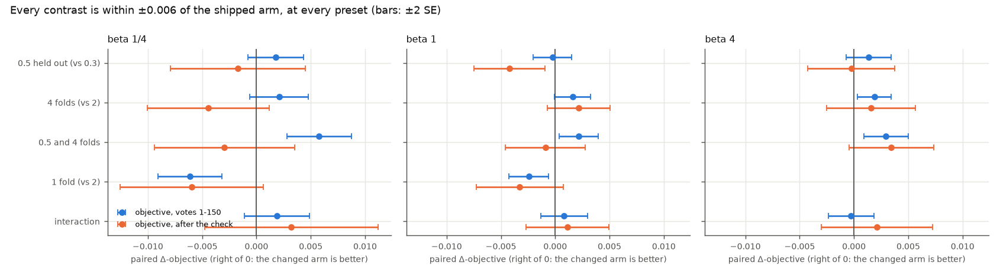
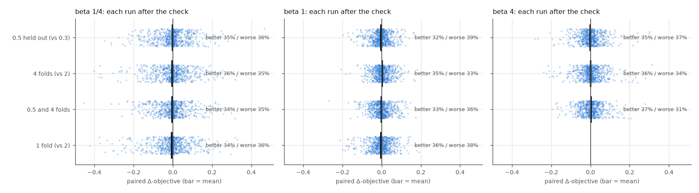
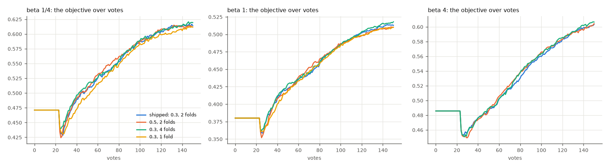

# The calibration split and fold count under the labels line (issue #4583)

**Both constants stand.** `PRODUCTION_SPLIT_BY_SPACE` (0.3 held out on single-vector spaces, 0.5 on patch
spaces) and `DEFAULT_CALIBRATE_COUNT` (2) were chosen on the cost of the *mixture* line (#3287, #3314).
Since #4452 the line is drawn from the labels alone, and its class model is the folds' held-out scores, so
both knobs feed today's line by a different route. This study re-measured them on today's app, on the objective
(#4427: F-beta of the withheld half above the threshold the app holds, at the preset's own beta). At every
preset, no change moves the objective by more than 0.006. None moves AP. The one consistent effect is on how
much the line returns: holding out more votes (0.5) returns more, by 92 items at beta 4. Part of #4581; the plan
is [`docs/plans/cost-to-fbeta.md`](../../plans/cost-to-fbeta.md).

## What was run

| | |
|---|---|
| app | today's default arm: the balance, the labels line, the weak-separation check |
| bench | `coco_better`, binary SigLIP, 144 class@band cells × 5 seeds, 150 votes; the user's pool at 1% (`CALIB_HAYSTACK_PREVALENCE=0.01`, as #4519), the withheld half at the bench's 0.44% |
| arms | calibration fraction {0.3 shipped, 0.5} × calibrate count {2 shipped, 4} × beta {1/4, 1, 4}: 12 arms. One fold at beta 1/4 and 1 was added after the grid, because #4582 flagged it above the old line |
| region | `siglip+dinov3_patch`, max-patch, beta 1, the patch space's shipped 0.5 against 0.3; #4219's 72 classes (hardest and easiest quartiles) × 2 seeds |
| size | 14 × 720 binary runs and 2 × 144 region runs, all on one commit of `claude/calsplit-4583`. 0 lost, 3 starved per binary arm (header-only: never found a positive) |

Launcher `launch_calsplit_4583.sh` (eight cells per array task, to stay under the 2,000-task submit cap); analyzer
`analyze_calsplit_4583.py` with its planted-answer selftest; figures `figures_4583.py`. Each arm read back its own
fraction, fold count and beta off its rows.

**Two readings of the objective**, as the State of the App gives them:
- **unchecked, over votes 1–150.** The curve is filled from the typed query's own set until a detector shows, so
  every curve leaves the same dot.
- **after the check.** This is the line the weak-separation check leaves the user with, read at the run's last
  check row.

Each contrast is the changed arm minus the shipped arm, paired on (category, seed), with the SE clustered on
category. Bold means more than 2 SE from zero.

## Result



*Every contrast against the shipped arm, at each preset (blue: mean over votes 1–150; orange: after the check).
All bars sit within ±0.006 of zero, and most cross it.*

**Δ-objective, mean over votes 1–150**

| changed arm − shipped | beta 1/4 | beta 1 | beta 4 |
|---|---|---|---|
| 0.5 held out (split) | +0.002 ± 0.001 | −0.000 ± 0.001 | +0.001 ± 0.001 |
| 4 folds (count) | +0.002 ± 0.001 | +0.002 ± 0.001 | **+0.002 ± 0.001** |
| 0.5 and 4 folds (both) | **+0.006 ± 0.001** | **+0.002 ± 0.001** | **+0.003 ± 0.001** |
| 1 fold | **−0.006 ± 0.001** | **−0.002 ± 0.001** | not run |
| region: 0.3 − 0.5 | | +0.002 ± 0.002 | |

**Δ-objective after the check**

| changed arm − shipped | beta 1/4 | beta 1 | beta 4 |
|---|---|---|---|
| 0.5 held out (split) | −0.002 ± 0.003 | **−0.004 ± 0.002** | −0.000 ± 0.002 |
| 4 folds (count) | −0.004 ± 0.003 | +0.002 ± 0.001 | +0.002 ± 0.002 |
| 0.5 and 4 folds (both) | −0.003 ± 0.003 | −0.001 ± 0.002 | +0.003 ± 0.002 |
| 1 fold | −0.006 ± 0.003 | −0.003 ± 0.002 | not run |
| region: 0.3 − 0.5 | | −0.006 ± 0.006 | |

- **No knob earns a change.** The largest gains are +0.006 at beta 1/4 and +0.003 at beta 4, both for "0.5 and 4
  folds" over votes 1–150. After the check, the same arm reads −0.003 at beta 1/4. A Δ that small, which changes
  sign between the two readings, is not a reason to fit two more folds on every retrain.
- **One fold is worse, not better.** It loses 0.006 at beta 1/4 and 0.002 at beta 1. #4582's re-score of #3314
  had one fold *ahead* at beta 1/4 (+0.0085), but that was above the mixture line, whose cut the fold count moved.
  Above the labels line, fewer held-out scores make the class model coarser.
- **#4582's `dinov3_patch` flip does not carry over.** Above the mixture line, 0.3 beat 0.5 on the patch space at
  beta ≤ 1 (F¼ +0.047). Above the labels line, in region voting at beta 1, it is a null on the objective
  (+0.002 ± 0.002 over votes, −0.006 ± 0.006 after the check) and on AP (−0.001 ± 0.002).
- **AP moves by at most 0.003** in any contrast, so these knobs touch the cut, not the ranking, as they should.
- **By object size**, the split's after-check loss at beta 1 comes from medium and large objects (−0.008 ± 0.003,
  −0.009 ± 0.002), with small objects at +0.004 ± 0.003. At beta 1/4 and 4 no band resolves.

**What the knobs do move: the returned set.** After the check, median items returned (shipped → 0.5 held out):
29 → 31 at beta 1/4, 51 → 56 at beta 1, **130 → 173 at beta 4**. Paired, 0.5 returns +14 ± 5 items at beta 1 and
+92 ± 22 at beta 4. Precision falls with it, 0.38 → 0.35 at beta 4. In region voting 0.3 returns 44 ± 16
*fewer* than 0.5, and precision rises 0.60 → 0.64. Holding out more votes widens the line without buying recall
the objective can see.



*Each dot is one run (category × seed). In every contrast and at every preset, about a third of runs are
better by more than 0.01 and a third worse. The means sit on zero because the runs split evenly, not because
they agree. That spread is the σ an A/B is sized with (below).*



*The four binary arms per preset are indistinguishable from vote 23, when the first detector shows, to vote 150.
The dip at vote 23 is the first detector's line scoring below the typed query's set. It is the same in every arm,
so it is not this study's subject.*

## The σ this grid gives #4584

The per-run SD of the paired Δ-objective, the number an A/B on today's app is sized with, is in `tables/sigma.csv`
(by window) and `tables/sigma_ab_window.csv`. The latter is in `analyze_ab`'s decision window, which is what
`preflight.sh` uses: 0.054–0.059 at beta 1/4, 0.030–0.035 at beta 1, 0.038–0.044 at beta 4. A line-only knob like
these parts trajectories less than an acquisition change, so #4584 set the defaults from the larger acquisition-type
σ (0.13 / 0.08 / 0.10; `docs/experiments/2026-10-07-objective-sigma-4584/README.md`). At those defaults, this
grid's 720 runs resolve about 0.010 / 0.006 / 0.007; at its own σ, about 0.004 / 0.003 / 0.003.

## What follows

- The constants stand, and their rationale blocks now carry this read (`vtscore/training/thresholds/knobs.py`,
  `vtscore/config/runtime.py`).
- The same cells also answered two other questions, posted on their issues:
  - #4359: Smart is preset-blind and goes green at vote 43 with 0.14 of objective still to come; Stable's floor-era failure is gone.
  - #3546: the acquisition cut is still a rank pin near the 98.5th percentile at every preset.

## Reproducing

```bash
cd scripts/experiments/calibration
bash launch_calsplit_4583.sh arms                 # the 12 arms; `arms f03k1_b025 f03k1_b1` for one fold
bash launch_calsplit_4583.sh region-prepare && bash launch_calsplit_4583.sh region
python analyze_calsplit_4583.py --base /expscratch/$USER/calsplit-4583 \
  --baseline /expscratch/$USER/progression-4184-h0.01/text_baseline.csv --out OUT
python figures_4583.py --data OUT --out OUT/figures
python selftest_analyze_calsplit_4583.py          # planted answers
```

`tables/` holds the outputs this report quotes:
- `paired.csv`: every contrast by read, window and size band.
- `levels.csv`: per arm.
- `curves.csv`: the objective per vote.
- `run_deltas.csv.gz`: each run's after-check Δ.
- `sigma*.csv`
- `provenance.json`
