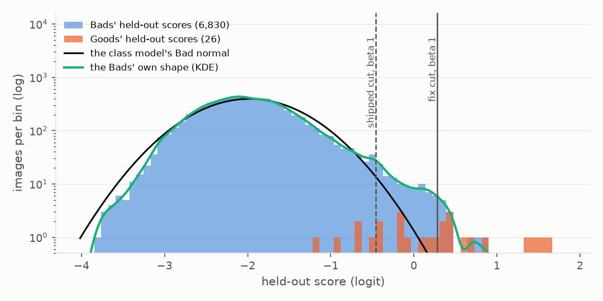
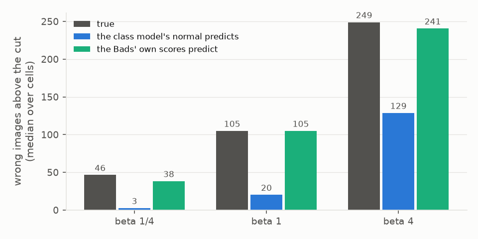
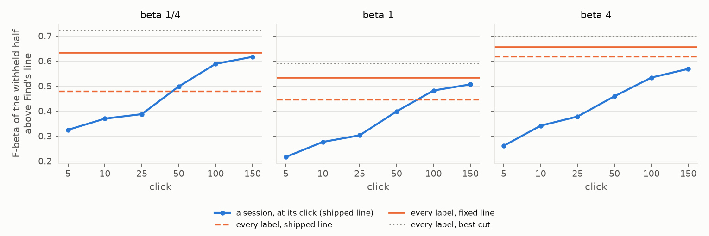

# With every label known, the labels line goes too deep (#4490)

**Confirmed, and there is a fix that leaves today's sessions untouched.** The decision for the owner is whether to
build it into the app's labels line ([Decision](#decision)).

With every training label known, the full-label model ranks better than a 150-click session, but Find's labels line
cut its ranking so deep that it scored worse at beta 1/4 and 1 (#4490, from the #4474 review). The cause is the class
model's normal for the Bads. Once the Bads are a random sample of the negatives, their scores carry a heavy upper
tail that the normal misses. Near the line that tail is what the cut decides on. The fix models the negatives with
the Bads' own scores when, and only when, the Bads are a random sample.

## Setup

- **Ceiling.** The full-label model of the review: every label in the training half, Binary, COCO Better, all 144
  cells × 5 seeds (720). It has its own calibration folds, and Find's line is fitted on the withheld half
  (~11,600 images, ~50 positives).
- **Sessions.** Today's dev, 150 clicks, 144 cells × 2 seeds at each preset 1/4, 1 and 4. Snapshots were taken at
  clicks 5, 10, 25, 50, 100 and 150 and after the check. Of 288 cells, 279 per preset trained a detector; the other
  9 never did.
- **Snapshots.** Every snapshot saves the withheld half's scores, the class model and the calibration folds it was
  drawn from. So every rule below is replayed on the same scores. The replay of the shipped line matches the
  harness's own count on every ceiling cell.
- **Metric.** F-beta of the withheld half above Find's line, at the preset's beta. A line that keeps nothing scores
  0. "Best cut" is the best F-beta over every top-k of the same ranking, which no line can beat.
- Differences are paired on cell and seed, with their standard error.

## What goes wrong

*traffic light@medium, seed 0. The class model's Bad normal (black) is fitted to ~6,900 Bads, almost all deep in
the bulk. Its upper tail falls far below the Bads' own (aqua). The shipped cut (dashed) keeps 242 images, of which
46 are right; the fix (solid) keeps 49, of which 31 are right. The best cut keeps 62.*

The Bads' held-out scores carry a heavy upper tail. Against the normal fitted to them, the share above the mean plus
2, 3 and 4 spreads is 1.4×, 4.5× and 27× the normal's (medians over 720 cells). The line's cut sits in that tail, so
the normal under-counts the wrong images there, and the line reads them as positives:

| at the shipped cut, medians over 720 cells | beta 1/4 | 1 | 4 |
|---|---:|---:|---:|
| returned | 79 | 146 | 289 |
| right | 34 | 40 | 45 |
| right, as the line expects | 71 | 115 | 145 |
| wrong | 47 | 105 | 249 |
| wrong, as the class model's normal predicts | 2.6 | 20 | 129 |
| wrong, as the Bads' own scores predict | 38 | 105 | 241 |

The line also believes the corpus holds too many positives: a median of 129 against a true 50, 2.6× (its two-part
fit absorbs the same tail). A larger total makes depth cheaper in the F-beta it maximizes, so the cut runs deeper
still.

**Why a session is spared.** A session's Bads are not a random sample: Autopilot picks them from the top of the
ranking. At click 150 a median of 14× their fair share sits in the corpus's top 5% (the ceiling's Bads: 1.0×), so
the Bad normal is fitted to the negatives near the line, where the cut is decided. With every label known the same
normal describes the bulk instead.

## The fix

When the Bads are a random sample of the corpus, model the negatives with the Bads' own held-out scores instead of
one normal.

- **The gate: the Bads are a random sample.** There must be at least 100 of them, and they may be at most 2× over-
  represented in the corpus's top 5%. A random sample is about 1× by construction; the ceiling's cells range from
  0.65 to 1.48. A session's median is 13× at clicks 100 and 150, and every session that reaches 100 Bads (only
  after the spot check, 114 of 837) sits at 3.4× or more.
- **The fit.** The negatives' density is a Gaussian KDE of the Bads' held-out logit scores (Silverman's bandwidth).
  The positives keep the class model's Good normal. The positives' share is fitted by EM on the corpus being
  decided, which gives each item's chance of being a positive. The cut is the shipped counted F-beta cut
  (`corpus_cut`) over those chances.
- **Otherwise** the shipped line, unchanged.

The rule reads only the labels' held-out scores and the corpus's own scores, so an exported labelset still carries
everything Find needs (#4452).

## On the ceiling

| preset | rule | F | Δ vs shipped | returned, median (p90) | precision | recall | best cut |
|---:|---|---:|---:|---:|---:|---:|---:|
| 1/4 | shipped | 0.47 | | 79 (244) | 0.47 | 0.66 | 0.71 |
| 1/4 | **fix** | **0.62** | **+0.155 ± 0.005** | 30 (50) | 0.67 | 0.42 | 0.71 |
| 1 | shipped | 0.44 | | 146 (758) | 0.37 | 0.78 | 0.58 |
| 1 | **fix** | **0.52** | **+0.085 ± 0.003** | 61 (232) | 0.50 | 0.63 | 0.58 |
| 4 | shipped | 0.61 | | 289 (2,615) | 0.28 | 0.89 | 0.69 |
| 4 | **fix** | **0.65** | **+0.039 ± 0.002** | 178 (1,101) | 0.35 | 0.81 | 0.69 |

The gap to the best cut closes from 0.25 / 0.14 / 0.085 to 0.091 / 0.055 / 0.045. The fix is better in 91% / 92% /
76% of cells at beta 1/4 / 1 / 4.

**The issue's table, re-read.** Paired with the same cell and seed's 150-click session (2 seeds, 279 cells per preset):

| preset | ceiling line | ceiling F | returned, median (p90) | precision | recall | session F at click 150 | ceiling − session | worse than the session |
|---:|---|---:|---:|---:|---:|---:|---:|---:|
| 1/4 | shipped | 0.48 | 76 (222) | 0.48 | 0.67 | 0.62 | -0.138 ± 0.010 | 77% |
| 1/4 | **fix** | 0.63 | 31 (50) | 0.68 | 0.43 | 0.62 | +0.017 ± 0.009 | 49% |
| 1 | shipped | 0.45 | 141 (659) | 0.38 | 0.78 | 0.51 | -0.061 ± 0.007 | 72% |
| 1 | **fix** | 0.53 | 62 (238) | 0.51 | 0.64 | 0.51 | +0.026 ± 0.006 | 41% |
| 4 | shipped | 0.62 | 272 (2456) | 0.28 | 0.89 | 0.57 | +0.049 ± 0.007 | 32% |
| 4 | **fix** | 0.65 | 173 (1115) | 0.36 | 0.81 | 0.57 | +0.086 ± 0.008 | 22% |

With every label known, Find's line now does at least as well as a session's line on the better ranking, at every
preset; before the fix it lost at 1/4 and 1.

## On the sessions

Mean F at each click; under it the fix's paired difference from the shipped line, and how many of the 279
sessions per preset it changed (`0`: none).

| preset | rule | click 5 | click 10 | click 25 | click 50 | click 100 | click 150 | after the check |
|---:|---|---:|---:|---:|---:|---:|---:|---:|
| 1/4 | shipped F | 0.32 | 0.37 | 0.39 | 0.50 | 0.59 | 0.62 | 0.64 |
| | fix, Δ (changed) | 0 | 0 | 0 | 0 | 0 | 0 | 0 |
| | gate at 30 Bads, Δ (changed) | 0 | 0 | 0 | +0.000 (3) | +0.000 (17) | -0.000 (13) | 0 |
| | first gate tried, Δ (changed) | 0 | 0 | 0 | 0 | 0 | 0 | -0.001 (3) |
| 1 | shipped F | 0.22 | 0.28 | 0.30 | 0.40 | 0.48 | 0.51 | 0.53 |
| | fix, Δ (changed) | 0 | 0 | 0 | 0 | 0 | 0 | 0 |
| | gate at 30 Bads, Δ (changed) | 0 | 0 | 0 | -0.000 (3) | +0.001 (15) | -0.000 (14) | 0 |
| | first gate tried, Δ (changed) | 0 | 0 | 0 | 0 | 0 | 0 | -0.001 (5) |
| 4 | shipped F | 0.26 | 0.34 | 0.38 | 0.46 | 0.53 | 0.57 | 0.60 |
| | fix, Δ (changed) | 0 | 0 | 0 | 0 | 0 | 0 | 0 |
| | gate at 30 Bads, Δ (changed) | 0 | 0 | 0 | -0.000 (4) | +0.001 (14) | -0.000 (11) | 0 |
| | first gate tried, Δ (changed) | 0 | 0 | 0 | 0 | 0 | 0 | -0.006 (6) |

The gate never opens on a session within 150 clicks: before the check no session has 100 Bads, and after it the
Bads are too many at the top.

- **With the gate lowered to 30 Bads** (`rep_kde_n30`) it opens on 11 to 17 sessions per preset at clicks 100 and
  150, about 5%: weak heads whose folds score their Bads below most of the corpus (median enrichment 0.7). The fit
  moves them by +0.001 at most on average, so the 100-Bad floor is caution about the KDE, not about sessions.
- **The first gate tried** (`rep_kde_median`) read the share of the corpus above the Bads' median instead. After the
  check it opened on 3 to 6 sessions per preset, whose ~100 Bads mix near-line picks with the check's uniform ones.
  There the KDE puts the near-line Bads' mass at the top of the corpus, the positives' share goes to zero, and the
  line collapsed to one image (one session at beta 4: 532 kept at F4 0.38, then 1 at 0.00). That is why the gate
  reads the top.

## With fewer random Bads

The ceiling's Goods with a random subsample of its Bads, as a smaller exhaustively labelled labelset would give
(720 cells; the fold scores are the full model's, so this isolates the rule). Mean F at each preset:

| random Bads | beta 1/4 shipped | fix | beta 1 shipped | fix | beta 4 shipped | fix |
|---:|---:|---:|---:|---:|---:|---:|
| 30 | 0.51 | 0.51 | 0.46 | 0.46 | 0.61 | 0.61 |
| 100 | 0.49 | 0.50 | 0.45 | 0.46 | 0.61 | 0.63 |
| 300 | 0.47 | 0.55 | 0.44 | 0.49 | 0.61 | 0.64 |
| 1000 | 0.47 | 0.59 | 0.44 | 0.51 | 0.61 | 0.64 |
| all | 0.47 | 0.62 | 0.44 | 0.52 | 0.61 | 0.65 |

At 30 the gate stays shut (the KDE of 30 random Bads cannot see the tail: ungated it loses 0.09 at beta 1/4). From
100 the fix gains, and it keeps gaining with more Bads.

## Other rules priced

| rule | ceiling Δ F (1/4, 1, 4) | sessions |
|---|---|---|
| the issue's "near-line Bads": the class model from the Bads in the corpus's top 2% | +0.092, +0.042, +0.001 | −0.004 to −0.010 at beta 1 and 4 from click 50 (+0.007 at 1/4 after the check) |
| the Bads as a normal mixture (components by BIC) | +0.11, +0.071, +0.036 | −0.02 to −0.07 from click 100 at every preset |
| the Bads' KDE with no gate | +0.155, +0.085, +0.039 | −0.10 to −0.26 at every click: a session's selected Bads are not its negatives |

## Costs

- **Too shallow on some cells.** The fix is worse on 7% / 6% / 23% of ceiling cells (by 0.041 / 0.033 / 0.030 on
  average), nearly always by keeping fewer than the best cut. Example: tie@large at beta 1 keeps 44 (F1 0.84)
  against the shipped 52 (0.91) and the best 55.
- **It can empty a weak cell.** At beta 1/4 it keeps 2 images or fewer in 2.1% of ceiling cells against 0.8% shipped,
  all weak rankings (chair@medium, bench@medium: best F under 0.30). The shipped line returned 270 to 920 images there
  at F about 0.06.
- **In exchange** it rarely over-returns: more than 200 images in 0% / 13% / 47% of cells against 17% / 43% / 59%.

## What the shipped line keeps that the fix does not

At beta 1, seed 0. Every image kept by either line is in
[`tables/example_cells_beta1.csv`](tables/example_cells_beta1.csv), with its labelled objects.

- **traffic light@medium:** the shipped line keeps 242 (46 right), the fix 49 (31 right). The 178 wrong images in
  between are street scenes: stop signs, buses, motorcycles, fire hydrants, parking meters. **38 of them hold no
  labelled object at all** (e.g. `000000222383.jpg`, `000000130654.jpg`, `000000453286.jpg`); worth a look for
  missed traffic lights.
- **tv@large:** 133 (41 right) against 55 (37 right). The 74 in between are desks: laptops, remotes, mice, keyboards.
- **airplane@small:** 95 (46 right) against 70 (45 right). The 24 in between are kites, surfboards and boats.
- **tie@large** (where the fix loses): 52 (49 right) against 44 (42 right); the 8 in between are 7 ties and a
  toothbrush.

## Decision

**Build the fix into the labels line?** Today it changes Find's line only for a labelset whose Bads are a random
sample of at least 100: a labelset imported from an exhaustively labelled dataset, and the review's ceiling. No
150-click session is touched. The build would carry the Bads' held-out scores on the class model (`ClassScoreModel`)
so that `on_corpus` can apply the gate and the KDE on any corpus.

## Files

- Runs: `/expscratch/sgreenberg/ceiling-4490/` — `run-b1/ceiling` (720 ceiling cells),
  `run-b025|b1|b4` (sessions), `examples-b1` (four ceiling cells with image ids). The run tree was frozen at
  f3756a269; the cells ran packed onto V100 nodes with the GPU hidden (`launch_bands.sh pack`) while the CPU cap was
  full.
- Analysis: [`ceiling_line_4490.py`](../../../scripts/experiments/calibration/ceiling_line_4490.py) (`price`,
  `summary`, `mechanism`, `pair`, `subsample`, `figures`) and its planted-answer self-test
  [`selftest_ceiling_line_4490.py`](../../../scripts/experiments/calibration/selftest_ceiling_line_4490.py).
- Tables: [`tables/`](tables/).
