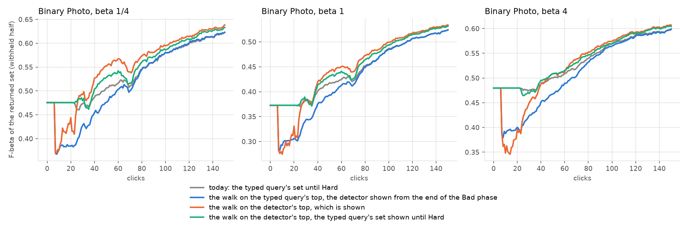
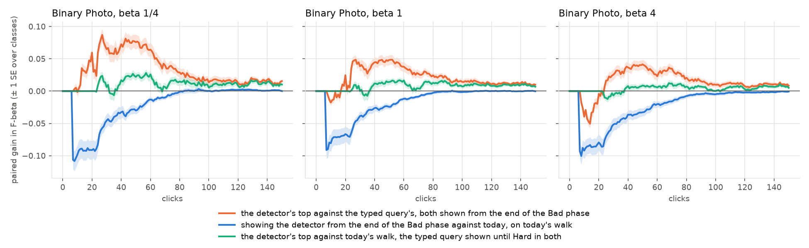

# Where the More walk picks once the opening's detector is shown (issue #4637)

**Status (2026-10-08): Binary Photo priced, 5 seeds; nothing shipped. Region Photo is #4639.**

**The walk should take the detector's top.** With the opening's detector shown from the end of the Bad phase, walking
its top rather than the typed query's adds **+0.046 / +0.022 / +0.009** to the mean F-beta over clicks 1–50, at
beta 1/4 / 1 / 4. Over clicks 1–150 it adds +0.033 / +0.021 / +0.014. It finds Goods faster, so the detector is
better: AP +0.05 at click 25.

**But on today's app, Binary should not show the detector at the end of the Bad phase at all.** #4604 priced that
hand-off against the old guarded typed-query line. #4603's line has since raised the typed query's set over clicks
1–50 from 0.31 to 0.48 at beta 1/4, and from 0.32 to 0.38 at beta 1. The hand-off now **loses at every preset:
−0.055 / −0.044 / −0.054** over clicks 1–50. #4604's ruling for Binary at beta 1/4 reverses.

**The best of the two on these runs:** walk the detector's top, but keep the typed query's set on screen until later.
- Showing it until Hard: +0.011 / +0.008 / +0.004 over clicks 1–150 against today.
- A later hand-off adds a little more: +0.019 / +0.013 / +0.008 with the vote rule (below).
- In this form More's picks are no longer the top of the list on screen.

## The question

#4604's ruling (2026-10-07) shows the opening's detector from the end of the Bad phase (3 Goods + 4 Bads): on Region
Photo at every preset, and on Binary Photo at beta 1/4. From there Autopilot's More walk runs until 20 Goods, or until
16 picks in a row hold none. Today it takes the top of the typed query's sort, which is also the list on screen. Once
the list shows the detector, the walk can take one of two tops:

- **T, the typed query's top.** The sessions are unchanged, which #4604 assumed.
- **D, the detector's top.** The list and the picks agree, as on document datasets since #4488.

The owner: "This is an empirical question! It needs an entire experiment."

## What was run

| | |
|---|---|
| arms | **T**: today's app. **D**: `CALIB_MORE_WALK=detector`, the More walk on the top of the step's detector ranking, the detector shown from the walk's first step (`app_trained`) |
| pairing | the same seed, cell and preset in both arms. All 2,106 trained pairs pick identically until the walk |
| code | dev at 0d696a7fd plus the harness arm (a921039fe), from a frozen worktree. It includes #4590 and #4603 (the typed query's display line) and #3546 (Hard's acquisition), all shipped since #4604's runs |
| bench | `coco_better`, 144 class@band cells, SigLIP whole-image (Binary Photo), the user's pool at the bench's 0.44% |
| presets | beta 1/4, 1 and 4, one run per preset |
| seeds | 5: 4,320 runs, all completed. 702 trained runs per preset; the other 18 never train a detector |
| clicks | 150, trajectory pass (no full-label ceiling) |
| objective | F-beta of the withheld half above the line the app shows, at the run's preset (#4427) |
| the typed query's set | the line the app draws at the preset (#4603), from `text_baseline.py` |

Four returned sets are read per run and click:

| set | arm | the walk | what the app shows |
|---|---|---|---|
| **today** | T | the typed query's top | the typed query's set until Hard |
| **#4604's hand-off** | T | the typed query's top | the detector from the end of the Bad phase |
| **D, shown** | D | the detector's top | the detector from the end of the Bad phase |
| **D, typed query until Hard** | D | the detector's top | the typed query's set until Hard |

The walk question is *D, shown* against *#4604's hand-off*: both show the detector from the same click. Gains are
paired per run. ± is one SE over classes, because the runs of one class are not independent.

## Result



*Mean F-beta of the returned set over trained runs, per preset. Grey is today. Before click ~23 no session has reached
Hard, so today and green show the typed query's set.*

| mean F-beta, beta 1/4 / 1 / 4 | clicks 1–50 | clicks 1–150 | click 25 | click 50 | click 150 |
|---|---|---|---|---|---|
| today | 0.48 / 0.38 / 0.48 | 0.54 / 0.44 / 0.53 | 0.46 / 0.37 / 0.47 | 0.51 / 0.42 / 0.50 | 0.62 / 0.52 / 0.60 |
| #4604's hand-off | 0.42 / 0.34 / 0.43 | 0.52 / 0.43 / 0.51 | 0.39 / 0.31 / 0.40 | 0.48 / 0.39 / 0.47 | 0.62 / 0.52 / 0.60 |
| D, shown | 0.47 / 0.36 / 0.44 | 0.55 / 0.45 / 0.52 | 0.47 / 0.36 / 0.42 | 0.55 / 0.44 / 0.51 | 0.64 / 0.53 / 0.61 |
| D, typed query until Hard | 0.49 / 0.39 / 0.48 | 0.55 / 0.45 / 0.54 | 0.48 / 0.37 / 0.46 | 0.53 / 0.43 / 0.51 | 0.63 / 0.53 / 0.60 |



*Paired gains over clicks, ± 1 SE over classes.*

| paired gain, beta 1/4 / 1 / 4 | clicks 1–50 | clicks 1–150 |
|---|---|---|
| **the walk:** D, shown − #4604's hand-off | **+0.046 / +0.022 / +0.009** (± 0.007 / 0.005 / 0.005) | +0.033 / +0.021 / +0.014 (± 0.005 / 0.003 / 0.004) |
| **#4604's hand-off on today's app:** hand-off − today | **−0.055 / −0.044 / −0.054** (± 0.008 / 0.006 / 0.007) | −0.020 / −0.017 / −0.023 (± 0.003 / 0.002 / 0.003) |
| D, shown − today | −0.008 / −0.021 / −0.045 (± 0.010 / 0.007 / 0.007) | +0.013 / +0.004 / −0.009 (± 0.005 / 0.003 / 0.003) |
| D, typed query until Hard − today | +0.007 / +0.003 / −0.000 (± 0.003 / 0.002 / 0.002) | **+0.011 / +0.008 / +0.004** (± 0.003 / 0.002 / 0.002) |

**Why the detector's walk wins.** The walk is the same length either way (a median of 20 vs 21 picks). From the
detector's top it finds Goods faster:

| beta 1/4 (the other presets agree; the walk is preset-independent) | T | D |
|---|---|---|
| walk picks that are Goods | 41% | 47% |
| walks that reach 20 Goods (the rest run dry) | 59% | 74% |
| Hard starts (median click) | 34 | 31 |
| Goods by click 50 / 150 | 17 / 29 | 18 / 31 |
| AP at click 25 / 50 / 100 / 150 | 0.41 / 0.47 / 0.55 / 0.55 | 0.46 / 0.52 / 0.56 / 0.56 |

**Why #4604's hand-off no longer pays on Binary.**
- **What changed is the typed query's set.** The detector at the end of the Bad phase is about where #4604 measured
  it. Mean F over clicks 1–50 with the hand-off was 0.39 / 0.33 / 0.43 there, and is 0.42 / 0.34 / 0.43 here.
- **Today's set rose** from 0.31 / 0.32 / 0.48 to 0.48 / 0.38 / 0.48. #4603 changed the typed query's line at beta ≤ 1 and left beta 4 alone, which already lost in #4604.
- **Among runs past the Bad phase by click 10** (seed 0), the detector's F is 0.52 against the typed query's 0.67 at beta 1/4.

**By band** (`tables/walk_bands.csv`), over clicks 1–150. The walk's gain sits mostly in medium targets:
- **The walk (D, shown − #4604's hand-off):** +0.057 / +0.038 / +0.030 on medium targets. Large is +0.020 / +0.008 / −0.002; small +0.022 / +0.015 / +0.014.
- **D, typed query until Hard − today:** medium +0.018 / +0.015 / +0.009, large +0.011 / +0.006 / +0.002, small +0.002 / +0.002 / +0.001.
- **#4604's hand-off − today:** it loses on large and medium targets at every preset, −0.017 to −0.037, and is about level on small ones (+0.001 / −0.004 / −0.008).

**Per run.** Under *D, typed query until Hard*, at beta 1/4 over clicks 1–150, 51% of runs gain, 40% lose and 9% are
unchanged.

### When to hand off, on each arm's sessions

The same pricing as #4604, on both arms:
- **Rules.** A rule shows the typed query's set until its hand-off click and the detector after. It never hands off before the end of the Bad phase, nor after Hard.
- **The vote rule.** It hands off once the detector's F-beta on the honest votes so far (each pick judged by the detector trained before it) is at least the typed query's plus a margin, with at least p positives judged.
- **Held-out check.** Tuned settings are picked on one class half and scored on the other, both ways.

| gain over today, beta 1/4 / 1 / 4 | clicks 1–50 | clicks 1–150 |
|---|---|---|
| T: the best fixed click, held out (click 50 every time) | −0.001 / −0.000 / −0.001 | −0.002 / −0.002 / −0.005 |
| T: the best vote rule, held out | −0.022 / −0.009 / −0.002 | −0.009 / −0.004 / −0.001 |
| T: ceiling (the better set per run and click until Hard) | +0.017 / +0.010 / +0.010 | +0.010 / +0.005 / +0.005 |
| D: hand-off at Hard | +0.007 / +0.003 / −0.000 | +0.011 / +0.008 / +0.004 |
| D: hand-off at click 30 | +0.016 / +0.006 / −0.004 | +0.021 / +0.013 / +0.005 |
| D: the best fixed click, held out (clicks 25–30 at beta 1/4 and 1, 40–50 at 4) | +0.015 / +0.006 / −0.001 | +0.021 / +0.013 / +0.006 |
| **D: vote rule, margin +0.1, 3 positives** (picked in 5 of the 6 held-out tunings) | +0.012 / +0.006 / +0.002 | **+0.019 / +0.013 / +0.008** (± 0.004 / 0.003 / 0.002) |
| D: ceiling | +0.040 / +0.019 / +0.013 | +0.032 / +0.019 / +0.014 |

- **On today's walk, no rule beats today.** The ceiling is only +0.01 to +0.02. The typed query's set is now hard to beat before Hard.
- **On the detector's walk, a later hand-off adds about +0.01** over showing the typed query until Hard. One vote-rule setting is best at every preset, and the held-out scores agree with the in-sample ones.

### Literal runs

Both are at beta 1/4.

- **`keyboard@medium`, seed 4: the detector's walk is the session.** The gain over clicks 1–150 is +0.34. The typed query's set has F 0.13.
  - **T:** today's walk takes 131 picks to find its 17 Goods, so Hard starts only at click 150. Goods: 7 by click 50, 20 by click 150.
  - **D:** the detector's walk finds 17 Goods in 18 picks, and Hard starts at click 37. Goods: 20 by click 50, 38 by click 150.
  - **At click 40:** T's detector has precision 0.34, recall 0.46, AP 0.42. D's has precision 0.92, recall 0.46, AP 0.57.
  - **At click 150:** D's AP is 0.63 against T's 0.38.
- **`remote@medium`, seed 2: the detector's walk runs dry.** The gain over clicks 1–150 is −0.26. The typed query's set has F 0.31.
  - **D:** the top 16 of the detector trained on 3 Goods + 4 Bads hold no remote. Its walk takes those 16 picks and stops, and Hard starts at click 23 with 3 Goods. At clicks 40 and 75 its detector returns nothing, and it has 7 Goods by click 150.
  - **T:** the typed query's walk finds 6 Goods in 45 picks, and Hard starts at click 52. It has 32 Goods by click 150.

## What this means for #4604's build

These are options for the owner; nothing is decided here.

1. **Binary at beta 1/4: don't show the detector at the end of the Bad phase.** #4604's ruling assumed the old typed-query line, and against today's line it loses −0.055 over clicks 1–50. Beta 1 and 4 already kept the hand-off at Hard.
2. **Binary, every preset: the More walk could take the detector's top while the list keeps the typed query's set.** That is +0.011 / +0.008 / +0.004 with the hand-off at Hard, or +0.019 / +0.013 / +0.008 with the vote rule. Two costs:
   - It needs a background retrain after each opening vote. That is #4508's mechanism, and it moves the Smart and Stable indicators' timing (#4508's pricing item).
   - More's picks are then not the top of the list on screen.
3. **Showing the detector and walking its top from the end of the Bad phase** (D, shown) gains over clicks 1–150 at beta 1/4 (+0.013). It costs early at every preset: −0.008 / −0.021 / −0.045 over clicks 1–50.
4. **Region Photo still needs re-pricing (#4639).** #4603's line moved its typed-query side too, and #4604's region gains (+0.16 / +0.09 / +0.04) were measured against the old line.

## Caveats

- **One path, one bench.** Binary Photo only, on COCO Better at 0.44%.
- **The harness trains a detector at every step, in both arms.** Its Smart and Stable lights therefore see the opening's models whatever the arm. The app's indicators see a model only when a learned sort runs (#4508). In the app, arm D's More steps would be learned sorts, so the harness models D's indicator timing more closely than T's. Arm T's opening is where the app and the harness differ, as they already do today.
- **D's display is the app's learned sort.** *D, typed query until Hard* and the hand-off rules on D are measurements: the app has no state where More walks the detector's top while the list shows the typed query's sort.

## Reproducing

From a frozen worktree of the branch:

```bash
bash scripts/experiments/state_of_app/walk_4637.sh dirs 5
for s in 0 1 2 3 4; do for b in 0.25 1 4; do for arm in T D; do
  bash scripts/experiments/state_of_app/walk_4637.sh launch $arm $b binary 5 $s $s
done; done; done
# after the arrays drain, on a compute node:
bash scripts/experiments/state_of_app/walk_4637.sh price <out> 5 0
python scripts/experiments/state_of_app/walk_compare_4637.py --dir <out> --docs docs/experiments/2026-10-07-more-walk-4637/tables
```

The run dirs are `/expscratch/sgreenberg/state-of-the-app/2026-10-07-walk4637{T,D}-b{025,1,4}`, and the priced
outputs `/expscratch/sgreenberg/walk-4637/priced`.

| script | role |
|---|---|
| `walk_4637.sh` | run dirs, launch, and the pricing chain |
| `handoff_extract_4604.py`, `handoff_price_4604.py` | #4604's per-step and per-pick extraction and per-run curves, per arm |
| `walk_compare_4637.py` | pairs the arms run for run: the four sets, the hand-off rules, the bands, the figures |

| table | contents |
|---|---|
| `tables/walk_summary.csv` | per preset: the four sets at each click and window, the paired gains, the walk's statistics, AP |
| `tables/walk_rules.csv` | every hand-off rule on each arm, with the held-out picks |
| `tables/walk_bands.csv` | the paired gains by band |
| `tables/walk_curves.csv` | the four sets' mean F at every click |
