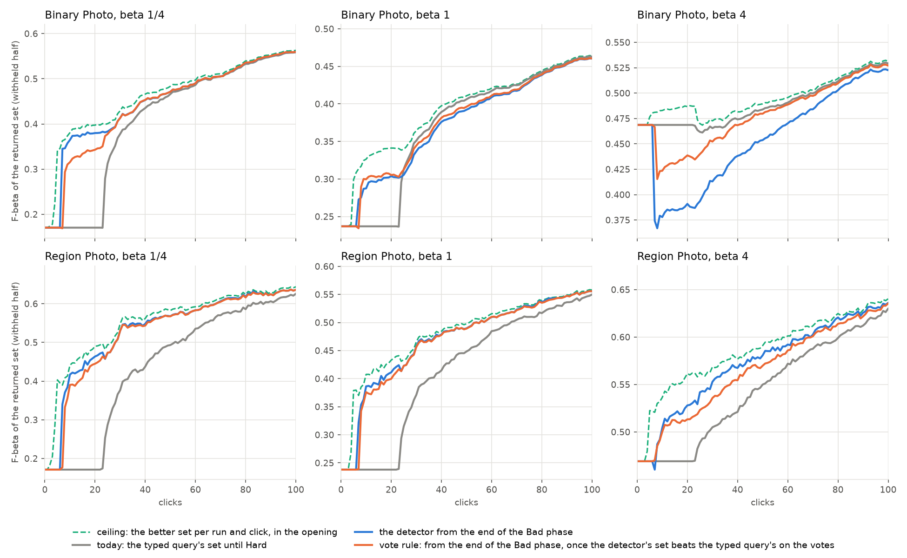
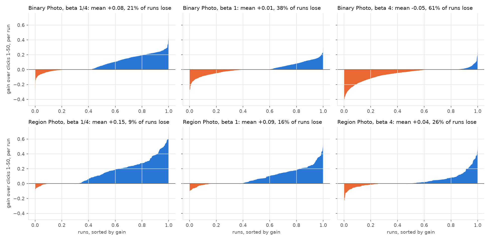
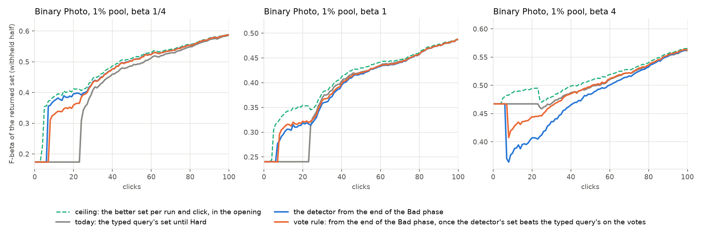

# Showing a detector during Autopilot's opening (issue #4604)

**Status (2026-10-07): priced offline, nothing shipped.** Re-priced the same day with every run, the 37 binary
and 9 region runs per preset that never train a detector included at the typed query's set (#4631). Every gain
moved by at most 0.01, and no ruling changed.

**Ruling (owner, 2026-10-07): per path and preset**, after the 1% check below agreed.
- Once the app has a detector during the opening (#4508's background retrain), it shows it from the end of the Bad phase on Region Photo at every preset and on Binary Photo at beta 1/4.
- Binary Photo at beta 1 and 4 keeps today's hand-off at Hard.

The app shows the typed query's returned set until
Autopilot reaches its Hard phase, at click 39 in the median Binary Photo run and 36 in the median Region Photo run (#4605). The harness
trains a detector at every click of the opening anyway, and scores its line on the withheld half. Suppose the app
showed that detector from the end of the opening's Bad phase: 3 Goods and 4 Bads, which is click 7 in the median run.
The returned set would then gain, on average over clicks 1–50:

| | beta 1/4 | beta 1 | beta 4 |
|---|---|---|---|
| Region Photo | **+0.15 ± 0.01** | **+0.09 ± 0.01** | **+0.04 ± 0.01** |
| Binary Photo | **+0.08 ± 0.01** | +0.01 ± 0.01 | **−0.05 ± 0.01** |

**Binary Photo loses at beta 4.**
- **Why:** the opening's binary detector *ranks* worse than the typed query (AP 0.33 against 0.42 at click 10), and beta 4 needs the recall that only a good ranking gives.
- **A vote rule helps but does not fix it.** The rule waits until the detector's set beats the typed query's on the votes so far. That cuts the loss to −0.02 and keeps 74–94% of the gains elsewhere.

**The picture holds at a second prevalence.** Binary Photo was re-priced with the user's pool at 1% (#4583's shipped arm). It gives the same signs and sizes at every preset: +0.08 / +0.02 / −0.04.

Showing a detector during the opening needs a background retrain after each opening vote (#4508).

## What was priced

| | |
|---|---|
| runs | the 2026-10-05 Binary Photo and 2026-10-06 Region Photo State of the App runs, as re-scored by #4605 (`analysis-*-4605`) |
| bench | `coco_better`, 144 class@band cells, presets 1/4, 1 and 4. Binary: 10 seeds, 1,440 runs per preset. Region (`siglip+dinov3_patch`, max-patch): 2 seeds, 288. Every run counts (#4631): the 37 binary and 9 region runs per preset that never train a detector keep the typed query's set under every rule |
| objective | F-beta of the withheld half above the line the app shows, at the run's preset (#4427) |
| the typed query's set | today's guarded line (#4136): precision 0.17, recall 0.58, a median of 203 returned |
| no new sessions | every run's rows carry the opening's own detector at every click (`app_trained == 0`). A rule changes only which set the app *shows*; votes, picks and every point from Hard on are the same sessions |

Each rule picks a hand-off click per run. The app shows the typed query's set before that click and the detector's line from it. A rule only moves the hand-off earlier than today's, which is Hard.

| rule | hands off at |
|---|---|
| today | Hard (`app_trained`, the first Hard pick) |
| from the first detector | the first click with a detector: 3 Goods and 1 Bad, usually click 4 |
| **from the end of the Bad phase** | the first click past the opening's Good and Bad phases |
| a fixed click N | N, swept from 0 to 150 |
| a Goods count G | the click the G-th Good is found, G from 1 to 20 |
| **vote rule** | the first click where the detector's F-beta on the votes so far is at least the typed query's plus a margin (−0.2 to +0.2), with at least p positives judged (1 to 8). Run with and without waiting for the end of the Bad phase |
| ceiling | the better of the two sets, per run and click, inside the opening (and, as a second number, at every click) |

**The vote rule judges only honest votes.** Each pick is judged by the detector trained just before its vote, at that detector's own line. The typed query's set is judged on the same picks. The app could do the same by keeping each pick's score from before its vote.

Gains are paired per run (rule minus today). ± is one SE over classes, because the runs of one class are not independent.

**Tuned rules are checked out of sample.** A fixed click, a Goods count or a margin was picked on one half of the classes (md5 of the class name) and scored on the other.

## Result

*Mean F-beta over every run, per path and preset.*
- **Gray, today:** flat on the typed query's set until runs start reaching Hard around click 23.
- **Blue, the detector from the end of the Bad phase:** steps up at click 7.
- **Orange, the vote rule:** margin 0, one positive, after the Bad phase.
- **Green dashed, the ceiling:** the better set per run and click.

At beta 1/4 and 1 the region and binary detectors jump far above the typed query. At binary beta 4, both rules sit below today for the whole opening.

**Mean F-beta over clicks 1–50** (gain against today ± SE):

| | today | from the end of the Bad phase | vote rule | ceiling, in the opening |
|---|---|---|---|---|
| Binary, beta 1/4 | 0.30 | 0.38 (**+0.08 ± 0.01**) | 0.36 (**+0.07 ± 0.01**) | 0.40 (+0.10) |
| Binary, beta 1 | 0.31 | 0.32 (+0.01 ± 0.01) | 0.33 (**+0.02 ± 0.01**) | 0.35 (+0.04) |
| Binary, beta 4 | 0.47 | 0.42 (**−0.05 ± 0.01**) | 0.45 (**−0.02 ± 0.004**) | 0.48 (+0.01) |
| Region, beta 1/4 | 0.30 | 0.46 (**+0.15 ± 0.01**) | 0.45 (**+0.14 ± 0.01**) | 0.49 (+0.19) |
| Region, beta 1 | 0.32 | 0.41 (**+0.09 ± 0.01**) | 0.41 (**+0.08 ± 0.01**) | 0.43 (+0.11) |
| Region, beta 4 | 0.50 | 0.53 (**+0.04 ± 0.01**) | 0.52 (**+0.03 ± 0.01**) | 0.56 (+0.06) |

**At single clicks**, today against the detector from the end of the Bad phase:

| | click 10 | click 25 | click 50 |
|---|---|---|---|
| Binary, beta 1/4 | 0.17 → 0.36 | 0.31 → 0.38 | 0.47 → 0.47 |
| Binary, beta 1 | 0.24 → 0.29 | 0.31 → 0.31 | 0.41 → 0.39 |
| Binary, beta 4 | 0.47 → 0.38 | 0.46 → 0.39 | 0.48 → 0.45 |
| Region, beta 1/4 | 0.17 → 0.42 | 0.29 → 0.47 | 0.49 → 0.57 |
| Region, beta 1 | 0.24 → 0.39 | 0.32 → 0.42 | 0.45 → 0.49 |
| Region, beta 4 | 0.47 → 0.50 | 0.49 → 0.54 | 0.55 → 0.58 |

**Over clicks 1–150 the same gains are about 40% as large**, because every rule matches today from Hard on:
- Region: +0.07 / +0.04 / +0.02.
- Binary: +0.03 / +0.00 / −0.02.

- **Not from the first detector.** The detector trained on 3 Goods and 1 Bad, at click 4 in most runs, is the session's worst set. The mean F dips to between 0.08 (binary, beta 1) and 0.18 (region, beta 4) at click 4, then recovers by click 7 as the Bad phase adds negatives.
  - Showing it from its first click is +0.02 better at region beta 1/4 and level at binary beta 1/4 and region beta 1.
  - It is 0.01–0.03 worse elsewhere, and binary beta 4 falls to −0.08.
- **No tuned count beats the simple rule.** Held out across class halves, over clicks 1–150:
  - *Where the early hand-off pays* (every region preset and binary 1/4): a fixed click or a Goods count lands on the same early hand-off, within 0.01 of its in-sample gain.
  - *Binary beta 1:* nothing is found, −0.006 to −0.002 held out.
  - *Binary beta 4:* the best rule is today's.
- **The vote rule sees binary beta 4 only dimly.** The opening's votes come from the top of the typed query's sort, so the votes flatter the typed query's set: its recall on them is near 1, against 0.58 on the withheld half.
  - Both sets are judged on the same easy items.
  - Stricter settings trade the remaining loss for gains: margin 0 with three positives costs −0.01 at binary beta 4, but gives up a third of the region gain at beta 4.
  - Only the strictest setting never loses: margin +0.2 with five positives. It gains +0.01 / 0.00 / 0.00 on binary and +0.06 / +0.03 / 0.00 on region, because at beta 4 on both paths it waits for Hard (`tables/rules.csv`).
- **Who gains.** Per run, over clicks 1–50:
  - Region beta 1/4: 9% of runs lose. Binary beta 4: 61% lose.
  - Medium and large objects gain the most, and small objects the least. Region beta 1/4: +0.18 large, +0.22 medium, +0.05 small (`tables/by_band.csv`).
- **20% of runs (binary) to 21% (region) are untouched by any rule over clicks 1–50.**
  - The typed query's top holds few of their positives, so the Good phase drags on: the first detector arrives at a median click of 34 (binary) to 45 (region), counting as never the runs that never train one (#4631).
  - The Bad phase then ends after click 50, or never before Hard.

*Each run's gain over clicks 1–50 from showing the detector at the end of the Bad phase, sorted. The flat zero
stretch is the 20% of runs whose Bad phase ends after click 50, or never.*

## Why Binary Photo loses at beta 4

**The opening's binary detector ranks worse than the typed query; the region detector ranks better.** AP on the withheld half (the typed query's is 0.42):

| | click 4 | 7 | 10 | 25 | 40 | 60 |
|---|---|---|---|---|---|---|
| binary detector | 0.26 | 0.32 | 0.33 | 0.35 | 0.41 | 0.45 |
| runs where it beats the typed query | 4% | 10% | 12% | 21% | 40% | 56% |
| region detector | 0.43 | 0.46 | 0.48 | 0.53 | 0.56 | 0.59 |
| runs where it beats the typed query | 42% | 48% | 53% | 67% | 73% | 79% |

This is #4384's early AP dip, now read inside the opening. A run that never trains a detector stays at the typed query's AP throughout (#4631).

At beta 1/4 the score rewards precision. A few images at the top of even a weaker ranking are precise enough to beat the typed query's 203 at precision 0.17. At beta 4 the score rewards recall, and only a deep ranking delivers it. The returned set at click 10, over runs with a detector:

| | precision | recall | returned (median) |
|---|---|---|---|
| typed query | 0.17 | 0.58 | 203 |
| binary detector, beta 1/4 | 0.58 | 0.36 | 25 |
| binary detector, beta 4 | 0.36 | 0.55 | 75 |
| region detector, beta 1/4 | 0.61 | 0.59 | 48 |
| region detector, beta 4 | 0.43 | 0.73 | 99 |

**Two literal runs, each at the median of its side:**
- **Region, beta 1/4, `tennis racket@large`, seed 1** (+0.21 over clicks 1–50).
  - The typed query returns 147 of 11,607 withheld images at precision 0.32, recall 1.00 (F 0.33).
  - At click 7 (3 Goods, 4 Bads) the detector returns 49 at precision 0.96, recall 1.00 (F 0.96), and it stays there.
  - The app shows it only from Hard, at click 24.
- **Binary, beta 4, `boat@large`, seed 2** (−0.07 over clicks 1–50).
  - The typed query returns 236 at precision 0.20, recall 0.96 (F 0.78).
  - At click 7 the detector returns 650 at precision 0.06, recall 0.84 (F 0.49).
  - At click 10 it returns 59 at 0.61 / 0.73 (F 0.73).
  - At Hard (click 25) it returns 59 at 0.47 / 0.57 (F 0.56). Its recall never reaches the typed query's in the opening.

## At a 1% pool (Binary Photo)

**Why this check.** #4603's typed-query count multiple was tuned at 0.44% and failed at 2%. So this pricing was repeated at a second prevalence before any rule is chosen.

**The runs.** #4583's shipped arm (calibration fraction 0.3, 2 folds):
- Binary Photo, 5 seeds: 720 runs per preset, the 3 that never train a detector included (#4631).
- The user's pool thinned to 1% (`CALIB_HAYSTACK_PREVALENCE=0.01`).
- The withheld half stays at the bench's 0.44%.

**The baseline.** The typed query's guarded line was rebuilt on the 1% pool with today's code (`handoff_1pct_4604.sh`). #4583's own baseline predates #4136, so its display line is the old midpoint.

**Gain against today, mean F-beta over clicks 1–50:**

| | beta 1/4 | beta 1 | beta 4 |
|---|---|---|---|
| from the end of the Bad phase, bench pool (0.44%) | +0.08 ± 0.01 | +0.01 ± 0.01 | −0.05 ± 0.01 |
| from the end of the Bad phase, 1% pool | **+0.08 ± 0.01** | **+0.02 ± 0.01** | **−0.04 ± 0.01** |
| vote rule, bench pool | +0.07 ± 0.01 | +0.02 ± 0.01 | −0.02 ± 0.004 |
| vote rule, 1% pool | +0.07 ± 0.01 | +0.02 ± 0.01 | −0.01 ± 0.004 |
| ceiling, 1% pool | +0.10 | +0.04 | +0.01 |

- **The signs and sizes match at every preset.** Today's curve starts from the same typed-query set: 0.17 / 0.24 / 0.47 at click 10.
- **Held out across class halves the result is the same.** A tuned click or Goods count again finds the early hand-off at beta 1/4 (+0.03 over clicks 1–150), and nothing at beta 1 (−0.003 to +0.006) or beta 4 (0.000).
- **The ranking explanation holds, and the gap is smaller.** At click 10 the binary detector's AP is 0.40, against the typed query's 0.42; 23% of runs beat the typed query there, and the detector's mean overtakes it between clicks 25 (0.41) and 40 (0.47). At the bench pool the same numbers are 0.33 against 0.42 and 12%. A 1% pool gives the opening more positives, so the binary β4 loss is a little smaller (−0.04 against −0.05).
- **Not covered:**
  - Region Photo was not re-priced at 1%.
  - Only the user's pool moves here; the withheld half the objective is scored on stays at 0.44%.

## The issue's first table

The issue's first table gave the hidden detector as 0.45 / 0.43 / 0.51 at clicks 10 / 25 / 50 for binary beta 1/4. Those numbers averaged only the runs that already have a detector at the click.
- At click 10, 21–23% of runs have none yet, and a rule can show them only the typed query's set.
- Counted that way, the same cells read 0.36 / 0.38 / 0.47 (`tables/reconcile.csv`).
- The issue's direction holds; its sizes were about 0.05 to 0.1 too high early.

## What this does not measure

- **The sessions are assumed unchanged.** In the app, the opening's detector would come from a background retrain after every opening vote (#4508).
  - That would also give the Smart and Stable indicators models earlier, and Autopilot's phase transitions read them. #4508 lists this as its pricing item.
  - Autopilot's opening picks come from the typed query's sort either way.
- **The typed query's set is today's guarded line.** #4603 is pricing a beta-aware line for it. A better typed-query set at beta 1/4 and 1 would shrink these gains; the vote rule would follow it, but the fixed rules would not.
- **One bench.** These are all COCO Better runs.
  - The second prevalence covers Binary Photo only, and only the user's pool (1%).
  - Region Photo has 2 seeds, at 0.44% only.
- **The cost of the retrain** (latency and load per opening vote) is #4508's to measure.

## Files

The scripts are in `scripts/experiments/state_of_app/`.

| file | does |
|---|---|
| `handoff_4604.sh OUT [DOCS]` | runs the three steps below over the six runs, about 2 minutes at 8 CPUs |
| `handoff_extract_4604.py` | pulls each run's steps (the detector at every click, shown or not) and picks |
| `handoff_price_4604.py` | the rules, per path and preset: per-click curves, gains, class halves |
| `handoff_1pct_4604.sh OUT` | the 1% check: rebuilds the typed query's baseline on #4583's 1% pool, then extracts and prices its shipped arm |
| `handoff_report_4604.py` | these tables and figures, including the 1% ones when that run is in the same dir |
| `selftest_handoff_4604.py` | planted answers, including that a pick is judged against the previous step's line |

The tables are in `tables/`.
- `rules.csv`: every rule at every path and preset.
- `curves.csv`: the named rules' mean F per click.
- `headline.csv`, `split_half.csv`, `by_band.csv`, `returned_set.csv`, `ap.csv`, `reconcile.csv`.
- The 1% check: `rules_1pct.csv`, `headline_1pct.csv`, `split_half_1pct.csv`, `ap_1pct.csv`.
- `provenance.json`: the run and baseline paths.
