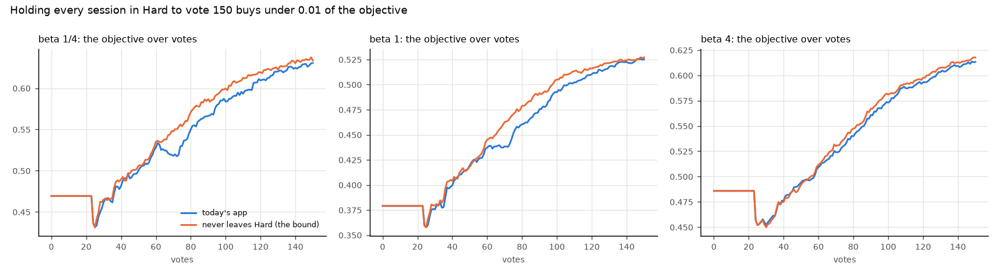

# How much could a later Smart light buy? (issue #4359)

**Under 0.01 of the objective, and nothing resolvable after the check.** So re-keying Smart to change what
Autopilot asks is not worth a design and an A/B. The case left for re-keying it is Smart as a *stop signal* to
the user, which is the stopping question (#3560).

## Why measure a bound first

Smart prices each model at FPR + FNR at its own Inclusion 0 cut. It ignores the preset, and on today's app (the
target-precision acquisition cut, #3546) it first goes green at a **median vote 42 at every beta**. After that
point runs still gain 0.15–0.17 of the objective (posted on #4359, from #3546's target-precision arms). Smart
and Stable both green move Autopilot from Hard to New, and to Done once Span is also green. So a re-keyed Smart
could only help by keeping sessions in Hard longer. This study measures the most that could buy: a session
that **never leaves Hard**.

## What was run

Today's app against `CALIB_SMART_GATE=never`. That is a harness-only knob (`smart_gate` on
`simulate_voting_iterations` and `AutopilotFlow`) that reads Smart as yellow for the phase decision; the light
is still computed and reported. The runs used beta 1/4, 1 and 4, `coco_better`, binary SigLIP, 144 cells × 3
seeds, 150 votes and the 1% pool, as in #3546's screen. That is 6 arms × 432 runs, all on one commit of
`claude/smart-gate-4359`, with 0 lost. Scoring is #3546's analyzer (`analyze_acqcut_3546.py --rules app,never
--control app`): paired on (category, seed), with the SE clustered on category. Bold means more than 2 SE from
zero.

## Result

| never leaves Hard − today | beta 1/4 | beta 1 | beta 4 |
|---|---|---|---|
| objective, mean over votes 1–150 | **+0.009 ± 0.001** | **+0.007 ± 0.001** | **+0.003 ± 0.001** |
| objective at vote 150 | +0.003 ± 0.004 | +0.002 ± 0.002 | **+0.004 ± 0.002** |
| objective after the check | +0.007 ± 0.003 | +0.001 ± 0.002 | +0.001 ± 0.002 |
| Goods by vote 150 | **+1.2 ± 0.2** | **+1.2 ± 0.2** | **+1.1 ± 0.2** |
| AP at vote 150 | **+0.004 ± 0.001** | **+0.003 ± 0.001** | **+0.003 ± 0.001** |
| Hard picks per session | **+58** | **+55** | **+47** |
| share of Hard picks that are Good | **0.20 vs 0.38** | **0.20 vs 0.38** | **0.21 vs 0.38** |



*The two curves are one line until Smart and Stable go green (votes 40–100), and stay within 0.012 of each other
after it.*

- **The ceiling is small.** No gate could keep a session in Hard longer than this arm does, and it buys at most
  +0.009 averaged over votes, +0.004 at vote 150, and nothing resolvable after the check. A re-keyed Smart would
  buy a fraction of that.
- **Hard has little left to give once Smart is green.** The ~55 extra Hard picks per session are 20% Good,
  against 38% for the Hard picks before Smart goes green. The target-precision cut (#3546) took most of what
  Hard offers early.
- **Smart's real cost is what it tells the user.** On today's app it says "you can likely stop" at about vote 42
  (Done at a median vote 74) with 0.15 of the objective still to come. The simulated user keeps voting to 150
  regardless, so that cost does not show up here. It is a question about when to stop, which belongs to
  #3560's stopping rules.

## What follows

- No change to Smart's gating. `smart_gate` stays as a harness knob.
- Stable was re-validated on both acquisition cuts (#4359 comments): its floor-era failure is gone.
- Smart as a stop signal goes to #3560: the objective still to come when Smart first goes green (0.15 here) is
  the number a stop rule should be judged on.

## Reproducing

```bash
cd scripts/experiments/calibration
bash launch_smartgate_4359.sh arms
python analyze_acqcut_3546.py --base /expscratch/$USER/smartgate-4359 --rules app,never --control app \
  --baseline /expscratch/$USER/progression-4184-h0.01/text_baseline.csv --out OUT
```

`tables/` holds `paired.csv`, `levels.csv`, `curves.csv` and `provenance.json`.
