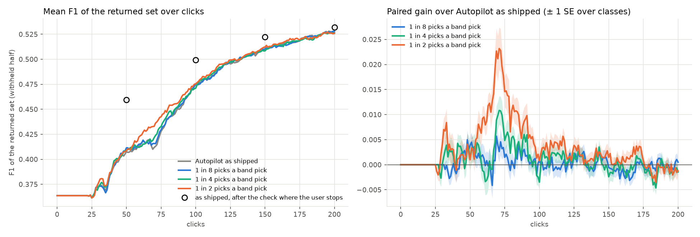

# What a uniform band pick is worth against an Autopilot pick (issue #4482)

**Status (2026-10-08): Binary Photo at beta 1, 5 seeds, priced; nothing shipped.**

**Mixing band picks into Autopilot's own picks does not help, at any share tried.** The arms drew one in 8, one in
4 or one in 2 of the picks past the opening uniformly within the check's bands. The returned set's F1 stays within
0.004 of Autopilot as shipped, averaged over clicks 1–200: +0.0003 / +0.0010 / +0.0034 (± 0.0003 / 0.0005 / 0.0006).
After the check at click 200 the change is +0.002 / −0.001 / +0.001. Band picks find Goods a little more often
(17–19% against 13%), and AP does not move.

**The check is worth most when a user stops early.** Run where the user stops, the check's ~20 picks add:

| stop at | the check | the same number of further Autopilot clicks |
|---|---|---|
| 50 | **+0.052** | +0.010 |
| 100 | +0.025 | +0.018 |
| 150 | +0.011 | +0.007 |
| 200 | +0.005 | not run |

At click 50, the check's 70 votes reach the F1 that Autopilot reaches at click 93.

So the question's answer is not a pick mix. Autopilot's own picks are as good as band picks at every click. What
pays is the check itself, early in the session.

## The question

#4474 and the 10-04 pricing on this issue found the check's ~22 uniform band picks worth more per pick than
Autopilot's: +0.047 at click 100, against +0.023 for 50 further clicks. The owner reframed the issue (2026-10-04):
"the last 50 clicks" is not a thing, and a user stops whenever they stop. It now asks two things. What is each kind
of pick worth, as a curve over the click a user has reached? And how should Autopilot spend its picks given that?

## What was run

| | |
|---|---|
| arms | **a0**: Autopilot as shipped. **a8 / a4 / a2**: one in 8 / 4 / 2 of the picks past the opening is a band pick (`band_share`). **c50 / c100 / c150**: as shipped, stopping at that click |
| band pick | an ordinary click, drawn uniformly within one band of the unvoted ranking. The picks cycle through the bands a spot check starts from (the top 8, 8–16 and 16–32 at beta 1): `vtscore.eval.al_strategies.band_pick` |
| the check | every run ends with the app's check (`spot_check="weak"`: the closing check plus the one the app prompts mid-session). So a run that stops at click N reads "after the check" where the user stopped |
| pairing | the same cell and seed in every arm. The arms are identical until their first band pick, or until they stop |
| code | dev at 2567db111 plus the arm (9a7d8b409), from a frozen worktree. It includes #3546's acquisition, #4603's typed-query line and #4643's quota |
| bench | `coco_better`, 144 class@band cells × 5 seeds, SigLIP whole-image (Binary Photo), the user's pool at the bench's 0.44% |
| preset | beta 1 |
| clicks | 200 for a0–a2; 50 / 100 / 150 for the c arms. 5,040 runs, all completed |
| objective | F1 of the withheld half above the line the app shows: the typed query's set until Hard, then the detector's line |

Gains are paired per run. ± is one SE over classes. Every number is over all 720 runs per arm. A run that never
trains shows the typed query's set throughout.

## Result



*Left: mean F1 of the returned set over clicks. The circles are Autopilot as shipped after the check where the user
stops. Right: each mix's paired gain over Autopilot as shipped.*

### Band picks mixed into Autopilot

| paired F1 gain over a0 | clicks 1–50 | 51–100 | 101–150 | 151–200 | 1–200 | after the check at 200 |
|---|---|---|---|---|---|---|
| 1 in 8 | +0.000 | +0.001 | +0.000 | −0.001 | +0.000 (± 0.000) | +0.002 (± 0.001) |
| 1 in 4 | +0.001 | +0.003 | +0.001 | −0.001 | +0.001 (± 0.001) | −0.001 (± 0.001) |
| 1 in 2 | +0.001 | **+0.010** (± 0.002) | +0.003 | +0.000 | +0.003 (± 0.001) | +0.001 (± 0.001) |

| per run | a0 | 1 in 8 | 1 in 4 | 1 in 2 |
|---|---|---|---|---|
| band picks | 0 | 12 | 25 | 51 |
| band picks that are Goods | – | 19% | 18% | 17% |
| Autopilot's own picks past the opening that are Goods | 13% | 13% | 13% | 12% |
| Goods by click 100 / 200 | 25 / 31 | 25 / 32 | 25 / 32 | 25 / 33 |
| AP at click 100 / 200 | 0.55 / 0.56 | 0.55 / 0.56 | 0.55 / 0.56 | 0.55 / 0.56 |

- **Band picks are Goods more often** than Autopilot's own picks past the opening (17–19% against 13%). That adds about 1 Good by click 200, and the detector's ranking does not change.
- **One in 2 lifts the middle of the session briefly.** The gain is +0.010 over clicks 51–100, peaking near +0.02 around click 70, and it is gone by click 125.
  - That is not the band picks standing in for the prompted check. The gain is the same in runs where a0 prompts a check mid-session (+0.010, 490 runs) as in the rest (+0.009, 230 runs).
  - The one-in-2 arm does prompt a little earlier: median first prompt at click 58 against 67. 68% of runs prompt in both.
- **By band** (`tables/band_by_band.csv`), every mix is within ± 0.005 over clicks 1–200 on large, medium and small targets.

### The check where the user stops

| stop at | F1 unchecked | after the check | check picks | the check's gain | the same number of further Autopilot clicks (a0) | per pick: check / Autopilot | Autopilot as shipped reaches the after-check F1 at |
|---|---|---|---|---|---|---|---|
| 50 | 0.41 | 0.46 | 20 | **+0.052** (± 0.006) | +0.010 (± 0.006) | 0.0026 / 0.0005 | click 93 (the check: 70 votes) |
| 100 | 0.47 | 0.50 | 20 | +0.025 (± 0.004) | +0.018 (± 0.003) | 0.0013 / 0.0009 | click 132 (120 votes) |
| 150 | 0.51 | 0.52 | 20 | +0.011 (± 0.003) | +0.007 (± 0.002) | 0.0005 / 0.0003 | click 179 (170 votes) |
| 200 | 0.53 | 0.53 | 20 | +0.005 (± 0.002) | not run | – | past 200 |

- **The check's worth falls with the click.** Per pick it is 5× Autopilot's at click 50, 1.4× at 100 and 1.7× at 150. It saves 23, 12 and 9 clicks respectively.
- **At click 50 it helps 62% of runs and hurts 27%;** 11% are unchanged.
- **Against the 10-04 pricing**, the check at click 100 is worth less: +0.025 against +0.047. Autopilot's own clicks there are worth about the same (+0.018 for 20 clicks, against +0.023 for 50 then). #3546 shipped in between: Autopilot's Hard picks now sample where the line's model is at even odds, which is close to what the check samples. That is consistent with the change, but no arm here re-runs the old acquisition.

### Literal runs

- **`person@large`, seed 2: the check at click 50 rescues the run.** Unchecked, the line is at F1 0.12, and Autopilot as shipped is still at 0.12 at click 70. The check's 20 picks take it to 0.78.
- **`stop sign@large`, seed 0: the check at click 50 costs.** It goes from 0.88 to 0.61. Under beta 1's advisory shape the check's votes retrain the model, and the retrained line moved.
- **`frisbee@small`, seed 2: band picks help** (one in 2, +0.25 over clicks 51–100). At click 75 the band-pick run's F1 is 0.63 against Autopilot's 0.30. Its 55 band picks found 9 Goods.
- **`person@large`, seed 1: band picks hurt** (one in 2, −0.23 over clicks 51–100). At click 75 it is 0.49 against 0.94, though its 79 band picks found 23 Goods. By click 100 both are at 0.93.

## What this means

These are options for the owner; nothing is decided here.

1. **Leave Autopilot's picks as they are.** No mix of band picks moved the returned set at any click, at any share up to one in 2.
2. **The lever is the check early in the session.** At click 50 its 20 picks are worth what Autopilot needs 43 more clicks for. Today the app checks mid-session only when the labels separate weakly (#4496; 68% of runs here, first at a median click of 67), and when the user presses Check.
   - Candidates: offer the check at about click 50 to every session, or whenever the user leaves the Train view.
   - What was measured here is the check *at a stop*. A check run mid-session changes the clicks after it, so the in-session version needs its own arm (filed as a follow-up).
3. **Late in the session the check is worth little more than Autopilot's own clicks** (+0.011 against +0.007 at click 150).

## Caveats

- **One path, one preset.** Binary Photo at beta 1 only. The check's shape differs above beta 1 (`trim`, a 128 cap), so beta 4 may read differently.
- **The c arms' prompted checks.** A shorter run can skip a prompted check whose bands no longer fit its budget. So up to the stop, the c arms can differ slightly from a0.
- **The 10-04 comparison crosses code changes.** #3546 is the likely cause of the change, but it was not isolated.

## Reproducing

From a frozen worktree of the branch:

```bash
bash scripts/experiments/state_of_app/band_4482.sh dirs 5
for s in 0 1 2 3 4; do for arm in a0 a8 a4 a2 c150 c100 c50; do
  bash scripts/experiments/state_of_app/band_4482.sh launch $arm 5 $s $s
done; done
# after the arrays drain, on a compute node:
python scripts/experiments/state_of_app/band_compare_4482.py --root /expscratch/$USER/state-of-the-app --seeds 5 \
  --baseline <text_baseline.csv with text_line_*_b1> --out <dir> --docs docs/experiments/2026-10-08-band-picks-4482/tables
```

The run dirs are `/expscratch/sgreenberg/state-of-the-app/2026-10-08-band4482-<arm>-b1`. The driver that queued them
under a shared CPU budget is `/expscratch/sgreenberg/band-4482/drive.sh`.

| table | contents |
|---|---|
| `tables/band_mix.csv` | per mix: F1, the paired gain and SE at each click and window, after the check, AP, Goods, and the band and Autopilot picks' Good share |
| `tables/band_check_at_stop.csv` | per stop: unchecked, after the check, the check's picks, its gain, and the same clicks of Autopilot |
| `tables/band_by_band.csv` | each mix's gain over clicks 1–200, by band |
| `tables/band_curves.csv` | each arm's mean F1 at every click |
